# 爱、金钱和孩子：育儿经济学

**作者：**马赛厄斯·德普克、法布里奇奥·齐利博蒂

# 版权信息

爱、金钱和孩子：育儿经济学/（美）马赛厄斯·德普克，（美）法布里奇奥·齐利博蒂著；吴娴，鲁敏儿译.—上海：格致出版社：上海人民出版社，2019.6

ISBN 978-7-5432-3021-7

Ⅰ.①爱…Ⅱ.①马…②法…③吴…④鲁…Ⅲ.①儿童教育家庭教育教育经济　Ⅳ.①G40-054

中国版本图书馆CIP数据核字（2019）第094569号

责任编辑　郑竹青　钱　敏

美术编辑　路　静

**爱、金钱和孩子：育儿经济学**

[美]马赛厄斯·德普克　法布里奇奥·齐利博蒂著

吴娴　鲁敏儿译

王永钦校

出　　版　格致出版社

　　　　　上海人民出版社

　　　　　（200001　上海福建中路193号）

发　　行　上海人民出版社发行中心

印　　刷　常熟市新骅印刷有限公司

开　　本　890×1240　1/32

印　　张　13

插　　页　2

字　　数　285，000

版　　次　2019年6月第1版

印　　次　2019年6月第1次印刷

ISBN 978-7-5432-3021-7/F·1234

定　　价　65.00元

---

目录

版权信息

名家推荐

序

引言

第一篇 在不平等的年代抚育子女

第1章 育儿经济学

第2章 “直升机父母”的兴起

第3章 当代社会中的教养方式

第4章 不平等、教养方式和育儿陷阱

第二篇 育儿简史

第5章 从大棒到胡萝卜：专断型教养方式的消亡

第6章 男孩与女孩：性别角色的变化

第7章 生育率与童工：从大家庭到小家庭

第8章 教养与阶级的价值观：贵族vs.中产阶级

第三篇 政策如何影响教养方式

第9章 学校系统的组织

第10章 育儿的未来

注 释

---

# 名家推荐

《爱、金钱和孩子：育儿经济学》对不同时间和国家的不同教养方式的前因后果提供了引人入胜、富有见地的分析。两位作者解释了父母如何以及为何塑造孩子的喜好和技能，以使他们适应成年后所面临的社会经济现实。他们创造性地运用基本经济理论，整合和阐释了来自多个学科的大量证据。这本雄心勃勃的书详细论证了家庭会如何影响孩子的社会和经济命运。

——詹姆斯·赫克曼，诺贝尔经济学奖得主

心理学家、社会学家和记者花了十多年的时间来诊断和批评“直升机父母”的习惯和他们对于教育的执迷。但最新的研究表明，在我们这个不平等的时代，这种育儿方式是必不可少的。这就是本书传达的信息。的确，高强度的育儿方式有一些毫无意义的过激行为，它不会给父母带来快乐。但只要做对了，它不仅在美国，而且在世界各地的富裕国家，都对孩子们有效。

——帕梅拉·德鲁克曼，《纽约时报》

对育儿和经济不平等富有洞察力的思考。

——卡罗琳·德弗，美国达特茅斯学院教授

为什么这么多看似理智的人在孩子身上过度投入？《爱、金钱和孩子：育儿经济学》告诉你，并不是父母都集体头脑发热了。相反，今天的父母是理性的经济人，他们对日益疯狂的环境做出了反应。

——珍妮·安德森，《石英》杂志

正如经济学家马赛厄斯·德普克和法布里奇奥·齐利博蒂在他们最近的著作《爱、金钱和孩子：育儿经济学》中所揭示的那样，今天的美国父母毕竟没有那么疯狂。不管是好是坏，他们的育儿方式都是完全理性的。

——凯·希莫威茨，美国家庭研究所

人们在考虑育儿时通常不会想到经济学。这本深入浅出的书旨在改变这种状况。它展示了该如何在不同的教养方式之间权衡，这些教养方式如何塑造孩子们探索实践和承担风险的方式，以及经济因素如何在我们看待孩子和抚养孩子方式上的惊人变化中发挥重要作用。这是一本必读书。

——达龙·阿西莫格鲁，《国家为什么会失败》作者

在对不同育儿方法背后的原因进行的启发性阐述中，两位作者大胆地主张了经济学解释，同时也考虑了社会和文化因素。令人担忧的是，他们展示了新的社会分化如何使一些父母得以提升孩子能力的同时，使另一些经济条件更加困难的父母的努力变得更加徒劳。阶级分明的育儿方式威胁到机会平等、社会流动性和政治参与。作者希望合理的政策干预能够阻止此类威胁。

——简·亨弗里斯，牛津大学研究员

《爱、金钱和孩子：育儿经济学》提供了许多关键的发现和新颖的解释，作者认为我们可以用经济学原理来解释为什么在任何特定时间点，不同国家间和国家内部都存在不同的教养方式。在没有其他书能处理与本书相同的主题时，它还做到了睿智、丰富以及易读。我真的很享受阅读过程。

——那塔乌德·鲍德哈维，英国华威大学教授

这本引人入胜、论证有力的书汇集了个人经验、理论和证据，它不仅表明育儿决策是由激励措施决定的，还展示了经济学方法可以帮助我们理解为什么父母的选择可能因国家而异并随着时间的推移演变。丰富的信息、细节和经济论证的力度令人印象深刻。

——乔·布兰登，英国萨里大学

教养决策在多大程度上取决于经济现实？本书是对于这一难题的认真尝试。要把作者的回答概括成一句话是过分简单化了，但无论如何还是让我们这样做：别傻了，是经济决定了美国人如何抚养孩子！

——帕特里克·A.科尔曼，“好爸爸”网站（Fatherly.com）

---

# 序

本书源于我们之前的一篇文章《教养方式：代际偏好传递中的利他主义与父爱主义》（Parenting with Style：Altruism and Paternalism in Intergenerational Preference Transmission）。[1]当我们从经济学视角来考虑教养方式时，意识到有许多学科（人类学、教育学、历史学、心理学，当然还有经济学）对此进行过探讨，但学科之间缺乏对话。为了促进更广泛的讨论，我们在门户网站voxeu.org设立了一个专栏，名为“虎妈与直升机父母：教养方式的经济学”（Tiger Moms and Helicopter Parents：The Economics of Parenting Style）。该专栏下的回复鼓励了我们写下这本书来向更广泛的受众，包括父母和有兴趣深入了解教养方式的读者，传达我们的观点。这就是本书的缘起。

多年来，父母和孩子是我们研究的焦点。在开始研究教养方式之前，我们的工作集中于探讨人力资本积累以及家庭内部偏好与家庭文化的传递。我们根据这些话题写了一系列学术论文，在这一过程中，意识到学术论文不足以涵盖我们所学的知识。在写作本书的过程中，我们回顾了这些年来的工作，并试图用完整的链条把它们串起来。我们也跳出学术文献的范围，借鉴了大众媒体如报纸、博客和流行的育儿书籍等，从而更多地了解人们是如何看待抚养子女这件事的。

这本书从我们作为孩童与为人父母的个人体验开始。我们回忆了童年时代，并将它和现在的家庭生活作了比较。我们意识到自己成为和父母截然不同的家长，当然并不认为自己做得比他们更好。我们相信在同样的时代、同样的情形下，会和父母表现得差不多。我们用不同的方式抚育子女，不是因为我们有更丰富的知识或更深刻的见解，而是因为当下培养孩子的环境与我们当年的成长环境不同。本着这种理念，本书试图解释育儿环境是如何影响父母的教养决策的。重点是试图理解父母行为背后的动机，而非直接给出育儿建议。

我们还参考了各自的妻子玛丽亚（María）和马里萨（Marisa）的经历，意识到她们的童年记忆与我们又有所不同。再一次，我们没有人认为自己拥有“最好的父母”。我们四个人成长于四个不同的国家：德国、意大利、西班牙和美国。在小时候，这些国家的育儿方法是很不同的。当进行更深入的分析后会发现，即便在今天，这些国家的育儿风俗仍然存在极大差异。因为我们在成人阶段都生活在不同的国家，这又提供了额外的个人经验。将这些经验和学术研究联系起来，我们试图阐释为什么世界各地的育儿风俗存在如此巨大的差异。

本书的第一部分探讨了当下的育儿习俗。首先，我们发现在美国和其他发达国家的教养方式在近几十年来变得更为密集（intense）[1]了。是什么导致了不少当代的父母在度过了20世纪七八十年代宽松的童年时代后，却突然成为“直升机父母”和“虎妈”呢？答案是经济激励发生了改变，这很大程度上是同时期经济不平等的加剧导致的。接下来，我们考察了世界上不同国家的抚育行为并试图解释其中的差异。答案依然与经济激励有关，经济激励在不同国家有所不同。最后，我们观察到在发达经济体，处于不同社会阶层的父母的教养方式有所差异。什么可以解释这种差异呢？即面对不同约束的父母的经济激励存在差异，而这些约束取决于他们的收入和教育水平。

本书的第二部分回顾了历史上的育儿习俗。为什么严苛的教养方式曾经风靡数个世纪，而今天更多的父母却避免在子女做错事时进行严厉惩罚呢？我们再一次把它归因于经济激励的变化。我们还采用同样的视角研究了在育儿习俗中性别角色的转换，经济发展过程中从大家庭到小家庭的转换，父母对于童工的态度的变化，甚至还考察了不同社会阶层偏好和价值观的形成与传递。

本书的第三部分展望了未来。这一部分探究了政策和制度的影响。首先聚焦于学校和教育机构，然后考虑了干预性政策。我们认为富裕家庭和贫困家庭之间的育儿差异扩大了不同背景之间的孩子的机会不平等。当然，进一步追问了如何才能消除这种差异。最后，预测了如果当前经济不平等的扩大趋势持续下去的话，下一代的教养方式会变成怎样。

本书的完成离不开许多人的帮助，包括我们俩的妻子玛丽亚和马里萨的鼓励。她们同时也是我们在育儿实践中的伴侣，这些经历构成了我们对书中所讨论的问题的大部分思考。在整个写作过程中，她们为本书的完善提供了不断的支持和建设性的批评意见。我们也感谢孩子们给了我们灵感，感谢他们忍受我们长时间专注于育儿理论而非将之付诸实践，感谢他们允许将我们的共同经历写入此书。

我们感谢编辑萨拉·卡罗（Sarah Caro）对写作本书的鼓励，感谢她从此书的初稿到终稿间提出的优秀编辑指导。也要感谢我们的工作单位，美国西北大学和耶鲁大学。本书涵盖的研究项目获得了来自美国国家科学基金会（资助编号：SES-0820409，Doepke）和瑞士国家科学基金会（资助编号：100018\_165616，Zilibotti）的资助。我们很幸运能依靠来自苏黎世大学、西北大学和耶鲁大学的杰出研究助理：Titan Alon、Stefan Binder、Severin Lenhard、Elisa Macchi、Nina Mühlebach、Sebastian Ottinger、Mathias Schief、Veronika Selezneva、Ashley Wong、Rachel Wu、Laura Zwyssig。没有他们的帮助就不会有本书的诞生。感谢给予我们有效反馈与评论的Helena Appelberg、Gabriele Catania、Kushal Dev、Pamela Druckerman、Luca Fasani、Vanessa Han、Lixing Liang、Liu Liu、Masao Ogaki、Alice Ollino、Jody Ono、Chiara Pronzato、Julian Schärer、Xiang Wei和Tong Zhang。我们的朋友以及合作者Fabian Kindermann、Joel Mokyr和Michèle Tertilt对所有稿件提供了宝贵的反馈意见。

最后，但同样重要的是，我们要感谢朱塞佩·索瑞特（Giuseppe Sorrenti）。他不仅仅只是这个项目的助手，如果没有他的热情、思想、知识和有效投入，这个项目将永远无法实现。

---

# 引言

当我们还是孩子时，常常闲逛到太阳落山，自己决定找哪个朋友玩，没有人会检查我们的家庭作业。当我们成为父母后，却为孩子报音乐课和体育课，督促他们做家庭作业……是什么导致了如此迥异的情况？

当谈起育儿时，人们通常不会想到经济学。然而，经济学是一门旨在了解人们如何决策的社会科学，而作为父母做出的决策是我们人生中最重要的决策之一。我们将在本书中说明，经济学能够帮助人们理解家庭如何选择生育孩子的数量、在孩子的成长过程中进行多少教育投资，以及选择怎样的教养方式。

与许多其他讨论育儿的书相比，我们的书不是一本育儿指南。我们相信作为社科学者，任务不是告诉父母们应该做什么，而是去理解他们行为背后的内在动机与外在力量。为此，我们采取的视角是假设父母基本上知晓不同教养方式的利弊，在这一前提下，做出他们认为的对自己也对自己所关心的孩子的最优决策。

我们认为，经济学视角是一个强有力的工具，它可以解释许多育儿现象，包括从最近的变化，如密集的（intensive）“直升机”式教养方式的兴起（即，“盘旋”在孩子上空，监督孩子的一举一动），到更早期的历史转变，如女性人均生育孩子数量的急剧下降导致了现代核心家庭（小家庭）的崛起。

借鉴个人经验

在撰写本书时，我们不仅仅依赖于数据和经济学训练，还借鉴了为人父母的经验和早年的孩童经历。因此，在引言部分，我们将首先描述自身的背景。我们是两位生活在美国的欧洲学者，和我们的孩子相比，我们在地理、文化和经济条件截然不同的环境中长大。我们的职业使得我们能够常常旅行，并接触各种各样的文化和养育孩子的习俗。在不同国家和不同时代下父母抚养孩子的方式中观察到了巨大的多样性，这一现象促使我们将经济学和社会科学的经验应用于育儿研究。

马赛厄斯在联邦德国萨克森州（Lower Saxony）的一个村庄长大，这是一个典型的中产阶级社区，靠近首都汉诺威。他的父亲是州政府的公务员，同时经营着一个农场。马赛厄斯的母亲是一位教师，但在马赛厄斯很小的时候就辞职回家，因为管理农场和照料四个孩子足以使她忙得不可开交。后来，她参与当地政治事务，并担任村长多年。在柏林洪堡大学完成学业后，24岁的马赛厄斯移居美国，先到明尼阿波利斯，然后到芝加哥，并在芝加哥大学取得了经济学博士学位。在加利福尼亚州找到第一份工作后，他娶了美国姑娘马里萨。马里萨的职业是电视节目和电影的选角导演。他们在洛杉矶生下了头两个儿子，奥斯卡和卢卡斯，然后在2010年移居芝加哥地区。他们目前居住在埃文斯顿的富人郊区，并在2013年生下了第三个儿子尼科。现在奥斯卡、卢卡斯和尼科分别年满10岁、7岁和4岁，他们精通德语和英语，均就读于芝加哥德语国际学校。

法布里齐奥生于艾米利亚罗马涅地区（Emilia Romagna），根据罗伯特·帕特南（Robert Putnam）《使民主运转起来》（Making Democracy Work）一书[1]的描述，这是在意大利一个具有高度公民意识的地区。他的父亲是一位白领工人，更确切地说，一位为意大利国家公共广播公司（RAI）工作的技术工人，他的母亲则是当地时装业的女装设计师。在博洛尼亚完成学业后，法布里齐奥移居伦敦，并在那里获得了经济学博士学位。在那里，他遇到了妻子玛丽亚，一位西班牙姑娘。玛丽亚和法布里奇奥在欧洲搬了好几次家：他们先是住在巴塞罗那，然后是斯德哥尔摩、伦敦、苏黎世，最终在2017年搬来美国。现在，他们住在康涅狄格州的纽黑文。诺拉现在是苏黎世瑞士联邦理工大学的学生。

当诺拉还是一个孩子的时候，她在斯德哥尔摩和伦敦上托儿所，然后在斯德哥尔摩上幼儿园和小学。当她搬到苏黎世的德语区时，她的父母从来没有和她进行过德语交流：作为学者，他们的工作语言和社交语言一直是英语。因此，诺拉必须掌握她父母不熟悉的语言和学校系统。如今，她精通英语、西班牙语、意大利语和德语。她也能熟练使用法语，还记得早期学过的瑞典语。外语教授肯德尔·金（Kendall King）和艾莉森·麦基（Alison Mackey）在《双语边缘》（The Bilingual Edge）一书中对诺拉的案例进行了讨论，他们写道：“她的父母对她很自豪，小诺拉不是天赋异禀，而是恰好出生在促进多语言学习的理想环境中。”[2]

除了曾经生活在不同的国家，我们也花费不少时间周游世界各地。法布里齐奥把大量时间花在中国和挪威，而马赛厄斯则时常造访德国和比利时。让人最震惊的是，我们观察到的育儿习俗哪怕在文化相近的国家也十分不同。中国和美国的父母育儿行为有差异并不会让人感到奇怪，因为这两个国家相隔甚远，经济和政治制度迥异，一直以来的文化也十分不同。然而，我们很难解释为什么育儿习俗在两个富裕的欧洲国家，比如连游客们有时也会混淆的瑞典和瑞士，依然相差很大。

教养方式的国际差异

瑞典是鼓励宽容和放任的教养方式的典型。慈爱的瑞典父母们认为，要求一个学龄前儿童安静地坐在餐桌前是有违基本人权的。他们中的大多数人不赞同任何形式的纪律，包括言语恐吓，更不必说体罚，体罚自从1979年就被认为是非法的了。被大多数国家的父母认为不恰当的儿童行为，比如打扰陌生人，在瑞典被认为是孩子的天性而得到原谅。玛丽亚和法布里齐奥曾经拜访过他们的瑞典朋友，当主人家六岁的小男孩冲他们尖叫：“闭嘴！我在看电视！”时，父母给出的回应是一个赞许的微笑，随后温和地建议我们换个房间，以免打扰孩子观看电视。

瑞典的学校也遵循了同样的自由主义哲学。大多数瑞典的学龄前儿童能够上免费的托儿所。这些都是平静欢乐的地方，由能干又积极主动的专业人士在禁止任何正式教学的指导原则下进行管理。在托儿所，孩子们几乎没有什么不可以做的事情。调皮捣蛋的孩子当然会被教导，但很少受到惩罚。在瑞典，正式的教育要到7岁才开始，小学生在年满13周岁之前不会收到任何成绩单。社会的共识是，让孩子承受压力和焦虑是罪大恶极的。一些教师甚至在公开场合劝阻雄心勃勃的小学生们不要“过于用功”，并且谴责“不负责任的”、咄咄逼人的父母给孩子们带来过多压力。瑞典孩子的竞争精神仅仅局限于体育活动，在这个领域瑞典人认为竞争是可以接受的。竞争心太强的父母们不被社会认可。当诺拉的父母去学校询问是否可以提前入学时（在6岁而非7岁），得到的回答是，“当然啦，她可以应付的，但我绝不会这样对待自己的孩子”。

按照国际标准来看，瑞士同样拥有着自由的育儿文化。但其育儿和教育实践绝对比瑞典的要严格得多。在低年级时，学生得开始适应老师的权威。任何年龄段的孩子在进入教室的时候都应当和老师握手，并礼貌而正式地尊称他们“您”（Sie），他们从不直呼老师的名字，在老师讲话时一言不发地聆听。[3]孩子们从二年级开始接受评分并收到成绩单，但瑞典的同龄人此时才刚刚入学。在六年级，瑞士的孩子会面临一场入学考试，20%的人被选入更偏向学术的高中系统（Gymnasium）（在瑞士没有初中，孩子们直接从小学进入高中）。这场考试被俗称为高中入学考试（Gymiprüfung），它对于12岁的儿童而言是一场严酷的考验。许多父母致力于为孩子提供额外的私教补习，大大削减孩子们的空闲时间，一些父母甚至请假辅导他们的孩子复习。这并不仅仅是某种偏执行为。学术型高中是获得大学教育的途径。尽管孩子们有机会在稍晚的年龄进入大学教育轨道，但学术型高中提供了更高级的课程以及筛选过的同龄人，因此，考试成绩无疑是非常重要的。

尽管教育系统的组织方式会影响家长的行为，比如高中入学考试，但它不该被认为是瑞士父母的教养方式的最终驱动力。相反，学校的组织方式只是一种在整体上不同的获取教育的途径的表现形式。本着更有天赋的孩子应该被挑选出来并被提供更具挑战性的教育的理念，瑞士人比瑞典人更易接受竞争的理念。父母为孩子能在学习上脱颖而出感到骄傲，并且很愿意投入金钱和精力来支持他们的个人发展。

虽然存在这些差异，瑞士的教养方式并不是瑞典的对立面。在高要求和执着于学业成就方面，瑞士父母远非极端。正如我们将要展示的，瑞士的父母不像法国和北美的父母们那样专制和咄咄逼人。而在美国，甚至典型的白人“直升机父母”也不如亚裔父母那样严苛。确实，许多美国白人用一种既恨又爱的眼光看待亚裔社区的严格教养方式，担忧他们在美国社会中的卓越和成功地位被亚裔赶超。然而，本土中国父母比美国华裔要更严苛。

是什么造成了国家和种族之间教养方式的巨大差异呢？一个常见的答案是文化差异。然而，文化态度不是一成不变的。它们随着时间的推移而演变，有时甚至变得十分迅速，而且文化的变化通常是社会经济转型的结果。比如，平均主义是中国20世纪五六十年代最重要的价值观之一，而在70年代末，经济改革重塑了中国社会及其价值观，通过对个人差异的认可与对企业家精神的鼓励，普通民众得以跨越社会阶层，亿万人摆脱贫困，但与此同时也带来了发展的不平等和不平衡。中国经济转型的同时，文化也发生了变迁。今天，中国也是一个十分强调个性的社会，中国的父母相信通过勤奋努力可以获得成功。

与之形成对比的是，瑞典多年来是一个平均主义价值观主导的低不平等社会。但历史并非从来如此，在20世纪前，瑞典的社会是高度不平等的。它也非常传统，阶级分明，等级森严。工业的兴起和农业的衰落共同导致社会平等化的变化，它们使得土地所有权（不平等的主要来源）随着时间推移弱化，从而改变了权力在拥有土地的贵族、工业资产阶级和劳动人民之间的分配。中国和瑞典的例子都表明，文化（包括育儿习俗）不是一成不变的，而是随着经济转型同步发展。

经济因素至关重要

我们的观点是，经济条件及其历史变迁的方式对育儿习俗以及良好教养方式的认知产生了重要影响。需要明确的是，本书并不是如一些读者想的，既然是两位经济学家写的，他们通常会假设，父母对孩子的教养决策也是建立在由金钱动机驱使的自私人类的基础上。恰恰相反，我们相信亲子关系主要出于爱与利他心理。不同的社会皆如此：大体而言，中国人和北欧人一样爱孩子。我们也不赞同富裕国家的父母因为了解良好的教学方法而做得更好的观点。像大多数欧洲父母一样，我们不喜欢通过打骂孩子来管教孩子。然而，我们并不认为所有用打骂来管教孩子的父母要么是愚昧的，要么缺乏为人父母的怜爱之心。

总的来说，我们相信，父母总是尽最大可能为孩子在社会上立足做好准备。育儿习俗的差异根植于父母自身成长的社会经济环境，在这个环境中他们与子女互动，并期望子女成年后能适应这个环境。换言之，父母试图塑造孩子的价值观和行为，为他们应对未来的挑战做准备。在这样做时，父母面对着各种各样的约束：他们可能富裕或贫穷，辅导孩子完成家庭作业的能力或高或低，他们的工作或忙碌或清闲，对于孩子的了解或多或少。在这本书中，我们发现经济激励与约束（比如财务资源、能力或时间）能够解释大部分父母的行为。[4]

有些读者可能会质疑经济因素对于我们理解父母如何对待孩子的重要性。之前讨论的许多例子比较了经济发展水平相似的工业化国家，在这些国家中，我们无法用一个确定的关系式将教养决策和社会平均收入联系起来。但是，平均收入并不是解释教养决策的唯一变量。事实上，当谈论到教养方式时，我们发现收入不平等比整体的经济发展水平更重要。更确切地说，影响父母育儿行为的关键因素，其一是孩子未来的收入水平在多大程度上取决于教育的成功，其二是教育机会不平等的程度。在不平等程度很高并且收入完全取决于一个人出身阶层的社会，父母敦促孩子使他们脱颖而出成为优秀学生的行为是徒劳的。然而，当不平等程度很高但受教育程度高的人（以及那些好学校的毕业生）能够比其他人挣得更多时，他们完全有理由这样做。

在我们的研究过程中，我们发现在低不平等和低教育回报率的国家，父母往往更宽容，在高不平等和高教育回报率的国家，父母可能会更专断，并更倾向于向孩子灌输出人头地的理念。不平等能够很好地解释我们之前讨论的各个国家的现象：不平等程度在宽容的瑞典很低，在以入学成绩为导向的瑞士较高，而在被忧心忡忡的“直升机父母”占据的美国则更高。

随时代变迁：从宽容的父母到“直升机父母”

育儿习俗不仅因国家而异，育儿文化随时代的变迁也同样有趣。当我们年少时，父母总是告诉我们，他们的家教比我们的要更严格。这是我们这一代人的典型现象：童年处于20世纪70年代，正当60年代掀起的反权威浪潮的巅峰。

虽然我们的中产阶级父母并不声称他们是反权威的，他们仍然吸收了这一文化运动的许多价值观。在很多情况下，采取一种新的宽容的价值观并不是孤立行为，而是反映了整个社会价值观的变化。从小学开始，老师们会强调自由、独立和从传统价值观中解放的重要性。在法布里齐奥童年时期的意大利，任何形式的对权威原则的尊崇都会被迅速地（通常是过于迅速地）和“法西斯”这个词联系在一起。父母被敦促不要掺和孩子的家庭作业。传统主义在多个方面首当其冲。当我们的父母（就像六十年后我们的孩子那样）需要记忆乘法口诀表时，我们则接受了当时新潮的数学教学法：在接触到任何算术之前，我们已经学习了集合理论、二进制代码和欧拉图。如果父母对子女在求和以及乘法运算上的缓慢进展有所不满，回应他们困扰的将会是老师满意的笑容。评分也被认为是过时的，并且被认为是对稍差的学生的一种侮辱，因此，评分逐渐被文字评估所取代（虽然最后也差不多，但文字被认为不如数字那样令人反感）。儿童和青少年也被鼓励在没有老师和父母的帮助下，积极解决同龄人之间的矛盾和问题。向老师和父母求助将使得孩子变得格外不受欢迎。与之形成对比的是，独立自主的孩子受到极大尊重。这些趋势同时也发生在法布里齐奥童年时期的意大利和马赛厄斯童年时期的德国。

如果我们现在思考，自己受到的教育和我们子女的不同之处，最显著的差异是我们对孩子日常生活的参与和干预比我们的父辈想象的更多。这令我们十分惊讶。在有孩子之前，我们以为自己会成为宽松型的父母，因为这就是我们成长的方式。但与我们父母在20世纪70年代所经历的一样，我们的教养方式事实上很大程度取决于我们现在生活的经济社会环境，而并非我们小时候接触的育儿文化。事实上，我们开始研究育儿经济学的一个原因在于希望理解为何我们做父母时的行为和预期的如此迥异。

这种更多地参与孩子生活的行为被今天的中产阶级父母们当成“标准”的教养方式，尽管在几十年前这种方式远非标准。我们为他们报音乐课和体育课，督促他们做家庭作业，安排游戏日，并和他们一起读书。此外，我们通常会密切监督他们，不是为了减少他们顽皮捣蛋的机会，而是为了给他们提供帮助，使他们能够按照自己的“自由意志”来做正确的事。相反，我们的父母从未做这些事，至少没有达到与之相当的程度。当我们还是孩子时，常常闲逛到太阳落山，自己决定找哪个朋友玩，没有人会检查我们的家庭作业，大家都是自由地玩耍且很少参加有组织的活动。

今天，父母和老师的关系也发生了变化。在20世纪70年代，许多年轻老师瞧不起在他们眼中一些老派的家庭企图保留的一板一眼的生活方式。但是现在，老师和父母之间的权力发生了转移。老师承受了来自要求甚高、固执己见的父母的巨大压力，特别是在富人区。一些父母抱怨学校的课程设置过于平庸缺乏远见，另一些则埋怨老师不能察觉他们亲爱的小宝贝的天赋。

我们教养决策的选择和我们父母的选择的差异体现了更密集的教养方式的整体趋势，这一特征贯穿本书。我们认为，这一趋势可以被理解为是对于同时期发生的经济变化的反应。这并不意味，经济因素是决定教养方式的唯一因素。但是，回想40年前，我们的确意识到，当今父母的一些共同关注点在我们小时候几乎不存在。在德国和意大利，就读中小学和大学都是免费的，学校质量也基本没有差异（在这两个国家都没有常春藤盟校）。一个人只要能够以压线的成绩从高中毕业，18岁以前在学校做的事情不会对其人生产生长期影响。我们没有参加大学入学考试，也没有任何录取委员会对我们的课外活动进行评估。甚至对于没有去上大学的孩子，其前景也是光明的。在德国，低层次学校的毕业生一般会进入学徒项目，他们的收入（比如在附近的大众汽车厂工作）与教师甚至医生相差不大。当时，德国的失业率很低，工人阶级的社会地位很高。在这样的情况下，父母从敦促我们努力学习中收获甚少，因此，他们采取宽松的育儿方式并让我们享受无忧无虑的童年也就不足为奇了。

从那时起，情况开始发生变化。从20世纪80年代开始，伴随着“赢者通吃”文化的出现，经济不平等急剧增加了。在这个不断变化的世界里，父母们越来越担心自己的子女可能落后于他人。因此，他们从孩子很小的时候就敦促他们脱颖而出。当高等教育逐渐成为世俗意义上的成功的必要先决条件时，越来越多的中上阶级的父母开始努力参与、干涉孩子的学习，以使其在学校取得不俗成就。高度不平等、高教育回报率以及学业成就的重要性很大程度上解释了为何我们会采取和父母不同的行为，以及采用更为密集的教养方式。

构建更好的制度

我们一开始即说明，我们的目的是为了解释为什么父母做出某种特定的决策，不是为了提供另一本题为“育儿方法”的书来告诉他们应该怎样抚养孩子。但这并不是说，我们不能从我们的研究发现中得出任何经验教训。我们的主要论点是，父母针对抚育孩子的环境以及他们期望孩子未来可能生存立足的环境尽可能做出最佳反应。而这些环境则是各个社会不同政策导致的结果。

我们可以在教育系统的设计中直接看到这一点：学校质量的差异、不同培养路线的学校系统、筛选学生进入不同培养路线的极度重要的考试和大学升学机制等特征构成了父母会做出反应的大部分环境。所有这些制度特征都可以归结为政策选择。其他相关政策包括这些社会为父母提供的财务支持、产假政策、不同程度的再分配收入的累进税和转移支付，以及养老金政策，因为它部分决定了老年人是否需要依靠子女的经济支持安享晚年。

我们可以并且应当探究不同政策对育儿行为造成的影响，以及是否可能改善政策和制度。我们在此强调两个需要政策干预育儿行为的理由。第一个理由涉及所有儿童的机会平等。我们会讨论最近在工业化国家出现的不平等的加剧不仅导致了更加密集的抚育行为，还造成了来自不同背景家庭的育儿投资差距拉大。如果来自低收入家庭的孩子不能和其他人拥有相同的机会，会造成低社会流动性以及代际不平等加剧的恶性循环。我们将讨论公共政策在应对这一威胁时可以发挥的作用。

可能需要政策干预和制度改进的第二种情况是，当育儿变成零和竞争时，所有家庭都会变得更糟。考虑在一个虚构的国家中，一个人的成功取决于16岁时的一场考试（比如，前100名能够获得受人尊敬的公务员职位）。更进一步，假设这场考试考察的知识与现实生活无关，考试的唯一功能在于提高未来的收入水平。在这样的国家，人们可能有强烈动机让他们的孩子为考试努力学习，为他们请辅导老师，或者让孩子参加应试的“填鸭式”学校。然而社会整体变得更糟糕了，因为所有的学习和临时死记硬背都没有任何实际收益。当然，努力学习可以让某个特定的孩子获得他心仪的职位，但其代价是另一个孩子被抛弃了：在职位数量一定的情况下，争取职位的竞争是一个零和博弈。此时，需要设计一个允许父母和子女能够共享更多时光的教育系统才能够使这样的社会有改进。

诚然，没有国家完全符合我们描述的零和博弈。尽管在许多国家，“一考定终身”在孩子的人生中扮演了重要角色，总的来说，这些考试考察的知识是有现实相关性的，因此，孩子学习这些知识是有价值的，并且它们有助于筛选出最具天赋的那些学生。在一个人人拥有均等机会的理想社会里，准确的选择对每个人都是有价值的：让最有能力的人担任企业和政府的负责人将使整个社会获益。

我们仍然可以问是否有某些制度可以达到最优均衡。比如，在美国，进入顶尖大学现在取决于一个学生卓越的综合能力，包括其近乎满分的课程成绩、完美的大学入学考试成绩和一份罗列了各项课外活动如音乐、体育、志愿者活动的令人印象深刻的简历。父母对这些激励的反应是给他们的孩子施加更大的压力。这导致学生比某些企业高管拥有更繁忙的时间表。此外，某些测试和选拔孩子的方式不成比例地选拔出了来自更富裕家庭或者高知家庭的孩子。一个例子是只接受富裕家庭孩子的私立学校和地方公立学校，它们成为进入精英大学的垫脚石。另一个例子是昂贵的课外活动。随之而来的选拔可能更多地取决于家庭背景而非孩子的个人能力。我们可以利用经济学分析是否存在更好的政策。

即使在考虑政策和制度的作用时，我们并不认为会有一个适合每个社会的单一的最优设计。我们当然认为不同的育儿习俗会形成不同的社会，但哪些是更理想的并不总是很明显。美国是一个倡导个人主义、创新和工作导向的（有些人可能认为是工作狂型的）社会。北欧人通过更强的合作和团队工作能力来弥补他们更轻松的工作习惯。人们往往依赖自己的生活方式：许多美国人认为欧洲太放松，不够精英；相反，许多欧洲人认为美国竞争过度，压力很大，而且不平等。

我们在本书中探讨了不平等和教养方式是如何互相影响并加强的，甚至影响了对不同制度的取舍。瑞典的不平等程度很低，这导致了他们选择一种继续保持低不平等的教养方式。在平均主义的瑞典传统下成长的孩子长大后更有可能支持高税收和收入再分配政策。与之形成对比的是，在更不平等、竞争性更强的社会中（比如美国）成长的孩子长大后更不倾向于支持再分配政策。我们认为这些社会可以互相吸取经验，尝试不同方法也是有道理的。

本书大纲

本书的中心论点是，经济环境会影响父母的决策和与子女互动的方式。在接下来的章节里，我们将更详细地阐述如何从经济学角度思考育儿行为，并将其用于理解不同国家和不同历史时期教养方式的特征。

第1章介绍了育儿经济学的主要内容。我们着重展示了在诸多社会科学中，经济学如何为理解父母和孩子的行为提供了有益的指导。在这个过程中，我们将我们的研究和发展心理学进行了有益联系，发展心理学领域也关注育儿行为对儿童心理的影响。我们采用了发展心理学语境下教养方式的概念。心理学家主要关注不同教养方式对子女发展的影响，但我们认为经济学能够帮助解释为何父母最终选择了某种特定的教养方式。

第2章通过对比我们和父母之间不同的教养方式，讨论了富裕国家在过去几十年里教养方式的变化。我们认为，社会风尚和育儿习俗的变化，比如20世纪六七十年代宽容的潮流以及近期“直升机父母”的流行，可以用经济不平等的加剧来解释。我们展示了育儿密集程度上升的经验证据，并将这些变化和经济发展趋势联系起来。我们还讨论了不同教养方式对儿童的学业成就的影响，以及这一结果如何反过来影响教养方式的选择。

第3章转向了各国教养方式的差异，比如玛丽亚和法布里齐奥在抚育他们的女儿诺拉时经历的瑞士和瑞典的教养方式的对比。我们讨论了不同国家的经济发展水平差异如何帮助我们解释一些国家的父母比较放任自流，而另一些国家的父母则比较严格。为此，我们使用了跨国数据并着重分析了某些国家。我们发现收入不平等程度对育儿选择起到至关重要的作用。我们同时展示了随着时间发展，在不平等程度加剧的国家，父母们变得越来越强势，在不平等程度下降的国家，父母们变得更加宽容。

第4章聚焦于国内社会经济不平等对教养方式的影响。我们检验了不同群体根据收入、教育和种族背景所做的育儿选择，以及这些差异在经济环境变化时如何影响育儿行为的变化。我们讨论了不同社会经济群体之间日益增加的“育儿差距”可能导致下一代不平等进一步加剧，以及降低不同群体间的社会流动性的可能性。我们也根据这一探讨提出政策建议，并探究哪种政策有助于减少育儿差距，从而有助于为来自不同背景的孩子提供平等机会。

从第5章开始，我们将分析拓展到了历史维度。我们认为，育儿经济学同时适用于几百年前的父母和今天为如何抚养孩子发愁的父母们。我们首先描绘了从圣经时期到今天教养方式的演变。在很长一段历史时期内，一个值得注意的主要的特征事实是，严苛的专断型教养方式，例如频繁使用体罚，正逐渐被人们抛弃。我们也探究了不同经济和文化因素（比如宗教）如何解释了育儿实践的差异。

在第6章，我们考虑了性别维度，并讨论了父母对待女孩和男孩的差异。历史视角在此处又一次发挥作用：尽管今天的父母努力用性别中性的态度对待子女，但在这种观念形成之前，女孩和男孩经历了非常不同的童年。我们将这些差异和近几十年来工业化国家渐趋平等的性别角色联系起来。这些差异在今天许多发展中国家中仍然显著。

第7章跳出教养方式，转向父母更基本的决策，比如，要几个孩子。我们展示了孩子数量从以大家庭、广泛使用童工以及高死亡率为特征的前工业化时期，到以工业化国家一孩或二孩家庭为特征的现代社会，随着经济发展发生的变化。我们检验了家庭规模大小的决策是如何与抚育方式相互作用的，特别是对童工和教育投资的影响，我们也探讨了具体的历史事件，比如二战后的“婴儿潮”。

在第8章，我们探究了在社会分化严重的社会中的抚育决策。我们特别关注了工业革命前和工业革命时期的英国社会，当时贵族、工人阶级和由工匠及商人构成的中产阶级的生活截然不同。我们认为经济激励能够解释为什么这些阶级信奉截然不同的育儿价值观。比如，中产阶级的父母强调耐心和努力可以获得回报的信念（与今天的父母类似），贵族阶级则培养下一代对于劳动的不屑和对于追求闲适的高度赞赏。我们也讨论了早期社会中鲜明的社会分层的结果是否能给当下不断加剧的不平等提供经验教训。

在第9章中，我们讨论了制度的作用，以及教育体系的组织方式对育儿行为带来的影响。在历史概述之后，我们详细描述了中国、日本、芬兰、瑞典和法国等国家的教育体系，以及它们如何反过来影响父母的育儿选择。

在整本书中，我们反复围绕这样一种观点，即父母对孩子的未来寄予何种期望和抱负，他们就会如何行动。这适用于我们自己的育儿行为：我们常常思考卢卡斯、尼科、诺拉和奥斯卡未来生活的世界是怎样的。在终章第10章中，我们提出了一些反思。如果当前的经济发展趋势持续下去，教养方式会怎样改变，以及公共政策在塑造下一代的教养方式时会扮演怎样的角色。

---

# 第一篇　在不平等的年代抚育子女

## 第1章　育儿经济学

安德烈回忆，有一天他表达了想踢足球而非打网球的愿望时，他的父亲对他怒吼道：“你是一名网球运动员！你将成为世界第一！你会赚很多钱。这就是计划，毋庸置疑。”

使用经济学去理解父母的行为究竟意味着什么？这是一个很合情合理的问题：直到近几十年，没有人会想到经济学家能够对育儿提供有用的建议。大多数传统的经济学与金钱及利润相关，更通俗点来说，涉及企业和市场中的活动。相比之下，抚育孩子在家中进行，尽管也涉及金钱，但养育子女最主要的还是爱与情感。

今天，“育儿经济学”的发展应当主要归功于诺贝尔奖得主加里·贝克尔（Gary Becker）的开创性工作。他是马赛厄斯在芝加哥大学时的论文导师之一。贝克尔认为，经济学是一种用于分析人类行为的通用工具，不一定局限于狭窄的传统主题。贝克尔在他的研究中将经济学的领域拓展到诸如犯罪、政治、宗教和家庭等社会现象。[1]在我们读博士时，贝克尔的思想已经成为主流，他的著作对我们产生了深远影响。在大部分的研究中，我们以贝克尔为榜样，用经济学去理解原本主要由其他学科（如社会学和政治学）所涵盖的问题。

用经济学方法理解人类行为的要点在于，人们在环境施加的约束之下，尽最大可能地实现他们的目标。比如，当我们思考企业的决策时，我们可以想象管理者在给定企业的生产技术、工人技能、投入品价格和产品需求的约束下，通过雇佣工人、购买机器设备和开发新产品来最大化企业利润。

在本书中，我们想使用同样的方法检验人们作为父母所做的决策。为了做到这一点，正如我们在企业的例子中所展示的那样，需要先了解父母的目标和约束，即父母试图达到什么目标，以及他们的行为被施加了什么约束。

父母的目标和约束

让我们从父母的目标开始谈起。在日常用语中，“经济”作为形容词时常常指“货币的”或者“金融的”。在某些情况下，认为父母把孩子当成一种经济资源来追求经济利益的看法是有道理的。在某些社会，年幼的孩子是家庭的收入来源。童工在今天许多发展中国家是普遍现象，在工业化国家的历史上也同样普遍存在（我们将在第7章具体讨论童工的问题）。同样，在一些社会，父母生养孩子是为了孩子能在晚年赡养他们。无论作为劳动者还是赡养者，人们都可以在某种程度上将孩子视作父母可进行投资的一种经济资产。[2]

然而，认为父母主要为了经济因素来抚养孩子是以偏概全的。经济因素当然很重要，但对于更多的父母来说，抚养孩子首先是由于慈悲、共鸣与爱。父母不仅关心孩子的现在（希望自己的孩子能够幸福快乐），还关心孩子的未来（希望孩子们有所成就）。

如果父母的目标是孩子的幸福与成就，那么他们需要考虑什么约束呢？当我们谈到约束时，我们指人们在做决策时所有的自身局限和外部限制。在传统的经济学中，人们最熟悉的约束是预算约束：人们总是喜欢购买很多东西，比如大房子、豪车和昂贵的旅行，但他们受到财务负担的限制。

在育儿方面，有限的资金可能限制了父母为孩子支付最好的私立学校的费用或者为孩子买最新款的游戏机的能力。然而正如目标一样，约束也不仅仅是财务性质上的。对于很多父母来说，最重要的限制是时间和能力。一些父母需要工作很长时间，因此削减了陪伴孩子的时间。在一些例子中，时间约束是很极端的：一些父母被囚禁在监狱里，一些父母可能离家外出工作，长年忍受和孩子分离的生活。父母的知识和能力的限制也同样重要。有些父母可能有时间和资源照顾孩子，但由于不了解不同食物的营养特性，无法给他们提供适当的饮食。有的父母低估了教育作为融入社会的方式的重要性，没有激励孩子在学校好好表现。在强调人们（特别是穷人和富人）面临的不同约束和机会时，我们的思想受到英国经济学家托尼·阿特金森（Tony Atkinson）的研究的极大影响。阿特金森是法布里齐奥在伦敦政治经济学院的导师，他一生致力于研究不平等和贫困，要不是他已过世，他很有可能成为诺贝尔经济学奖得主。

父母要面临某些约束是不可否认的现实，认为他们带有目标地抚育孩子也不应引起争议。经济学家与其他社会科学家不同的是，我们认为，人们基本上是为了实现目标而优化其行为。正如美国经济学家詹姆斯·杜森贝里（James Duesenberry）评论贝克尔在生育率方面的研究时所说，“经济学是关于人们如何做出选择的学科；社会学是关于为何人们缺乏选择的学科。”[3]

最后，评估我们经济学家所研究的育儿策略选择方法是否有效取决于其解释社会现象的能力。在某些育儿的具体例子里，经济学方法能够多大程度解释跨时间、跨地区以及跨人群育儿行为差异呢？换言之，我们的任务是在已知父母的目标下，将育儿行为的变化与父母面对的激励和约束的变化联系起来。在本书中，我们将表明经济学方法能够非常成功地解释父母的行为。

黛安娜·鲍姆林德的教养方式

我们最想要理解的决策是教养方式。这一概念最早出现于发展心理学领域。因此，我们首先阐明发展心理学家是如何看待教养方式的，以及他们的方式和我们的有何不同。在发展心理学领域，教养方式指父母用于抚养孩子的广义策略。不少这一领域的实证研究（我们在后面会回顾其中的部分研究）表明教养方式对孩子的发展很重要，换言之，在不同教养方式下成长的孩子会拥有不同的偏好、态度和技能。

加州大学伯克利分校的黛安娜·鲍姆林德（Diana Baumrind）对发展心理学中的教养方式理论作出了开创性贡献。鲍姆林德识别了三种主要的教养方式：专断型（authoritarian）、放任型（permissive）和权威型（authoritative）。[4]我们接下来将简要介绍这三种教养方式。

专断型教养方式

顾名思义，专断型教养方式是指父母要求孩子绝对服从，并且对孩子施加严格控制。用鲍姆林德的话来说：

专断型父母试图用一系列行为准则塑造、控制并评估孩子的行为和态度，这种行为准则通常是由更高的权威制定的、神圣不可侵犯的绝对标准。他们（指父母）将遵从看成一种美德，并在儿童的行为和信念与他们理解的正确行为发生冲突时，喜欢用惩罚性、强迫性的手段来限制孩子的自我意志。他们相信可以通过让孩子循规蹈矩、限制孩子的自主权、给孩子分配家庭责任来灌输其对工作的尊重。他们认为保持秩序和传统结构本身就具有很高价值；不鼓励在语言上相互让步，认为孩子应该接受自己说的是对的。[5]

瑞典导演英格玛·伯格曼的电影《芬妮与亚历山大》（Fanny and Alexander）中的路德会主教厄德瓦·魏格拉斯就是一位虚构的专断型父母。[6]即使是轻微的不服从和不尊重，肃穆、严格和缺乏幽默感的魏格拉斯也会对继子亚历山大施加无情的惩罚，包括殴打、鞭打以及羞辱这个可怜的孩子。亚历山大的悲剧被他对亲生父亲生前的鲜活记忆衬托得更加糟糕，他曾生活在一个艺术家庭（其中包括他的母亲，艾米丽）自由欢乐的氛围中。然而，魏格拉斯并不是一个施虐狂：他相信他是为了亚历山大的长远利益着想，这也是对上帝的尊重。

专断型父母常常会使用体罚。然而，我们需要在专断型父母和虐童者之间划清界限。在现实生活中，虐待通常是家庭功能失调的症状，父母通常有毒品成瘾、酒精成瘾或其他形式的心理障碍。我们在本书中没有涉及这种社会病态，当我们提及专断型父母时，我们也并没有把他们当作这样的人。相反，我们关注的是总体来说善良的父母，他们认为孩子应该遵从父母的原因是这样做归根结底符合孩子的利益。

著名网球运动员安德烈·阿加西（Andre Agassi）的父亲迈克·阿加西是另一个专断型父母的例子。作为退休拳击手和后来儿子的网球教练，迈克从安德烈很小的时候就向他明确表示他必须成为世界上最好的网球运动员。无论是他对网球的个人兴趣，还是他对其他运动的热情，以及他对身体状况的任何担忧都不应该影响或干扰这一目标。在他的自传中，安德烈回忆，有一天他表达了想踢足球而非打网球的愿望时，他的父亲对他怒吼道：“你是一名网球运动员！你将成为世界第一！你会赚很多钱。这就是计划，毋庸置疑。”[7]迈克是一个意志坚定的父亲，和魏格拉斯一样不是虐待狂。相反，迈克·阿加西和魏格拉斯都坚信只有他们知道什么对他们的儿子最好。

虽然魏格拉斯和安德烈·阿加西的父亲所使用的方法都是冷酷无情、近乎虐待的，但是专断的父母也并不总是苛刻的。一些父母可能很严格，并要求孩子服从他们，同时又充满爱和深情。专断型教养方式的较正面代表是玛丽亚的母亲（即法布里齐奥的岳母）特雷莎。在西班牙的佛朗哥独裁统治期间，玛丽亚在一个共有六人的天主教家庭中长大。特雷莎是一位慈爱的母亲，她相信她的任务是实施“一系列由最高权威制定的准则”。规则不需要被解释，不需要被商定，也不需要被理解，它们只需要被遵守。用鲍姆林德的话来说，特雷莎相信孩子们应该接受父母的话总是对的。与魏格拉斯和迈克·阿加西不同，特雷莎没有让孩子们生活得很悲惨。相反，玛丽亚的父母是很慷慨的，他们时刻准备为孩子的未来做出巨大的经济牺牲：所有的孩子得到了很好的高等教育和物质支持，尽管总是在父母的旨意下。

当两位大女儿表达了20世纪70年代的反叛情绪之后——据称是由于过度的自由和“坏”朋友的影响——玛丽亚被她的父母送往一个由天主教保守组织天主事工会（Opus Dei）管理的寄宿公寓。她在瓦伦西亚大学上学期间住在那里。她的父母承担了寄宿公寓的全部费用，包括饮食、住宿和认真的管理员的监督服务。公寓的守则包括严格的宵禁和适当的宗教仪式。尽管玛丽亚认为她的大学时代是一生中最悲惨的时光，她的母亲却坚称这是她能给女儿的最好的礼物，这为女儿未来成人后的学术成就播下种子。尽管玛丽亚和母亲对于这件事和其他事持有不同看法，但她深爱她的母亲，并认为自己是一个幸运的女孩。

马赛厄斯的祖父奥托的故事与之类似。马赛厄斯和他的兄弟姐妹都认为奥托是一位容易发怒的老头，对在他房子里吵闹的小孩几乎无法容忍，哪怕孩子犯的是最轻微的违规行为，他也会大声呵斥他们。对于马赛厄斯的父亲迪特玛来说，奥托的专断有更严重的后果。奥托的观点是，在他五个孩子生命的前24年里，他需要一人独自决定他们学习的内容和他们应当追求的人生目标。作为大儿子，迪特玛不得不忍受父亲的这种态度。对于奥托而言，迪特玛的未来职业毋庸置疑应当是继承农场。迪特玛的人生规划也因此遵循这一长期规划，他自己的喜好不重要。因此，在完成学业之后，迪特玛去给另一位农场主当学徒。他甚至不能决定他应该在哪个农场当学徒：奥托包办了一切，把迪特玛丢在了他选好的农场。学徒期满后，迪特玛学习成为一名教师，因为奥托（他自己也是一位老师，像他的父亲一样）认为教师是可以和经营农场兼任的工作。迪特玛自己的喜好（他更希望学习物理或法律）再一次没有在人生的决策过程中起任何作用。后来，奥托对迪特玛生活的蛮横干预导致了父子关系短暂的破裂。但总的来说，奥托达成了他的目标：迪特玛完成了学业，接管了农场，并且像奥托一样有一份为人民服务的事业。迪特玛的弟弟妹妹们有更多的独立性，但是也远远谈不上自由选择他们的人生道路。

放任型教养方式

黛安娜·鲍姆林德提出的第二种教养方式放任型教养方式，恰好是专断型教养方式的对立面。放任型父母遵循了一种自由放任的方式，让孩子们自主决策，鼓励他们独立。鲍姆林德写道：

放任型父母试图以非惩罚性、接受性和肯定性的态度对待孩子的冲动、欲望和行为。父母与孩子就家中政策进行协商，并且对家中规定作出解释。父母对于家庭责任和有序行为几乎不作要求。父母在孩子面前表现为孩子按照自己的意愿使用的资源，不是作为孩子效仿的榜样，也不是作为负责塑造或改变孩子现在或未来行为的积极推动者。父母允许孩子尽可能自我调节、规范自己的活动，避免控制孩子的行为，并不鼓励他遵循外部给定的法则。[8]

正如我们不把专制型父母看成坏父母一样，我们也没有把“放任”这个词与任何负面含义联系起来。[9]当然存在一些父母忽视或完全对孩子放任自流，但我们借用心理学家埃莉诺·麦科比（Eleanor Maccoby）和约翰·马丁（John Martin）的术语，称这些父母为“忽视型”（neglectful）或者“不参与型”（uninvolved）。[10]与之形成对比的是，放任型父母也关心他们的孩子并希望孩子好，但他们相信给予孩子很多自由是实现这一目标的好方法。在我们的术语中，放任型父母的意思也可以用（我们偶尔会用）自由主义父母来替代。

艺术家与设计师布鲁斯·泽尼斯（Bruce Zeines）就是一个有意识地采用放任型教养方式的例子。作为独立学习这一激进形式的支持者，泽尼斯是布鲁克林自由学校（Brooklyn Free School, BFS）的创始人，这是一所在纽约的“民主自由学校”。这所学校对学生的唯一严格要求是，他们需要参加旨在让学生自由发言的全校民主会议。根据泽尼斯的说法，学校坚信只要学生不干扰他人，学生就可以做任何想做的事。如果确实发生了干扰行为，那么相关人员可以召集会议。

在他的文章《虎妈的对立面》（The Opposite of Tiger Mom）中，泽尼斯坦白他的观点来源于他自身对公立教育的体验。[11]“我花了很多时间绘画，但我对老师做的事情并不感兴趣……我开始了自己打造的学习之路，我从校外学到的东西比校内多。”这一经历使他成为了一位放任型家长。“作为父母，我的观点几乎就是让他们自己来。让他们找到自己的道路。你可以称呼我们为悠闲的父母。”他决不会强迫自己的儿子做他不喜欢的事情，相反，他会让他通过自己的兴趣来学习。“在公立学校，孩子因为你的要求而阅读，但强迫孩子做任何事都会让他们不喜欢它。公立学校充斥着遵从、尊敬权威的理念。我们想要听话的孩子吗？还是想要自由思想家，那些能够帮助我们摆脱困境的人？”他认为，他的激进教养方式让他的孩子无所畏惧，并且敢于质疑大人错误的或肤浅的观点。

下面，我们列举两位虚构的放任型父母，即青少年喜剧电影《贱女孩》（Mean Girls）中雷吉娜的母亲乔治太太，和电视剧《吉尔莫女孩》（Gilmore Girls）中的两位主角之一罗蕾莱·吉尔莫。乔治太太称自己为一位“酷妈妈”，并表现得非常少女。她用青少年的流行语和女儿交谈，虽然看起来很傻，但也让她真正接触到了女儿的想法。她十分倡导自由主义并反对传统，甚至到了允许孩子们在家中饮酒的地步，她也不反对自己十几岁的女儿沉迷于滥交，甚至于在雷吉娜带沙恩·奥曼来家里时主动提供避孕套。简而言之，乔治太太是一位放任型母亲，因为她没有强加给女儿任何传统成人价值观，并支持小女儿的个人意愿。

罗蕾莱·吉尔莫并没有像乔治太太那样过分放任，她小时候母亲很专制，而父亲是个工作狂，导致罗蕾莱自身既叛逆又独立。怀孕之后，她离开家庭，以单身母亲的身份生下并抚养女儿罗里。作为母亲，她试图成为她母亲的反面。对于女儿她从不专断，而是保持开放、关怀、同情和支持。罗蕾莱总是认真考虑罗里的观点，事实上，她常常向女儿咨询她自己的工作和情感生活。尽管罗里拥有她生活中的所有事情的最终决策权，罗蕾莱归根到底还是一位非常尽心尽力的母亲。她关心罗里的日常幸福，也关心她的学业成就。有人可能认为她的教养方式中90%是放任型的，10%是权威型的，我们将在下一节介绍后者。

权威型教养方式

权威型教养方式采取了折中手段。像专断型父母一样，权威型父母试图影响孩子的选择，但不是通过命令和约束，而是通过说理和努力塑造孩子的价值观来达到目标。用鲍姆林德的话来说：

权威型父母试图以理性、问题导向的态度引导孩子的行为。他们鼓励交流上的互相让步，和孩子分享他们的方针背后的道理，当孩子拒绝遵循时征求他的反对意见。自主意愿和遵守纪律被认为同样重要。因此，父母在孩子和自己发生分歧时对孩子施加坚定的控制，但不完全限制孩子。父母强调自己作为成年人的观点，但也认可孩子的个人兴趣和独特的行为方式。权威型父母既肯定孩子目前的行为，但也为未来的行为设定了标准。父母使用理性与权力，通过规律的塑造和思想的巩固来达到目标，并且不基于群体共识或孩子的个人愿望作出决定。[12]

鲍姆林德的话读起来像是推荐这一类型的教养方式，这和最近一些书籍、网页和博客为寻求建议的父母提供的推荐一致。它和当下许多工业化社会中产阶级父母所追求的目标相契合。我们必须承认，鲍姆林德很精准地把握了我们二人作为父亲想要做的事。如果本书不过是另一本现代育儿指南，那么剩下的部分将提供如何成为真正的权威型父母的方案。然而，我们的目标有所不同，我们想要理解为什么父母采取某种特定的教养方式，为什么他们的选择取决于他们所生活的社会的经济状况。在我们能做到这一点之前，我们需要探索不同的教养方式最后的实际效果。

教养方式对孩子发展的影响

在发展心理学领域，许多研究致力于理解某种特定的教养方式是如何影响孩子的发展的。在相当数量的实证研究中，一个主要的发现是权威型父母的孩子在学校中比其他教养方式下的孩子表现得更好。斯坦福大学桑福德·多恩布什（Sanford Dornbusch）和其他学者合写的一篇被高度引用的文章使用了旧金山湾区7 837个高中生的数据，发现受到权威型教养方式的孩子获得了更好的成绩。[13]一些使用美国其他地区数据的研究也验证了他们的结果。[14]社会学家陈德荣（Tak Wing Chan）和顾静华（Anita Koo）探究了教养方式除学校表现外的其他影响。[15]他们使用了英国家庭面板调查数据，发现在权威型教养方式下成长的孩子不仅在学业方面表现更好，还有更高水平的幸福感和自尊感。此外，这些孩子健康状况更好，并且不太可能沉迷于如吸烟、吸毒或打架等危险行为。

是什么使得权威型父母的孩子在学校表现更好呢？根据心理学家凯萨·奥诺拉（Kaisa Aunola）领导的一项关于瑞典青少年的研究发现，青少年的学业成就的一个重要决定因素是他们的成就策略（achievement strategy），特别是他们是如何应对挑战的。[16]这一研究表明，在面对困境时，在权威型教养方式下成长的孩子不太可能表现出被动和无助，他们更不畏惧失败，并不倾向于把失败归结为自身能力不足。此外，他们也不易抑郁，更善于集中注意力并专注于任务。有趣的是，她的研究也发现，放任型教养方式下的瑞典儿童和权威型教养方式下的儿童的表现十分相似。相比之下，无论是受到专断型教养还是忽视型教养的孩子都表现得更糟糕。在第3章中，我们将说明放任型教养方式在瑞典很受欢迎，在受过教育的中产阶级父母中十分普遍。因此，为什么在瑞典这种教养方式和良好的学校表现相关，可能还有其他充分的理由。我们将在后文再讨论这个问题。

权威型父母的孩子表现更好的另一个原因是因为这些父母更多地参与了孩子的学校活动。心理学家劳伦斯·斯坦伯格（Laurence Steinberg）领导的一项对于美国威斯康星州和加利福尼亚州北部9所高中的研究表明，权威型父母更有可能帮助孩子完成家庭作业，参加学校项目，观看孩子的体育或课外活动，并帮助孩子选择课程。[17]此外，这些父母更了解自己孩子的行为和在学校的表现情况。最后，权威型父母比其他父母更推崇追求卓越和勤奋的重要性。

如果权威型教养方式能够导致更好的学校表现，那么典型的华裔美国“虎妈”是这样的吗？心理学家赵茹思（Ruth Chao）表明，尽管大多数华裔父母表现为专断而非权威，华裔孩子一般在学校表现很好。[18]这些孩子是特殊的吗？赵茹思指出，问题在于通常分为三种基本的父母教养方式隐藏了一些重要的细微差别。中国父母可以制定许多规则和禁令，但也强调训练，并时刻准备投入大量时间来激励和支持孩子的学习活动。这种育儿方式结合了权威型和专断型教养方式的特点，与前面讨论过的玛丽亚的母亲和迪特玛的父亲的传统专断型教养方式有本质区别（尽管一些人可能会认为它与迈克·阿加西的方法有一些共性）。[19]在本书的剩余部分，我们会用“密集型教养方式”（intensive parenting）来指代结合了权威型和专断型元素的教养方式，换言之，它捕捉的是时常插手并强烈干预孩子生活的父母的行为。

我们必须说明，仅凭权威型教养方式与优异的学校表现之间的经验联系并不能证明这种养育方式是孩子在学校表现良好的最终原因。为了确认孩子在学校表现更好是由于接受了权威型教养方式，我们必须设计一个理想实验，在这一实验中，父母被随机分配不同的教养方式。在这一虚构的研究中，负责实验的研究者告诉父母他们应该采取什么方式来抚养孩子，父母不论自身的信念或偏好，必须遵守研究者的指令。显然，这样的实验在自由社会下是不可能实现的。即使研究人员能够获得伦理委员会的批准，他们也无法找到足够多的愿意参与这种实验的父母。大多数读者会反对为了获得科学知识来体罚自己的孩子！

鉴于这样的随机实验是不可行的，之前讨论过的调查研究就提供了教养方式影响的最佳可得证据。这些研究表明，权威型教养方式与良好的孩子的表现正相关，特别是在学校表现方面。然而，很有可能这种相关性，至少一部分是由于某些导致更好学校表现的因素恰好在采用权威型教养方式的父母中更普遍。比如，我们会猜测更富裕或者学历更高的父母的孩子在学校表现更好，同时这些父母更有可能是权威型父母。我们可以通过比较同等收入或者相同教育水平的父母的不同教养方式，至少部分地解决这一问题。在接下来的章节里，我们提供了在控制父母收入和受教育水平因素后，在不同国家教养方式对于教育水平、考试成绩和社会流动性的影响的额外证据。我们也认为，发展心理学领域的主要发现（比如权威型家长的孩子在教育方面表现更好）仍然成立。

教养方式的经济学视角

从发展心理学角度回顾了教养方式的影响的一些证据后，让我们回到经济学。正如我们看到的那样，心理学研究着重于探究某种特定的教养方式是如何影响孩子的发展的，这通常是通过比较一些其他条件相同（比如他们都在同一所学校就学），但受到不同教养方式的孩子。我们的方法有三个不同点。首先，我们聚焦于父母，并探寻为何他们作出某个特定选择，而不是把这些选择作为给定的，只考虑它们的影响。其次，我们对更广泛的比较，即不同国家不同时代的父母的巨大差异十分感兴趣，探究为什么国家间和代际育儿方式如此不同，而非仅仅立足于某个特定的时间和地点。最后，为了回答这些问题，我们采用了经济学方法，即我们认为父母是在给定约束下做出有意识的选择以达到特定的目标。[20]

遵循经济学方法，我们避免对父母分类为好或是坏。几个世纪以来，大多数父母都是专断型的。这是为什么呢？是我们的祖辈过于无知，不理解好的父母应当做什么吗？还是因为20世纪70年代的宽松化潮流是集体错觉？今天的父母终于被一些开明的专家拯救，并被授予了抚养孩子的正确方法了吗？这样看待世界的观点是肤浅而傲慢的，因此，本书采取了不同的方法。

我们认为，父母的行为是由关心子女这一目标，以及对帮助他们实现这一目标的不同教养策略的利弊的看法所驱动的。这并不意味着我们假设父母完全了解每种教养方式的影响：预测未来对于父母来说很困难，就像对于经济学家或其他社会科学家一样。事实上，实施某种特定教养方式的知识或能力的局限性也构成了父母需要面对的约束的一部分。尽管如此，我们假设父母大致了解他们在做什么，在给定的环境下，他们的选择是合理的。

我们同样需要说明经济学方法有助于父母有意或无意识地做出决策。或许我们很难找到这样的父母，在他们有了第一个孩子之后，在表格上详细列出不同教养方式的利弊，就此进行明确的辩论，以选择他们的教养方式。更多时候，父母做出某些决策仅仅是觉得它们看上去似乎是正确的，并没有深入思考为何如此。尽管我们表明，这一过程的结果等价于父母在做决定前谨慎权衡了他们的所有可能选择。父母经常试图去设想孩子成年后生活的社会，经济学方法的核心是假设父母对于教养方式的选择是通过这些思考来实现的。如果父母预期社会变得更加不平等，竞争会更激烈，他们会采取让孩子们在更具竞争性的环境中生存并能够过上更好生活的教养方式。我们的论点并不局限于经济因素。比如，在高度民主的国家，我们预期家长会鼓励孩子直言不讳，而在民主程度不高的国家，父母可能更提倡克制。

我们想要通过经济学方法来找到驱使父母在实际生活中选择某种教养方式的动机，以及教养方式是如何随经济激励改变而变化的。我们的最终目标是理解不同国家、不同时代和不同群体间采取的教养方式的差异。如前所述，我们认为推动父母决策的主要目标归根结底是对孩子的爱与喜欢。但这并不意味着父母的育儿总是旨在最大限度地提高孩子的即时幸福感，正如专断型父母的例子所表明的那样。为了理解为什么爱与喜欢仍旧能够产生这样的教育方式的决策，我们需要更深入地探讨父母关心孩子的具体形式。

我们是如何关心孩子的：利他主义和父爱主义

父母通常会关心孩子当前和未来的幸福。父母的行为方式，包括他们采取的教养方式，可能反映了他们对这两个目标重要性的权衡。一些父母认为，童年应该是人一生中最幸福的阶段，因此应该主要帮助孩子享受它，而非为未来忧虑。与之相反的是，另一些父母认为，童年是播种的时节，而成年是收获的时节。父母应该引导甚至推动孩子们为成功的成年生活进行必要投资。

在最近的研究中，我们发现为了理解父母的行为，将他们对孩子的爱分成两种不同的驱动力是有益的，这两种驱动力是利他主义（altruism）和父爱主义（paternalism）。[21]我们并不认为一些父母总是出于利他主义行动，而另一些父母总是出于父爱主义行动。相反，我们相信两种力量都存在于每个父母身上，尽管一些父母可能表现得更为利他主义，另一些可能更为父爱主义。

遵循加里·贝克尔的思路，如果父母总是准备着采取对他们成本高昂（无论是金钱意义上的还是他们内心的不悦）但能够增进孩子整体福利的行动，我们定义他们为利他主义父母。[22]在这里，孩子的“整体福利”不仅仅意味当下的快乐，而且意味着享受未来的快乐或成功。

什么是成本高昂的行动呢？比如，利他主义的父母可能会为了陪孩子去他们更喜欢的迪士尼之旅，决定牺牲他们自己十分热衷的爬山计划。或者他们可能愿意放弃去电影院或歌剧院，待在家里陪孩子们玩耍。作为父母，我们常常和孩子一起玩棋盘游戏，不一定有乐趣（有些棋盘游戏相当冗长乏味），但是希望孩子开心。利他主义并不意味着为孩子放弃一切：父母仍然衡量成本和收益。尽管玛丽亚是一位深爱孩子的母亲，她还是发现相对于看到她心爱的女儿的笑容而言，棋盘游戏要更无聊、更痛苦。

父母的利他主义的关键特征在于对孩子的完全共情。换言之，具有利他心的父母接受孩子自己认为的什么对他们有益的观点，他们通过孩子的视角看待孩子，而非给孩子强加他们的观点。在我们的定义下，利他主义的父母认可孩子的偏好，那么完全由利他动机驱动的父母总是会让孩子来规划，也因而采取一种放任型的教养方式。[23]像泽尼斯先生那样，利他主义的父母从不逼迫孩子做他们不喜欢的事情，甚至在他们自己愿意做出不同选择的情况下。[24]比如，虽然孩子被告知在早餐吃甜食会蛀牙而且将来看牙医会很痛苦，但是孩子对于甜食的热爱是如此强烈，以至于他认为值得承担蛀牙的风险，那么利他主义的父母会支持孩子的选择。同样，如果一个更年长的孩子决定从高中辍学并环游世界，那么一个完全利他主义的父母不会作任何反对。

大多数父母对孩子都有利他主义倾向，但原则上很少有人能够做到完全同意孩子的决定。他们会试图劝服孩子不要吃过多的甜食和辍学。这是为什么呢？这是由于父母行为的第二个动机：父爱主义。正如利他主义父母，父爱主义父母也关心孩子，但他们相信有时孩子的自主权应该受到限制，这是为孩子好。这是因为父爱主义的父母对什么对孩子有益有一套自己的看法，并且这些看法可能和孩子的看法相左。因此，父爱主义父母可能会反对他们孩子想要做的事情，并且试图影响孩子的行为。父爱主义的父母不仅仅关心孩子的福利，还从成年人的视角权衡孩子行为的利弊。[25]

我们相信所有的父母在某种程度上都有父爱主义动机。毕竟，“父爱主义”这个词就来源于拉丁词汇“paternus”，意思是“像父亲一样”。在对待无法判断是非的幼童时，父爱主义几乎是不可避免的。甚至对于更年长一些的孩子，利他主义和父爱主义也不是一个非此即彼的问题，而是程度问题。举一个极端的例子，想象一个青少年加入街头帮派并染上毒瘾。如果孩子争辩道：“我知道自己在做什么，我也清楚后果，但是这实在太有趣了，以至于我不能放弃。”即使是十分开明的父母也会去阻止这一切发生。富裕的父母可能会考虑搬到另一个社区；其他父母可能会实行严格的家庭宵禁；有些父母可能会尝试从心理学家那里获得帮助。[26]同时，同样是这些父母，他们也认为其他选择（比如课外活动或恋爱对象）应该让孩子自主决定。

或许，最常见的亲子分歧在于享受当下的乐趣和当前行为的长期后果之间的权衡。父母总是比孩子自己更关心孩子的未来。因此，父爱主义的父母时刻准备着做出可能减少孩子当前的幸福感、但他们判断符合孩子长期利益的代价高昂的行为。[27]

父爱主义动机能够解释为什么许多父母采取了权威型或专断型教养方式，这两种教养方式不像完全利他主义的父母会选择的放任型教养方式，它们都旨在影响孩子的选择。[28]

环境如何影响我们的育儿方式

说明了教养决策背后的基本动机之后，需要回答的问题是，是什么决定了父母会选择不同的教养方式呢？是什么导致了不同国家不同时代流行的教养方式的差异呢？一个可能的简单解释是，不同父母间存在差异。就像有的人喜欢足球，有的人喜欢歌剧，有些父母可能更为自由主义和利他主义，有些则更加父爱主义。一些差异和社会经济因素有关：像布鲁斯·泽尼斯这样的艺术家往往比农民或公司职员更加自由主义，而宗教人士则更加倾向于父爱主义（见第5章）。然而，不是所有的个体差异都可以归因于社会因素：我们知道许多和我们社会经济地位相近的学者对孩子的教养比我们更宽松，我们也知道有同样多的人远远比我们严格。

第二种可能的解释，也是更有意思的解释是，同样是父爱主义的父母，也可能根据生活环境来决定采用不同的教养方式。比如两位自由主义的父母，一位生活在黎巴嫩首都贝鲁特，另一位生活在伊朗首都德黑兰。如果两位都有一位想穿超短裙的女儿，贝鲁特的父母（着装标准是自由化的）可能会表示支持或毫不在意，而在德黑兰的父母可能会表现得专断并禁止这一行为（在德黑兰，穿着“不得体”的女性会被道德警察找麻烦）。同样，马里萨和马赛厄斯没有让他们的儿子们独自在家附近闲逛，很重要的一个原因在于美国警察有时会接载没有人陪伴的孩子并指控他们的父母犯了儿童疏忽罪。当我们拜访德国家庭时，在那里，孩子们从很小就自由行动，马里萨和马赛厄斯也适应了当地环境并允许孩子更多地自由行动。更一般地说，父母期望孩子生活的社会经济环境应该是育儿决策中的一个重要驱动力。

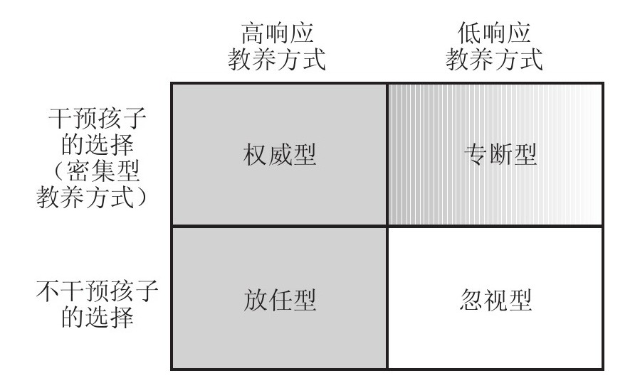

图1.1　不同的教养方式

注：表格展示了根据父母的响应程度和对孩子选择的干预程度，对鲍姆林德的教养方式的分解。

我们想应用这些观点来理解父母如何在图1.1所示的教养方式之间做出选择。该图设想了父母教养方式是由亲子互动的两个维度产生的，即父母对孩子的反应程度，以及他们是否会干预孩子的选择。在这一框架中（这构成了许多关于教养方式的实证研究的基础，包括后续章节中我们研究的基础），既不对孩子做出反应也不试图影响孩子行为的父母被认为是“忽视型”的。由于父母根本不关心他们的孩子（也就是说，他们既不是利他主义，也不是父爱主义），可能会出现疏忽，因而我们的主要兴趣在于最重要的教养方式之间的选择：放任型、专断型和权威型。育儿的目标和约束如何引导父母选择？父母何时决定最好不要对孩子施加压力并选择遵循放任型教养方式，而何时他们更喜欢咄咄逼人？父母何时强调规则，又何时强调自由？

教养方式的权衡：放任型与密集型

首先考虑在放任型教养方式和密集型（权威型与专断型）教养方式之间的抉择。关键区别在于，密集型父母会干预孩子的选择，而放任型父母不干预。如前所述，我们认为对孩子的利他心是推动放任型教养方式的力量，而父爱主义是推动密集型教养方式的力量。因此，我们将看到一位完全利他主义的家长是放任型的，而一位完全父爱主义的父母会采取密集型教养方式。然而，大多数父母同时拥有利他主义和父爱主义动机。对于这样的父母，在放任型和密集型教养方式间的选择取决于他们的社会经济环境。

所有一定程度上有父爱主义的父母对孩子的理想选择抱有自己的看法，而且常常和孩子希望做出的选择不同。父母是否决定干预的关键在于他们眼中孩子的选择导致的后果有多重要。这又进一步取决于做出的选择的利益攸关程度，而这与环境相关。当选择的利益攸关程度很低时，也就意味着采取“错误行动”不会对孩子的未来造成任何重大影响时，父母可能会让孩子按照他或她的方式行事。当从父母的角度来看，做出正确的事对孩子的未来至关重要时，那么进行干预的驱动力会强很多。

具体利益大小视具体问题而定。比如，父母可能担心孩子的健康、职业前景或未来的人际关系。父母甚至很有可能根据某个特定行为采取或多或少的父爱主义态度。因此，一些父母可能在涉及受伤的风险上非常具有保护性（以及父爱主义），而在职业选择上表现得比较宽松。

经济不平等与危险行为所发挥的作用

父母和孩子在许多方面存在分歧，但如果要挑出最重要的一个，那么就是如何在当下的乐趣和对未来的投资之间做出权衡。我们还不知道有哪个父母会希望孩子在作业上花更少的时间，在电子游戏上花更多的时间。大多数时候，父母会担心孩子的未来前景，而孩子更倾向于片刻的满足。

当父母决定需要对孩子强加他们的意愿并敦促他们学习时，需要考虑的是这件事是否重要到要付出这么多努力。这时，经济不平等就成为了教养方式中的决定性因素。假设有一个孩子发现上学很无聊，并且决定辍学，找一份低技能的工作。相比在竞争性较强、不平等程度较高的社会的父母，在工资差异很低、蓝领工人享有较高地位的社会中的父母可能更不担心孩子的受教育程度。换言之，在一个辍学者的收入仅仅比医生和工程师稍低一点的社会，父母承担得起宽松教育的后果，因而放任型教养方式会更普遍。事实上，密集型教养方式（不论是专断型、权威型，还是二者结合）在这样的社会可能会不必要地束缚了孩子的独立能力，阻碍她发现自己的真正才能（例如，选择一个最适合她的职业）。相比之下，在一个教育和努力能得到高度回报以及教育程度低的人生活艰难的社会中，即使以抑制孩子的个人发展为代价，父母也会有很强的动机督促孩子。因此，我们会看到经济不平等和密集型教养方式相关。在本书的剩余部分，我们会看到，这一预测无论是在教养方式随时间的变化还是教养方式在国家间的差异上，都得到了数据的有力支持。

如果父母生活在一个好工作取决于一个人的出生地位或社会关系而非美德或技能的社会中，他们也有可能不太关心孩子的教育。法布里齐奥的叔叔詹尼，现在是一位退休工程师，还曾经是一位成功的企业主，是家里第一个大学生。由于当时他出生于中下阶层，父母对他的教育干涉较多，因为对于他们来说，一个不工作的成年孩子意味着重大的经济损失。相比之下，他许多出生于富裕家庭的同学要远远放松得多，仅仅在大量的聚会中穿插一点学习时间。在一个上大学是富人特权的社会中，学习散漫、花十年毕业也算不上什么大问题。这些富家子弟知道对他们而言，找一份工作毫无困难，因为工作并不取决于他们最终获得的学位，而是取决于他们的出身。

为未来成就而努力的重要性与及时行乐的冲突并不是父母与子女之间紧张关系的唯一根源。另一个根源在于孩子沉迷各种父母可能不赞同的危险行为的倾向，包括从骑摩托到婚前性行为，这些对于青少年而言尤为重要。父母通常比孩子要更加厌恶风险。事实上，我们观察到许多社会中父母越来越倾向保护型。这一态度的缺点在于可能会使孩子变得怯弱、不主动。在这里，环境再次起到塑造激励的作用。在帮派和贩毒者居住的贫困社区，更易接触青少年犯罪的环境可能导致孩子做出毁掉他们生活的选择。而住在中产阶级社区，这样的风险要小得多。在这种更安全的环境中，父母可能更容易让孩子冒险并采取自主行动，而不必担心他们在失败的情况下会遭受严重后果。这种成长经历可能会使得在未来的生活中，孩子对涉及不同类型的风险的选择抱有更积极主动的态度，这些风险包括创新和企业家精神。

如何成为一位密集型父母：禁止还是劝说？

假设经济环境使得父母认为有必要引导孩子，因而采取了密集型教养方式。这样的父母倾向于影响孩子的选择，使得他们和成年人的偏好一致。父母可以通过两种策略达到这一目标。他们可以采用的第一种方法是强迫——也就是说，禁止某种行为或让孩子做特定的选择——这是专断型教养方式的特征。与这种教养方式相关的还有直接监控和通过惩罚来执行严格的规则。专断型父母并不试图让孩子相信他们希望孩子做的是正确且符合孩子的自身利益的，他们只是告诉孩子要这样去做。[29]

另一种方法是通过劝说，也就是说，父母试图塑造孩子的价值观和偏好，从而使得孩子能够自愿地做出和父母所希望的选择相一致的决定。比如，父母可能给孩子灌输很强的对勤奋的信念感或者对于毒品的厌恶（或恐惧），或者，更贴近生活经验的，他们可以试图说服孩子学业成就在生活中应该被放在首位。这一方法和权威型教养方式相一致。它还与哈佛大学的政治学家约瑟夫·奈（Joseph Nye）在国际关系背景下创造的软实力概念相呼应。奈将软实力与强制和贿赂区分开来，将其定义为通过感召力、吸引力和微妙的沟通来塑造他人偏好的能力。[30]根据奈的说法，软实力是引导他人按照自己想要的方式行动的有效途径。这正是权威型父母试图在孩子身上做到的。

如何在这两种方法中做出选择呢？在我们眼中，并没有哪一种明显比另一种更正确。诚然，作为专断型教养方式一部分的强迫具有负面含义，如果这种强迫依赖于公认会造成不良影响的体罚的话。然而，我们也承认，与放任型父母相反，权威型父母不会完全从孩子的角度看问题，而是试图引导（有些人可能会说操纵）孩子的思考和行为，使得他们与成年人一样。比如，如果孩子天性喜爱与同伴玩乐，权威型父母有可能会试图贬低这些游戏相对于做作业的乐趣。权威型教养方式在所有教养方式中可能会被认为是最具侵入性的，因为它旨在重塑儿童的价值观。相比之下，即便是专断型父母也会接受孩子的本性，他们只是规范孩子的行为。

当两种方式中没有哪种明显更好时，选择取决于对成本和收益的权衡。从父母的角度来看，所有教养方式都需要一些成本。专断型父母花时间和精力监督他们的孩子。同样，权威型父母努力给他们的孩子灌输观念，比如使他们相信延迟满足是一个好主意，或者他们应该从长期的成就来评估他们的选择。有些父母也可能花时间让他们的孩子参加在他们喜欢的方向上塑造孩子偏好的活动。例如，古典音乐或田径运动可以培养孩子集中精力、坚持进取的能力。然而，这些活动通常对于父母来说是昂贵且耗时的。

除了这些直接成本之外，父母还可能存在心理负担：由于所有父母都有利他主义的自我，他们可能不喜欢侵入性教养方式对孩子施加的压力。从这个角度来看，宽容的教养方式比密集的教养方式成本更低，因为宽容的教养方式可以使父母免于监督孩子或给孩子灌输观念。然而，即使是放任型教养方式也有成本，比如父母受孩子的摆布，或者不得不面对不愉快的邻居和朋友。法布里齐奥有一位来自北欧的朋友，他是一位放任型教养方式的狂热信徒。他们的孩子年纪相仿，在孩子们小时候，两家人有时会一起组织野餐。但好几次，那位朋友四岁的孩子会发脾气并要求做别的事。那位父亲就会宣布：“抱歉，我的儿子感到压力。”——野餐就结束了。盘子和桌布被迅速地收起来，整个计划在道歉中被取消。告诉孩子，“不，我们现在正在吃饭”从来都不在他的选项之中。

不同的教养方式也有不同的好处。当孩子长大时，权威型养育方式的许多好处得以实现。例如，坚定的对于努力可以获得回报的信念可能会培养孩子的韧性和毅力，这是大多数人职业生涯中重要的品格特征。放任型教养方式也可以带来一些好处。典型的，北欧孩子不太会成为书呆子，而是可能成长为更独立和自立的人，而且更有能力发现自己喜欢做的事。给孩子洗脑去喜欢“有用”的科目，如数学或金融，对许多父母来说可能听起来很明智，但也可以扼杀孩子们隐藏的才能。一些在密集型教养方式下成长的孩子可能因此无法成为世界级的足球运动员或才华横溢的艺术家。放任型父母的孩子可能会对喜欢的东西保持自信，并遵循他们的天性，而权威型父母的孩子可能会接收来自父母的所有恐惧。对于职业选择，甚至专制型教养方式也不如权威型教养方式具有侵入性。玛丽亚的兄弟（他回忆说，自己有一位善良温和的专断型母亲）是一位成功的职业画家。与之相比，玛丽亚和法布里齐奥的女儿就从未考虑过与艺术相关的职业，她的权威型父母会用尽全力劝阻她选择一个经济前景如此不确定的职业。[31]

专断型教养方式的一个重大缺点是它依赖于父母的持续监控。如果需要在无法进行监控的某个时间或地点做出重要决定，那么这些孩子将无法独立自主做出正确的选择。相比之下，由于权威型教养方式让孩子内化了成人的价值观和态度，如果实施成功，孩子即使在独自一人的情况下也会做出“成人风格”的决定。换句话说，相对于专断型教养方式，权威型的一个主要好处是即使在直接监控不可行的情况下也能发挥作用。我们相信这个好处对于解释数据中在两种密集型教养方式之间的选择至关重要。我们将在书中表明，在父母能够密集监视孩子的情况下，例如孩子会继续与父母一起住在家庭农场，专断型教养方式更为常见。相比之下，当孩子需要独立做出重要选择时，例如在需要到远离家乡的地方就学才能获得成功的社会中，权威型教养方式占主导地位。

先天差异与后天教养

我们认为，权威型父母的目标是塑造孩子的价值观和偏好。但是，父母真的可以实现这样的目标吗？关于教养方式的实际重要程度一直存在争论，一些人认为孩子的性格主要是先天的，即由遗传而不是教养方式决定。[32]例如，有些人可能会认为，来自中上阶层的孩子通常不是因为他们的家庭环境而成功，而是因为他们拥有更优越的基因。人类学家和人口遗传学家之间关于先天差异和后天教养相对重要性的争论多年来一直存在争议。[33]但是，目前毫无疑问的是，后天教养很重要。例如，对领养儿童的研究表明，家庭抚育非常重要。[34]

基因因素的确对于基本的人格特征有很大影响，比如外向性格和内向性格。相反，教养则是培养技能的核心。权威型父母试图影响的大多数儿童特征都是所谓的非认知技能，比如耐心、风险厌恶和对于努力可以获得回报的信念。[35]例如耐心，可能部分取决于冲动等个人特征，但也部分由后天习得。当父母试图帮助他们的孩子变得更有耐心时，他们会教孩子仔细思考自己行为的后果，并设想这些行为在数年或数十年后对自身的长期影响。做出这些考虑的能力不是孩子天生具备的，而是一种需要后天教导的技能。

家庭教养和社会环境对非认知技能产生强烈影响的证据目前尚无争议。例如，诺奖得主詹姆斯·赫克曼（James Heckman）证明，针对弱势家庭的财务支持项目可以对儿童的非认知技能产生很强的积极影响。[36]相比那些在没有得到财务支持的贫困家庭中长大的孩子，这些孩子变得更有动力去学习，更不可能从事犯罪活动，而且更倾向于考虑他们所做的选择的未来后果。由于财务支持能够影响家庭的育儿行为但不能影响他们的基因，这一证据表明非认知技能并不完全是遗传决定的。这些软技能对个人生活的成功至关重要。在与一些合作者的一项研究中，赫克曼表明非认知技能是劳动力市场和社会行为成功的驱动因素。[37]许多实证研究特别关注风险承受力和耐心的传递，在我们的讨论中，这些特征具有重要作用。一项使用德国社会经济面板数据进行的研究表明，在育儿方面投入更多精力的父母可以塑造孩子的信任和对风险的态度。[38]总而言之，证据有力支持这样一种观点，即教养方式的选择会对孩子的价值观、人生态度产生重要影响，最终将会影响孩子的行为决策。

其他约束：思辨能力和父母的意识

到目前为止，我们已经探讨了社会经济环境如何影响父母在养育子女时所追求的目标，以及教养方式如何随施加的约束条件而变化。当我们考虑为什么生活在同一社会的父母的教养选择不同时，其他因家庭而异的因素也很重要。例如，父母通过使用软实力来影响孩子的价值观和行为的能力或机会可能不同。因长时间工作而远离家庭的父母与那些在家附近工作并能够很容易监督孩子的父母相比，可能很难对孩子严加管教。受过高等教育的父母可能具备更多的论辩技巧，这使得他们能够为他们的“成年人”视角辩护，从而更有效地劝服孩子。更富裕的父母可能不必为音乐课和体育活动的费用发愁，这些活动可以帮助孩子学会专注。所有这些因素都可能有助于解释不同的父母对教养方式的选择。

另一个可能存在的约束是知识：一些弱势家庭可能不知道各种教养方式的影响。经济学家奥拉乔·阿塔纳西奥（Orazio Attanasio）认为，在一些发展中国家父母没有为孩子进行人力资本投资，是因为他们低估了教育的经济价值。比如，父母并不总是意识到诸如与孩子交流这种简单互动的好处。[39]这种信息匮乏在发展中国家的农村地区尤为显著，因为在这里文盲仍然是一个严重的问题，并且信息传播缓慢。然而，在信息易于获取的工业化国家，这些知识差距当然不那么严重，也不那么普遍存在。

在一项经济学家进行的关于育儿行为的早期研究中，布鲁斯·温伯格（Bruce Weinberg）认为，贫困的父母缺乏能够通过金钱奖励影响孩子行为的资源，因此必须依靠体罚来控制他们的行为。[40]例如，富有的父母可以向他们十几岁的孩子承诺买一辆摩托车或者报名一个昂贵的网球俱乐部，以换取孩子的某种行为。贫穷的父母则根本无法以这种方式奖励孩子的合规行为。温伯格的观点解释了为什么在美国体罚在低收入家庭中更为普遍。

我们相信，教育甚至比收入还要重要。一些父母发现很难说服自己的孩子听从他们的建议，最终选择了更专断的教养方式。受过良好教育的中产阶级能更容易地积极补充他们对于“正确”价值观的引导。比如，他们可能会帮助孩子完成微积分和拉丁文的家庭作业，这对于没有接触过这些科目的父母来说简直是天方夜谭。在瑞士，许多六年级学生必须通过一项考试（引言中提到的Gymiprüfung）才能进入学术型高中。考试通过一系列复杂问题来考察数学能力，对于拥有更高级的数学知识（例如，如何求解方程组）的孩子而言，这些问题相对容易。因此，孩子必须证明他们能够使用基本逻辑来解决这些问题，而非使用复杂的技巧。此外，当地的教务人员试图安排一种能够识别儿童的认知能力并且无法通过死记硬背来准备的考试。尽管如此，训练仍然是有效果的。对于有数学素养的家长来说，这要轻松得多，他们可以摇身一变成为教师，并自信地告诉他们的孩子：“（在我的辅导下）你可以成功！”这使得受教育程度较低的家庭处于弱势。

理解社会变迁：从放任到“直升机父母”

我们现在已经掌握了所有的基础知识，以便于使用育儿经济学来理解为何教养方式在不同国家和时代间存在差异。为了达成这一目标，我们需要确定教养的重要性如何随时间发生变化，以及不同教养方式的成本和收益如何因家庭而异。

我们首先把注意力转向一个对于社会学家而言很有趣的问题。为什么许多成长于反专制主义的20世纪70年代的、被教导要质疑权威并蔑视物质主义的孩子，成年后却成了“直升机父母”？在第2章中，我们将表明，“直升机家长”在美国和其他国家的兴起可以追溯到同一时期发生的重大经济转型。

## 第2章　“直升机父母”的兴起

蔡美儿坚信应该督促而非宠溺孩子：“西方父母非常担心孩子的自尊心。但作为父母，你为孩子的自尊心做的最糟糕的事情之一就是让他们放弃。相反，没有比发现你做到了你本以为不可能做到的事情更好的建立自信的方式。”

“妈妈就像直升机一样盘旋在我头顶……我也只有在打喷嚏时可以不打报告了，”儿童心理学家海姆·吉诺特（Haim Ginott）1969年出版的畅销经典育儿指南《孩子，把你的手给我》（Between Parent and Teenager）的主人公，列那德（Lenard）这样绝望地哀嚎。[1]尽管列那德抱怨不已，当今父母对于控制孩子的痴迷程度要比那个年代严重得多。今天，“直升机育儿”（helicopter parenting）一词被广泛使用，它指的是在过去30年中变得十分普遍的高参与度、高时间密集度、高控制度的儿童抚养方法。向密集型教养方式转变的趋势不仅仅意味着监视与保护孩子，还意味着插手孩子在学校的表现、孩子选择的活动，甚至孩子的交友与恋爱。

“虎妈”与过度管教

密集型教养方式与20世纪70年代流行的放任型教养方式截然不同。大多数今天的“直升机父母”都成长于那个宽松的年代。是什么使得20世纪70年代的独立青少年变成了痴迷于孩子个人成功的父母？具备这种经历的人也有不同的回忆。温迪·威斯纳（Wendy Wisner），一位为网站“惊叫妈咪”（Scary Mommy）撰写文章的作家，回忆起她作为一个嬉皮士家庭的女儿的快乐童年，“在马莎葡萄园半裸着赤脚跑来跑去，然后在四处旅行中打发剩余的时光”，因为她的父母“总是肩负找寻自己、改变世界、不断探索的使命”。[2]尽管她对于自己享受这样的童年感到幸运，自从她成为了母亲，她就“拥抱了一种某种程度上说更为传统的家庭生活方式，但同时又保留了一点点反对教化、顺其自然的态度”。美国著名电视新闻主播汤姆·布罗考（Tom Brokaw）这样总结这种变化：“这些人会接受你交给他们的任何东西。现在他们时刻监视他们的孩子，让他们进入足球训练营、大学预科课程，为孩子进入顶级大学操碎了心。他们在‘天然食品’超市（Whole Foods）购物。这种变化令人惊叹。”[3]

父母可以通过各种方式干预孩子的生活。强硬父母的一个极端版本是耶鲁大学法学院美籍华裔教授蔡美儿（Amy Chua）。她的畅销书《虎妈战歌》（The Battle Hymn of the Tiger Mother）为传统严苛的东亚教养方式做出了精彩（和幽默）的辩护，她指出这一方式旨在培养自信勤奋、追求卓越的孩子。蔡美儿坚信应该督促而非宠溺孩子：“西方父母非常担心孩子的自尊心。但作为父母，你为孩子的自尊心做的最糟糕的事情之一就是让他们放弃。相反，没有比发现你做到了你本以为不可能做到的事情更好的建立自信的方式。”[4]不是“通过提供正向的援助和抚育环境……最好的保护孩子的方式是为将来做好准备，让他们认识到自己的能力，并用技能、工作习惯和自信心来武装他们”。[5]

蔡美儿是专断型和权威型教养方式的典范吗？她的信条涉及了两者的要素。一方面，蔡美儿认为，建立孩子的自信心需要迫使他们做他们不喜欢的事情，这是专断型教养方式的要素。她说：“中国父母知道，在你擅长某件事之前，没有什么是有趣的。要善于完成你必须完成的任何事情。而且孩子自己永远不想工作，这就是为什么凌驾于他们自身的偏好至关重要。这通常要求父母表现得很强硬，因为孩子会抵抗；万事开头难，西方父母往往刚开始就放弃了。”[6]另一方面，蔡美儿也像权威型父母一样，相信孩子必须在追求成功的过程中自我激励。

尽管人们总是把蔡美儿的教养方式和中国文化联系在一起，密集型教养方式在许多工业化国家变得越来越流行，尽管其特征不尽相同。[7]一些父母的关注和建议几乎让孩子窒息，但更具有保护性而非强制性。法布里齐奥认识一位意大利母亲，她25岁的儿子正在服兵役，她在一个村庄里租了一套公寓，这样她就可以为儿子准备温暖的晚餐，以缓解他艰苦训练的疲劳。如果所有的意大利母亲都这样保护孩子，政府可能不得不为前线的随行母亲安排特殊营地。心理学家哈拉·埃斯特罗夫·马拉诺（Hara Estroff Marano）将这种育儿方式称为“过度育儿”。在名为《弱者之族：入侵式家庭教育的高昂代价》（A Nation of Wimps：The High Cost of Invasive Parenting）的书中，她指责过度育儿将使美国年轻人失去独立性。[8]事实上，她声称父母的干预已逐渐扩大到成人范围，并且父母越来越多地参与到他们孩子的教育中，甚至远远超出了高中和本科阶段。例如，越来越多的父母介入孩子的博士阶段的录取流程，访问校园并打电话要求与招生官会面。马拉诺恐惧的是，这种干预现在已经进入商学院和法学院这些一贯重视申请人的自我激励和自立能力的学院。[9]

马拉诺只是过度育儿热潮的众多批评者之一。英国记者泰妮丝·凯里（Tanith Carey）是一本关于如何“驯服”“虎爸、虎妈”的畅销书的作者，她指责过度育儿扼杀了创造力和独立能力，而且很有可能会抚养出一代缺乏个性或想象力的千篇一律的人，所有人的目标是去相同的大学，并获得相同的工作。[10]作为放任型教养方式而非权威型教养方式的倡导者，凯里建议父母应该放宽对于成功的定义。在她看来，父母应该帮助他们的孩子成为快乐、有活力的人，而不是一味强迫他们努力工作。斯坦福大学前本科生教务主任朱莉·利思科特海姆斯（Julie Lythcott-Haims）的一本新书呼应了马拉诺和凯里的批评[11]，她指责父母帮孩子做作业，为孩子请昂贵的家庭教师，甚至插手孩子找工作或申请博士，最后培养出的将会是被动、依赖和缺乏想象力的孩子。她呼吁这些父母摆脱“过度育儿陷阱”。[12]

密集型育儿的经验证据：那些在孩子身上花更多时间的父母们

那些打电话给招生官或为服役的孩子准备热饭的父母当作轶事谈谈即可，但作为经济学家，我们需要寻找系统的证据来证实这是一种更普遍的模式的表现之一。我们在整本书中采用的方法都是如此：当考虑教养方式的变化和可能的解释时，我们会使用来自大量父母和孩子的数据，看看是否有证据表明这样的解释是可信的。

为了衡量育儿在近几十年是否真的变得更加密集，第一步自然是查看人们如何分配时间的调查记录。[13]越来越多国家的统计机构收集关于人们对每天24小时的规划信息。例如，在美国，劳工统计局在一个名为美国时间使用调查（ATUS）的项目中收集了美国人如何使用时间的数据。[14]在其他国家也有类似的项目。[15]这些数据证实，近几十年来，父母在育儿上投入了更多的时间。

图2.1展示了加拿大、意大利、荷兰、西班牙、英国和美国的母亲（上半部分）及父亲（下半部分）每周在育儿上花费的小时数。荷兰和美国的曲线尤其显著，因为这两个国家的数据可以一直追溯到20世纪70年代。2005年，荷兰的母亲每周花在育儿上的时间比1975年多4个小时，而荷兰的父亲则多花了3个小时。这意味着与1975年的孩子相比，2005年的孩子平均每天与父母互动的时间增加了1个小时。在美国，育儿时间的增加甚至要更多：从20世纪70年代末到2005年，母亲和父亲每周与子女一起度过的时间大约增加6小时，这相当于每天增加了1小时45分钟的亲子互动。加拿大、意大利、西班牙和英国仅有较短的时间跨度的数据，但在所有情况下，都有明显的证据表明育儿时间的增加趋势。

如果考虑到同一时期发生的生育率下降，这种时间上的增加的影响将进一步扩大。在荷兰，每个家庭的平均子女数（以总生育率衡量）从1960年的3.1下降到2014年的1.7，而在美国，这一数据在同一时间段从3.7下降到1.9。如果考虑到今天有更少的孩子需要照顾，我们估计的亲子互动每天增加一到两个小时，实际上是低估了每个孩子得到的额外关注。

另一个需要考虑的因素是成年人与孩子一起度过的时间的“质量”——一起看电视与真正投入孩子的活动中不同。这个维度很难量化，但平均而言，如今的父母比几十年前受教育程度更高，这可能与亲子互动的质量有关。父母也可以使用更便宜、更有效的教学工具。事实上，开发益智玩具、网站、应用程序和电子设备的行业如雨后春笋般涌现。这些教学工具旨在“刺激”孩子并帮助他们发展。然而，这些变化的净效应很难评估，因为技术肯定也容易被误用。朱迪丝·伯恩斯（Judith Burns）撰写的BBC教育新闻报道指出，父母过度使用智能手机会扰乱家庭生活。她引用了一项调查结果，调查中超过三分之一的青少年表示要求他们的父母停止不断刷手机的行为。[16]这令人质疑儿童与成人互动的质量是否真的比过去要高。

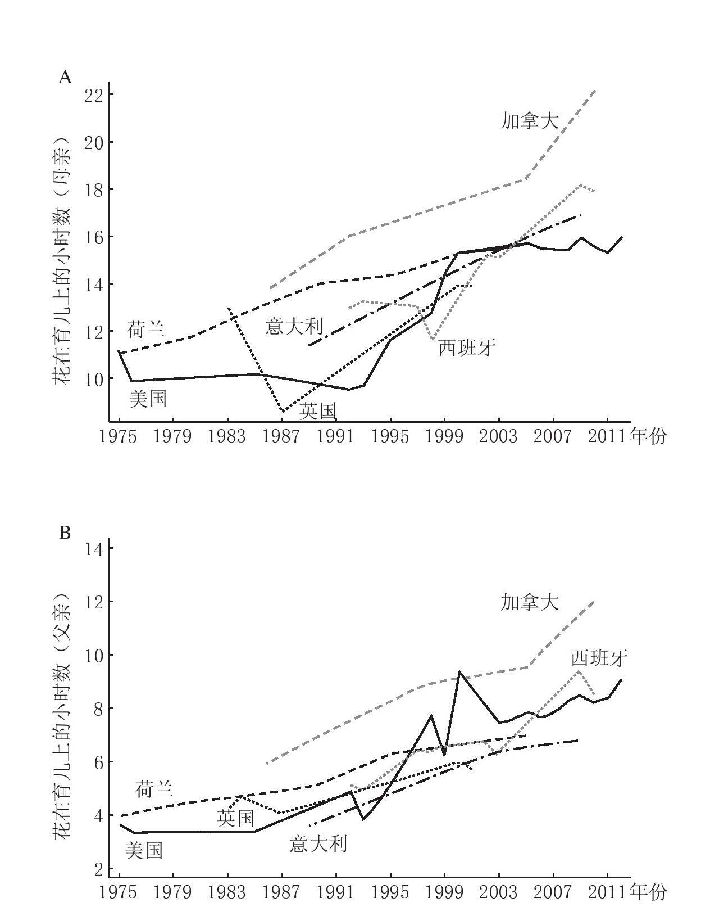

图2.1　6个OECD国家中母亲（上半部分）和父亲（下半部分）每周花在育儿上的小时数

另一个有趣的观察结果是，在美国和荷兰，受过大学教育的父母花在育儿上的时间比受教育程度较低的父母更多。1975年在荷兰，受过大学教育的母亲比没有受过大学教育的母亲每周在育儿上多花1个小时。对于父亲来说，教育带来的育儿时间的差距是半小时。在21世纪的前10年，教育带来的父亲和母亲的育儿时间差距均达到了大约两个半小时。在同一时期，美国的变化甚至更大。在20世纪70年代，受教育程度较低和较高的父母大约花相同的时间照顾孩子。今天，这两个群体之间的差距超过3小时。我们将在第4章继续讨论这一现象。

这些调查记录也告诉我们亲子活动都做些什么。在1976年，美国的父母平均每周花2个小时（母亲76分钟、父亲43分钟）陪孩子游戏、阅读与交谈，平均每周花17分钟（母亲10分钟、父亲7分钟）指导孩子的家庭作业。在2012年，美国的父母平均每周花6.5个小时（母亲204分钟、父亲184分钟）陪孩子游戏、阅读与交谈，平均每周花一个半小时多（母亲65分钟、父亲31分钟）指导孩子的家庭作业。总体来看，美国父母在这些活动上花的时间是原来的3.5倍，从每周小于2.5小时增加到每周8小时以上。

意大利的结果也类似。在1989年（最早可得的数据），意大利的父母平均每周花不足2个小时（母亲53分钟、父亲71分钟）陪孩子游戏、阅读与交谈，平均每周花1个多小时（母亲41分钟、父亲13分钟）指导孩子的家庭作业。2009年，父母们平均每周花7个小时（母亲257分钟、父亲165分钟）陪孩子游戏、阅读与交谈，平均每周花约一个半小时（母亲77分钟、父亲25分钟）指导孩子的家庭作业。[17]总体来看，意大利的父母们在这些活动上花的时间是原来的2.9倍，从每周3小时增加到每周8.5小时。

在美国，在家上学的兴起可能是一些父母越来越渴望完全控制并能够塑造他们认为合适的孩子的另一个表现。美国教育部报告称，从1999年到2012年，在家上学的学龄人数的百分比翻了一番，达到3.4%左右。这是“直升机育儿”的标志吗？超过90%的选择让孩子在家上学的父母表示“担心学校环境”是他们做出决定的一个重要因素，这一事实支持了直升机育儿的兴起。[18]

密集型育儿的影响反映在孩子的体验中。在美国，步行或骑车上学的孩子从1969年的41%下降到了2001年的13%。[19]6—8岁的美国儿童，1981年至1997年间，自由游戏时间减少了25%，花在家庭作业上的时间则增加了一倍多。这一现象很有趣，因为人们可能怀疑父母只是学会了与孩子一起享乐和游戏。他们也可能这样做（特别是对于父母比孩子更喜欢的益智性更强的游戏），但新的密集型育儿的大部分内容是为了让孩子尽早取得学业成就。

总结来说，证据表明，与几十年前相比，毫无疑问，今天的父母在孩子身上花费的时间要多得多。是为什么？是今天的父母更加聪明、更有思想，或许甚至比他们自己的父母更有爱心吗？亲子互动时间的增加是否会培养出一大批受过良好教育并且积极主动的成年人？又或者，如马拉诺、凯里和利思科特海姆斯这些批评者所言，这只不过是一阵非理性狂潮，最后培养出的会是一代缺乏独立性和想象力的“妈宝男”和“娇娇女”呢？

本书的目标是理解什么情况导致了这种教养方式的转变。我们的理论是，父母会对激励的变化做出反应，特别是对于他们孩子成年后生活的经济环境的变化。是什么让父母越来越关注孩子们的行为？为了回答这个问题，我们回到20世纪六七十年代我们童年时的个人经历。

回到我们的童年

在我们的童年，我们被要求出席每次家庭聚餐，但是剩余的大部分时间我们几乎不受到监管。当时我们大多数人都是这样，街道上到处是闲逛的孩子。更重要的是，因为在街道上玩耍不花任何费用，不同阶层和背景的孩子之间也有很多互动，在20世纪六七十年代欧洲低水平的住宅隔离使得这一切变得更加容易。

法布里齐奥五岁的时候从农村搬到了博洛尼亚市（Bologna）。博洛尼亚被称为“红色之都”，这是指代那里“屋顶瓦片”颜色和左翼政治传统的双关语（博洛尼亚从意大利共产党中选出市长，从1945年国家解放到1991年该党解散之间没有中断过）。法布里齐奥家在一个中产阶级和工人阶级混居的郊区社区。孩子和父母都不重视社会隔离。就算有的话，当时流行的社会规范鼓励白领隐藏自己的阶级背景，并表达与蓝领工人的共同阶级认同感。任何对经济成就或教育成就感到自豪的表现都是不受欢迎的。

几乎完全由公共资助的教育系统强有力地促进了正义和平等的价值观。小学生被要求撰写有关越南战争的文章或参加有关捍卫世界和平的讲座。法布里齐奥的父母是不参加教堂活动的天主教徒，他们在全国选举中把票投给了联合政府中温和的中间党，但在地方选举中投票给左翼政党。总的来说，他们是一个相当典型的中产阶级家庭，倾向于保守地与周围环境保持一致。尽管如此，他们家庭的价值观充满了当时的平等主义文化。法布里齐奥的父亲曾经被选入当地学校理事会，作为一个严肃的白领工人，他支持了防止富裕家庭将孩子送到市中心的精英学校来形成隔离的措施。

在学校，常规课程主要在上午进行，尽管父母可以让孩子参加课外活动。这些活动是为父母双方都工作的弱势家庭（当时很少见，因为女性劳动参与率很低）提供的免费社会服务。然而，为了与社会融合，更富裕的父母的子女也在强烈的同伴压力驱使下参加了这些课外活动。少数不参加的父母会受到教师和学校校长的批评和质疑。法布里齐奥的家人不得不遵守社会规范。

除了学校组织的活动（主要是对到处乱跑的孩子的一种放松化的监督）外，课外活动很少见。有些孩子参与了有组织的体育活动（男孩主要是踢足球，女孩跳舞或打排球），但这是特例，不是常规。学校本身的教育并不是很具挑战性。直到八年级，留级都是罕见的，而且通常是与父母达成一致的情况下选择留级。在某些时候，数字成绩单被禁止，取而代之的是旨在淡化学业成绩差异的文字评估，成绩差异被视为学校未能弥补收入和机会不平等背景的失败信号。“孩子们天生的能力可能有差异”的观念是被禁止的。

主流文化对勤奋好学的孩子并不鼓励：在学业上的成功并没有让他们在同龄人中更受欢迎。法布里齐奥记得他对他的学业成就总是三缄其口。当老师公开称赞他时，他感到更多的是尴尬和对同伴反应的担心，而非自豪。他的父母自然对他的好成绩很满意，但认为没有理由进一步督促已经表现良好的孩子。这不是疏忽的表现。由于他在学业上表现很好，他的父母认为更重要的是鼓励他出去，与同龄人交往，并学会在多元化的社会环境中与其他人互动。虽然父母在吸毒或其他危险活动出现时会保持警惕，但他们对孩子选择与谁成为朋友并不太关心。

父母和老师认为学校是培养独立人格，而不是促进未来的经济成功的工具。当法布里齐奥的父母搬到博洛尼亚时，并未专门考查当地学校的教学质量。大多数父母会把孩子送到最近的学校，他们从未想过区分好学校和坏学校。法布里齐奥的父母认为生活在混合型社区是一种幸运。偶尔的争斗会让孩子变得更强，带给他应对未来的困难和冲突的经验。当与其他孩子出现争端时，他们会鼓励孩子自己解决，除非事情变得非常糟糕才让老师或大人调和。当时的社会规则是“永远不要咄咄逼人，但受到攻击时，要保持坚定并反击！”

法布里齐奥家所处的经济环境造就了这种闲散的教养方式。直到20世纪70年代末，失业并不是欧洲的一个主要问题（特别是在博洛尼亚这样一个繁荣的意大利北部城市）。收入不平等在70年代初很低，在70年代与油价冲击相关的高通胀时期之后更是急剧下降。意大利有一个特殊的劳动力市场机制，称为“自动扶梯”（escalator），它通过定期调整生活成本，将工资与通货膨胀挂钩。法律确保工资定期调整，以补偿劳动者的购买力损失。重要的是，所有劳动者的绝对通货膨胀津贴都是相同的，而不是与工资成正比。在高通胀时期，“自动扶梯”具有显著的均衡效应。[20]白领和蓝领工人之间的工资差异大幅缩减，降至历史最低水平。

20世纪70年代的政治局势并未预示这种趋势可能出现逆转。意大利共产党的民意支持达到了历史性高峰。在1976年的全国大选中，共产党获得了超过34%的投票份额，几乎与传统的领跑者基督教民主党相当。当时人们普遍预期意大利政治在未来几年将进一步左翼化。

马赛厄斯的个人经历也很类似。马赛厄斯在汉诺威北部的一个村庄里度过了他的童年。汉诺威是一个人口约50万的城市，它是一个交通枢纽，也是一个汽车和轮胎的制造中心，沃尔夫斯堡（Wolfsburg）的大众汽车总部就在附近。马赛厄斯的家族拥有一个小农场，这个农场的历史可追溯至17世纪初。然而，在马赛厄斯出生的时候，农场已经被两代人作为家庭的第二收入来源，马赛厄斯的父亲迪特玛和祖父奥托都是州政府的公务员。事实上，虽然仍然有一些传统的农民家庭，但是这个拥有5 000人口的村庄变得更像是一个郊区，大多数家庭的主要劳动者都会去汉诺威工作。

在20世纪70年代的德国，父亲负责赚钱养家糊口、大多数母亲留在家中照顾孩子的模式是常态。那时托儿所服务还不存在。4岁的孩子可以选择上幼儿园，但马赛厄斯在最初的几天里不停地哭泣。小学从6岁开始，每天只有几个小时，并且孩子们被要求在课后回家吃午饭。总的来说，教育系统的建立基于一种母亲总是可以在孩子有需要时照料他们的预期。马赛厄斯的母亲在生完前两个孩子后不久就不再担任教师（包括第二个孩子马赛厄斯），这并不令人惊讶，照料孩子和农场工作使她忙得不可开交。

在马赛厄斯的学校伙伴当中，有些人的母亲会兼职工作。有一个全职工作的妈妈十分罕见，同时也表明家庭可能遇到了麻烦，比如父亲在监狱或父母分居。但是，这种情况很少见。这个村庄大部分是中产阶级，几乎没有任何真正富裕的家庭（收入最高的人主要由当地的牙医和药剂师组成），也几乎没有任何贫困家庭。大多数人生活在条件类似的小康之家。

像法布里齐奥一样，与他的孩子相比，马赛厄斯拥有更加轻松悠闲的童年。每天只花几个小时上学，午餐后的大部分时间和他的三个兄弟姐妹自由地嬉戏。只要每个人都回来吃晚饭，马赛厄斯的父母就不会担心孩子的下落。他们在朋友家里玩耍，在干草堆里建造堡垒，和村里的其他孩子一起踢足球。马赛厄斯的父母对孩子的少数几个要求主要是干农活，例如帮助喂养小牛，制作干草和收割庄稼。

马赛厄斯的父母采取的自由主义方式延伸到了教育方面。在学校学习多少，或者是否要学习，主要由孩子来决定。如果其中一个孩子总是不及格并开始有留级风险，马赛厄斯的父母可能会表达一些担忧或聘请家教。但只要孩子能够跟得上课程，就不会受父母的干预。

马赛厄斯早就发现，在这样的情况下完成家庭作业没有什么意义。鉴于他能够通过认真听课而获得合格的成绩，他的父母并没有费心去敦促他学习。在学校，许多教师也不会系统地检查家庭作业，而是继续让少数努力学习的学生来公布他们的答案。如果偶尔老师确实希望学生提交作业，那么搭乘公共汽车去学校的路上随便写上一些基本答案就足以避免被老师批评的后果。下午有很多有趣的事情要做，马赛厄斯多年来完全不做家庭作业，直到十二年级才开始认真学习，而当时成绩开始计入高中毕业文凭（Abitur，可以进入大学学习的高中学位）。

马赛厄斯父母的一些选择有个人因素影响。马赛厄斯的父亲经历了严格的专断型教养方式，他自己的父亲让他没有余地来规划自己的人生道路。上学也表现为一种负担，在学校教师常常体罚学生。鉴于这些经常令人痛苦的经历，迪特玛决心尽可能多地给予自己的孩子自由，并让他们自己做出大部分决定。马赛厄斯的母亲安娜玛丽小时候承受的压力较小，部分原因是，作为一个女孩，她不是那个应该继承她家农场的人。尽管如此，她还是在一个大多数孩子无法选择人生的环境中长大的，并且她希望自己的孩子能够同样分享她曾经获得的自由特权。

同时，个人经验只不过是故事的一部分。毕竟，尽管马赛厄斯的父母可能比大多数父母要自由放任，大多数和他一起长大的孩子也大致有着类似的童年。同样重要的因素是经济环境，当时的主要特征是低不平等和低失业率，特别是在马赛厄斯长大的郊区村庄。犯罪也很少，吸毒成瘾等问题主要局限于大城市。父母没有理由担心他们的孩子会遇到严重的麻烦，即使他们没有在学校表现出色，孩子们仍然可以期待以后过上好日子。在这种环境下，父母非常努力地督促孩子是没有意义的。

马赛厄斯成长的相对平静的20世纪七八十年代，与马赛厄斯的父母在孩童时期的20世纪四五十年代形成鲜明对比。安娜玛丽和迪特玛都出生于二战期间。他们的父母经历了两次世界大战、20世纪30年代的全球经济衰退、20年代和二战结束时的两次恶性通货膨胀以及大范围的饥荒和贫困时期。他们的家人能够从这一切中幸免于难，很大程度上是因为拥有耕种土地提供的相对稳定收入。鉴于他们的经历，迪特玛和安娜玛丽的父母认为保留土地和继续经营家庭农场对他们家庭的生存至关重要也就不足为奇。这一背景解释了，至少部分解释了奥托为什么强迫迪特玛追随他的脚步。同样，70年代的情况完全不同，当时德国的小农经济正在迅速衰落，这可能解释了迪特玛宽松的教养方式。

除了经济情况，教育体系的组织方式对选择教养方式也很重要。马赛厄斯小时候的德国教育体系的特点是很早分流（现在程度稍轻）。在四年级之后，孩子进入三种不同的学校，最学术的那一种才能使他们进入大学（学术型高中），另两种则让孩子为职业训练做好准备（Realschule和Hauptschule，即实科中学和职业预校）。因此，人们可能会认为父母会为了孩子会被推荐进入哪种学校感到焦虑，并且可能会选择密集型教养方式，以增加孩子进入更具挑战性的学校的机会。

实际上，近几十年来这种情况越来越多。例如，父母直接找孩子的老师，甚至乞求“正确的”（即进入学术型高中）的推荐信，已经变得很普遍。然而，在20世纪70年代，即使是在那样关键的时刻，父母们也表现得很放松。这里至少有两个原因。首先，选择风险并不高。即使是较低层次的学历也可以为孩子提供美好的前景，因为从这些学校毕业之后孩子通常会进入学徒项目，这些项目过去让大多数孩子得到了一份安稳的工作。此外，还有社会习俗的因素，即为不同背景的孩子决定“适当的”学校。工人阶级背景的孩子（包括他们自己的父母）预期会前往职业预校，来自更有特权背景家庭的孩子（比如医生、律师或药剂师的孩子）可以去学术型高中，哪怕他们并没有在学业上表现卓著。

一旦进入学术型高中，学业优异就并不是特别重要了。马赛厄斯朋友的父母们主要关心孩子是否可能留级，但由于留级很常见，这甚至算不上羞耻。事实上，留级的（稍微年长的）孩子往往是学校里的“酷”孩子。当然，他们对美国父母今天所熟悉的平均绩点几乎没有任何担忧。如果我们看看学术型高中之后发生的事情，就很容易理解为什么会有这样的现象。从高中毕业后，只要有及格的分数都能使高中毕业生获得大学教育。在20世纪七八十年代，这意味着几乎可以在任何一所大学的任何专业就学。成绩好并不能决定孩子未来的生活。因此，我们很容易理解为什么孩子和父母都只对他们的学校表现提最低要求。

在当时，关心成绩的主要是那些需要在大学学习医学的孩子。对于医学教育的需求超过供给，医科类大学录取学生主要是基于其在高中的成绩以及一场专门举办的医学考试（Medizinertest），这场考试和其他很多国家的大学的入学考试类似。在马赛厄斯的同学当中，决心要学医的孩子（通常是医生的子女）与专注于其他领域的孩子相比，明显要更关注成绩并强调学业。

20世纪六七十年代，意大利和德国的经历代表了那一时间段更广泛的趋势。法国经济学家托马斯·皮凯蒂（Thomas Piketty）和伊曼纽尔·赛斯（Emmanuel Saez）最近的研究报告指出，在工业化国家，二战后开始的不平等程度在20世纪70年代降到历史低谷。[21]这一低不平等时期恰好与放任型教养方式的日益流行和专断型教养方式的消亡相吻合。

显然，经济因素并不是全部。第二次世界大战后对法西斯主义的反应在欧洲尤为重要。日益流行的精神分析学和囊括了威廉·赖希（Wilhelm Reich），卡尔·荣格（Carl Jung）和埃里克·弗罗姆（Erich Fromm）等关键人物的弗洛伊德学派；伯特兰·罗素（Bertrand Russell）的社会批评；让保罗·萨特（Jean-Paul Sartre）和西蒙娜·德·波伏娃（Simone de Beauvoir）对存在主义、女权主义和马克思主义的整合；此外，还有法兰克福学派的哲学，众多知识分子的这些力量将当时的西方文化推向激进的反奉从主义（anticonformist）。20世纪50年代“垮掉的一代”的地下艺术和文学叛逆演变成了60年代社会和政治活动的爆发。反专制主义在嬉皮士运动时期达到了第一个顶峰，并在70年代更具批判性和反抗性的反权威的朋克亚文化中延续。这些运动的共同主题包括自由恋爱和性解放、女性解放、强烈的平等主义以及对毒品的宽容态度。这种文化氛围也使得越来越放任的教养方式变得流行。

80年代的转折点：不平等的上升与嬉皮士vs.雅皮士

20世纪80年代是西方国家在政治、经济和文化上的转折点。在70年代晚期，保守的反革命思潮开始抬头。1978年，波兰红衣主教卡罗尔·沃伊蒂拉（Karol Wojtyla）成为教皇，是为约翰·保罗二世（John Paul II），这标志着天主教会向保守派的迅速转变。他充满活力和魅力（这点可能有争议）的领导旨在恢复天主教会的威望、声名和权力，同时引导公众注意专制制度的压迫性。

1979年，玛格丽特·撒切尔成为英国首相。她的政治宣言颂扬了个人主义，将几十年来蓬勃发展的平等主义价值观拒之门外。例如，在1987年的一次采访中，她提出“没有社会这种东西”，相反，有的是“个体的男性和女性，有的是家庭。得不到人民支持的政府不会有任何作为，但每个人必须先处理好自己的事”。[22]

在大西洋的另一边，罗纳德·里根于1981年成为美国总统。里根和撒切尔提倡了许多共同的价值观，例如自由市场和个人主义的优点，以及对社会主义和共产主义理想的不屑。他们的幕僚重塑了世界，改变了保守的自由主义，并导致了苏联的崩溃。

同时经济不平等也发生了急剧变化。图2.2展示了4个OECD国家就业人群中最富裕和最贫穷的10%（也称为S90—S10比率）的总收入份额之比。[23]图片展示了自20世纪80年代以来不平等水平的加剧趋势。在美国和英国，不平等程度的上升特别剧烈。在美国，这一比率在1974—2014年间翻了一番多（从9.1到18.9）。在英国的同一时期，这一比率从6.6增加到11.2。在意大利，该比率从1984年的7.7（最早可获得的数据）到了12.6。甚至传统意义上高度平均主义的国家也存在不平等的加剧：瑞典的S90—S10比率从3.5上升到7.3，荷兰从5.3上升到7.8。尽管它们的不平等水平远远低于盎格鲁撒克逊国家（荷兰和瑞典现在都没有达到美国70年代的收入差距水平），这仍然是实质性的增长。

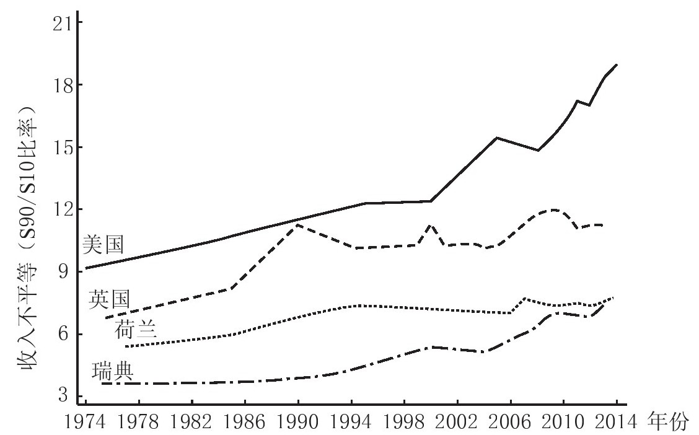

图2.2　荷兰、瑞典、英国和美国的收入不平等（就业人群中最富裕的10%的人的收入份额与最贫穷的10%的收入份额之比）的变化情况

20世纪80年代以来收入不平等的激增很大一部分是由于教育回报率上升导致的。在美国，受过大学教育的劳动者工资与仅受过高中教育的劳动者工资之比从1.5上升到了2。此外，研究生教育的回报率也急剧上升。[24]英国经济学家乔安妮·林德利（Joanne Lindley）和史蒂夫·梅钦（Steve Machin）表示，在英国和美国，接受过研究生教育的劳动者相对于只有大学本科学位的劳动者而言，工资溢价增加了。[25]在70年代早期，这两个群体的平均工资大致相当；而在2009年，拥有研究生学历的劳动者平均获得的收入比本科毕业生多1/3（比高中毕业生多出136%）。这些数字还有可能低估了研究生学位的价值，因为许多获得这些学位的人最后选择了学术研究或担任教职，这些工作的收入一般不高（除了在几所精英学校），但是有许多明显的非货币福利（比如声望、研究自由和工作保障）。今天，研究生教育的回报非常高，高等教育的吸引力的提升是显而易见的，因为多年来持有研究生学位的人的比例一直在增长。

总体不平等程度上升的另一个影响因素是教育水平相同的人群中工资不平等的增加。这种转变可以通过各个学科越来越大的薪酬差异（例如，相对于人文科学和社会科学的毕业生，获得科学和工程学位的毕业生工资显著增加），以及不同大学的毕业生的薪酬差异来解释。[26]所有这些不平等的变化都有一个共同的结果：它们增加了教育的重要性。

为什么不平等上升了呢？人们通常把它归咎于同一时期的政治动荡，这导致了再分配经济政策的减少。然而，大多数经济学家认为政治变革不是首要原因。对于不平等加剧趋势的最广为接受的解释是技术变革。[27]信息技术革命极大地改变了劳动力市场条件，减少了对受教育程度较低的劳动者的需求，并增加了对受教育程度较高的劳动者的需求。同一时期的政治和制度变革降低了政府通过收入再分配和社会政策来减轻技术变革影响的能力，从而起到了加剧不平等的作用。一些研究甚至认为技术变革可能是政治和制度变革的原因。比如，经济学家达龙·阿西莫格鲁（Daron Acemoglu）、菲利普·阿洪（Philippe Aghion）和詹卢卡·维奥兰特（Gianluca Violante）断言，教育溢价的上升会导致高技能劳动者脱离工会，致使工会逐步衰落。[28]另一些经济学家，包括法布里齐奥和他的合作者约翰·哈斯勒（John Hassler）、何塞·罗德里格斯·莫拉（José Rodríguez Mora）和凯蒂尔·斯多尔斯莱登（Kjetil Storesletten），构建并检验了一种政治经济学理论，其中工资不平等的增加是80年代发生的政治变革的原因，而不是其结果。[29]在低不平等和低教育回报的20世纪60年代，大多数人（包括高收入劳动者）认为国家福利计划极具吸引力。这些计划提供了保障措施，在失业率较低的情况下，参与这些计划并不昂贵。在20世纪80年代，更富裕的那部分人打破了这一社会契约，并决定考虑自己的利益：他们更多地投资于教育和个人成就中，同时认为社会保障不那么重要。在投票时，他们支持承诺降低税收和废除社会转移支付的右翼政府。那些收入更低的人没有足够的能力去与会损害他们利益的政策抗争。

文化和人们渴望效仿的榜样也反映了这些变化。20世纪70年代的平等主义精神受到了人们的强烈反对，在80年代因个人主义的崛起而黯然失色。两个著名的缩写词总结了这一态度上的转变：嬉皮士（hippie）和雅皮士（yuppie）。嬉皮士是一场激进的反权威、以青年为导向的政治运动，起源于20世纪60年代的美国，但迅速风靡世界。雅皮士是20世纪80年代初期创造的一个术语，是“年轻的城市白领”（young urban professional）的缩写，指的是年轻、受过良好教育、高薪、执迷于自己的职业生涯和成功的物质陷阱的白领。

嬉皮士运动的两位领导者是活动家阿比·霍夫曼（Abbie Hoffman）和杰里·鲁宾（Jerry Rubin）。尽管霍夫曼在1989年去世之前一直忠于他的激进思想，但鲁宾的故事却反映了80年代早期发生的文化转变。[30]鲁宾从加州大学伯克利分校辍学，在60年代因反对种族歧视、领导反战抗议而成名，并因为组织运动阻挠运往越南的部队和武器而声名大噪。但在70年代晚期，鲁宾对政治活动失去了信心。他转型成为了一个成功的企业家，并最终成为百万富翁。1986年，他与霍夫曼进行了一系列题为“异皮士vs.雅皮士”（Yippie vs.Yuppie）的辩论，其中鲁宾为他的信仰辩护，指责嬉皮文化导致滥用毒品、滥交和破坏私人财产。他现在把希望寄托在新一代创新型企业家身上，他们将把未来掌握在自己手中，并造就了社会、经济和政治方面的重大转型。

我们认为，经济不平等的增加除了促使文化价值观的转变，也改变了父母的行为。特别是，父母越来越相信他们孩子的成功将取决于教育成就。在一个利益攸关的世界里，放任型教养方式的吸引力正在逐渐消失。中产阶级的父母开始推动他们的孩子采取成人风格、成功导向的行为。正是在这种背景下，“直升机育儿”获得了广泛的支持。

与我们的观点一致，图2.3展示了美国受过大学教育的母亲在育儿上的投入随大学教育溢价的变化，大学教育溢价即拥有大学文凭的人的收入与那些没有大学文凭的人的收入之比。[31]这两个变量表现出惊人的相似趋势。20世纪80年代大学教育溢价增加之后，受过大学教育的母亲照顾子女的时间大幅增加。

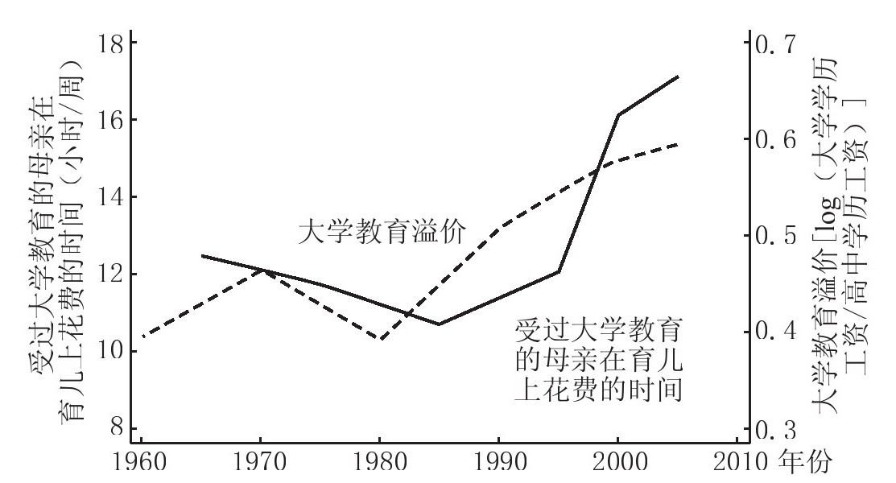

图2.3　美国受过大学教育的母亲在育儿上花费的时间，以及美国教育回报率（受过大学教育的人的平均工资与仅受过高中教育的人的平均工资之比）

我们认为，经济状况的变化至少是父母在孩子身上增加投资的部分原因。为了使这一论点可信，重要的是需要证明教养方式在学校和生活的成功方面至关重要。支持密集型教养方式，或者更一般地说，父母与孩子互动的时间提高了孩子在学校的表现的证据有多有力？在第1章中，我们已经描述了许多支持这种观点的发展心理学研究。我们现在考虑来自两个数据源的证据，这些数据源让我们得以使用多个国家的数据更详细地研究这个问题。

教养方式很重要：来自PISA的证据

我们首先考虑OECD国际学生评估计划（Program for International Student Assessment, PISA）的数据。PISA于1997年正式启动，每三年进行一次，测试了15岁的学生在数学、科学和阅读方面的知识能力。该项目涉及70多个国家，最近的调查中有超过50万名学生参与。每个国家都会随机选择参与调查的学校，学生的样本具有代表性，也就是说，他们的背景和能力各异。世界各地的儿童回答的问题是相同的，并且被翻译成当地语言，以使结果具有可比性。

公众对于PISA项目的关注大多数都集中在比较不同国家和教育系统的表现。在这里，我们感兴趣的是育儿的维度。在最近的一些调查中，学生及其父母被要求回答一份调查问卷，其中包括有关父母和孩子如何互动的信息。我们将对这些问题的回答与每个孩子的考试成绩联系起来。我们的分析聚焦于2012年的问卷调查。

我们使用关于父母育儿参与度的问题的回答来构建衡量教养方式强度的方法。更确切地说，如果满足以下所有条件，我们将教养方式归为密集型：父母每周至少讨论一次孩子在学校的表现，每周至少与孩子交谈一次，每周至少和孩子一起吃一顿饭。[32]显然，这是对密集型教养方式的宽泛定义。回顾我们自己的童年经历，我们的父母常常和我们聊天，每天和我们一起吃饭。然而，他们可能没有每周与我们谈论学业。因此，我们的父母将被归类为采用了非密集型教养方式。

首先来看韩国的结果，韩国是一个东亚国家，是PISA中孩子表现最好的国家之一。只有来自中国上海、新加坡、中国香港和中国台湾的学生获得的平均分数高于韩国学生。例如，韩国儿童的数学分数为554，而美国儿童的数学分数为481，而OECD的平均分数为494 （OECD是一个由工业化程度最高的高收入经济体组成的组织）。在韩国学生中，非密集型父母的子女平均分数为540，而密集型父母的子女平均分为563，相差23分（见图2.4）。[33]阅读和科学分数的差异差不多，分别为24和22分。

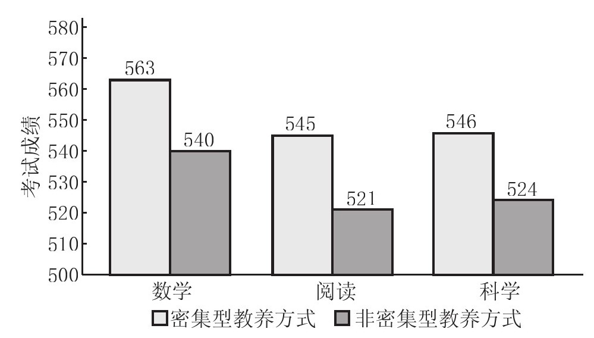

图2.4　PISA 2012中韩国学生在两种教养方式下的考试成绩

PISA测试分数中23分是很大的差异。这类似于芬兰（芬兰以及瑞士是欧洲表现最好的国家）的孩子的数学成绩与表现较差的法国或英国等其他OECD国家的孩子的数学成绩之间的差异。

有人可能会担心，受不同教养方式影响的儿童的表现差异实际上可能反映的是父母的教育水平：密集型父母平均受教育程度高于非密集型父母。受教育水平更高的父母可以在学业上更好地支持孩子，例如帮助他们完成家庭作业。因此，需要比较来自相同教育背景的父母。由于PISA提供有关父母教育水平的信息，我们可以使用标准的统计学方法（多元回归）将父母教育水平的效果与父母教养方式的效果分开。[34]有些令人惊讶的是，给定父母对教养方式的选择，受过更高水平的教育并不会对孩子产生很大的影响。拥有两名受过高等教育的父母只使得平均数学考试成绩增加7分，而密集型教养方式在同等教育水平的父母中则使数学考试成绩增加20分以上。因此，使用密集型教养方式与父母本身的教育水平相比，更大程度上与孩子表现的进步相关。阅读和科学考试成绩给出的结果类似。

对于韩国学生的发现是否在其他国家适用？PISA 2012提供了11个国家和地区的教养方式的信息：比利时、智利、德国、中国香港、克罗地亚、匈牙利、意大利、韩国、中国澳门、墨西哥和葡萄牙。几乎在所有这些国家和地区，在我们的度量方法下的密集型教养方式与考试成绩都呈正相关。这一影响对于意大利的孩子最大（三个考试分数的平均分增加为34分）。唯一的例外是比利时和德国，密集型教养方式的影响接近于零。

由于韩国学生的分数与墨西哥学生的分数差异可能还是由除了教养方式之外的原因导致的（例如，很大一部分可能是由于教育系统的差异），因此需要将韩国的孩子与韩国的孩子进行比较，墨西哥的孩子和墨西哥的孩子进行比较，而非使用来自不同国家的孩子进行比较。可以使用统计技术来计算11个国家和地区内的平均效应（用经济学家使用的术语来说，我们使用了控制国家固定效应的回归）。当我们这样做时，我们发现受到密集型教养方式影响的儿童的表现明显优于同一国家和地区内没有受到密集型教养方式影响的儿童。三种测试分数之间的差异在14—17分之间。当比较具有相同教育水平的父母的孩子时，效果仅略微变小，范围在11—14分之间。所有的影响都在统计意义上显著。

PISA还包含父母与子女进行的具体活动的信息。特别是2009年调查问卷中询问了父母与孩子一起阅读书籍、讲述故事或讨论政治或电影等各种话题的频率。使用与之前相同的统计技术，我们可以计算控制父母受教育水平的情况下，这些亲子活动和考试成绩之间的相关性。由于许多父母参与多项活动（例如，阅读书籍和讲故事），我们在控制其他活动的效果的前提下估计每项活动的效果。与孩子一起阅读书籍的父母，其孩子在数学、阅读和科学测试中的分数增加16—18分，而讲故事的平均影响在2—7分之间。有趣的是，与孩子讨论政治的父母，其孩子的测试分数增加9—12分，这是很大的进步。

人们应该谨慎地对这些发现进行因果关系解释。我们并没有声称（正如某些育儿书所做的那样）父母可以通过与孩子阅读更多的书籍使得孩子的能力大大提高。相反，与不参与任何这些活动的父母相比，花时间阅读书籍、讲故事或与孩子讨论政治的父母比起什么都不做的父母可能更多地与孩子在多方面接触。因此，这些发现应该被解释为在育儿选择上很多因素的差异带来的影响，这些差异都是密切相关的，但只有一部分被纳入考量。根据这种解释，我们发现父母参与所有三项活动（阅读书籍、讲故事、讨论政治）的孩子受到的影响最大。如果以足够高的频率进行这些活动，孩子在测试中平均得分比父母不参与任何这些活动的孩子高出约32分。对于PISA 2012，这一效果与密集型教养方式的效果相当。总的来说，PISA 2009和PISA 2012的数据给出了一致的结果：密集型教养方式与学校表现的显著改善相关。

教养方式在美国的影响：NLSY97

我们用来检验教养方式对儿童教育成就影响的第二个数据来源是1997年美国国家纵向青年调查（National Longitudinal Survey of Youth 1997，NLSY97）。NLSY97是一项具有全国代表性的调查，追踪了9 000名在1996年12月31日时年龄在12—16岁的美国青少年的生活。在1997年的初次访谈中，父母和孩子都接受了某些话题的访谈，其中包括一系列关于教养方式的问题。之后，在这些青少年逐渐步入成年生活的同时，他们也每年接受访谈。这使我们能够获得考试成绩之外的信息，并将育儿信息与孩子成年后的情况联系起来。

我们根据孩子对两个问题的回答对父母的教养方式进行分类。第一个问题涉及孩子认为父母对他们支持的程度。孩子们被问到，“当你想到他/她是如何对待你时，一般来说，你会说他/她是非常支持、有点支持，还是不太支持？”当回答是“非常支持”时，我们将父母归为“支持的”，否则归为“不支持的”。第二个问题与父母的严格程度相关：“总的来说，你会说他/她对于确保你做了该做的事上是宽容的还是严格的？”在这里，可选择的回答是“宽容的”和“严格的”。我们接着将对这两个问题的回答结合起来产生一种（对于每个父母的）“教养方式”的度量，它有四个类别：不参与（宽容和不支持）、专断（严格和不支持）、放任（宽容和支持）和权威（严格和支持）。[35]

这种度量父母教养方式的方法有局限性。最重要的局限性在于分类是基于孩子的主观感知。在存在大量冲突的家庭中，孩子更有可能表示父母不支持他们或对他们过于严格。这可能会使专断型父母的某些结果产生偏差，因为我们可能会把冲突的影响误认为专断型父母的影响。同样，调查可能会导致我们将一些实际上是权威型的父母归类为放任型。通常与父母关系良好的孩子可能不愿意给父母贴上“严格”的标签，即使父母引导他们坚持遵守某些行为准则。同时，当被问及父母的严格性或支持性时，孩子们也可能会使用同龄人作为基准。例如，一些做法在白人孩子眼中可能是严格的，许多亚裔美国孩子则习以为常。即便考虑到这一点，这种分类（在文献中广泛使用）在探究教养方式影响的研究中仍然描绘出了一致的画面。

表2.1显示了孩子的教育成就如何随着母亲和父亲的教养方式的变化而变化。与平均水平相比，母亲为不参与型的孩子的高中辍学率要高出37%，而且他们获得大学学位的可能性显著降低。对于不参与型的父亲，他们的孩子不完成高中学业的可能性比平均水平高26%。不参与型父母的孩子的表现不佳也不足为奇，因为这种分类很可能会把来自弱势社会背景的真正的忽视型父母或家庭纳入进来。涉及三组参与型父母的比较更为有趣。其中，专断型父母的孩子明显表现最差。专断型父亲的孩子中未获得大学（学士）学位的比例达76%，相比之下，权威型父亲的孩子占66%，放任型父亲的孩子占69%（总样本中平均有71%的人回答这个问题）。母亲的情况类似，尽管教养方式带来的差异不太明显。权威型父母的子女比放任型父母的子女的教育成就更高。最大的差异在于研究生教育阶段。权威型母亲的孩子获得硕士以上学位的概率比放任型母亲的孩子高出40%。虽然获得硕士以上学位的孩子的比例总的来说很小，但这仍然是一个重要的现象，因为这些学历的经济回报急剧增加了（如前所述）。

表2.1　（父母）不同教养方式下孩子的受教育水平

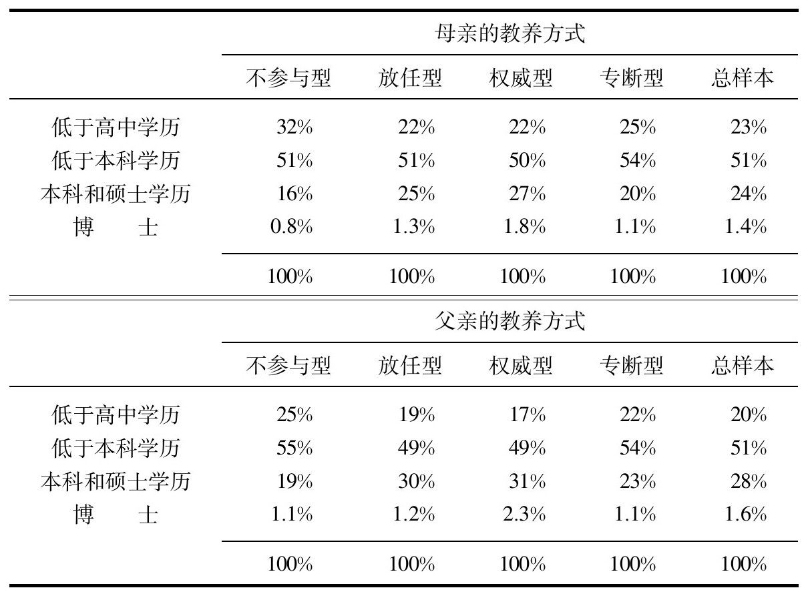

需要再次强调的是，我们应该谨慎地解释这些结果。不同的教养方式可以掩盖重要的社会经济差异。例如，第4章的表4.1显示，不参与型和专断型的父母的平均受教育程度都低于放任型和权威型的父母。由于父母的教育可以直接影响孩子的表现（例如，受过更高教育的父母可能更善于帮助孩子完成家庭作业），一些相关性可能是由教育背景而不是教养方式导致的。其他社会经济因素可能也很重要，例如不同种族群体的家庭结构以及父母的年龄。第4章将更深入地讨论社会经济特征如何影响父母对教养方式的选择。

为了将父母教养方式的影响与混杂因素区分开来，我们采用了一种称为多元逻辑回归分析的统计方法。由于我们在书中会多次使用这种方法，现在我们将解释胜算（odds）和优势比（odds ratio）的统计概念。

胜算和优势比（快速入门）

考虑一个可能出现成功或失败结果的事件，例如在某个学校通过某项考试的概率。成功概率与失败概率之间的比率就是胜算。比如，假设有1/3的女学生和1/4的男学生通过了这项考试。那么，女学生和男学生的胜算分别为1:2和1:3。优势比是这两个数字之间的比率。例如，在上面的例子中，女学生相对于男学生的优势比为1.5（1/2除以1/3）。在这里，优势比大于1，表明女学生比男学生更有可能成功通过考试。

逻辑回归允许我们估计具有相同社会经济特征的父母的不同养育方式的优势比。换句话说，教养方式X与教养方式Y的优势比指的是两对除教养方式外完全相同的父母的相对成功概率。请注意，虽然双亲的绝对成功概率还取决于社会经济因素，但统计模型假设优势比这一比例与这些因素无关。我们的快速入门到此结束。

回到NLSY97的结果

我们首先考虑母亲的教养方式对于完成大学教育（暂时不考虑父亲）的影响。放任型的母亲相对不参与型母亲的优势比是1.7；而专断型母亲相对不参与型的母亲的优势比是1.3；最后，权威型母亲相对不参与型母亲的优势比是2.1。这意味着，拥有权威型母亲对于获取大学学位这一目标是最好的，其次是放任型、专断型，然后是不参与型的母亲。

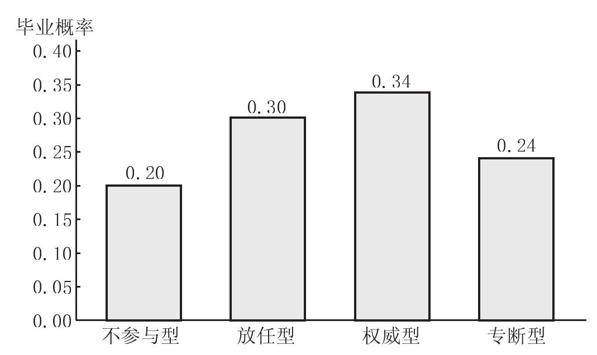

图2.5　给定社会经济特征，不同教养方式下获得大学文凭的概率估计

为了将优势比转化成更为标准的成功概率，假设有4个白人女孩：简、杰茜卡、吉尔和朱迪丝。在这一虚构的例子中，4个女孩的母亲具有完全相同的社会经济特征（也就是说，相同的教育、年龄等），但是她们的母亲采取了不同的教养方式。图2.5展示了这一结果。假设简的妈妈是不参与型的，并且简有20%的概率获得大学文凭。给定这一信息，我们可以运用之前估计的优势比来计算另三位女儿从大学毕业的概率。这一计算让我们了解了教养方式的差异有多重要。杰茜卡拥有放任型的母亲，她将以30%的概率毕业。吉尔拥有专断型的母亲，将以24%的概率毕业。可能性最高的是朱迪丝（拥有权威型母亲），她将以34%的概率毕业。

正如我们所预期的那样，其他因素对于教育的成功也很重要，有些因素则不如我们度量的教养方式重要。给定任何的教养方式，受过良好教育的母亲会增加孩子获得大学学位的可能性。女孩比男孩更有可能从大学毕业。然而，教育成就唯一的预测具有最强解释力的因素是亚裔背景。控制所有其他因素（包括教养方式），来自亚洲或太平洋地区可以将胜算率提高2.5倍。回到上面的例子，假设有两个亚裔女孩娇娇和珠珠，她们的母亲与简、杰茜卡、吉尔和朱迪丝的母亲具有相同的社会经济特征。假设娇娇的母亲是不参与型的，而珠珠的母亲是权威型的。娇娇将以39%的概率获得大学学位，这已经远高于简的20%；珠珠将以大于56%的概率从大学毕业。

该如何解释亚裔血统与学业成就的强关联性？我们相信文化和行为差异，而非基因因素，扮演了至关重要的角色。我们的数据只能对实际的教养方式提供一个粗略的度量。分类标准最终依赖于孩子觉得他们的父母是严格的还是支持的。无论孩子报告了什么结果，许多亚裔家庭的互动可能与其他家庭的互动不同，这是我们的分类方法忽略的在教养方式上的微妙差别。例如，如果我们自己的孩子接受采访，我们的妻子玛丽亚和马里萨可能最终会和蔡美儿描述的“虎妈”一样。然而，实际上他们可能比一般的亚裔美国母亲要远远“宽松”得多。因此，亚裔背景如此重要的原因很可能正是因为亚洲家庭背景的孩子接受了比其他群体更严格的权威型教养方式。

父亲的情况又是如何？整体情况大致和母亲相仿。假设有一个名叫杰奎琳的虚构女孩，她的父亲和母亲都是不参与型的。让我们假设她完成大学的概率是20%（与简的相同）。接下来，考虑另外4个女孩，珍妮弗、乔迪、朱莉娅和晶晶。珍妮弗的父母是专断型的；乔迪的父母是放任型的；朱莉娅的父母是权威型的；晶晶也是如此，然而，晶晶也是华裔美国人。珍妮弗的毕业概率为23%，仅略高于杰奎琳。在这里，一个有趣的新发现是，专断型父亲和学业成就的相关性与不参与型父亲相比是一样低的；相比之下，之前的结果表明专断型母亲明显比不参与型的母亲拥有更成功的孩子。乔迪和朱莉娅成功毕业的概率分别为36%和40%。因此，拥有同为放任型或权威型的父母（而不仅仅是一个采用这些教养方式的妈妈，如杰茜卡和朱迪丝的例子）进一步增加了大学毕业的机会。最后，晶晶成功毕业的概率是65%！

当我们考虑硕士以上学位，如博士学位时，教养方式的影响会变得更大。我们主要想说明，相比于放任型教养方式，接受权威型教养方式的孩子的成功概率大幅增加。让我们回到前面的例子，假设杰奎琳获得博士学位的概率为0.5%。乔迪（拥有两位放任型父母）获得博士学位的概率几乎不到0.8%。相比之下，朱莉娅（拥有两位权威型父母）有1.3%的概率获得博士学位。回想一下，乔迪和朱莉娅获得大学学位的概率大致相同。放任型和权威型教养方式对于孩子完成本科学位没有巨大差异。然而，相对放任型教养方式而言，权威型教养方式在孩子获取硕士以上学历这一方面具有显著的优势。在这个例子中，当一个人从放任型教养方式转变为权威型教养方式时，孩子成功的可能性就会大大增加。再一次，亚裔背景十分重要：晶晶获得博士学位的概率高达5.4%。

教养方式也与危险行为相关。使用相同的数据集，我们探究了教养方式对于入狱、初次性行为的年龄、避孕套的使用、抽烟、酗酒和吸毒的概率的影响。对于所有这些行为的研究结果是一致的。相比放任型和权威型父母，不参与型和专断型父母的孩子更有可能参与危险行为。总体而言，权威型父母（特别是权威型母亲）的孩子的危险行为最少。

“直升机育儿”的经济学根源

来自PISA和NLSY97调查的数据证实，教养方式对学校表现和高风险行为有影响。采用权威型教养方式的参与型父母的孩子更有可能在学校取得好成绩并获得更高的学位，并且不太可能做出有潜在危害的危险行为。在教育成果方面，放任型父母的子女处于中间位置，专断型和不参与型父母的子女表现则稍逊一筹。在我们控制了父母的教育背景的情况下，所有的结果仍然保持正确。

我们对教养方式的分类没有捕捉到其他差异。在美国，亚裔背景与成功概率的显著增加有关。我们讨论了为什么这也可能与教养方式有关：对教养方式的粗略定义可能无法捕捉到亲子互动性质的重要差异。由于不相信不同种族群体的学习能力存在显著差异，因而猜测我们发现的巨大影响与孩子与父母及同龄人互动方式的差异有关。

所有这些证据都与我们的整体论断相一致：通过父母与子女互动的时间来衡量育儿强度发生了变化。这种转变发生在一个以不平等加剧、教育回报率提高以及抚养子女的重要性上升为特征的时期。结果，父母越来越担心孩子的学业表现，并通过更加密集的教养方式以及选择有利于孩子取得学业成就的教养方式来应对。因此，“直升机父母”的兴起可以理解为父母对变化的经济环境的理性反应。

## 第3章　当代社会中的教养方式

为什么美国、瑞典或中国的父母们用不同的方式抚养孩子？传统观点认为，根深蒂固的文化差异起着至关重要的作用。然而，我们再次发现经济激励可以解释我们观察到的大部分现象。

本书的中心论点是经济激励塑造了父母育儿的方式。当不平等程度上升使得教育的重要性上升时，父母通过选择密集型教养方式以帮助孩子取得成功。在前一章中，我们发现育儿经济学能够很好地解释过去30年中育儿的总体变化：在不平等大幅上升时，“虎妈”“虎爸”和“直升机育儿”变得越来越受欢迎。

相对于解释不同教养方式的受欢迎程度随时间的变化，解释为什么养育子女在各国之间的差异如此之大是一项更为雄心勃勃的任务。各国在诸如政治历史、种族多样性和文化等许多方面都有所不同，每一个方面都可能在养育子女方面发挥作用。当涉及父母与子女之间的关系时，我们似乎很自然地认为当地代代相传的文化和传统在其中起着核心作用。相比之下，经济因素究竟有多重要？

在这一章节，我们会论证育儿经济学实际上非常成功地预测了全球不同国家的父母的行为方式。我们发现，许多父母的选择最初看起来是当地文化的一部分，最终还是归结于经济条件。经济不平等程度再次成为焦点。

收入不平等的水平和变化在各个国家都有很大差异。在美国，不平等程度的增加尤其明显，中等收入和高收入人群之间的差距越来越大。自1980年以来，中等收入家庭的实际收入几乎没有变化。同时，最富有的1%的家庭的收入增长很快。从1980年到2014年，这一小部分人的收入占总收入的比例从10%增加到21%，增加了一倍多。[1]今天，最富裕的1%家庭的平均收入是最贫穷的10%的家庭的38倍。

收入不平等程度在欧洲相对较低。在美国，在收入分布的90分位点的劳动者收入是10分位点的6.5倍。在北欧，这一数字降为3。在法国和德国，这一数字比北欧略大一些，但仍然远远低于美国的数值。欧洲的不平等程度在过去30年间上升了，但不像美国上升得这样快。在大多数欧洲国家，中等收入家庭的收入随着时间的推移稳步增长，尽管其收入增速仍然低于富人的收入增速。

根据我们的经济激励理论，在更加平均的社会中，比如北欧国家，父母应该表现得更加放任。与之相对的，“虎爸”“虎妈”和“直升机父母”应该在高度不平等国家更为常见。育儿经济学也预测了它们随时间推移发生的变化。在不平等程度上升较快的社会，父母应该更倾向于密集型（特别是权威型）；在收入分布变得更为平均的社会，父母应该更倾向于放任型。如果所有社会都变得更加不平等，那么在不平等增长更快的社会中，密集型教养方式应该会更快得到普及。我们将看到实证证据与这些预测十分吻合。

不同国家的育儿价值观：想象力、独立性以及勤奋

我们使用了世界价值观调查（World Values Survey, WVS）的数据检验了教养方式在不同国家之间的差异。世界价值观调查是斯德哥尔摩的一些社会学家用于研究文化价值观的变化以及这种变化对社会生活和政治生活的影响的一项调查。[2]世界价值观调查覆盖了一系列关于家长认为对于抚养孩子而言最重要的价值观问题。在本章中，我们主要关注了一些工业化国家，这些国家是OECD的成员国（OECD囊括了世界上大多数发达经济体），因为与把发达国家和发展中国家都包括在内的研究相比，这些样本中，除不平等以外的社会经济差异不太可能发挥重要作用。[3]例如，我们样本中的国家人均收入大致相似（以人均国内生产总值，即人均GDP来衡量）。我们将在后面对更多的国家进行比较。

调查问卷询问了人们认为最重要的孩子在家中需要学习的态度或价值观。受访者可以从菜单中最多选择5个值，包括独立性、勤奋、责任感、想象力、对他人的宽容和尊重、节俭、决心和毅力、宗教信仰、无私和服从。服从是与专断型父母联系最密切相关的价值观，我们将在第5章对此进行讨论。在本章中，我们关注的是想象力、独立性和勤奋，其中勤奋与密集型教养方式（更具体地说是权威型教养方式）有关，而注重想象力和独立性是放任型教养方式的特征。

通过观察这些育儿价值观如何随着国家的不平等程度的变化而变化，可以检验我们的预测是否正确，即在不平等程度较高的国家，密集型教养方式应该更受欢迎。图3.1根据基尼系数分别列出了每个国家中选择了想象力、独立性和勤奋的受访者比例。基尼系数是收入不平等的标准度量方式，基尼系数越高表明不平等程度越高。[4]

图3.1展示的规律是惊人的。在高不平等国家，许多父母会强调勤奋是孩子需要学习的重要价值观，而在低不平等国家，父母则更重视独立性和想象力。我们可以用称为“相关系数”的统计指标来度量不平等程度和价值观之间相关性的强度。这一系数可以在-100%至+100%之间取值。相关系数为0意味着两个变量不相关。+100%是两个变量之间可能的最大正相关性（如果一个变量上升，另一个上升），-100%是两个变量之间可能的最大负相关性（如果一个变量上升，另一个下降）。[5]我们发现在不平等和选择“勤奋”这一价值观之间存在极强的正相关性（+89%）而选择“独立性”“想象力”和不平等之间存在强负相关性（分别为-48%和-68%）。

我们首先来看对于勤奋的选择情况。65%的美国人认为勤奋是一种重要的美德，而在北欧国家这一比例可以低至11%—17%。同样，低于30%的德国父母们赞赏勤奋的价值观。这与我们认为德国人努力勤勉的刻板印象（马赛厄斯认为被夸张了）不符，但是和德国很低的不平等水平是相一致的。在中等不平等程度的国家，比如意大利和澳大利亚，父母对于培养勤奋的孩子的热情不如美国父母，但比德国和北欧国家要多。有少数几个国家不完全和一般规律相符。比如，法国和西班牙的孩子普遍被灌输勤奋的观念，尽管这两个国家的不平等程度都是中等。我们将在之后回到这些例外情况。然而，主要的规律是强烈的正向关联：一个国家越不平等，父母越认为孩子应该学习勤奋的美德。

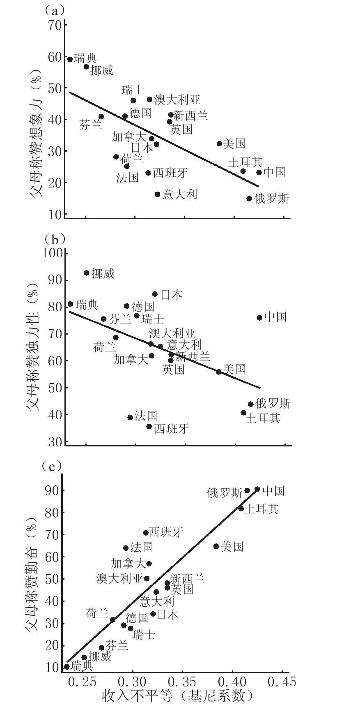

图3.1　收入不平等（基尼系数）与OECD国家（以及中国和俄罗斯）中选择了想象力（a）、独立性（b）和勤奋（c）的父母的比例

相反的规律出现在对于独立性的选择中。[6]北欧的父母认为培养独立的孩子非常重要，特别是挪威人，93%的挪威父母将其视为排名前五的价值观。中欧的父母也重视独立性，而只有一半的美国父母将其列为五个最重要的价值观之一。父母高度重视独立性的另一个国家是日本。这对于东亚父母来说似乎是特别的，我们稍后会回到这一现象。

与独立性相似，大部分北欧父母都高度重视想象力。相比之下，在不平等程度较高的国家，选择想象力的父母要少得多。例如，不到1/3的美国父母将其单独列出。土耳其也是如此，它也是一个高度不平等的国家。令法布里齐奥感到沮丧的是，意大利是OECD国家中想象力受到赞赏最少的国家，尽管意大利历史上充满了伟大的诗人、发明家和艺术家。马赛厄斯则可以振作起来：超过40%的德国父母赞赏想象力。再一次，经济解释比被文化误导的刻板印象更能揭示现实：意大利体育评论员长久以来都声称德国足球队队伍扎实、组织良好，但比意大利足球队缺乏想象力！

中国和俄罗斯在经济转型后，它们的收入不平等程度都变高了。为了进行比较，也将它们包括在我们的样本中，尽管它们不是OECD成员。在这两个国家，父母的态度都符合我们的假设：90%的中国和俄罗斯受访者称颂勤奋，而只有15%的俄罗斯人（比意大利得分低）和23%的中国人青睐想象力。

总之，世界价值观调查数据给出了一个强有力的结果，即经济不平等确实是各国选择更宽松或更密集的教养方式的关键决定因素。在不平等程度较低的国家（如德国、荷兰和北欧国家），父母们明显更重视孩子独立性和想象力，我们将其与放任型教养方式联系起来。勤奋在美国、中国和俄罗斯等不平等程度较高的国家很受欢迎。在本章后面，我们将深入地研究数据，并考虑将世界价值观调查中每个人的回答与特定的教养方式联系起来。在此之前，我们会考虑密集型和放任型教养方式与孩子的福利有何关联，并仔细研究在一组选定的国家中父母的行为方式。

世界上最幸福的孩子

人们不应该将宽松的教养方式与忽视的教养方式混为一谈。我们的论点并不是美国父母或中国父母比欧洲父母更好或更糟。不同的教养方式有利有弊，其适用性因经济环境而异。

可以说，宽容但有爱心的父母最终可能会有更快乐和更独立的孩子，尽管他们可能不太愿意面对全球其他国家的激烈竞争。联合国儿童基金会（UNICEF）对各国儿童福利进行的一项研究将荷兰儿童列为世界上最幸福的儿童。[7]（在我们世界价值观调查样本中的国家之中）紧跟在荷兰后面的分别为挪威、芬兰、瑞典、德国、瑞士和丹麦。这些都是不平等水平较低的国家，这些国家的父母重视独立性和想象力，并且不太执着于对孩子灌输严格的职业规划。

联合国儿童基金会的排名考虑了五个类别的一系列广泛度量标准：物质条件、健康和安全、教育、行为和风险、住房和环境。与教养方式最直接相关的度量标准是父母与子女共同度过的、可以增进孩子福利的时间，例如每天一起吃早餐或定期与他们一起锻炼。荷兰和北欧的孩子在这些方面与其他方面一样排名第一。这些国家的父母可能会对成功的态度更为宽松，但他们会与孩子互动，回应他们的需求，并且十分关心他们的健康。

有人可能会怀疑，对孩子的幸福感的各种衡量标准可能捕捉到的仅仅是富裕的好处。然而，事实证明，人均国内生产总值与整体孩子福利之间的关系相当弱。例如，捷克孩子的幸福感排名领先于奥地利，斯洛文尼亚领先于加拿大，葡萄牙领先于美国。在每一项比较中，较贫穷国家的儿童幸福感都较高。英国和美国这两个富裕大国的排名相当糟糕，英国排名第16位，而美国仅为第26位，尽管美国的人均国内生产总值在样本中位居第三，仅次于挪威和瑞士。

荷兰：正常点，已经够疯狂了

在荷兰，“世界上最幸福的孩子”的父母鼓励孩子们独立。例如，孩子们从小就被要求自行准备午餐并学习骑自行车。与世界价值观调查中对勤奋的重视程度较低相一致，人们很少听到荷兰的父母敦促孩子小小年纪就要取得成就或对他们的孩子是神童表示兴奋。与“虎妈”的精神相比，在“正常点，已经够疯狂了”（doe maar gewoon, dan doe je al gek genoeg）的信条下，他们相信脚踏实地、安于当下的价值观。[8]

宽松的标准全面适用于亲子关系。荷兰父母不会时刻监视孩子。游乐场通常位于咖啡馆或餐厅旁边，父母在那里聚会和聊天，而他们的小孩则在无人看管的情况下一起玩耍。父母甚至容忍一些冒险的行为。只有不到30%的荷兰儿童在城市骑行时戴头盔，这远远低于欧洲的平均水平。[9]虽然在荷兰骑自行车相对安全，但每年有1.8万名12岁以下儿童由于与自行车有关的伤害到医院急诊室就诊。儿童声称不喜欢戴头盔，因为这种穿着既笨拙又不方便，而且同龄人也不觉得戴头盔很“酷”。荷兰父母对这些争辩持宽容态度。他们通常不会在孩子面前戴头盔，而不是在安全行为上为孩子提供榜样。

学校的规章也反映了这种宽松的育儿文化。在荷兰，10岁以下的儿童没有作业。在低年级中，学生之间几乎没有竞争，而不及格也十分少见。这种闲散的教学方式似乎并不妨碍他们取得好的学业成就。在PISA 2015中，荷兰学生是欧洲表现最好的学生之一。在数学考试中，他们的成绩仅次于瑞士，在欧洲排名第二。在数学和科学考试中，荷兰的低分学生的比例始终小于美国。在参加PISA的所有国家中，荷兰的小学生报告的生活满意度最高，与韩国、日本和中国形成鲜明对比，这些国家孩子的学习成绩强于荷兰，但报告的幸福水平更低。

瑞典：户外小憩，让孩子们成为孩子

像荷兰人一样，瑞典人也一心关注孩子的福利。瑞典父母不是独自战斗，换言之，他们得到了政府的大力支持。父母有权享受共16个月的带薪育儿假（父亲假或母亲假），但规定一方不能休假13个月以上，这一措施旨在促使父母双方（特别是父亲）全心全意陪伴孩子。父亲假或母亲假的权利一直可以延续到孩子七岁。许多父母在他们的法定权利之外还选择休无薪假期。这种慷慨的育儿假政策鼓励年轻人生孩子。毫无疑问，瑞典是整个欧洲生育率最高的国家之一。休假只是支持家庭的众多社会政策之一。政府还大量补贴日托班和幼儿园——事实上这些机构几乎是免费的。超过80%的适龄儿童就读于学前机构。

有人可能会争辩说，育儿假和其他再分配政策解释了瑞典的养育方式。如果国家帮家庭承担了很多费用，父母可能不会那么急迫地去工作赚钱，并且政府通过补贴公共儿童保育机构，让父母以一种特殊的方式受到了抚养孩子的激励。政策驱动的激励措施无疑是解释瑞典人行为方式的重要因素。然而，人们不应该忘记政策和制度不会从天而降。向家庭的转移支付得到了广泛的民众支持，并在不同政治倾向的执政者期间仍然保持不变。因为任何提议削减家庭福利政策的政党都将面临选举中的惨败。

瑞典父母是世界上最宽容的父母之一。父母认为，孩子应该获得最大的自由，只要这不会危及他们的安全。由于瑞典孩子就像其他地方的孩子一样，也经常会在游戏中发生冲突。一种常见的情况是一个孩子打了另一个孩子，然后受害者流着泪向妈妈或爸爸哭诉。作为一名意大利父亲，法布里齐奥已经习惯了这样的想法，即每个家长都应该确保自己的孩子不会对他人造成伤害或干扰。一位优秀的意大利家长在自己的孩子越线时会有进行一番尖刻的责骂的冲动，这位冲昏了头脑的父母估计也会向受害者的父母不断道歉。瑞典的游乐场没有这样明确的规则。父母悠闲地坐在咖啡馆里，不主动去监视孩子的行为。即使遇到问题，他们也不愿介入：按照瑞典人的说法，孩子们会用自己的方式解决问题。出现问题时，将触发瑞典式的冲突解决协议。侵略者被礼貌地要求表示对受害者的同情。孩子们之间的拥抱会毫无疑问地结束这一事件，而父母则会毫不含糊地评论：“好吧，他们只是孩子。”在对这种文化冲击适应了一阵之后，玛丽亚和法布里齐奥经常看到小孩子如何学习利用这种宽容：他们“真诚”和“自发”的道歉往往伴随着胜利的微笑。然而，瑞典男孩和女孩比其他孩子更不可能成长为暴徒。令人惊讶的是，玛丽亚和法布里齐奥看到他们逐渐学会了和平共处。

除了体育运动之外，有组织的课外活动在瑞典很少见。权威型的玛丽亚和法布里齐奥把诺拉半强迫地送到了一位严格的东欧职业教师那里上钢琴课。来上课的孩子都有不同的国家背景，而其中的大多数来自亚洲。诺拉的成就让她的父母感动、自豪。然而，瑞典朋友们常常会对这样高压的父母皱起眉头，而非对他们的小神童表示羡慕。在瑞典，大多数家长不逼迫孩子去上音乐课，或者给他们报名为“小数学家们”准备的课程。同样，幼儿园明确不会提供正式的教学，无论是阅读还是写作。孩子7岁前不被强制上学（像其他北欧国家一样），尽管如此，人们总是听到父母对他们的8岁的小宝贝被迫进入正式学习阶段表示极大的担忧，有些父母甚至要求更晚开始上学。这些父母都是杞人忧天：甚至在正式学习阶段，瑞典的课堂也完全不能说是正式的。孩子们经常休息，经常可以自己决定是坐在桌子旁还是在教室里闲逛。而在意大利人眼中，把这样的课堂描述为“受控制的混乱”也不为过。

在瑞典，孩子们在小时候经常参与户外活动。这可能听起来不可思议，因为瑞典的天气不是很宜人。在南欧，婴儿很少在冬季被父母带出室外，因为他们认为冬天太冷了。相反，瑞典人认为没有恶劣的天气，只有糟糕的着装（也就是穿得不够多）。回到1999年，当新生儿诺拉即将在出生后几天离开斯德哥尔摩的丹德里德斯医院（Danderyds hospital）时，她的父母已经开始准备如何应对室外低于-10℃（14℉）的气温。这是一个寒冷的冬天，温度计显示-18℃（0℉）。一位护士建议：“只要温度不低于-20℃，你就不应该担心，宝宝穿得很保暖。”玛丽亚和法布里齐奥向护士反映他们的朋友建议更小心点为好。护士笑着说：“斯德哥尔摩人总是过分担心！我来自布登（Boden，瑞典北部的一个寒冷的城市），可以向你保证没有危险。”我们这两位南方人很快就明白了护士的意思，在寒冷的冬天，穿着暖和的婴儿喜欢在外面打盹并且很容易适应寒冷。瑞典人知道他们在做什么；毕竟，瑞典的儿童死亡率是世界上最低的。

玛丽亚和法布里齐奥无法接受所有的瑞典习俗。例如，他们的一些朋友为孩子报名了森林幼儿园，那里的孩子一年四季都在户外玩耍，只有当天气条件变得恶劣时才有基本的庇护所。当他们热心的朋友解释说，在这些学校上学的小孩子会接触到更少的细菌并且不那么经常生病时，玛丽亚和法布里齐奥礼貌地点头，但仍然选择了更传统的室内学校。

北欧的人们大多数比较随和。然而，当涉及育儿时，他们总是怀抱坚定的信念。他们认为世界上其他地方的教养方式都有点儿疯狂。比如当时，玛丽亚和法布里齐奥决定要搬到瑞士的德语区。在这一过渡期，他们考虑让诺拉转学到斯德哥尔摩的一所德语学校学习一年，以便让她适应这种转变。他们的朋友认为这是个糟糕的主意。显然，北欧人认为德国父母和德国的教育体系属于残忍的专断主义。

德国和瑞士：（某种程度上）宽松的父母

北欧人的观点当然比较夸张。德国父母可能某种程度上比北欧父母要严格，但是对于教养方式的看法很大程度上取决于习惯的育儿习俗。美国人看待德国人的教养方式可能完全不同。比如，一篇在《时代》杂志上发表的文章提及了一位移居柏林的美国母亲的视角：“所有的德国父母都聚在一起，喝着咖啡，而对他们在沙坑上20英尺处的木头龙上挂着的孩子们毫不在意。那堆软海绵垫到哪里去了？责任通知呢？人身伤害律师在哪呢？”[10]文化冲击不止于此。美国母亲惊讶地意识到，德国的幼儿园不注重学业，德国父母也不敦促他们的学龄前儿童学习读书和写字。最大的冲击是学校里各个年级的孩子都在无人护送的情况下步行上学，并在社区里到处闲逛。故事结尾，美国母亲摆出一副大义凛然的神色，终于决定让她的女儿独自去面包店……但同时一直在阳台监视着她的一举一动。

马赛厄斯常常在他三岁小儿子就读的芝加哥德语国际学校感受到这样的文化冲击。老师们来自德国、奥地利或者瑞士，并且也只是刚刚来到芝加哥，他们习惯于采取一种更为放松的德式态度对待孩子们的游戏。在孩子上学初期，让父母们惊愕的是，孩子在操场上受了点擦伤或者撞出了淤青，但学校没有对当时的情况提供任何解释。美国的父母（他们习惯于美国的学前班）期待着，至少能够有一份详细的书面“事故报告”来准确描述当时的情况以及事故原因，在这之后会有一场与一位老师（理想的人选是学校主任）的会面，以进一步交流并得到担保，即学校将不惜任何代价保证这样的事情不再发生。相反，德国老师们只会耸耸肩然后说，“那发生在操场上，我们当时并没有注意”，便撇下目瞪口呆的美国家长们走了。

瑞士的教养方式也相对宽松。当地文化中并没有过度育儿的概念。在2015年5月，《纽约时报》发表了一篇标题富有暗示性的文章，《在瑞士，父母旁观；在美国，父母监视》（In Switzerland, Parents Observe.In the US, Hovering Is Required）。[11]一位住在美国的瑞士母亲在自助餐厅里目击了自己的女儿和一位年纪更小的男孩发生了冲突。像一位典型的瑞士母亲一样，她认为没有任何理由去干预这样不起眼的“小插曲”，并倾向于让孩子独立寻找解决冲突的方式。随之而来的是男孩“控制狂”母亲的惊骇反应，指责她事不关己的态度，并且要求向她和她的儿子郑重道歉。

“独立性”在瑞士的育儿文化中排名很高。上小学的孩子们在没有大人监护的情况下与其他孩子一起步行上学，甚至幼儿园的孩子也是如此。瑞士政府也努力确保道路安全，街道上到处都是标志，警告司机学校就在附近。驾驶方式被要求迁就教养方式（对鲁莽驾驶的惩罚是十分严厉的）！

然而，瑞士孩子更为放松并且压力更少的断言需要一些限定，至少是年龄上的限定。尽管孩子一直到小学低龄阶段都可以享受轻松的童年，随着他们升入高年级，压力水平也会上升。正如我们曾经提到过的，在瑞士孩子们需参加高中入学考试，这一考试会将学生分配到学术型或职业型的高中。这场考试是一个转折点，也是瑞士家庭的主要压力来源。在苏黎世地区，考试在六年级，即孩子12岁时举行。许多家长给孩子报名参加高难度的预备课程，并花大量时间辅导他们学习。高中入学考试的那一天也极具戏剧性：一群备受煎熬的家长在考试地点等待着，试图从走出考场的孩子的表情中读出成功或失败。这一例子表明，除了经济不平等之外，制度特征，比如教育体系的设计也会影响教养方式的选择。利用经济学可以预测：“定终生式”的考试提升了教养的重要性，也因此为使用密集型教养方式提供了激励。我们会在第9章继续讨论这一点。

瑞士是一个很有意思的案例，因为尽管瑞士是一个小国，但它在语言、经济特征、甚至教育体系上拥有极大的地区间差异。在苏黎世大学一篇最近的论文中，经济学家朱利安·谢兰（Julian Schärer）使用瑞士儿童与青年调查（COCON）中的能力和背景数据检验了瑞士不同地区（州）的不平等与教养方式之间的关系。[12]这是一个始于2006年的纵向研究，涵盖了瑞士的德语区和法语区。谢兰根据家长对于一系列关于亲子关系的问题的回答，对他们的教养方式进行了分类。由于专断型教养方式在瑞士并不普遍，他主要聚焦于放任型和权威型教养方式。他的分析表明，在每个州权威型家长的比例都随着收入不平等程度的上升而上升。在施维茨（Schwyz）、沃州（Vaud）和巴塞尔（Basel）等高度不平等的州，权威型父母的比例很高。在阿尔高（Aargau）、索洛图恩（Solothurn）、比尔（Biel）和伯恩（Bern）这样的低不平等的州，比例大大降低了。这与我们在不同国家间的比较发现的规律相同。

在英国人气不断增长的过度育儿

主流教养方式的差异并不仅仅反映了欧洲人和美国人的文化分流。不是所有的欧洲人相信宽松的教养方式可以培养独立性和想象力。在2016年1月，在卡梅伦政府由于脱欧公投倒台的几个月前，英国首相戴维·卡梅伦于伦敦北部伊斯灵顿向一群父母致辞。在致辞中，他呼吁父母和学校的教育工作者们采取“虎妈”的教育观念，并且不惜一切代价向孩子灌输勤奋的美德。公立学校应该传达蔡美儿“不断努力，相信自己，屡败屡战”（try hard, believe you can succeed, get up and try again）的信念，而非一种“所有人都应获得奖励”的文化。用他的话来说“坚毅是成功的核心，……无论你多聪明，如果你不相信持续的努力和专注，如果你不相信你可以从失败中站起来，你将无法发挥你的潜能。”[13]他关于道德价值观的富有激情的演讲没有触及录取条件苛刻的精英私立学校，比如卡梅伦先生自己就读的希瑟塘预备学校（Heatherdown Preparatory School）和伊顿公学（Eton College），在成功中扮演的重要性。

尽管没有展示故事的全貌，卡梅伦先生也可能不过是多此一举。英国人的教养方式，特别是在那些教育程度更高的阶级，比德国人和北欧人都要更为密集。在英国，直升机育儿的人气从20世纪90年代起就高速增长。就像许多美国家长所做的那样，越来越多的英国父母在孩子的大学选择中扮演积极的角色并陪他们去参观校园。

这一新兴潮流发展如此深远，以至于现在大学的访问日面向潜在学生的家长的程度和面向学生的程度一样多。在访问日，家长越来越敢于表达自己的观点。为了对抗这种趋势，大学通常会同时为家长和学生安排单独的宣讲，以避免家长“擅自参加”学生的宣讲活动。曾经有过这样的趣闻，不期而至的母亲们出现在为硕士生准备的聚会中，以期和教授们讨论她们二十多岁的孩子的学习进展。有趣的是，英国父母育儿态度似乎是1998年通过《教学和高等教育法案》（Teaching and Higher Education Bill）时开始发生转变的，这一法案提高了学费，并废除了学生的助学金，取而代之的是新的经济状况调查贷款制度（means-tested loans）。[14]从此以后，高等教育每年的费用从1 000英镑增加到9 000英镑，并且顶尖学校的竞争也愈演愈烈。在改革之前，一般大部分学生能获得助学金（比如，大学讲师的工资水平就足以让她的孩子满足接受助学金的条件）。相比之下，在新制度下，许多中下阶层的父母根本无力承担让孩子放弃学业或在几年后改专业或转大学的费用。他们也不能让孩子选择不太可能带来相对高薪而稳定的工作的专业。换言之，改革后经济因素更重要了，在教育方面这些因素重要性的上升与直升机育儿的大行其道是并行的。[15]

中国：我知道什么对他们最好

如果你在寻找一个将密集型教养方式常态化的国家，那就是中国。在美国，蔡美儿相信来自中国的父母比西方父母更关注孩子的学业成就：“中国家长大约每天花十倍的时间对孩子进行学业训练。相比之下，西方的孩子更有可能去参加运动队。”[16]来自世界价值观调查的数据印证了这种严格的中式育儿文化的传统印象（见图3.1）。90%的中国受访者肯定了勤奋的价值（美国为65%，瑞典仅为11%）。根据《中国日报》一项调查，蔡美儿推崇的严格育儿方式在中国很受欢迎。“在1 795个受访者中，94.9%的受访者认识那些是严格母亲的女性，55.1%的人赞赏蔡美儿的教养方式”，只有“18%的人说‘虎妈’剥夺了孩子的童年乐趣”。[17]在这篇文章的报道中，一位北京大学教育学教授表明，这种教养方式的优点使得孩子更聪明，他们为未来的激烈竞争做了更充分的准备。

在中国，“虎妈”的神话是如此受欢迎，以至于成为了一部电视连续剧的主题。这部电视剧由著名演员赵薇和佟大为主演。三位主人公分别为毕胜男（“虎妈”）、罗素（丈夫）和茜茜（他们五岁的女儿）。毕胜男（在汉语中意思是“比男性还出色”）是一家成功企业的高管。她意志坚定、严格，并准备付出巨大的努力来引导女儿走向成功。相比之下，罗素是一个更放任的爸爸。这个喜剧性的故事围绕着两位家长之间的纠纷展开。

在电视剧中，一个反复出现的主题是给予茜茜最好的教育的重要性。有一天，毕胜男发现，茜茜为了漂亮化了妆，她勃然大怒。母亲和女儿之间的冲突一直没有平息，直到茜茜为了哄妈妈开心，告诉妈妈她不想化妆，而是想要像她的朋友嘟嘟一样好好学习。胜男想更多地去了解优秀的嘟嘟。她发现嘟嘟是第一小学的学生，那里有许多像她一样的孩子。胜男的人生目标一下子成为了将茜茜送到那所学校。获得录取的条件是拥有学区房，而学区房十分昂贵。胜男决定出售他们居住的复式公寓，购买一套每平方米9万元（14 000美元）的老破小学区房。当罗素和他的家人试图阻止她进行200万元的抵押贷款，因为这将使他们的生活陷入困境时，胜男讲述了她的故事：她的父亲很穷，但他把大部分钱花在了她的教育上。多亏了这一点，她可以去最好的学校并最终获得事业上的成功。

尽管她的家庭作出了巨大的牺牲，茜茜仍然没能够进入梦寐以求的学校，由于录取规则的变化，只有来自学区并居住两年以上家庭的孩子才可以被优先录取。胜男没有放弃，她没有把女儿送到普通小学，而是让女儿推迟一年入学。然而，在学习中断期间让茜茜放任自流是决不可能的。胜男辞去了她的工作，并强迫女儿接受超高强度的家庭教育以及日常体育锻炼，还给她报名了绘画和音乐课。胜男从未犹豫：“我们的事业可以被牺牲，但女儿的未来不能。我们活着是为了女儿。”

胜男是全心全意的传统中国母亲形象的缩影，她认为勤奋是成功的途径——这一信念反映在中国父母对世界价值观调查的回答中。胜男在教育上可以做到毫不留情。有一天，茜茜没有完成作业，因为奶奶带她出去了一整天。当胜男晚上回家时，她把女儿从床上拉下来，逼迫她完成家庭作业。这仅仅是一个虚构的电视剧的夸张手法吗？不完全是。有一天，法布里齐奥充满钦佩地向一位中国朋友问起他的钢琴天才女儿，“所有这些天赋从何而来？”这位朋友认真地回答说，他相信他的女儿不比她的许多同学更有音乐天赋；她只是愿意比其他人花更多的时间练习。许多中国父母都同意那句据称来自爱迪生的名言：“天才是1%的灵感加上99%的汗水。”

中国父母的教育方式支持我们的育儿经济学理论。由于不平等程度在今天的中国相对较高，而教育在父母的眼中也非常重要。最后，正如胜男对自己生活经历的描述一样，勤奋是跨越阶层的有效手段。对国内的学生而言，成功之门是高考，这是一场至关重要的考试，每年有900多万考生参加高考以进入高等学府。在高考中的优异表现能够让学生进入顶尖大学，而糟糕的成绩则可能让孩子失去任何就学机会。这与美国相反。在美国，精英学校的录取不仅仅与平时成绩和测试成绩挂钩，还取决于其他因素，比如课外活动和社会经济背景。在中国成绩决定了一切。我们会在第9章探讨高考导致的戏剧性后果。

我们是否可以断言，经济不平等和教育的高度重要性能够完全解释中国式的教养方式呢？虽然我们认为这些因素非常重要，但我们认为中国式育儿在某种程度上植根于古老的文化传统，而非当前的经济条件。比如，传统对权威和等级的尊重可以解释中国式育儿向专断型教养方式的偏向，这种偏向将中国式的密集型父母与类似经济社会状况的西方国家的父母区分开来。用蔡美儿的话来说：“中国父母相信他们知道什么对孩子最有利，因此会忽视孩子的欲望和偏好。”[18]

日本：让可爱的孩子踏上旅途吧

日本的育儿文化与中国相映成趣。尽管中国和日本如今是截然不同的两个国家，但它们历史上有许多共同的文化特征。比如，教育和学业成就在中国和日本都受到极高的尊重。对于父母和老人的尊敬也是两国共同的重要传统价值观。因此，如果我们相信传统文化因素是决定教养方式的主要因素，那么我们在两个国家应当看到相似的育儿行为。然而，当下日本的经济情况与中国很不同。首先，尽管中国在过去20年间经济增速比日本要快得多，日本却更为富裕（日本的人均GDP比中国高2.5倍）。更重要的是，收入不平等在日本比在中国要低。日本的基尼系数也比美国低，介于德国和英国之间。与这些经济差异一致的是中日之间育儿价值观的差异。在世界价值观调查中，日本的父母强调勤奋的程度远低于中国父母。相比中国的90%，只有1/3的日本受访者把勤奋作为育儿中最重要的价值观。相反，日本父母把想象力放在了更高的位置。因此，中日的分歧与我们经济学理论的预测完全一致。

然而，当我们谈到培养孩子的独立能力的重要性时，中日育儿文化达成了共识。独立性被76%的中国受访者以及超过80%的日本受访者列为非常重要的价值观，远高于美国，在美国这一比例是56%。对于独立性的强调可以用一句日本谚语来概括：“かわいい子に旅させよ”，翻译成中文就是“让可爱的孩子踏上旅途吧”，或者更直白但准确地说“让亲爱的孩子独自旅行”，这一日本谚语描绘了培养孩子的自立能力的重要性。日本的孩子很小就在没有大人监护的情况下搭乘公共交通工具，或为父母跑腿，比如去杂货店买东西。

日本育儿文化中抚养独立孩子的重要性是如此深入人心，以至于日本有一个名为《我家宝贝大冒险》（はじめてのおつかい）的电视节目专门拍摄小孩子们的第一份差事（比如，哥哥和妹妹第一次出门买菜）。这一真人秀在日本的电视台播了25年多。[19]为什么独立性在日本父母中这么受欢迎？或许是因为日本文化中存在极强的社会信任和社区意识。此外，日本的犯罪率非常低，孩子们很早就被教导，他们可以在需要帮助时依靠其他社区成员。[20]

尽管日本的父母不像中国的父母那样执着于努力可以获得回报的信念，密集型教养方式仍然在扩张，特别是对于支持孩子的教育上。日本人长期以来很关心教育。母亲负责确保孩子的学习进展，“说教妈妈”（教育ママ）一词多年来被用于指代这一角色。一个研究团队研究了日本的母亲和孩子的学龄前老师以及小学老师的关系，并得出结论，20世纪60年代传统的比较内敛并支持学校的目标和教学方式的“说教妈妈”们，到今天逐渐演变为在各方面干预孩子生活的“魔鬼父母”（monster parents）。[21]“魔鬼父母”们常常和学校老师发生冲突，他们责怪老师的教学无法达到家长的预期。[22]

专断型育儿在欧洲遗脉：法国和西班牙

目前，我们讨论过的国家对于教养方式的选择都与我们理论的核心相吻合。我们现在转向两个挑战更大的欧洲国家：法国和西班牙。世界价值观调查数据显示，虽然他们对勤奋的态度与我们的理论预测的大致吻合，但法国父母重视独立性和想象力的程度远低于他们中等不平等程度所对应的水平。相反，服从的得分很高，43%的受访者将这一价值观列为5个最重要的价值观之一。这比德国（17%）、瑞典（17%）和美国（30%）的比例要大得多。西班牙与法国相似，42%的父母相信服从是重要的。

法国和西班牙父母向专断型的转变也反映在他们普遍接受体罚上，尽管近年来两个国家推行了不同的法律：体罚在西班牙从2007年起成为非法行为，而在法国直到2017年还是合法的。然而，两个国家的父母都承认这种手段被广泛使用。一项在5个欧洲国家（瑞典、奥地利、德国、法国和西班牙）进行的调查，访谈了5 000名家长对于使用体罚的看法。[23]超过一半（55%）的西班牙父母称曾扇过孩子巴掌，80%的父母打过孩子屁股，7%的人曾经用工具打孩子。法国父母，这些比例分别为72%、87%和5%。

一个可能的解释是天主教父母特别倾向于使用专断型方法。与这种观点相一致的是美国社会学家格哈德·伦斯基（Gerhard Lenski）的一项研究，该研究考察了居住在底特律的天主教徒和新教徒的教养方式的差异。[24]在亲子关系方面，底特律天主教徒比新教徒更为传统，他们拥有的价值观更强调服从权威而非独立自主。天主教徒也更倾向于使用体罚。这一研究基于美国并且历史可以追溯到半个世纪以前。最近的世界价值观调查提供的国际证据只能部分支持这种猜想。服从的价值观在大多数天主教国家受到高度赞扬，比如，阿根廷（48%）、智利（58%）、哥伦比亚（67%）、墨西哥（64%）、秘鲁（61%）、巴西（55%）和波兰（55%）。然而，意大利（29%）是一个天主教国家，其父母对服从的重视程度却较低。此外，我们对一国以内父母行为的分析（见第5章）表明，虽然信仰宗教的父母平均而言更专断，但天主教徒和持有其他宗教信仰的人之间并无重大差别。其他可能的解释集中在政治历史上（西班牙是一个相对年轻的民主国家，在20世纪30年代经历了内战）和教育体系的特征，这是我们将在第9章要回答的问题。

使用世界价值观调查的个人层面数据

在深入探讨了几个国家后，我们回到对来自世界价值观调查的数据的具体分析。在本章开篇，我们使用了一期世界价值观调查的数据（选择了覆盖面最广的那一期），展示了几种教养方式与国家之间的不平等程度的联系。我们还可以从数据中提取更多的信息。首先，可以使用育儿价值观的信息来推断每个受访者的教养方式。其次，由于许多国家多次参与了世界价值观调查，可以检验不同教养方式受欢迎程度的变化是否与收入不平等程度的变化一致。换言之，我们可以检验，当国家变得更不平等时，权威型教养方式是否会取代放任型教养方式。最后，世界价值观调查提供了每位受访者的社会经济特征的丰富信息，比如年龄和受教育程度。由于个人的特征也有可能对教养方式的选择产生影响，可以使用统计方法来把这些特定因素的影响与国家层面的收入不平等程度分离开来。

我们使用了4个维度来将世界价值观调查的受访者归类为某种特定的教养方式：独立性、想象力、勤奋以及服从。由于父母被要求从许多选项中选择出他们认为的5种最重要的价值观，在我们感兴趣的这4种价值观中他们选择的可能多于一个。由于这一点，我们将所有的将“服从”作为5种最重要价值观之一的父母都归类为专断型，无论他们选择的其他价值观是什么。高度服从的要求是专断型教养方式独有的一个显著特征，因为权威型父母的目标是让孩子相信他们自愿做出了正确选择，而放任型父母不会干预孩子的选择。在剩余的（非专断型）父母中，我们把那些选择了勤奋的归类为权威型父母，因为督促孩子去追求卓越是这一教养方式的特征，而非放任型教养方式的特征。最后，我们把那些既不是专断型也不是权威型，而且选择了独立性或想象力的家长归类为放任型，因为独立性或想象力都很自然地可以与放任型教养方式联系在一起。剩下的是那些没有选择作为我们分类基准的4种价值观中任何一种的父母。由于这一类只占所有受访者的9%，我们在分析中略过了他们。

不平等增长越多，权威型家长越多

图3.2展示了随着不同国家不平等程度的变化，选择各种教养方式的父母的比例的差异。[25]这里我们分别用在收入分布的90分位点和10分位点的全职的、非独立经营的劳动者的收入之比来度量不平等程度（注意，这一度量和我们在本章开始时使用的不平等度量不同，也与第2章讨论的S90—S10比率不同）。如果我们使用基尼系数，结果会和图3.1很相似，但跨时间维度上该指标的度量精度更高。[26]图中对每一个国家仅汇报一个值，也就是该国在世界价值观调中的均值。

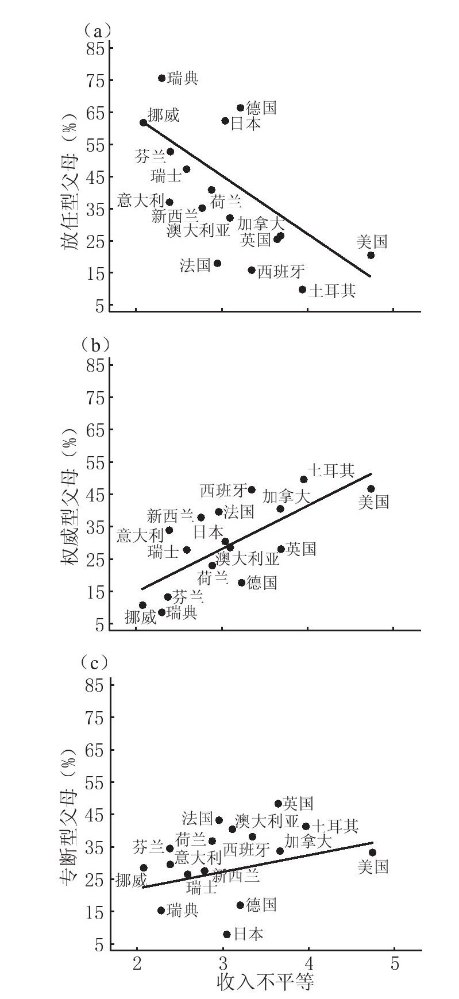

图3.2　收入不平等（收入分布90分位点与10分位点的比率）与OECD国家中采取放任型、权威型和专断型教养方式的父母的比例

首先来看放任型教养方式，见图3.2（a）。与高不平等水平相对应的，更低比例的家长选择了放任型教养方式。许多瑞典父母是放任型的，而不平等程度在瑞典也很低，只有少数美国父母是放任型的，而不平等程度在美国很高。由于我们可以从不同版本的世界价值观调查中获得数据，我们也可以考虑一国之内的跨时间变化。在我们此前发表的研究中我们对这些数据进行了更为系统的分析。[27]在这些分析中，我们发现不同教养方式的受欢迎程度与国家内部不平等程度的变化是一致的。在大多数情况下，一个国家的不平等程度上升，放任型教养方式的受欢迎程度会下降。以挪威为例，平均意义而言，挪威有很多的放任型父母。然而，当不平等程度在1996—2007年间上升时，挪威的父母不再那么宽松了。芬兰、德国、新西兰和美国也是如此，所有这些国家一开始的收入不平等程度都不同。与之形成鲜明对比的是，当西班牙的不平等程度在2007—2011年间下降时，西班牙的父母变得更为宽松了。正如在社会科学中常见的那样，没有理论可以完美地与数据吻合，因为理论总是聚焦于一个方面（我们的理论聚焦于不平等）而对其他可能也很重要的因素泛泛而谈。比如，德国的不平等在2006—2013年几乎没有变化，然而德国家长们却变得更放任了。

图3.2（b）表明，与高不平等程度相对应的，更多的家长采用了权威型教养方式。这一教养方式在北欧不受欢迎，在荷兰、瑞士或德国也没有被广泛采用。相反，权威型教养方式在美国、土耳其、法国和西班牙很受欢迎。我们早期的研究也揭示了权威型教养方式受欢迎程度与国家内部不平等程度的变化是一致的。比如美国，在1995—2011年间不平等急剧上升的同时，权威型教养方式普及度从39%上升到53%。

最后，图3.2（c）展示了不平等和强调服从的专断型教养方式的关系。与高不平等程度相对应的是更高比例的专断型父母。尽管这一关系要比另两种教养方式更弱。与我们之前对日本的讨论相一致，很少有日本父母是专断型的。我们也有些许惊讶：专断型的芬兰父母比瑞典父母要多得多。我们将在接下来的章节表明，选择专断型教养方式的主要决定因素是家长的社会经济地位以及国家层面的经济发展水平而非不平等程度。

经济不平等的影响有多大？

对于世界价值观调查的跨国分析为这样的假设提供了支持，即收入不平等上升时，相应地，放任型父母会更少，而权威型父母会更多（专断型父母也会更多，但比权威型父母略少一些）。然而，这些关联需要更进一步的检验。目前，我们仅仅考虑了宏观经济不平等一个因素的作用。然而，在个人层面，教养方式可能取决于父母的一系列社会经济特征，比如他们的受教育程度等。在国家层面，教养方式的差异可能是由于文化异质性（比如，中国儒家文化或者美国清教徒文化）。忽视这些决定因素可能会让我们高估不平等对于教养方式的影响。

为了解决这些问题，我们回到第2章使用过的统计方法（多元逻辑回归）。我们使用了原始的个人数据，其中每个观测值都代表一个世界价值观调查的受访者，而非把数据加总到国家层面。这一方法使得我们能够把上升的不平等程度的影响从父母的教育或人口学特征的影响中剥离出来。[28]换句话说，我们估计了具有相同社会经济特征的家长在不同的收入不平等程度下选择各种教养方式的概率。我们可以利用每个国家在不同年份的调查数据来消除每个国家的特定因素，比如文化的影响。这使得我们能够在控制国家层面的因素的情况下，通过对生活在同一国家的父母进行比较，检验不平等对于教养方式的影响。这一分析方法被称为“控制国家固定效应的回归”。

总的来说，这一分析给出了与之前不那么复杂的分析相类似的结果。国家层面不平等程度的变化和父母采取哪种教养方式的概率的变化有关。[29]具体而言，当一个国家变得更不平等时，具有相同社会经济特征的父母的选择明显更不倾向于放任型，而是更倾向于权威型，并且某种程度上更为专断。

为了量化感知收入不平等的变化在重塑教养方式上的重要性，考虑如下的例子。假设有一位虚构的瑞典家长，在各方面的特征（年龄、教育等）都处于平均状态，其时为1996年，不平等的度量为2.3。这位虚构的家长是放任型、权威型和专断型父母的概率分别应当为75%、6%和19%，与图3.2中的国家层面的平均值接近。然后，假设我们把这位家长移到不同的经济环境中，这一经济环境的不平等程度与2011年的美国相当。我们可以使用估计出的影响来推测这位家长在这个和美国相似的社会中，选择放任型、权威型和专断型的概率，估计出来的概率分别应当为21%、26%和53%（见图3.3）。[30]这些数字和原来的数字完全不同！从放任型向权威型教养方式的转变特别大，并且统计意义上十分显著。放任型教养方式比例的下降几乎与瑞典和美国放任型父母所占比例之间的差距是相等的（见图3.2）。这意味着不平等而非个人特征或者国家特定的因素解释了大部分瑞典和美国教育方式的差异。更进一步而言，这些结果也意味着持续增长的经济不平等可能使得全世界范围内的“直升机育儿”急剧上升。

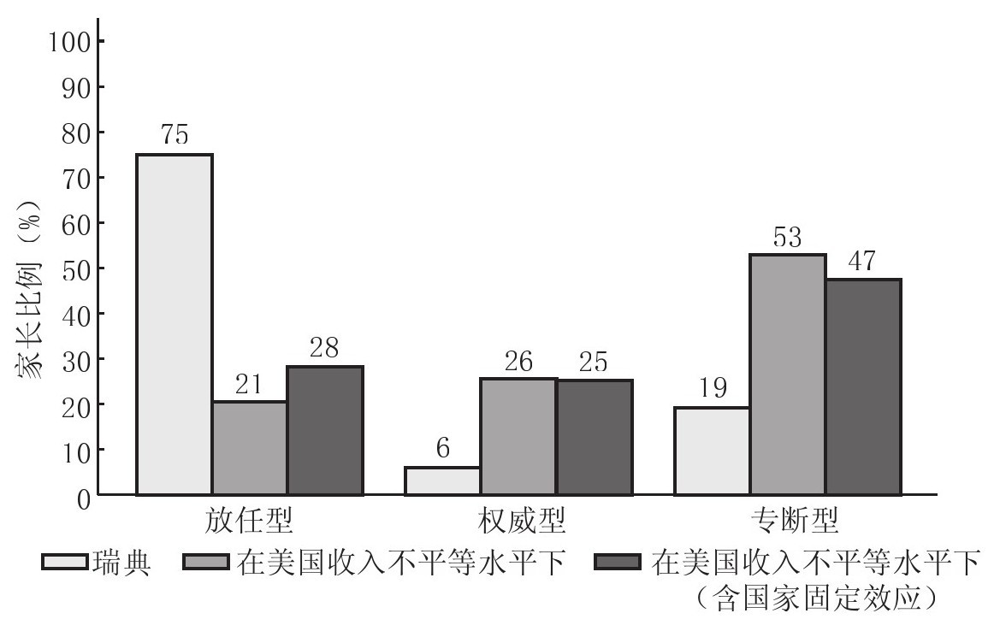

图3.3　具有1996年瑞典平均水平特征的父母教养方式的预计分布vs.虚构的不平等程度上升到美国2011年水平下相同父母的教养方式的预计分布

此处需要说明两个局限。首先，尽管我们控制了一系列对教养方式的选择的可能影响因素，比如父母的社会经济特征和国家的特定影响，我们不能确保囊括了所有可能影响教养方式的因素。因此，我们很难确定不平等和育儿之间的联系是否部分地由我们未能度量的因素导致的。其次，在我们之前的比较中，允许瑞典的不平等程度变得和美国一样是一个十分大的变化，远远大于任何一个国家在这一时期经历的不平等的变化。换句话说，我们不太可能在未来10年在某个国家观察到教养方式会出现像我们的例子中展现的这样急剧的变化。

统计分析还揭示了相对于各个国家的不平等程度所预测的水平而言，哪些表现出了不寻常的育儿行为。德国和瑞典（两个不平等程度较低的国家）的父母较不平等和放任型之间的负相关性所预测的水平而言，更加放任。同样，专断型日本父母的比例异常低。相比之下，我们来预测法国和西班牙收入不平等对应的放任型父母的比例，更少的法国和西班牙的父母是放任型的，反而有很多是权威型或专断型的，这是我们之前已经注意到并且后续要探讨的事实。意大利父母因其更多地选择权威型而非专断型或放任型而成为例外。最后，在英国、土耳其和美国，专断型的特征特别明显（超出这些国家高收入不平等程度所预测的水平）。就全球趋势而言，我们的分析显示权威型教养方式的普及随着时间的推移而明显增加，与第2章中讨论的全球不平等的加剧是一致的。

教育程度又如何影响教养方式的选择呢？我们的估计表明，相对于高中没毕业的父母而言，具有高中学历以及大学学历的父母，更有可能采用放任型的教养方式。拥有大学学历的父母极不可能是专断型的，换句话说，极不可能认为服从是一个需要给孩子灌输的重要价值观。第4章将更深入地讨论受教育程度较低的父母更有可能成为专断型父母的结论。

最后，人们可能想知道经济发展水平对教养方式的影响。当我们研究CECD国家之间的跨国差异时，我们会发现这一影响相当小。人均GDP的增长（经济发展的标准度量）略微增加了放任型教养方式的吸引力。总的来说，在我们的CECD发达国家样本中，收入不平等的影响比发展水平更大、更稳健。我们在第5章会回顾这一讨论，那时我们会考虑包括更多国家的样本，这些国家也包括发展中经济体。

公共政策的角色：税收和再分配如何影响教养方式

到目前为止，我们只考虑了税前收入不平等的影响。然而，人们实际上更关心他们的可支配收入，即他们纳税后可以获得的收入。此外，人们的福利也受到提供公共产品（公园、公立医院、法律秩序）和安全网络（公共养老金、失业救济金、医疗保险）的公共政策的影响。如果教养方式是由父母对孩子未来前景的预期决定的，那么，人们也应该会看到不同教养方式的受欢迎程度因税收和社会支出而异。例如，在拥有优厚的国家福利政策的国家，父母可能会更宽松，更不执着于孩子的教育成就，因为他们知道如果遇到经济困难，孩子可以依靠国家。

累进式税收是一项强有力的政策工具。如果税率随着应税收入的增加而变得更高，则征税方法是累进的。累进税的目标是重新分配收入，它有利于收入较低的穷人，而牺牲了收入较高的富人的利益。税收累进程度越高，高收入者和低收入者之间的可支配收入差异也越小。

我们的理论预测，如果税收累进程度不高，父母更倾向于采取密集型教养方式。相反，在税收累进程度高的国家，我们应该能观察到更多的放任型父母。我们使用了安德鲁·扬政策研究学院（Andrew Young School of Policy Studies）开发的税收累进程度衡量标准。[31]图3.4显示的证据与我们的预测很好地吻合：在税收制度累进程度高的国家，父母多为放任型，更少为权威型和专断型。

接下来我们考虑社会支出总额占GDP的百分比。[32]社会支出倾向于帮助穷人并减少实际上的不平等。因此，我们应该预期在那些在社会政策上支出更多的国家，父母更多的是放任型而非权威型。实证证据再次证实了这一点。社会支出与专断型教养方式之间的关系也为负相关，尽管这种关系在正式统计意义上较弱而且不显著。

有人可能会表示异议，认为上面的不同结果具有共同的根源，因为税前不平等程度低的国家可能会系统性地具有高税收率和高社会支出，例如瑞典，反之亦然，例如美国。然而，事实证明，本章讨论的三个变量中的每一个对父母教养方式的选择都有影响。在多元回归分析中，我们发现以下任何一个——低税前收入不平等、高度累进的税收制度和高社会支出——都使得父母更加倾向放任型。

更确切地说，如果我们比较两位具有相同社会经济特征的家长，那么生活在不平等程度较低和/或税收更加累进和/或社会支出更为慷慨的国家的那位家长更有可能是放任型的，不太可能是权威型和专断型的。为了使这一论点更具体，考虑两位年龄、受教育程度以及其他各方面都相同的家长，他们分别居住在德国和土耳其。假设对于土耳其家长来说，放任型、权威型和专断型的概率分别为10%、45%和45%（图3.5）。然后，根据我们的分析，另一位其他方面都相同的德国家长为放任型、权威型和专断型的概率分别等于49%、22%和29%。因此，即使个体特征相同，德国家长也更有可能是放任型的。差异的部分原因是德国较低水平的不平等，以及德国具有更慷慨的福利政策。为了分离这两个部分，让我们想象一个虚构的国家，所有的财产都与真实世界的土耳其相同，只是它与德国有着相同的税前不平等程度。让我们称这样一个国家为“伪土耳其”。然后，伪土耳其的父母为放任型、权威型和专断型的概率分别为39%、27%和34%。在这种情况下，相对于实际土耳其的差距较小：仅高的税前不平等水平将放任型的概率从10%提高到39%。[33]要达到德国父母49%的放任型的概率，剩下的10%是因为德国的税收制度累进程度更高以及更慷慨的福利政策。

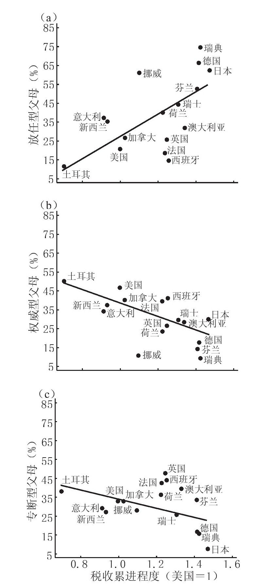

图3.4　税收累进程度和不同OECD国家间选择各类教养方式的父母的比例

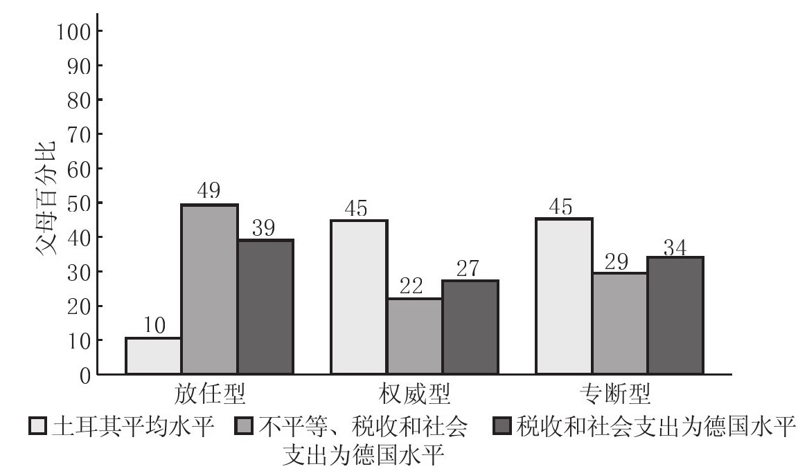

图3.5　具有2007年土耳其平均特征的家长的教养方式的预计分布vs.虚构的不平等程度、税收以及社会支出为德国水平下的相同家长的教养方式的预计分布，或仅税收和社会支出为德国水平下的相同家长的教养方式的预计分布

总的来说，我们看到即使考虑到税前不平等的差异，政府政策也解释了父母教养方式的某种变化。这意味着经济政策的变化可能会影响父母抚育子女的方式，这是我们将在后面的章节中回归的主题。

教育回报率的影响

可以说，不同教养方式产生的最重要的影响是孩子的教育成就。由于我们的论点是父母教养方式的选择取决于孩子的经济前景，我们应该看到父母干预的强度会随着教育的经济利益的增大而增加。特别是，我们预期看到父母在受教育程度较高的国家中不那么放任，尤其是在教育回报率高的国家中，更倾向权威型。教育的回报率与一个国家的不平等程度相关，但不尽然相同。如果教育回报率很高，即受教育程度最高的劳动者比其他人获得的回报要多得多，将会导致不平等。与此同时，还有其他不平等的来源（例如财富的初次分配）对育儿的直接影响则较小。因此，通过观察教育回报而不仅仅是宽泛的不平等水平，我们或许能够更清楚地聚焦于育儿行为背后的激励机制。

不幸的是，比较各国的教育回报率比人们想象的要复杂得多。经济学家计算教育回报率的标准方法是将受过大学教育的劳动者的收入与受教育程度较低的劳动者的收入进行比较，或者通过观察增加一年的教育对收入的影响来进行比较。但是，如果想要捕捉各国教育的经济利益的差异，这两项措施都有局限性。在一些国家（例如瑞士），职业培训很重要。接受不同类型的职业培训的工人之间存在相当大的不平等，并且不同专业的录取是竞争性的，这并不反映在教育年限的回归中。同样，在像美国这样的国家，与排名低的大学相比，就读于精英大学的人有很高的收入溢价。被排名高的大学录取的额外收益没有被包括在教育回报的标准度量中，然而这很重要，因为在其他国家（如德国），不同大学之间的差异要小得多。

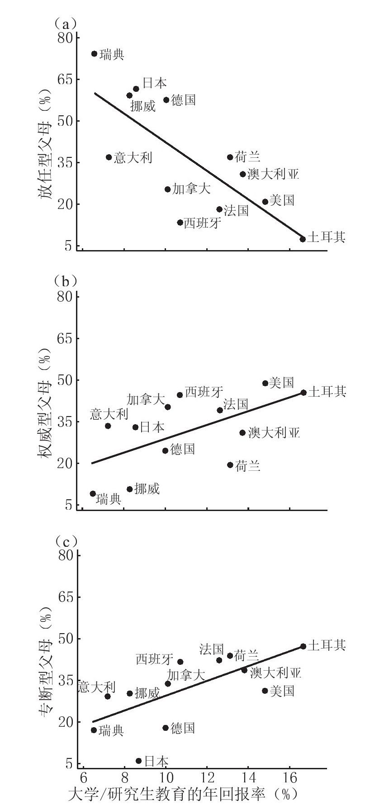

图3.6　大学与研究生教育的回报率与OECD国家采取不同教养方式的父母的比例

尽管存在这些局限性，跨国分析中教育回报率与教养方式之间的关系仍然与我们的理论相吻合。我们使用了世界银行最近一项研究中收集的教育回报数据。[34]图3.6显示，在教育回报率较高的国家，父母更倾向于权威型和专断型，而在教育回报率较低的国家，父母更多为放任型。[35]有趣的是，教育回报率可以帮助我们解释为什么在法国和西班牙这么少的父母是放任型的。如前所述，这一现象令人费解，因为这两个国家都不存在非常高的不平等。在这里，我们看到法国和西班牙的教育回报率是欧洲最高的。教育回报率可能是法国和西班牙父母比其他欧洲国家的父母更为咄咄逼人的原因之一，其他欧洲国家的教育回报率相对较低，例如北欧国家，或与法国和西班牙在文化方面有许多相似之处的意大利。

政治制度和公民自由

迄今为止我们考虑的因素——不平等、再分配和教育回报率——都与父母对孩子经济前景的预期有关。但对孩子未来的抱负和恐惧不仅仅是体现在金钱上。考虑生活在一个专制国家的父母，在这种情况下，自由表达观点的人有可能受到攻击或监禁而缺乏法律的应有保护。在这样一个国家，父母更有可能坚持要求他们的孩子循规蹈矩，不以任何方式标新立异，这可能导致父母采取专断的教养方式。相比之下，在一个盛行言论自由且强力保护公民权利的国家，父母会更有勇气让孩子随天性发展。在这样的国家，想象力和独立性可能更有用，因为它们促进了可以成为创新驱动力的批判性思维和非常规思维的发展。因此，我们预期放任型教养方式更为普遍。

这一讨论表明，教养方式的选择不仅取决于经济因素，还取决于政治制度的性质，例如公民权利保护的力度和司法制度的优劣。为了检验是否符合现实情况，我们考虑三个指标。第一个是哥德堡大学政府机构质量评估中心（the Quality of Government Institute）的人权和法治指数。该指数包括了与新闻自由、公民自由、政治自由、人口贩运、政治犯、监禁、宗教迫害、酷刑和处决有关的度量。正如我们猜测的那样，如图3.7显示，更好地保护公民权利的国家往往拥有更多的放任型父母、更少的权威型或专制型父母。

我们也使用了透明国际（Transparency International）的腐败程度指标。该度量根据公民对公共部门的腐败程度的评估对国家进行排名。[36]在高腐败国家，正式制度较弱，非正式制度可能比个人能力更重要。在这样的社会中，批判性和独立思考可能会让人们陷入困境而不是让他们过得更好。在排名中，北欧国家、新西兰和瑞士的得分最高——换句话说，被认为是最不腐败的国家。意大利和土耳其是我们样本中最腐败的国家（据本书的作者之一所言，这令人悲伤但又似乎合理）。我们发现，低腐败与放任型的教养方式强正相关，并与权威型教养方式负相关，与专断型的教养方式（稍微弱一点的）负相关。[37]

最后，我们考虑了世界银行（World Bank）的法治指标（全球治理指标，Worldwide Governance Indicators），该指标结合了企业、公民和专家受访者的观点。该指标体现了人们对社会规则的信心和遵守社会规则的程度。特别是，它侧重于合同执行、财产权保护、警察和法院的质量，以及犯罪和暴力的可能性。数字越大意味着法治水平更高。与其他制度质量度量方法相同，我们发现法治较强的国家往往拥有更多的放任型父母、更少的权威型或专断型父母。

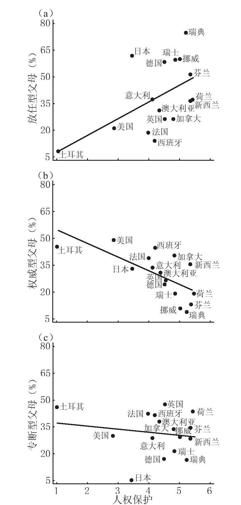

图3.7　人权和法治指数（可得观测值的跨时间平均值）与OECD国家采取不同教养方式的父母的比例

正如我们之前强调的那样，人们不应将跨国分析中的相关性解释为因果效应。首先，那些使公民支持更强有力的捍卫公民自由的因素可能会促使人们偏好放任型教养方式。其次，本节讨论的三种制度质量指标与教养方式高度相关。例如，北欧国家的腐败程度低，法治能力强，对个人自由的保护力度很大。无论如何，这些观测结果都是表明制度与教养方式相关的强有力的证明，这符合经济学的激励理论的预测。

总结：为什么存在不同的教养方式？

在前一章中，我们将“直升机父母”和“虎爸”“虎妈”的兴起与近几十年来发达经济体中经济不平等的上升联系起来。我们认为，当不平等程度很高时，父母就有更大的动力去推动孩子在教育方面取得高成就。与该解释一致，我们表明了密集型的育儿与孩子更高的考试成绩和更高的教育程度相关。

在本章中，我们转向了解释各国教养方式的差异这一更大的挑战。为什么美国、瑞典或中国的父母们用不同的方式抚养孩子？传统观点认为，根深蒂固的文化差异起着至关重要的作用。然而，我们再次发现经济激励可以解释我们观察到的大部分现象。

首先，我们展示了世界价值观调查关于不同国家的父母认为对抚养孩子最为重要的价值观的统计证据。正如我们对于“直升机育儿”的兴起的讨论，我们发现不平等非常重要：在不平等的国家，比起想象力和独立性，父母更倾向于强调勤奋的美德。我们还仔细研究了影响一系列特定国家对教养方式的选择的因素。在这里，我们至少发现了文化因素的一些作用，例如天主教法国和西班牙的父母的反放任倾向，以及日本文化对独立性的强调。然而，一般规律符合我们的经济理论：高度不平等和高教育回报助长了密集型教养方式。

然后，我们扩展了对世界价值观调查数据的分析，将每个受访者（基于其育儿价值观）归类为专断型、权威型或放任型教养方式，并使用其他个人层面数据。我们发现，即使在控制诸如父母的受教育水平等社会学以及人口学特征之后，我们的结论也仍然成立。此外，当我们关注每个国家内部收入不平等变化的影响而不是各国不平等程度的差异时，我们理论的预测也保持成立。随着不平等的增长，父母变得更加权威而不那么放任。这一观测结果提供了反对传统观念的额外证据。传统观念认为跨国分析中的规律只是反映了文化差异。例如，有人可能认为北欧人生活在一个更加同质化的社会中，这一方面导致更多的合作和更少的不平等，另一方面导致更宽松的教养方式。如果这是完整的解释，我们应该看不到每个国家内部教养方式随时间变化的系统性规律。然而，我们却看到不平等随着时间推移的变化反映在了育儿强度的变化中。

我们还考虑了一些额外的变量，这些变量对于使用密集型教养方式的动机至关重要。教育回报率会影响我们理论预测的对教养方式的选择：更高的教育回报使父母不那么放任。同样，保持其他一切（包括税前不平等）相同，在税收更加累进，安全网络更加完备的国家，父母更宽松（即放任）。除经济因素外，制度的质量也很重要。在那些对公民自由有强有力的保护、腐败程度低以及有独立和有效的司法系统的国家，父母知道他们的孩子得到了更好的保护，因此他们能够做到更宽松和放任。

我们再次强调，我们不持有任何价值判断。勤奋可能对经济增长有价值。然而，教育的高度重要性和密集型教养方式可能通过限制自发性、创造性，以及整体上降低了孩子的福利而对社会产生不良影响。有趣的是，瑞士和瑞典这两个拥有强有力的制度和民权保护、盛行放任型教养方式的国家，在2016年全球创新指数（Global Innovation Index）中名列前茅。[38]

所有这些现象都与本书的总论点一致，即在育儿方面，激励十分重要。

## 第4章　不平等、教养方式和育儿陷阱

帕特南认为20世纪50年代的社会分层是不明显的。来自不同社会背景的孩子尽管并不拥有完全相同的机会，但差异并不大。……相比之下，现在……特权家庭努力让他们的孩子在社会中站稳脚跟，并将他们隔离在学校普遍优秀的中上阶层社区中，贫穷的孩子却因为机会的减少而受损。

教养方式不仅在国家间存在差异，在国家内部也存在差异。富人选择的教养方式系统性地与穷人的不同。比如，心理学家早就注意到在低收入家庭专断型教养方式更为普遍。[1]其他社会经济特征，如教育、种族背景甚至政治观念也与育儿有关。经济学分析可以帮助我们解释为什么同一个国家的不同父母会选择不同的教养方式，以及这对未来的收入不平等和社会流动性意味着什么。

由于不平等的大量增加，社会经济因素对教养方式的影响近来已成为一个日益紧迫的问题，特别是在美国，我们在前一章中已经指出了这一点。这种不平等在纽约、洛杉矶、芝加哥、迈阿密和华盛顿特区等主要大城市尤为突出，在这些城市贫民窟与富人区比邻而建。虽然大城市常常以巨大的差异性为特征，但近年来收入不平等现象激增。今天，曼哈顿是美国较大规模的地区中最不平等的，区内收入不平等程度与世界上最不平等的五个国家相当。[2]而在1980年，曼哈顿在不平等的区排名中仅仅位列第17。

不平等的加剧伴随着中产阶级的消失和日益增长的居住隔离。社会学家乔治·加尔斯特（George Galster），杰基·库辛格（Jackie Cutsinger）和贾森·博扎（Jason Booza）根据人口普查数据对规模最大的一百个都市圈进行的一项研究发现，“12个大都市圈的中心城区中具有中等收入水平背景的社区的比例从1970年的45%降至2000年的23%。在2000年，相对大都市圈的收入中位数，这些中心城区的大多数家庭（52%）和社区（60%）的收入偏低或非常低。”[3]该研究还记录了1970—2000年间的居住隔离的加剧，这意味着越来越难在高收入社区中看到低收入家庭或在低收入社区中看到高收入家庭。2000年，仅有37%的低收入家庭生活在中等收入社区，低于1970年的55%。

在不平等程度上升、隔离加剧的时期，穷人可能不仅在收入和就业方面，还会在育儿方面落后。也就是说，当中上阶层的父母们面对不平等的增加和教育回报率的上升时采用了密集型教养方式，而弱势群体进行相同规模投资的能力可能正在恶化。确实，本章也会就此说明，来自不同社会阶层的父母对于教养方式的选择有着本质的区别，并且这些差异在经济不平等加剧的当下已经存在。育儿差距的扩大进一步加剧了不平等，并长期阻碍了社会的流动。

我们的论点补充了罗伯特·帕特南在他《我们的孩子：危机中的美国梦》（Our Kids：The American Dream in Crisis）一书中的分析。[4]像我们一样，帕特南也在写作中借鉴了个人经历。以1959年他在俄亥俄州克林顿港的高中班级为例，帕特南认为当时社会分层是不明显的。来自不同社会背景的孩子尽管并不拥有完全相同的机会，但差异并不大。大多数家庭的收入相对稳定，学校也类似，孩子们生活在各阶层混居的社区。大多数他的高中同学成年后的生活比他们的父母要好得多。相比之下，现在这一代的孩子面临着截然不同的状况。特权家庭努力让他们的孩子在社会中站稳脚跟，并将他们隔离在学校普遍优秀的中上阶层社区中，贫穷的孩子却因为机会的减少而受损。

本章侧重于分析不平等和贫困对教养方式的约束。在之前的章节中，我们曾指出近年来密集型教养方式的越来越受欢迎主要是由于密集型教养方式的预期回报率的变化，因此这归根结底与家长的目标相关。当我们比较不同社会阶层的教养策略时，这些目标大致相仿。与这一发现相一致的，我们可以观察到所有社会阶层都有向密集型教养方式转变的趋势，只不过在更具优势的阶层这种倾向更为强烈。然而，拥有不同收入和受教育程度的父母们面对的约束变化也很大。

一些约束涉及财务方面。密集型教养方式费用高昂，比如高质量的儿童保育及音乐、体育等美育提升课程，或者为了孩子高考请家庭教师。不平等加剧的一个直接影响是，它扩大了收入分布的最低点和最高点的家庭可用资源的差距，这样导致密集型教养方式对富人来说变得相对便宜而对其他人来说则变得难以负担。富裕家庭日益增长的教育和娱乐服务的需求使得财务限制对穷人更具约束力，因为全社会的学费和服务价格随着富人需求的增加而增长。

同样重要的约束是时间。更富裕的父母可以请保姆干家务，以便有更多的时间陪伴孩子。此外，工资非常低的父母有时会兼打几份工来维持生计，而牺牲陪伴孩子的时间。更重要的是，时间限制还取决于父母双方是否与孩子一起生活：如果双亲能共同承担育儿责任，则更容易实施密集型教养方式。在许多国家，单亲家庭在穷人中更为常见。因此，单亲育儿已经成为社会群体间产生育儿差距的重要决定因素之一。

我们的讨论侧重于美国育儿中的不平等，因为美国近年来不平等程度的上升尤为突出。然而，在其他工业化国家也可以观察到类似的趋势。我们首先归纳了美国各社会阶层中教养方式的差异。然后，继续探讨产生这种不平等的根本原因，以及政策干预的潜在作用。

育儿的社会经济存在差异的事实

我们继续使用在第2章中曾用过的1997年NLSY97的数据，以了解教养方式对教育结果的影响。在第2章，我们讨论了NLSY97中父母的教养方式这一变量是如何根据父母对子女的支持程度和严格程度这两个问题构建的。我们遵循通常的分类方法把家长分为放任型、专断型、权威型和不参与型（即忽视型）教养方式。

数据显示，受教育程度不同的父母在他们所采用的育儿策略方面存在很大差异。表4.1根据教育水平细分了数据集中母亲和父亲的受教育程度，其中“高中水平”对应于已完成长达12年的学校教育（即完成高中教育）的父母，而“高中以上水平”是至少受过一定程度大学教育的父母。该表显示，无论是对于父亲还是母亲来说，受过更多教育的父母都不太可能是不参与型或专断型的，而更有可能是放任型或权威型的。当我们将教育进行更精细的分类时，这些差异更大。在样本中拥有博士学位的母亲中，没有一个是不参与型，有一半则是权威型的。

表4.1　不同教育程度的家长的教养方式（NLSY97）

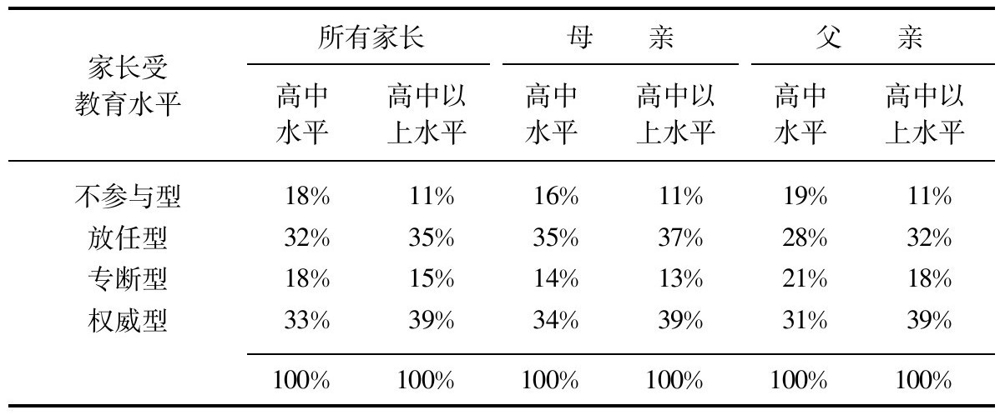

表4.1中内容宽泛的教养方式并没有完整描绘在教养方式上的社会经济差异。例如，即使是在典型的权威型父母中，也可能会有人更积极地参与其中，并且在孩子身上花费更多的时间。量化父母育儿强度差异的一种方法是看育儿时间，就像我们在第2章中所做的那样。

图4.1显示了近几十年来受到较少教育（最高到高中）和受过更多教育（超过高中）父母的育儿时间的变化。我们注意到育儿时间从20世纪80年代开始上升，而这与最近更密集的教养方式的普及相对应。伴随着平均育儿时间的这种变化，我们也观察到受教育程度较高与受教育程度较低的父母之间的育儿时间差距越来越大。最近几年，受教育程度较高的父母每周花在孩子身上的时间比受教育程度较低的父母要多2个小时左右。当我们关注已经完成（而不是刚刚开始）高等教育的父母时，教育水平带来的育儿时间的差异更加明显。2003至2006年，完成大学教育（本科学历）的母亲平均每周照料孩子的时间比仅接受过高中教育的母亲多4个小时。接受过研究生教育（专业学位或博士学位）的母亲每周要再多半小时。社会学家安妮特·拉鲁（Annette Lareau）还记录了父母与子女共度时光的质量差异。受过良好教育的中上阶层父母对孩子进行了时间密集的“协调培养”，贫寒的父母却往往参与度较低。[5]

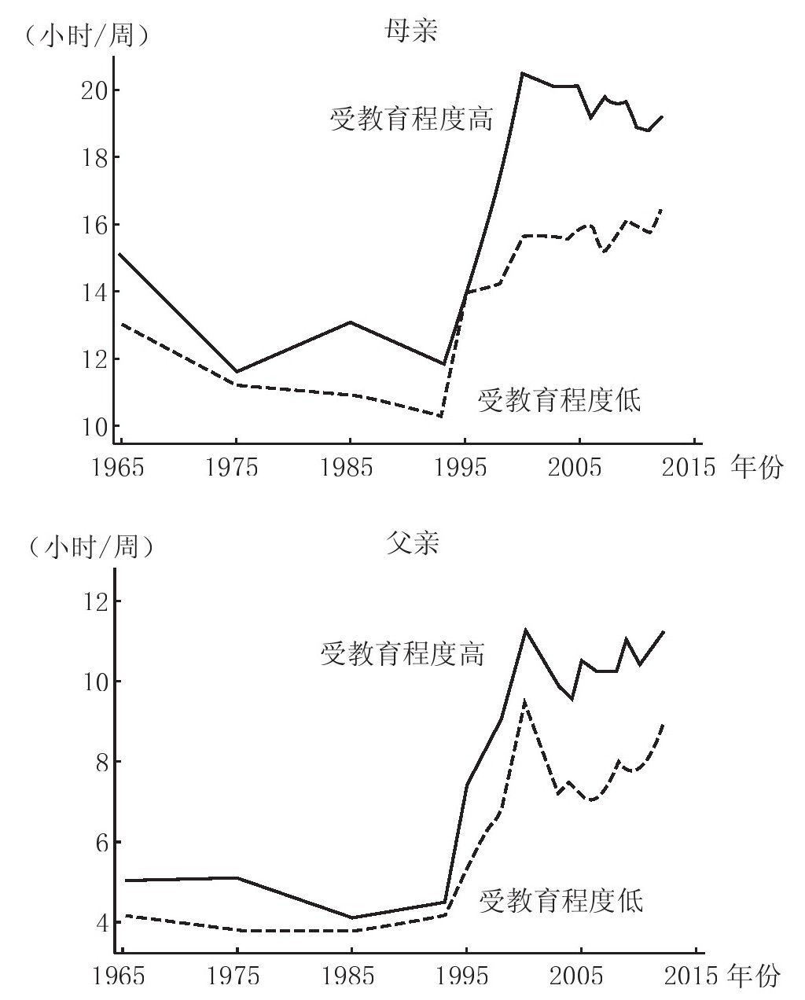

图4.1　美国母亲和父亲的育儿时间

育儿的时间差异并不是因为受教育程度更高的女性更有可能成为家庭主妇。事实上，情况正好相反：平均而言，受教育程度更高的女性工作时间更长，同时会花更多时间照顾孩子。受过更多教育的母亲付出的育儿时间更多并不是从正式劳动力市场中工作时间的差异看出来的，而是可以用闲暇时间的差异来解释。接受过大学及以上教育的女性比最多只接受过高中教育的女性每周的闲暇时间少约4小时，这与育儿时间的差异相符。这一结果表明，受教育程度导致的育儿时间差距不仅仅受时间限制的影响，尽管这一限制对于一些小群体，比如低收入单身母亲显然很重要。

教育水平引起育儿时间差异的结论不仅限于美国。经济学家乔纳森·古里安（Jonathan Guryan）、埃里克·赫斯特（Erik Hurst）和梅利莎·卡尼（Melissa Kearney）发现，在14个不同的工业化国家，受过高等教育的母亲比受教育程度较低的母亲在育儿上花费的时间更多。[6]

教养方式和社会流动性

我们的育儿经济学理论表明，家长们采用密集型教养方式来增加孩子未来的成功机会。一种度量成功和社会流动性的方法是比较孩子的学业成就。表4.2在父母采用相同教养方式的样本中，根据父母的受教育水平以及教养方式细分了孩子的学业成就（以获得高中以上教育的概率来度量）。

表4.2　在相同教养方式下，根据父母受教育水平和教养方式细分的孩子获得高中以上教育的比例（NLSY97）

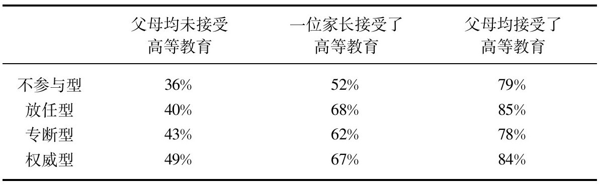

表4.2显示，代际受教育水平具有很强的延续性：无论教养方式如何，受过良好教育的父母的子女接受良好教育的可能性更高。尽管如此，教养方式对于受教育程度相同的父母来说依然很重要。教养方式对于向上流动性尤为重要，向上流动性即父母中有一方或双方都没有受过高等教育的孩子最终接受高等教育的可能性。不出所料，如果父母是不参与型的，孩子相对于父母的教育提升一个阶梯的概率最低。如果父母双方都受过很少的教育，那么使用权威型教养方式向上流动的可能性最高，相对于不参与型教养方式，成功率提高了13个百分点。有趣的是，与权威型教养方式相比，父母中至少有一方受过高等教育的孩子在放任型教养方式下表现得与权威型一样好（甚至更好）。这一现象表明，受过教育的父母的榜样作用以及他们所拥有的软实力可以减少对严格育儿的需求，而严格育儿是在NLSY97调查中父母被标记为权威型的必要条件。[7]

如果向上流动性被定义为孩子移动到教育金字塔顶端的可能性，即获得研究生以上学历（如法律、医学博士及其他博士学位），那么教养方式对向上流动的影响要大得多。在父母双方最多只接受过高中教育的家庭中，从不参与型改变为专断型教养方式可以让孩子获得研究生学位的可能性提高近3倍。在父母一方接受了高中以上教育的家庭中，从不参与型到权威型的转变将这一可能性提高近5倍。即使使用了权威型教养方式，这样的家庭获得更高学位的孩子的概率也只有10%左右。尽管如此，这一结果告诉我们，密集型育儿几乎是受教育程度较低的父母让孩子接受最高层次教育的必要条件。

就其自身而言，密集型教养方式和向上的社会流动性之间的统计相关性并不能证明教养方式与子女的成功之间存在因果关系。特别是，子女的成功可能主要取决于其他因素，如父母的收入或财富，这可能恰好也与父母教养方式有关。虽然我们的数据无法完全排除这种可能性，但它表明这种相关性对于控制了各种因素，如种族和民族、父母的教育、家庭净资产和家庭收入的多元回归分析是稳健的。[8]这意味着如果我们以两个收入相同的家庭为例，一个选择密集型教养方式，一个选择非密集型教养方式，前一个家庭的孩子更有可能在社会阶梯上向上爬。对于相同种族和受教育程度的父母也是如此。

父母的教养方式不一定重合，区分母亲和父亲的教养方式的影响也很有意思。首先，我们发现父母双方的教养方式都很重要。在对子女的教育程度（教育年限，其中12年对应高中学历，16年对应大学学位等）进行解释的回归分析中，不管对于母亲还是父亲而言，权威型教养方式对应的孩子的教育程度都是最高的。其次，母亲的教养方式比父亲的更重要。在控制了其他因素之后，权威型母亲的孩子与不参与型母亲的孩子相比要多接受大约8个月的教育。对于父亲来说，权威型教养方式的优势仅为4个月。这可能反映了传统家庭角色的延续，即母亲在推动子女取得教育成就方面发挥着更大的作用。

有趣的是，专断型育儿对于父亲和母亲具有相反的效果：拥有一位专断型母亲会对教育产生积极影响（与不参与型的母亲相比），但拥有一位专断型父亲却会降低教育程度。[9]这一结果表明母亲和父亲专断的形式不同，母亲更可能严格要求与学业成就相关的事情（如让孩子做家庭作业），而父亲更关注其他方面的行为（如服从父母）。

英国的教养方式和社会流动性

英国提供了另一个特别有趣的社会经济不平等影响社会流动性的例子。自1688年光荣革命以来，英国的政治制度相当稳定，并且几个世纪以来一直未发生革命和被入侵的事件。这一定程度上导致了英国的社会动荡比其他国家少，而且阶层差异相对其他国家而言仍然很大。

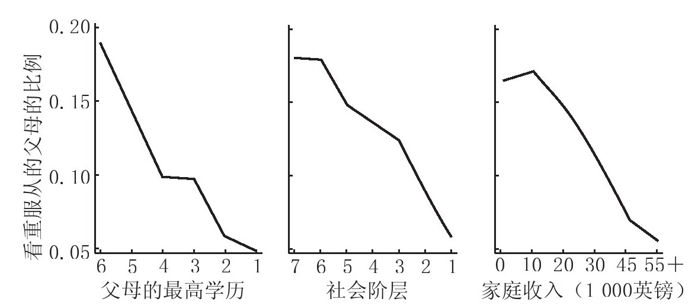

图4.2　细分条件下，认为“服从父母”对孩子很重要的英国父母的比例

数据显示，与美国一样，英国不同阶层的育儿决策存在很大差异。关于社会阶层教养方式差异的最新经验证据可以从千禧年世代研究（Millennium Cohort Study）中获得，这项调查追踪了2000—2001年出生的大约19 000个孩子的整个童年时期的生活。图4.2使用这项调查展示了那些认为“服从”在抚养孩子方面具有重要价值的父母的比例如何因阶层而异。[10]鉴于期望孩子服从父母是专断型教养方式的一个定义特征，我们可以认为服从的比例代表了各阶层专断型父母的比例。该图表明，无论是根据教育、社会经济特征（如蓝领与白领），还是根据收入来定义阶级，专断型教养方式在较低阶层中更为普遍。虽然我们在美国可以观察到相同的规律（见表4.1），但在英国阶层差异更为明显。对于每个阶层，最低阶层的专断型父母的比例是最高阶层的三倍以上。

在美国的数据中，我们看到育儿决策对社会流动性有重要影响。英国也是如此。我们可以使用英国家庭跟踪调查（British Household Panel Survey, BHPS）来分析社会流动性，该数据集提供的信息可与美国的NLSY97的调查数据相媲美。在这项调查中，我们将父母及其（成年）孩子分为7个由职业界定的社会阶层，从非熟练的体力劳动者到包括大型企业的管理人员、高级行政人员和官员的“高级白领”。[11]现在让我们考虑教养方式对向上的社会流动性的影响，其中教养方式使用了社会学家陈德荣和顾静华提出的方法进行分类。[12]图4.3描绘了不同教养方式下向上流动的个体的比例。向上流动指的是孩子最终的社会经济阶层比父母更高的情况。

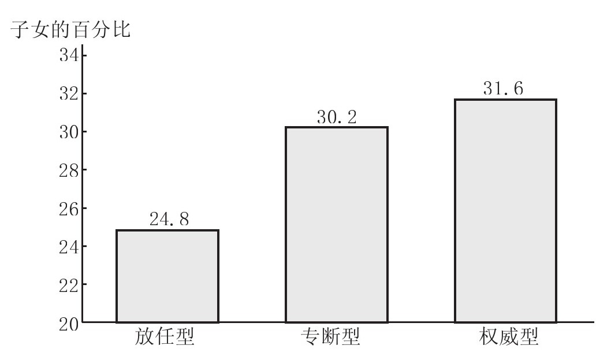

图4.3　不同教养方式下，向上进行社会流动的子女的比例

在英国，我们发现权威型教养方式对应的向上社会流动的可能性最高。专断型（另一种密集型教养方式）父母的子女提升阶层的可能性也较高，而放任型父母的子女则不太可能提升阶层。我们可以使用回归分析将父母教养方式的效果与父母社会阶层的直接影响分开，因为社会阶层与父母教养方式和社会流动性同时相关。在这里，我们发现，控制父母的社会阶层之后，专断型教养方式相对放任型教养方式而言，将向上社会流动的可能性提高了7%，权威型教养方式则将提升阶层的可能性提高了13%。当我们观察更大幅度的向上流动，即孩子的阶层上比父母至少高两级时，这一影响甚至更强烈（分别为10%和14%）。[13]一个例子是，父母是工厂的工头，孩子则成为政府或大企业的高管。

BHPS和NLSY97的分析既有相似之处，又有不同之处。主要的共同结果是，这两个数据集分析都表明，权威型教养方式有利于教育和职业选择中的向上流动。

单亲家庭，婚姻与离婚

在今日美国，约有1/3的孩子成长于单亲家庭，并且单亲育儿的情况在社会经济处于弱势的群体中尤为突出。[14]比如，相比仅接受了高中教育的母亲，单亲育儿在接受过大学教育的母亲中更不常见。对于单亲爸爸或妈妈而言，时间和金钱的约束都深刻地影响着他们的育儿决策。

成长于一个单亲家庭可能意味着要面临特殊挑战，即一开始就拥有更少的资源（由于只有一位家长的收入），并且在儿童保育和与孩子度过“优质亲子时光”方面继续面临更大的困难。对于低收入父母来说，这些挑战尤为严峻，因为他们可能负担不起市场化的托儿服务，而且有时候他们不得不身兼数职以谋生。单身父母既没有富裕到可以负担得起大量的托儿服务（日间看护、保姆等），也不容易获得其他人（如附近的亲近家庭）的帮助，他们可能根本无法成为“直升机父母”并监督孩子的一举一动。

事实上，在使用NLSY97的数据后，我们发现在控制年龄和受教育水平的情况下，相比双亲家庭中的母亲，单亲妈妈更有可能是专断型而更不是权威型。

那些支持家庭教育的公共机构，例如北欧国家的免费公立托儿所，可以减轻单亲家庭的劣势。法布里齐奥在瑞典见到过一些单身父母，他们过得很好。然而，在美国等需要以市场价格购买托儿服务的国家，许多单亲家长仅仅为了支付托儿费就必须长时间工作。对于低收入父母来说，这可能是一项艰巨的挑战。

当父母不结婚或选择暂时先不在一起生活，或夫妻分居和离婚时，就会出现单亲家庭。美国劳工统计局的三位经济学家最近根据早期版本的NLSY79进行了一项研究，该研究记录了一些关于美国婚姻状况的社会分层的事实。[15]不同受教育程度的群体以及不同种族和民族之间的差异很大。例如，在NLSY79调查的人群（1957至1964年间出生）中，19%没有获得高中毕业文凭的人在46岁前没有结婚，而大学毕业生的此比例仅为11%。随着时间的推移，不同受教育程度的群体之间的婚姻差异急剧增加。在更早的1950—1955年间出生的人中，受教育程度较高和较低的人之间还没有任何婚姻差异。[16]

离婚差异的情况与之相似。在1957—1964年间出生的人中，60%没有获得高中毕业文凭的人离过一次婚，而大学毕业生只有30%。总体而言，对于受教育水平更高的成年人而言，结婚、维持婚姻甚至离婚后再婚的可能性都要更高。此外，与之前出生的人群相比，1957—1964年出生的人群差异更大。不婚和离婚的可能性在不同种族和民族之间也有很大差异，这是我们将在后面的章节中要回答的问题。不同教育程度和社会经济背景的父母之间婚姻和离婚差异的扩大影响了对教养方式的选择，并加剧了育儿方面的不平等。

单亲育儿不仅仅因为单亲父母的资源较少，还会因为父母之间关系的好坏影响到孩子。有证据表明离婚或父母分居的孩子往往比与双亲在一起的孩子的在校表现要更糟糕。[17]经济学家托马斯·皮凯蒂认为，父母分居本身不一定是问题的主要原因。[18]首先，决定分开的父母通常情况下彼此相处并不愉快。皮凯蒂证明，只与父母中一方生活在一起的孩子的学业成绩在分居前两年就受到了影响。此外，他发现法国1975年法律改革令离婚变得更为容易，离婚率也随之大幅增加，主要是因为离婚人数增加了，故家庭冲突的强度没有受到显著影响。这些观察结果表明，生活在父母经常争执的不稳定家庭是子女学习成绩差的一个重要原因。平均而言，受过高等教育的人或许能更好地建立和谐的伴侣关系并处理家庭冲突。这可能会影响到他们选择的教养方式，并最终影响到孩子的学业成就。

在共同抚养孩子的已婚父母中，婚姻对象也很重要。一般认为，夫妻双方在社会经济背景方面往往彼此相似，这就是社会学家口中的“门当户对式婚配”（assortative mating）的现象。在美国，主体种族群体之间的人结婚比和来自不同背景的人结婚的可能性要大得多。跨种族的婚姻随着时间的推移变得越来越普遍，但仍然是少数：2015年，17%的人与不同种族或民族的人结婚，而1967年只有3%。[19]

鉴于近年来不平等现象的加剧，配偶在教育方面拥有一致观念也很重要。例如，如果大多数高中毕业生得以与大学毕业生结婚，大学教育溢价的上升并不一定会增加家庭与家庭间的不平等。然而，实际上，人们在教育方面也追求门当户对。随着时间的推移，这种趋势变得更加强烈，部分原因是对于女性平均受教育程度提高的一种反应。直到几十年前，男性大学毕业生还比女性大学毕业生多得多。因此，许多接受大学教育的男性与比他们受教育程度低一些的女性结婚。1980年，在拥有大学学历的20至60岁的已婚男性中，54%的人的配偶受教育程度比他们低。但到2007年，只有31%的人如此。[20]对于受教育程度较低的人来说，与受教育程度高一些的人结婚变得尤其困难。经济学家拉塞·艾卡（Lasse Eika）、马格纳·莫斯塔德（Magne Mogstad）和巴西特·扎法尔（Basit Zafar）最近的一项研究发现，“在1980年，[没有高中学历的美国人]与同样没有高中学历的美国人结婚的可能性是随机配对的概率的3倍；在2007年，这一可能性是随机配对的概率的6倍。”[21]在教育层面的门当户对式婚配可以放大不平等并加剧对育儿的影响：父母均受过良好教育、享受高收入和稳定职业的家庭与父母都面临着工资增长停滞和失业问题的家庭之间的差距在持续扩大。

种族、民族以及国籍扮演的角色

在许多国家，社会经济不平等的一个重要表现是不同的种族、民族和国籍的人之间的不平等。美国就是一个典型的例子。根据美国人口普查局的统计，2015年亚裔家庭的收入中位数为77 000美元，非拉美裔白人家庭收入为63 000美元，拉美裔家庭收入为45 000美元，黑人家庭收入为37 000美元。户主出生于本国的家庭平均收入为57 000美元，而户主非本国国籍的家庭的平均收入为45 000美元。[22]财富方面的差距甚至大于收入差距：2013年，非拉美裔白人家庭的净值（包括住房和金融资产等所有资产与债务之间的差额）中位数为142 000美元，而拉美裔家庭仅为14 000美元，黑人家庭为11 000美元。[23]这些差异部分地与受教育水平的差距相关。2015年，在25岁及以上人口中，36%的非拉美裔白人拥有本科以上学历，而亚裔占54%，拉美裔占16%，黑人占23%。[24]由于完成高等教育的劳动者的平均收入要高得多，这些教育差距造成了社会不同群体之间的收入差距。高收入进而使家庭能够为未来储蓄更多从而实现积累财富。虽然几十年前这些群体之间的收入和财富差距更大，但近年来缩小这些差距的进程已经放缓。

美国国家数据中代表的不同社会背景的家庭教育成果的差异在马赛厄斯目前的居住地伊利诺伊州埃文斯顿——西北大学的所在地——显而易见。埃文斯顿是芝加哥的一个郊区，位于城市的北部，在密歇根湖畔。沿湖一带的社区很富裕，平均教育水平很高。然而，作为一个富裕的美国郊区，难得的是埃文斯顿也极富多样性。距离湖泊一英里的土地上，豪宅让位于更加朴素的单户和多户住宅，并且有一个相当大的历史黑人聚居区。在2010年的人口普查中，埃文斯顿的白人人口占66%，黑人占18%，亚裔占9%，拉美裔占9%（总和超过100%，因为这些类别并不互斥），这使得埃文斯顿的情况大致和美国整体类似（那一年美国的分布是72%的白人，13%的黑人，5%的亚裔和16%的拉美裔）。

埃文斯顿拥有备受好评的公立学校，不同出生背景的孩子均可在此就读。尽管如此，不同社会经济群体的教育成果存在显著差异。事实上，最近的一项研究发现，在中学阶段，埃文斯顿公立教育体系中不同种族学生的成绩差距是所有学校中最大的。白人学生（平均而言来自相对富裕的家庭）的表现比全国平均水平高出近4个年级的水平（即学校教育年数），拉美裔学生与全国平均水平相当，而黑人学生则落后半个年级。[25]这些成绩差距与父母由于种族和民族导致的收入和教育水平差异有关。有几个原因导致埃文斯顿的差距异常大。首先，埃文斯顿是一个富裕社区和低收入社区并存的多元化的城镇。这种多样性在美国是罕见的，在大城市之外，社区之间的收入隔离是主流——“富裕”和“贫困”的城镇或郊区分别有独立的政府和独立的学校体系。第二个原因是，埃文斯顿是一个大学城。因此，社会经济群体的初始条件差距因受过高等教育的大学教师和研究人员的存在而进一步扩大，这些教职人员中少数族群的人数仍然不多。这有助于解释为什么出现最大校内成绩差距的其他美国城市也同样是大学城，比如加利福尼亚州的伯克利（加利福尼亚大学伯克利分校在此）和北卡罗来纳州的教堂山（北卡罗来纳大学教堂山分校在此）。

学生的成绩差距从小学出现并一直持续到高中毕业，此时这些差异进一步转化为教育和职业的不平等机会。埃文斯顿唯一的公立高中是埃文斯顿镇高中，该校拥有超过3 000名学生，并且跻身美国顶尖高中之列。在2014年的毕业生中，84%的学生继续在大学就读。然而，在学校内存在巨大的成绩差距。埃文斯顿镇高中的录取情况就反映了埃文斯顿的多元化，它录取了43%的白人学生，31%的黑人学生，17%的拉美裔学生和4%的亚裔学生。[26]白人和亚裔学生的成绩要比其他学生高得多，2014年的平均绩点分别为3.71和3.66（总分为4分），黑人学生为2.62，拉美裔学生为2.71。白人和亚裔学生也参加了更高级的课程，其中包括使用大学教材的课程。在申请大学方面发挥重要作用的标准化考试成绩也存在相当大的差距。在2014年美国高等院校考试（ACT）中，埃文斯顿镇高中的白人学生的平均分数为27.5分，黑人学生17.9分，拉美裔学生19.5分（没有单独统计亚裔学生的成绩）。相比之下，全国平均水平为21.0分（最高为36分）。

在埃文斯顿以及美国各地观察到的巨大的学习成绩差距令人担忧，减少种族和民族之间收入和财富差距的重要一步在于尽可能给孩子提供最好的教育，不论孩子的背景如何。为了理解该如何消除这些差距，了解差距产生的根源十分重要。在之前提到的不同种群的孩子之间的差距可以与其父母的社会经济差距联系起来，例如收入、财富和教育方面的差距。事实上，在像埃文斯顿这样的城镇，这些差距非常大。

在埃文斯顿，2014年非拉美裔白人的人均收入为53 492美元，黑人为24 296美元，拉美裔仅为17 939美元。[27]教育水平的差距同样明显，79%的白人成年人拥有本科及以上学历，黑人为29%，拉美裔为33%，亚裔为92%。尽管存在孩子的成绩差异与其他不平等指标存在相关性这个事实，但了解了这一点并未提供最终答案：找出社会经济不平等具体为何影响了孩子的成绩也很重要。

不同种族和民族之间的不平等的一个维度是教养方式。1997年NLSY97调查数据显示，在美国，亚裔父母是最专断的（22%的亚裔母亲是专断型的，相比之下白人母亲为11%），白人父母是最放任的，而黑人父母则通常比拉美裔或白人父母更专断。母亲和父亲的教养方式有些差异：例如，与白人或拉美裔母亲相比，黑人母亲不太可能是不参与型的，但对于黑人父亲来说则相反。鉴于父母教养方式与孩子成就的相关性，这些差异可以用来解释一些不同族群的孩子的成就差异。然而，不同族群的教养方式的区别总体而言较小，当然不足以解释很大的成就差异。而且，父母教养方式的效果可能在各族群之间不一致。例如，亚裔父母更可能是专断型的教养方式，而这种教养方式通常与孩子糟糕的表现相关，但如第2章所述，亚裔孩子通常表现得很好。

婚姻市场和性别失衡

我们曾提及单亲育儿是教养方式选择的一个重要约束。单亲育儿的影响不仅在不同教育程度的群体之间不同，而且在种族间也有所不同。2014年，66%的（18岁以下的）黑人孩子生活在单亲家庭，相比之下，拉美裔孩子占42%，非拉美裔白人孩子占25%，亚裔孩子占17%。[28]这些巨大差异可能在孩子的成就差距方面发挥重要作用。虽然造成一些少数族群的高单身母亲比例和相应的低结婚率的原因有很多，但贫困仍然是一个重要因素。当配偶有稳定收入时，婚姻和承诺的关系更容易维持。对少数族群来说，缺乏经济收入和高失业率使育儿成为更大的挑战。

当谈到经济学家所谓的婚姻市场时，另一个对少数族群特别重要的问题是性别不平等。导致高结婚率的一个重要因素是，婚姻市场中符合条件的女性和男性的“供给”大致相等。然而，由于年轻黑人男性的监禁率一直居高不下，性别之间的平衡被打破，特别是在城市的最贫困地区。2009年，4.7%的黑人男性入狱，而白人男性则为0.7%。[29]此外，监狱中的许多男性都很年轻，通常处于适婚年龄。对于25—29岁的黑人男性，2009年的监禁率总体上为11%，而对于教育水平在高中以下的25—29岁的黑人男性的监禁率则高达32.2%。[30]

再加上，我们之前讨论过越来越普遍的门当户对式婚配的现象，即受过良好教育和高收入的人更易配对的倾向。希望给孩子们提供最好机会的年轻黑人女性一方面可以通过自己接受大学教育让孩子受益，另一方面还可以通过与大学同学结婚让孩子受益。这样的女性面临的挑战是，除了婚姻市场的整体不平衡之外，还存在教育的性别差距。平均而言，今天来看，所有种族的女性在教育成就方面都超过了男性，但在一些少数族群中，男女受教育的差距特别大。2012年，高中毕业的黑人女性中有69%可以进入大学深造，而黑人男性只有57%，这产生了12%的性别差距。拉美裔的差距甚至更大。相比之下，白人的差距要小得多，亚裔的差距最小，仅仅为3%。[31]

由于我们认为大学教育的高成本不利于经济状况不佳的学生群体，因此不同群体的大学入学率差距也会变大。以芝加哥地区为例。西北大学是马赛厄斯任教的学校，是一所门槛很高的美国顶尖私立大学。西北大学的学费很高，超过50 000美元，每年的总费用超过65 000美元（虽然可以申请奖学金）。不过，学院的性别相对平衡；2015年，本科生中有1 978名男性和1 993名女性，女性占比为50.2%。[32]这些数字表明，招生办公室可能会意识到大学作为约会市场的作用，因此会试图在招生时控制性别平衡。美国大多数其他精英本科院校也是如此；大学入学的整体性别不平衡对就读于精英大学的学生来说并不明显。

德保罗大学位于芝加哥市中心西北大学以南几英里处，是一所大型天主教大学，全校本科生人数为16 707名。德保罗大学是一所私立大学，与西北大学相比，学费较低，2016年的学费为37 000美元，入学总费用超过50 000美元。[33]与西北大学相比，德保罗大学的学生更好地代表了美国大学的整体情况。在2015年录取的大一学生中，56%是女性，44%是男性，或者每四名男性大约对应五名女性。[34]当然，除了大学之外还有其他地方可以邂逅潜在的约会对象或伴侣，并且许多大学生毕业后很多年才结婚。尽管如此，我们仍然预计这种相当大的不匹配会对约会以及最终校园里的婚姻匹配市场产生明显的影响。

再往南一点的芝加哥州立大学是一所公立院校，主要服务于经济上处于弱势的芝加哥南部居民。芝加哥州立大学的学费更容易承担，2015年的学费为8 800美元，每年的就读费用（包括住房费用）仅略超过20 000美元。[35]芝加哥州立大学的许多学生都有资格获得联邦财政援助。芝加哥州立大学也主要为少数族群学生提供服务，2012年黑人学生就占了学生总数的83%。入学时的性别失衡比西北大学或德保罗大学大得多。2012年，芝加哥州立大学的女性学生占本科生的72%，这意味着每名男性都对应超过2.5名女性。[36]

如果有比男性更多的女性接受高等教育，那么她们中的一些人将无法找到一个受过同等水平教育的长期伴侣。巴拉克·奥巴马和米歇尔·奥巴马及两个女儿（其中一人现在正在哈佛大学就读）组成的前“第一家庭”已经展示了黑人在美国的潜能。米歇尔·奥巴马在芝加哥南部长大，她的父母都没有上过大学，而且她在芝加哥的公立学校接受教育。尽管起步较低，她最终还是成功地进入普林斯顿大学和哈佛大学，并在遇见巴拉克·奥巴马之前入职一家大型律师事务所。毫无疑问，她是今天在类似情况下成长的许多年轻女性的榜样。然而，除非黑人女性和男性之间教育成就的差距开始缩小（或者跨种族婚姻的比例大幅增加），否则黑人女性最终与受过同等教育的男性结婚和抚养孩子的几率将低于平均而言已经从较高家庭收入等其他优势中受益的白人和亚裔女性。

当然，与以往的时代不同，进行“成功匹配”远非当今教育的唯一甚至主要目的。[37]然而，当涉及两性之间的育儿和忠诚关系时，伴侣的能力和抱负仍然很重要，这意味着教育中的性别不平衡增加了当今少数族群中女性所面临的挑战。

育儿差距和持续的贫困

经济学家用“贫困陷阱”（poverty trap）来描述贫困同时是一个人或社会无法摆脱的持续的糟糕结果的原因与结果。比如，一个国家可能需要投资于物质资本和人力资本来发展，但如果人们太贫穷了，以至于他们必须消费掉大部分收入来满足他们的基本生存需求，那么，储蓄和投资将会很低，贫困会一直持续下去。再比如，一个无家可归的人很难找到工作，因为潜在的雇主对他或她的无家可归有所顾虑。然而，一个没有工作的人是支付不起房租的。在这两个例子中，贫困导致了贫困。

本章描述的事实说明，除了收入、财富和教育方面的不平等，还有在不同人群之间增长的“育儿差距”。在某些方面，这样的差距可能成为一个闭环中的链条，让一些家庭从繁荣走向繁荣，而另一些家庭却从贫困走向贫困。换言之，育儿差距可能是“育儿陷阱”的根源。更密集的、成就导向的教养方式可能现在在其他方面占据优势的群体中已经成为某种习俗。比如，受过高等教育的父母更有可能共同抚育他们的孩子，在育儿上花更多时间，并且采用有利于孩子在社会上立足或提升阶层的教养方式。与之相反，在已处于弱势的家庭中，父母面对着越来越紧迫的约束，这些约束让他们无法采取同样的成就导向的做法。因此，育儿差距增加了来自弱势背景的孩子所要面临的挑战，同时也可能成为社会流动性的一个障碍。

我们之前讨论过的时间分配数据确实为受教育程度更高或更低的家长在育儿投入上扩大的差距提供了证据。图4.1显示，在过去几十年中，所有父母都增加了对养育子女的投入，但受教育程度更高的父母增加的幅度更大，这表明育儿差距已经扩大了。

其他关于教养方式以及育儿态度的度量方法也可得出同样的结论。近几十年来不平等和教育回报率的上升，随之而来的是以孩子的学业成就为导向的教养方式的高度普及，特别是权威型教养方式。相比之下，“老式”的方法，例如以经常使用体罚为特征的专断型教养方式逐渐衰落。

图4.4展示了在美国不同教育水平的群体中人们对于体罚的态度的变化，[38]也展示了各个群体中赞成为了教训孩子而打孩子屁股的成年人的比例。在20世纪60年代，人们普遍赞同打孩子屁股，并且不同教育水平的成年人的态度几乎没有什么区别。从70年代开始，赞同打屁股的比例显著下降，这与专断型教养方式受欢迎程度下降是一致的。这是我们将会在第5章中详细讨论的一个话题，届时我们会讨论相关的国际证据。这里令我们感兴趣的是不同教育水平的群体间对于打屁股的分歧越来越大。在受教育程度最高（拥有研究生学历）的成年人中，赞同比例急剧下降。在高中以下学历的成年人中，赞同打屁股的成年人比例下降的幅度仅仅只有受教育程度最高的成年人的一半。假设对于打屁股的赞同反映了实际生活中的教养方式，我们再次看到，在不同群体中育儿习俗存在越来越大的差距。

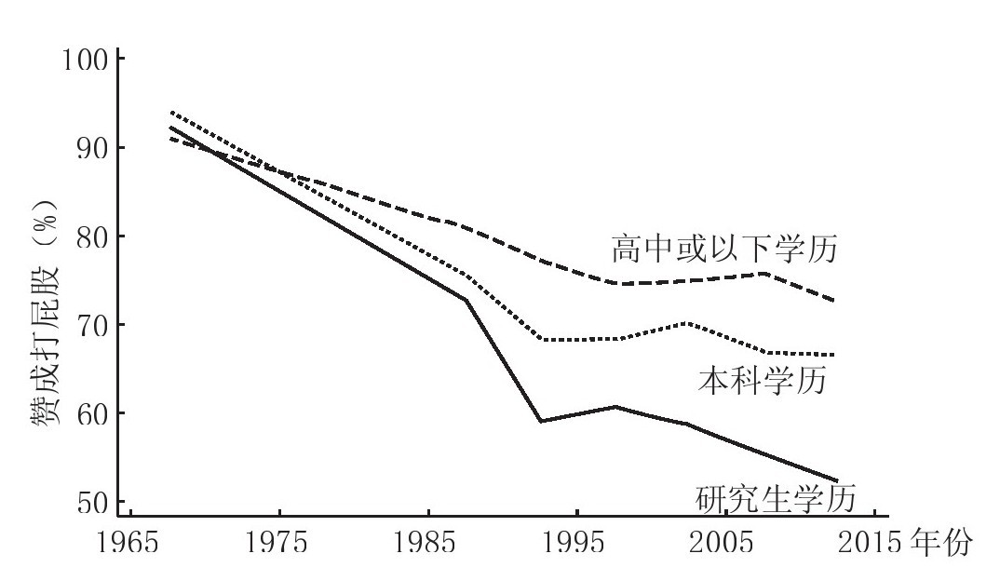

图4.4　美国不同教育水平群体中赞成使用体罚的比例（占成年人的比例）

从育儿差距到育儿陷阱？

就我们的发现而言，扩大的育儿差距放大了来自不同社会经济背景的孩子的机会差异，育儿陷阱的可能性几乎为1。为了理解为什么育儿差距会变成育儿陷阱，需要先解决一个很重要的问题：育儿的社会经济差异是如何随经济环境的变化而变化的？特别是，如果不平等上升（正如近几十年来在美国和许多其他国家发生的一样），育儿差距会变得更大吗？如果答案是肯定的，这揭示了一个自我强化机制的可能性，这种机制将加剧高不平等和持续贫困。比如，如果育儿差距随着不平等程度的增加而增加，那么在处于社会两极的孩子的平均受教育水平的差距也会拉大。这将会降低社会流动性并加剧下一代的不平等程度。

为了衡量育儿陷阱的风险，我们需要考虑育儿差距的潜在根本原因，然后询问如果不平等上升会发生什么。我们的激励理论表明对于特定社会中的家庭间的育儿差异存在两类解释。一种可能性是，育儿的社会经济差异主要由不同背景的父母对子女未来生活的期望和抱负所致。根据这一解释，父母理性地预见到自己的孩子会走上不同的道路并相应地调整了教养方式。

社会学家梅尔文·科恩（Melvin Kohn）和卡米·斯库勒（Carmi Schooler）提出了这种理论。他们推测，蓝领工人的工作往往是单调的，而“敢于质疑的思想”只会成为这种职业的障碍。[39]因此，期望子女也成为蓝领的父母可能没有多少动力去使用一种强调推理和讨论的教养方式，即权威型教养方式，而是转向权威不容置疑的专断型教养方式。

今天，这个想法可能看起来有点过时了。尽管制造业中蓝领的工作岗位日渐趋少，但也不太可能是平淡乏味的流水线工作，因为在整个（后）工业经济中，重复性的工作要么被机器或计算机替代，要么被外包给其他国家。然而，该理论可能仍然具有相关性，部分原因是服务业仍然存在许多单调的工作。如表4.2所示，即使父母选择有助于提高孩子受教育程度的教养方式，低学历的父母的子女也不太可能接受高等教育。部分原因可能是高学历父母更高的平均收入、技能的继承以及人力资本、知识、勤奋和耐心等非认知技能在家庭内部的传递产生了影响。无论哪种方式，低学历的父母可能会理性地预期，相比高学历父母而言，他们在孩子身上投入的同等投资不太可能会为他们带来额外回报。因此，低学历的父母可能会选择减少对育儿的投资，或以其他的方式进行投资。

解释育儿差距的第二个可能的原因是，差异不是源于目标或期望，而是源于父母面临的约束。其中一个限制因素是来自不同经济背景的父母实施不同教养方式的能力可能会不同。[40]自身成长于专断型家庭的蓝领父母可能不太熟悉权威型教养方式。培养孩子的偏好或态度是权威型教养方式的一个关键要素，而这可能需要软技能，高学历的父母更有可能拥有这样的软技能。正如之前在本章中讨论的那样，约束差异还包括可支配的金钱和时间。中上阶层密集型教养方式的一些内容，例如昂贵的课外活动，对于收入较低的父母来说可能无法承担。此外，经济拮据的父母可能被迫长时间工作或打多份工，从而减少了养育子女的时间。

还有一个层面的不平等，即家庭之外的更宽泛的孩子成长环境。长期以来，教育研究者们认识到了同伴的重要性：孩子能够从彼此身上学到很多，有抱负的孩子周围也同样是这样的孩子，那么，他们可能会（比如，在教育方面）表现得很好。如果父母的投资以及同伴的影响会互相加强，孩子身边有更优秀的同伴的父母就更有动机增加他们的育儿付出。[41]居住隔离意味着，来自更富裕家庭的孩子更有可能成长于一个由相对更富裕、受教育程度更高的权威型父母组成的社区。同样重要的是与好榜样和坏榜样的接触。[42]居住隔离降低了来自弱势家庭的孩子与来自其他社会背景的成年人互动的可能性，而这些成年人与这些孩子在家中接触到的大人不同，可以提供不一样的榜样作用。

了解育儿差距的这些潜在解释之后，我们现在可以考虑父母如何应对经济环境的变化，尤其是近几十年来观察到的不平等的加剧。首先，考虑不平等和教育回报对育儿目标，即父母对子女的期望和抱负的影响。就目标而言，不平等的加剧增加了育儿的利害关系：父母会更关心孩子在社会阶层中的位置，因而会有动力进行更多的投资。这可以解释为什么经济不平等的加剧伴随着整体上更加密集的教养方式。至于育儿差距，问题在于处于社会不同阶层的父母目标的变化是否都相同。

原则上，无论父母的背景如何，不平等的加剧对每个人而言会增加育儿的重要性，因此，父母变化的育儿目标并不一定意味着育儿差距将会增加。然而，不同的父母可能对他们影响孩子成就的程度有不同的看法。不平等的加剧可能会刺激那些认为自己的孩子如果被敦促也许可以成功，但如果放任自流可能会失败的父母。相比之下，我们也可以想象一位处于社会顶层的父母，他们相信无论自己做什么，他们的孩子都能成功；对于这样的父母来说，不平等的加剧并不会改变育儿的利害关系。同样，如果社会底层的父母觉得他们的孩子处于不利地位，无论父母做什么都不会成功，那么他们就没有什么动力去好好养育孩子了。即使不平等继续增加，他们也可能会选择放弃。在这两种极端情况的中间，经济变化的影响可能会更大，父母认为孩子最后取得的成就会各种各样，而他们作为父母的行为确实很重要。

总的来说，不平等的加剧增加了育儿的利害关系，但它对社会阶层的影响程度不同。对于中产阶级，这种影响可能是最大的；而对于顶层或底层，感觉无论自己做什么，孩子的路径已经确定了的人来说，这种影响可能是最小的。

现在让我们转向约束。就财务约束而言，不平等现象的加剧显然扩大了育儿差距。根据定义，较高的不平等和不断上升的教育回报意味着社会底层人口的收入相对于顶层人口的收入下降了。更糟糕的是，富裕阶层对高质量教育服务需求的增加提高了它们的价格，从而导致了更大比例的低收入家庭。收入和财富方面不平等的加剧也转化为育儿时间不平等的加剧。低收入家庭无力支付保姆、日托中心和其他替代自己抚养孩子的服务，只能自己花时间育儿，这样就减少了工作和育儿的时间和灵活性。对于低收入家长来说，不平等的加剧即便为密集型教养方式提供了更多的动力，也使他们的目标变得似乎越来越遥不可及。

父母对子女的学校教育越来越多的干预扩大了高学历与低学历家庭之间的差异。高学历的父母可以帮孩子完成数学和科学作业，并协助他们开展与学业相关的研究项目，此外，帮助孩子准备精英学校的申请（如论文写作），这对于低学历父母而言，可能是束手无策的事情。

我们还谈到了富人与穷人之间日益扩大的婚姻差距。富裕和高学历的人越来越有可能与同一群体中的人结婚并共同抚育孩子，而收入较低且低学历的人结婚的可能性较小，离婚的可能性较大，并且更有可能独自抚养孩子。这样的情况近期不太可能发生改变。即使在今天，两人结婚部分也是出于经济保障的目的。低学历的男性和女性面临着低收入和高失业风险，这使得他们作为潜在配偶的吸引力下降。不平等的加剧也反馈到婚姻市场，加剧了弱势群体的障碍。如果我们认为不断加剧的不平等会增加育儿的利害关系，那么它也会增加寻找能够成为好父母的伴侣的利害关系。高学历的人将设法与受过同等水平教育的伴侣在一起，增加共同生活的协调性。[43]用简单的话说，穷人想通过结婚改变社会阶层越来越难。再者，这又进一步加剧了顶层与底层孩子之间的机会差距。

最后，我们讨论了城市中加剧的居住隔离的情况。这意味着来自富裕和高学历父母的家庭的孩子往往与相同背景的孩子进行越来越多的互动，其中大多数孩子都拥有雄心勃勃的权威型家长。同群效应（peer effect）强化了父母的直接影响。而较贫穷家庭的孩子愈发被排除在这种良性循环之外。居住隔离也会通过婚姻对社会流动性产生负面影响：来自社会较低阶层的年轻男女碰到白马王子（或公主）的机会越来越渺茫。

这一讨论的结果是，不平等加剧可能会进一步恶化社会中的育儿差距。反过来，育儿差距将产生更多的不平等。这预示着下一代之间机会差距日益扩大的令人不安的前景。育儿差距变成了育儿陷阱。

避开育儿陷阱的政策

尽管本章中描述的机制都会增加形成育儿陷阱的风险，但这种结果并非不可避免。政策干预可以减少育儿差距并降低形成育儿陷阱的可能性。通常而言，“天下没有免费的午餐”，最终还是需要由选民和政府来决定应该采取什么措施以遏制不断加剧的不平等，并保持社会的凝聚力和包容性。社会科学研究为找出可能有效应对这些挑战的政策提供指导。

有两种类型的政策可以提供帮助。一类政策解决育儿差距背后的不平等。由于社会各阶层中育儿的差异主要是由父母面临的约束导致的，减轻对弱势家庭约束的干预措施也应该能减小育儿差距。第二类政策特别侧重于支持弱势背景的孩子。

第一类干预措施包括传统的财政和社会政策，如旨在减少税后不平等的累进税和一般转移。如果不平等加剧扩大了育儿差距，扩大再分配政策可以起到缩小作用。我们在第3章中看到，再分配政策影响了教养方式，即减少了对密集型教养方式的需求，从而有助于缩小育儿差距。为了解决育儿的社会经济差异，可以特别针对幼儿家庭的政策。事实上，大多数工业化国家已经制定了旨在缩小儿童机会不平等的政策，例如，通过为有幼儿的家庭提供收入支持的计划或在健康保险等领域提供有针对性的帮助。

另一个重要的政策领域是建立公立幼儿园或对幼儿园提供补贴。提供更多的儿童保育服务为贫穷的家长（特别是单身母亲）提供了进入劳动力市场的激励，同时为不同社会经济背景的孩子提供共度童年的机会。在隔离日益严重的社会中，让孩子接触多元化的环境或许是遏制育儿差距的有力方法。虽然用高税率来支持免费的幼儿园的想法对一些读者来说难以接受，但这正是北欧和其他欧洲国家多年来采用的方法。虽然这些政策费用昂贵，但让不同社会经济背景的孩子互动却更有价值：法布里齐奥和玛丽亚发现，诺拉在瑞典公立幼儿园的经历要比在英国的任何精英预科学校更具持续性的影响。

第二类政策侧重于弱势群体的教育。诺贝尔奖获得者詹姆斯·赫克曼（James Heckman）与其他学者合作进行的研究表明了儿童在出生头几年习得技能的重要性。[44]现在有大量的研究表明了特别针对贫困家庭儿童早期干预（Early Childhood Intervention, ECI）计划的有效性。一些干预措施，诸如对高质量的儿童保育和支持家长在家中育儿的补贴已被证明非常有效。旨在向父母提供更好的儿童发展信息、提高父母儿童发展意识的干预措施也很重要。[45]儿童早期干预计划的益处不仅包括未来的教育成就和劳动收入，还包括健康水平和婚姻。此外，这些政策已被证明可以降低孩子未来的犯罪倾向并减少他们对福利政策的依赖。

最著名的儿童早期干预计划之一是佩里学前教育研究计划（Perry Preschool Project），该研究项目在1962—1967年间为生活贫困的非裔美国儿童提供了高质量的学前教育，每名儿童每学年约11 000美元（以2007年美元计）。佩里计划是一项随机对照试验，意味着优待（即学前教育）仅提供给通过随机分配选择的所有儿童中的某一组。这一特征使研究人员能够将被分配到该项目的儿童的未来生活与具有同等特征但未被选中的儿童的结果进行比较。在与经济学家罗德里戈·平托（Rodrigo Pinto）和彼得·萨维耶夫（Peter Savelyev）合作的一项研究中，赫克曼证明该计划使孩子长大后的暴力犯罪减少了65%，逮捕拘留减少了40%，失业率降低了20%。[46]其他儿童早期干预计划也有类似的结果。例如，经济学家埃利安娜·加西斯（Eliana Garces）、邓肯·托马斯（Duncan Thomas）和珍妮特·柯里（Janet Currie）研究了启智计划（Head Start program），这是一个为弱势儿童提供公共学前教育、服务于80多万儿童的计划。[47]他们发现参与启智计划改善了教育成果并降低了犯罪倾向。[48]

研究这些计划的运行机制也很有意思。它们的主要作用渠道不是去改进可以通过智商测试等来度量的学术（或认知）技能。获得儿童早期干预计划帮助的孩子确实在智商测试的分数上有所提高，但提高的效果不大并且随着时间的推移逐渐消失。相反，儿童早期干预计划起作用的主要机制是通过改进非认知技能。这些技能包括使人们在学校和工作场所中成功进行社交互动的态度和行为，例如积极性、耐心、毅力、自我控制以及评判当前行动对未来影响的能力。一些研究表明，这些技能而非智商测试所度量的认知技能对于人的成功更为重要。[49]

这样的儿童早期干预计划以两种不同的方式建立非认知技能。一方面，弱势儿童受益于合格的教师、更好的榜样或较小的班级。另一方面，这些计划会影响父母在育儿上的投资和教养方式。儿童早期干预计划对父母投资的影响取决于具体的计划。例如，一些儿童早期干预计划旨在通过为父母提供工作激励来减少对福利的依赖，以期工作后的父母能够获得更多的经济资源以满足孩子的需求。这种方法的潜在缺点是，当父母的工作时间更长时，他们与孩子互动的时间更少了。经济学家弗朗西斯科·阿戈斯蒂内利（Francesco Agostinelli）和朱塞佩·索伦蒂（Giuseppe Sorrenti）研究了美国的所得税抵免计划（Earned Income Tax Credit, EITC）的影响，这是一项以就业为条件向父母提供收入支持的计划。[50]事实上，他们发现该计划对于无法获得高质量托儿服务（因为没有渠道获得或太昂贵）的低收入家庭的孩子发展产生负面影响，因为孩子与父母的互动最终减少了。相反，如果父母的工资足够高，所得税抵免计划的净效应是正向的，这既是因为高收入的直接影响，也是因为这些家庭更有能力承担用市场服务替代自己抚养孩子的时间。这些研究结果表明，虽然儿童早期干预计划可以有效地减少育儿差距，但必须经过深思熟虑，并同时考虑到这些计划对孩子的直接影响和通过父母行为对孩子的间接影响。

另一类可能有助于降低育儿差距的政策是教育体系的组织。今天，孩子们在学校里度过了他们大部分的童年时光，学校对于育儿的社会经济差异非常重要。我们将在第9章详细讨论这个话题。

这些政策干预的成本是多少？我们讨论过的许多政策都比预期的成本更低。补贴日托可以减轻其他福利政策的负担，并通过增加劳动参与来产生税收。针对弱势家庭的干预计划减少了犯罪，从而降低了在维持警力和建造监狱上的成本。增加社会凝聚力的长期效益难以量化，但意义重大。简而言之，实施这类政策除了可以建立一个人人平等的理想社会外，在减少育儿差距方面比预期的效果更好。

---

# 第二篇　育儿简史

## 第5章　从大棒到胡萝卜：专断型教养方式的消亡

在更久远的年代，家长认为体罚没有任何问题……来自各个阶层的父母们认为坚持他们的权威是他们家长责任的一部分。……他们的观点是，孩子只是孩子：他们年龄太小，无法理解，但一旦长大，他们就会感激父母的严格教养。

“棍棒底下出孝子”这一句古老的谚语总结了几个世纪以来育儿的自然方式。体罚以各种各样的形式出现，无论是“打屁股”“扇巴掌”“掴耳光”“挨板子”“抽皮带”还是“挥鞭子”，并且一度成为家庭和学校里教育孩子的常规手段。相比之下，如今人们对于体罚几乎都是谴责的。儿科医生和畅销育儿书作家威廉·西尔斯（William Sears）的网站个人主页上列举了十条不要打孩子的理由。这一清单的开头是一位母亲的故事，她曾经打过学龄前女儿的屁股，直到她看到女儿打弟弟。“当受到质问时，她的女儿说，‘我只是在扮演妈妈。’这位母亲再也没打过孩子。”[1]西尔斯断言打屁股会造成父母和子女之间的情感隔阂，这是虐待儿童，并且不能修正孩子的行为。

对于体罚的态度仅仅在几代人中就发生了根本性的变化。作为原则问题，我们从没有打过孩子，但是在我们小时候，偶尔的打骂是被广泛接受的。再往前推一代要更糟糕。马赛厄斯的父母就表示在20世纪50年代老师常常打孩子。法布里齐奥的父亲曾经因为小小的调皮捣蛋就受到学校老师的体罚和羞辱。这在今天是难以想象的（而且确实是犯法的）。

在更久远的年代，家长认为体罚没有任何问题，并且采取了当时专家们推荐的“铁腕”方针。来自各个阶层的父母们认为坚持他们的权威是家长责任的一部分。那种应该说服孩子相信成年人所说的是正确的想法对于我们的祖父母来说听起来很陌生，甚至可以说是奇怪。他们的观点是，孩子只是孩子：他们年龄太小，无法理解，但一旦长大，他们就会感激父母的严格教养。

在本章中，我们探索了教养方式及对于童年的看法是如何随着历史变迁而演化的。考虑到严格的教养方式以及对服从的强调一直到最近才不再是常态，我们特别关注了专断型教养方式背后的激励。我们也检验了宗教在塑造育儿观念上发挥的历史作用，以及甚至到今天宗教信仰是如何影响我们对教养方式的选择的。

历史上的亲子关系

宗教的道德权威长期以来一直支持使用打骂来规训儿童。例如，《圣经》认为，孩子们天生没有能力作出自己的判断：“愚蒙迷住孩童的心，用管教的杖可以远远赶除。”[2]此外，体罚被认为具备净化作用：“鞭伤除净人的罪恶；责打能入人的心腹。”[3]在伊斯兰传统中，体罚在某些情况下被接纳：“孩子到达七岁，你们就当命令他礼拜；如果到达十岁，你们应当责打他礼拜。”[4]在非洲文化中也有着类似原则，如斑图（Bangubangu）谚语：“用杖纠正儿子的父母不算犯罪。”[5]

并非只有宗教权威倡导严格的纪律制度：大多数知识分子和哲学家都赞同同样的观点。希腊传记作家和哲学家普鲁塔克（Plutarch）是少数例外之一。在他的《关于子女的教育》（De liberis educandis）一文中，他写道：“应该通过鼓励和说理来引导孩子做出得体的行为，肯定不是通过责打或虐待，因为大家公认这些更像是给奴隶而非自由人准备的；因为这样做的话会使孩子变得呆滞并在面对任务时紧张得发抖，部分是由于责打的痛苦，部分是由于屈辱。”[6]然而，普鲁塔克的立场是不同寻常的。根据自传和日记的样本，英国历史学家约翰·普拉姆（John Plumb）记载，在“1770年之前对育儿提出建议的200位建议者中，只有三位，普鲁塔克、帕尔米耶里（Palmieri）和萨多莱托（Sadoleto），没有建议父亲打孩子”。[7]

社会历史学家仍然在争论早期粗暴的管教方法的根源。有一种观点认为，父母历来不怎么关心孩子。在1960年出版的开创性著作《儿童的世纪》（Centuries of Childhood）中，菲利普·阿利埃斯（Philippe Ariès）论证，在16世纪之前，父母在情感上对他们的孩子漠不关心，部分原因是由于儿童死亡率很高。[8]为了支持他的观点，阿利埃斯声称中世纪的人们不会留下任何死去孩子的纪念品。“如果一个孩子要么会成长为成年人要么在婴儿时期死亡，那么没有人会想到留下孩子的肖像……人们认为生命中很快就消失的小东西不值得纪念。”[9]阿利埃斯引用了哲学家蒙田的陈述，“我失去了两三个还在婴幼儿时期的孩子，有遗憾之情，但没有巨大的悲痛”，并补充说，“我无法持续那种宠爱新生儿的热情，他们既没有思想，长得也不好看。”[10]这种漠不关心被认为是儿童广泛受到虐待或甚至遗弃的原因。

20世纪六七十年代的文献深受阿利埃斯观点的影响。心理史学家劳埃德·德莫斯（Lloyd De Mause）将儿童与成人关系的历史定义为人类最近才从中清醒过来的“噩梦”。[11]在他的文集《童年历史》的引言中，他给出了关于亲子关系模式的生动概括：杀婴模式（直到4世纪）、弃婴模式（4—13世纪）、矛盾模式（14—17世纪）、入侵模式（18世纪），最后才是帮助模式（自20世纪中叶以来）。[12]

最近的研究已经推翻了这种观点。社会历史学家休·坎宁厄姆（Hugh Cunningham）依靠日记、具象艺术和墓碑的证据，得出的结论是古代社会中的父母就像今天的我们一样爱他们的孩子。[13]尽管在古典时期有父母抛弃或贩卖孩子的情况发生，机构还是会赦免父母的罪行，因为父母还是爱孩子的。尽管在死亡率很高的年代，幼儿的死亡是寻常之事，但父母们也对失去幼儿感到悲痛。坎宁厄姆讨论了中古史学家的一些研究，这些研究驳斥了中世纪社会没有童年观念的说法。总体而言，历史学家目前的共识与我们的观点很好地相吻合，也就是说，即使是在过去，大多数父母也是爱自己的孩子的，并且把他们相信最符合孩子利益的东西铭记于心。但这并不意味着孩子们受到了宽容的待遇。历史学家托马斯·威德曼（Thomas Wiedemann）在《罗马帝国的成人与儿童》（Adults and Children in the Roman Empire）一书中记载，即使儿童在罗马社会中扮演着重要角色，他们也受到来自教育者的严格纪律的约束。[14]

在哲学家中，认为应该严格育儿的观点在启蒙运动时期是主流。自由主义之父约翰·洛克（John Locke ，1632—1704）是一位浸信会教徒，他认为父母不应该关注如何让孩子快乐。[15]相反，他们应该试图迅速使孩子脱离不成熟，以塑造强大的成人人格。在他看来，严格的教养方式最有效地实现了这个目标：“如果要让他敬畏你，那就在他的襁褓中留下印记……因为自由和放纵对孩子没有好处；他们判断力的缺乏使得他们需要约束与纪律。”[16]同时，洛克认为童年是一个关键的形成时期。“在我们婴幼儿时期微小到几乎难以察觉的印象会产生非常重要和持久的影响……在我们遇到的所有人中，他们的人格，是善还是恶，有用或无用，十有八九都取决于他们的教育。”[17]他还建议父母在孩子长大后缓和态度。孩子应该逐渐被视为拥有理性的存在，因为“以专制和严厉来对待有自己的思想的人，是一种糟糕的做法”。[18]

虽然洛克认为童年仅仅是形成成人人格的工具，另一位伟大的政治哲学家、启蒙运动的思想先驱让雅克·卢梭（Jean-Jacques Rousseau，1712—1778），却在他的著作《爱弥儿》（Emile, or on Education）中采取了截然不同的立场。[19]根据卢梭的观点，童年本身就是人类生存的重要阶段。教育工作者应避免干涉儿童的自由和幸福。相反，他们应该顺应儿童的天性和发展规律，让孩子们以适合他们自己的速度和形式在经验中学习。[20]在卢梭的理想世界中，外界的规训没有任何作用：“儿童永远不应受到这样的惩罚；惩罚应该始终是他们错误的自然结果。”[21]用现代的术语来说，卢梭提倡放任型教养方式，理由是孩子们学习的最佳方式是通过自己的体验，而不是通过成人的指导和规训。

由于卢梭将自己的孩子遗弃在孤儿院，许多人认为他是一个育儿的伪权威。然而，卢梭的观点影响了几代教育改革者，包括裴斯泰洛齐（Pestalozzi），弗罗贝尔（Froebel），蒙特梭利（Montessori）和杜威（Dewey）。例如，玛丽亚·蒙特梭利（Maria Montessori，1870—1952）认为，儿童从小就有自发的学习和发展的倾向。[22]她的教学理论强调了引导独立性的价值：“独立的征程在生命之初就开始了。随着发展，孩子会自我完善并克服在路上遇到的每一个障碍。”[23]教师的主要任务是通过创造一个为独立学习提供机会的环境来引导这一过程。与卢梭不同，蒙特梭利认为，教师应该在孩子犯错时作出反应并纠正孩子，但他们的干预应该是建设性的、友好的而不是惩罚性的。

玛丽亚·蒙特梭利和其他教育改革者的想法在20世纪逐渐取得影响力，今天有许多学校基于她的教学方法进行教学。然而，转变是缓慢的；在欧洲国家，直到第二次世界大战之后，依赖严格纪律和体罚的方法才不再是学校的常态。美国的情况也与之类似。由霍勒斯·曼（Horace Mann）领导的呼吁全民公立教育的19世纪美国教育改革运动为战后新世界带来了新的教育方法，这些方法部分地借鉴了普鲁士的公立教育系统的经验。然而，这一改革运动仍然采用了一些专断型原则，并强调了纪律和服从的重要性。专断型方法也长期普遍被用于家庭教育中；在前一章中，我们曾提到直到1970年还有超过90%的美国成年人认可打孩子屁股的行为（图4.4）。

专断型教养方式的消亡

在过去几十年里，赞同打屁股的比率已经下降，特别是对于受过更多教育的父母。在美国是这样，在欧洲更是如此，目前在许多国家体罚都是非法的。既然我们在前一章已经讨论了美国的情况，本章则集中讨论欧洲、澳大利亚和日本的趋势。

根据第3章提到的奥地利、法国、德国、西班牙和瑞典的比较研究，父母打孩子屁股的数量远远少于他们自己作为孩子时被打屁股的数量。[24]在瑞典，24%出生在1962年之前的人反映他们被父母打过（这已经比同时期的美国要低得多）。对于1968—1973年间出生的人来说，这一数字下降到16%以下。目前，调查显示，不超过6%的瑞典人仍然认为轻轻地打孩子也是可以接受的。在奥地利和德国，体罚的发生率高于瑞典（1962年以前出生的孩子的发生率超过50%），但这些年来体罚无论是作为父母育儿过程中的实际行动还是作为一种公认的社会规范的接受度都大幅下降。对德国父母进行的1996—2008年间的纵向研究显示了他们日益增长的对任何形式的体罚的强烈反对。

我们已经注意到，在法国和西班牙等一些天主教国家，专断型教养方式仍然很受欢迎。因此，体罚在那里负隅顽抗也就不足为奇了——在20世纪六七十年代出生的人中有70%反映在童年时被父母打过——甚至在今天体罚也被广泛使用。[25]在同样是天主教国家的意大利，最近的一项调查显示，有一半的父母反映说他们在特殊情况下会打孩子，1/4的父母每个月都会打几次，而且有多于3%的父母几乎每天都打孩子。虽然体罚仍然相对普遍，但只有少数意大利父母声称认可体罚。超过一半的父母实际上认为打屁股是一种糟糕的教育行为，而只有约1/4的人表示一定程度上的支持。[26]这一认可度也随着时间的推移而下降。与2009年的类似调查相比，2012年进行的一项调查显示，支持体罚的父母的比例要远远低得多。

对于体罚的认可程度的下降与专断型教养方式的衰落是紧密相连的。有趣的是，专断型教养方式的衰落在20世纪70年代放任型教养方式的巅峰时期之后仍然在持续。换言之，尽管教养方式变得更为密集，我们并没有观察到孩子应该无条件遵从父母的传统观念的再次流行。世界价值观调查的数据提供了时间跨度足够长的信息，我们从中可以看到专断型教养方式的持续衰落。回想一下，我们对世界价值观调查数据中专断型父母教养方式的分类取决于父母对“服从”这一价值的强调。在澳大利亚和日本，专断型父母的比例在1981—2012年间减少了一半（澳大利亚从59%降至30%，日本从10%降至5%）。相比之下，同期权威型父母的比例在澳大利亚从11%上升到40%，在日本从22%上升到37%。这种规律并非太平洋地区所独有。以西班牙和瑞典为例，这两个欧洲国家分别拥有欧洲最大和最小的专断型父母的比例。尽管水平存在差异，但随着时间的推移，这些变化也会遵循类似的模式。在瑞典，专断型父母的比例在1996年（最早的数据可得年份）和2011年之间从19%下降到11%，而权威型父母的比例翻了一番。在西班牙，专断型父母的比例从46%（1990年）下降到最近调查中的34%，再次被权威型父母的比例增加所取代。总体而言，专断型教养方式的衰落和权威型教养方式的日益普及在所有OECD国家中都很普遍。[27]

传统社会和独立的价值

是否有经济因素可以解释专断型教养方式的延续性以及其在20世纪后半叶的快速消亡？我们的理论指明了经济激励的重要性。疼爱孩子的父母权衡了不同教养方式的成本和收益。经济环境的变化会影响不同教养方式的相对吸引力。正如我们所看到的，专断型教养方式在几个世纪盛行并延续。经济史学家指出，在这个时期，整个世界并没有太大变化，至少相对于过去两个世纪惊人的变革速度而言。至于为何专断型教养方式被广为接受，我们认为前工业化时代最重要的特征是，它几乎没有为父母在赋予孩子独立性方面提供激励。

在工业化开始之前是由以比今天的世界严格得多的社会等级制度为特征的农业社会。在罗马帝国的衰落和英国工业革命之间，绝大多数人的生活水平没有太大变化。正如古典经济学家托马斯·马尔萨斯（Thomas Malthus）所强调的那样，技术进步使得社会能够随着时间的推移养活更多的人口，但人口增长最终会超过资源的增加（我们将在第7章讨论这个问题）。因此在整个前工业化时代，生活水平接近生存线。当时，城市化程度较低，虽然城市的物质生活水平略高于农村，但疾病发生率和死亡率也更高了。

前工业化社会的一个共同特点是，父母和孩子在工作、教育和相互支持方面的联系比现在要更紧密。所有家庭成员都将作为为家庭提供服务的高效运转的部件，根据性别和年龄被分配了不同的任务。同样，知识和技能的传播主要局限于家庭内部：孩子需要学习的大多数知识来自父母和兄弟姐妹。家庭也意味着很强的隐性义务，例如照顾老人。抛弃家庭以追求个人成功的孩子将受到家庭和社会的谴责。

这一讨论指出，在前工业化社会，独立的好处很少。当一个孩子必须在一个父母无法引导他们的世界中取得成功时，独立意识尤其重要。如果孩子一生大部分时间要与父母一起生活，并且在职业选择方面跟随父母的步伐，强烈的独立意识不再那么有价值，甚至可以说是危险的。在这种情况下，父母可以教会孩子们所有他们需要知道的事，并密切监视他们，防止他们逃避父母认为他们应该承担的职责。通过鼓励他们遵守社会规范并密切监督他们的行为，父母还可以减少孩子的危险行为，如婚前性行为或打架斗殴。

在传统社会中，独立意识可能是一种特别危险的优势，因为独立意识会在青少年的思想中植入抛弃家庭和打破社会规范的念头。意大利作家乔万尼·维尔加（Giovanni Verga）在他1881年出版的小说《枸杞树旁的小屋》（The House by the Medlar Tree）中围绕这一主题进行了讨论。[28]该小说讲述了一个生活在西西里村庄阿茨特雷扎（Aci Trezza）的贫困渔民家庭的故事。他们的主要收入来源是一艘小渔船。在小说开头，五个孩子中最大的孩子恩托尼（＇Ntoni）因为服兵役而离开了。风暴摧毁了这个家庭的船只之后，一连串的不幸遭遇接踵而至。从战场上回来后，恩托尼拒绝回归传统家庭生活方式，并开始了一系列危险的事业，这些事业最后都陷入了困境。他起初背井离乡外出碰运气。遭受挫败之后，他转而酗酒、闲混和犯罪。他被监禁后，家庭陷入了财务危机，无法偿还船只被毁之前产生的债务。结束了监禁期之后，恩托尼试图回到村里，恢复旧时的家庭生活。但为时已晚，他面临着亲人的排斥。他摆脱传统的生活方式的尝试最终以彻底的失败收场，他的人生被摧毁，他自己也永久地被传统社会所排斥。

作者这样总结了小说的寓意：“每当一个人比其他人更弱，或者更不小心，或者更加以自我为中心时，由于想要探索未知或渴望改善的欲望而试图脱离群体，世界这条贪婪的鱼将吞噬他。”[29]根据维尔加的说法，诱使年轻人偏离常规轨道的独立精神只能导致自我毁灭。在这样的世界中，服从是比想象或独立性更安全的价值观。

现代社会中独立的回报的增长

专断型教养方式的缺点在于限制孩子的选择，阻碍他们探索世界的能力并扼杀他们的内在才能和天性。正如卢梭所言，通过做出独立决策并从他们自身行动中的正面或负面结果中获得经验，孩子会变得成熟，变得更加坚定自信，并最终能够更容易地寻找到自己的人生道路。然而发现一个人的人生道路在较低社会和职业流动性的传统社会中不那么重要。比如，在一个阶层明晰的社会中，农民的孩子将成为农民，贵族的孩子将成为富裕的食利者，几乎没有留给孩子独立探索的空间。生活有它“自然的”进程，每个人必须学会安分守己、各司其职。许多伟大的天才曾经努力奋斗想要颠覆这种秩序：乔治·弗里德里希·亨德尔（Georg Friedrich Händel）违抗了父亲希望他成为一名律师的意志，成为了一名音乐家。[30]根据亨德尔的传记作者的说法，他在他父亲无法看见或听到他的阁楼里练习击弦古钢琴。他还必须参加法律课程，为了在他能够辍学并追求他的爱好之前平息父亲的怒气。

我们认为，专断型教养方式在技术进步有限的社会中更具吸引力，在这样的社会中人力资本主要是在家庭中获得的，通常来自向子女传授他们自己职业的父母。这种方法适用于前工业化社会。在工业化开始之前，西方社会的大多数人都从事农业，这是一个孩子可以与父母一起劳作的部门。作为工匠或手艺人的城市居民有更多的社会和职业流动性，但即使在城市中，大多数技能都从家庭中习得，并且已经从事这些职业的家庭通常受到行会的正式保护。在这种情况下，专断型教养方式必然会占据统治地位。

对孩子灌输独立意识在充满变化的社会中更具吸引力，因为在这些社会中，年轻人被要求独立做出重要决定。工业化社会中劳动分工的不断细化增加了职业的数量，使子女更有可能找到比从父母那里继承的更适合自己才能的职业。新的机会常常出现在新的部门。例如，现在的软件行业从业人员中几乎没有谁的父母也在同一领域工作。即使在同一行业内，快速的技术变革也会使传统知识过时，这会降低子女从父母那里学习的有效性，即使他们职业相同。[31]在农业方面，传统习俗和技术在农业机械化后失去了价值。作为会计的父母可能缺乏今天从事同一职业的年轻人所需的计算机技能。法布里齐奥的父亲是一名在意大利国家电视台工作的熟练技术工人。他的专业知识被卫星和数字化淘汰了。他的母亲是一名时装设计师，但不熟悉电脑，而这是现在的设计师必备的工具。总而言之，技术进步改变了育儿的游戏规则，使得专断型教养方式本身已经过时。

与这种观点相一致的，社会历史学家记录了在工业化颠覆传统经济秩序的时期，对孩子和育儿态度的逐渐变化。历史学家琳达·波洛克（Linda Pollock）认为，变化最初出现在18世纪后期，主要发生在社会的中上阶层。[32]根据历史学家卡尔·卡斯特（Carl Kaestle）和马里斯·维诺夫斯基（Maris Vinovskis）的观点，第一代改革者是采取了许多卢梭的童年观的知识分子精英。[33]他们的影响最初仅限于社会中较为进步的部门，但随着经济条件的演变，其影响逐渐增强。

改变不同教养方式的相对吸引力的一个重要因素是20世纪高等教育的扩张。当孩子在家里学习时，父母仍然可以依靠体罚的力量。然而，随着孩子们搬到提供了充足的娱乐和游戏机会的大学后，父母们再也不可能监控他们了。相反，孩子必须靠自己去取得成功。随着紧密组织的父权制家庭被孩子在家庭以外接受正规教育的新模式取代，加上很少有孩子继承父母的职业，专断型教养方式逐渐衰落了。然而，这种转变在20世纪上半叶仍然较为缓慢。社会历史学家安托万·普鲁斯特（Antoine Prost）报告了1938年法国《信心》杂志（Confidences）进行的一项调查结果，调查发现近1/3的读者同意父母应该为孩子选择职业并在孩子幼年就引导他们走向选择好的道路。[34]在第二次世界大战之前，父母知道什么对孩子最有益并且应该对他们的生活作出重大决策的想法仍然被广泛接受。

正是在20世纪60年代，传统的专断型教养方式迅速瓦解了。正如第2章所讨论的那样，较低的人力资本投资回报率使得在此期间放任型教养方式变得具有吸引力。在这里我们看到，与父母选择相同职业的优势逐渐减弱，我们称其在位溢价（incumbency premium）低，这也促成了当时专断型教养方式的消亡。相关研究显示自20世纪70年代以来在位溢价的下降幅度更大。最近一个经济学家团队表示，在过去的几十年里美国的职业流动性持续增加。[35]与此同时，相同教育水平的工人之间的工资不平等也有所增加，反映出人们寻找与他们的个人才能和技能很好匹配的工作的重要性日益增加。[36]在当今社会，年轻人发掘他们天然的比较优势而非学习父母的职业变得越来越重要。

总之，我们认为专断型教养方式的衰落与传统的、僵化的社会的消亡相关，在这种社会中，独立性的价值有限，父母可以轻易地维护自己的权威并控制孩子的选择。当然，我们并不认为对于经济成本效益的考虑是父母专断的唯一原因。在前工业化时代已经形成了一套文化与宗教的价值观与习俗体系，这一体系的设计有助于使父母的权威合法化。然而，这种文化上层建筑并没有在现代化的冲击中存活下来：在现代化、高度流动的经济体中，独立性的价值太高了，以至于普遍存在的专断型教养方式不可持续。

服从与经济发展

与我们认为现代经济与普遍的专断型教养方式不相容的观点一致，图5.1显示，强调服从这一专断型教养方式的典型特征的父母比例，随着以人均国内生产总值衡量的经济发展水平的增加而下降。[37]服从在农业为主的撒哈拉以南的非洲国家最广为接受（值得关注的是埃塞俄比亚除外）；服从在中亚和拉丁美洲地区具有中等水平的人气；最后，服从在欧洲、北美和最富裕的东亚国家中最不受欢迎。因为欧洲、北美都是职业流动性高、农业部门小、接受高等教育的年轻人比例很大的经济体。与之相对应的，图5.2显示，强调独立性的父母比例随人均国内生产总值的增加而增加。[38]

简而言之，贫穷国家的父母往往是专断型的，而在富裕国家，权威型和放任型教养方式很普遍。经济发展与职业流动性的增加密切相关，并且伴随着家庭在传承知识和生产技能方面的传统角色的逐渐衰落，这一观察结果与我们的论点是一致的。

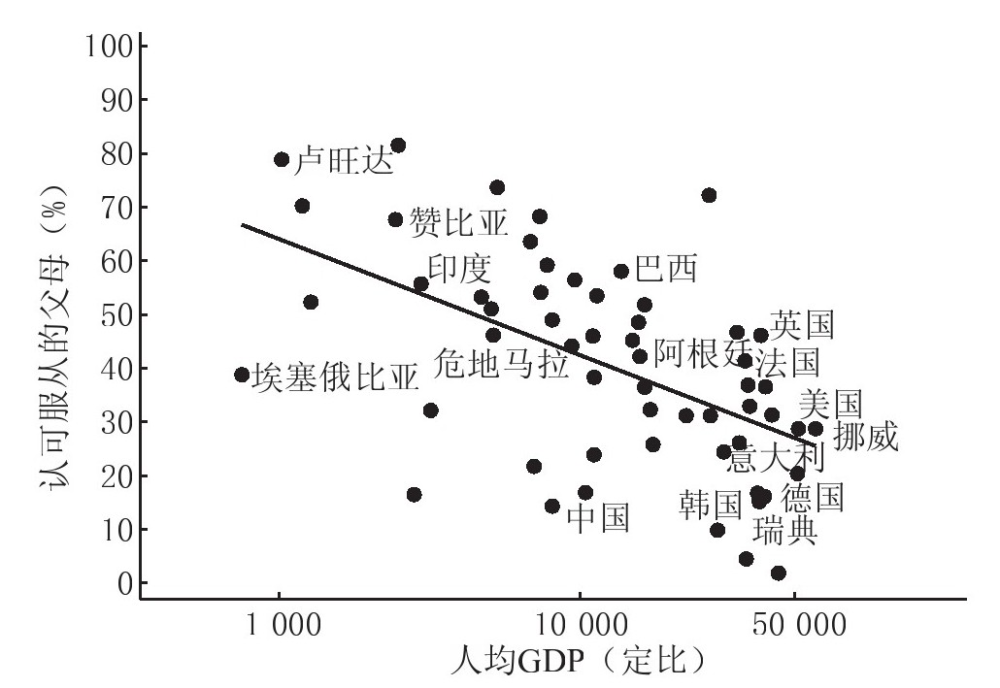

图5.1　各国强调服从的父母的比例及人均GDP

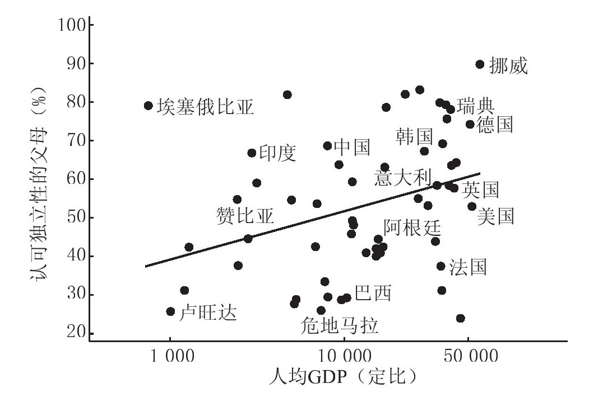

图5.2　各国强调独立性的父母的比例及人均GDP

巴西是个特别典型的例子，很好地说明了我们的观点。巴西是一个新兴经济体，人均国内生产总值低于OECD经济体，并且有着格外高的收入不平等水平。根据我们的激励理论，鉴于巨大的经济差异，我们预期很少有巴西父母是放任型的，而且大多数人都选择密集型教养方式。鉴于其与OECD经济体相比较低的发展水平，我们同样期望大多数这种密集型教养方式应该采取专断而非权威的形式。数据证实了这些预期。在最近的世界价值观调查（2014）中，55%的巴西父母是专断型的，35%是权威型的，不到10%是放任型的。只有24%的人将想象力作为抚养孩子的重要价值观。放任型父母的比例不仅与欧洲相比明显较低，和美国相比也同样较低。专断型父母的比例远远高于欧洲和美国。

宗教信仰和教养方式

巴西有另一个显著特征：它是一个宗教信仰很强的国家。根据盖洛普民意调查，86.5%的巴西受访者表示，宗教在日常生活中很重要，相比之下，美国为65%，德国为40%，北欧国家不到20%。在本节中，我们将讨论宗教信仰对教养方式的影响。我们表明，在像巴西这样的宗教国家，父母往往更加专断。为什么会这样呢？

本书的主要论点是，慈爱的父母希望让他们的孩子为未来的世界做好准备。我们认为，父母对子女未来际遇的看法取决于社会和经济变化的速度。然而，如果这些转变的实际速度很重要，那么父母对变化速度的感知也很重要。不同的人对未来有不同的看法。有些人认为下一代将生活在与我们截然不同的社会中；他们或许认为机器人能在许多职业上取代人类，信息技术革命将开辟新的前沿，甚至社会规范和道德价值观也会发生变化。这样的父母不太可能将家庭视为知识的主要来源，而更倾向于让孩子在世界的发展过程中独立地发现新世界。

对于那些认为世界受到永不改变的秩序的管理，并认为教育者的责任是向孩子传递一套永不改变的价值观和真理的父母而言，情况恰恰相反。这就是宗教和宗教信仰发挥作用之处。例如，最近的一项研究指出，美国的保守派新教徒“认为《圣经》没有错误，它提供了可靠和充分的见解来指导所有人类事务的行为，包括育儿”，并相信“所有人类的关系都……由神命定的权威关系的特定范式来塑造”。[39]在这样一个稳定的世界中，鼓励孩子独立和富有想象力是没有必要的，或许也是不明智的。[40]

一个相关的观点是，许多原教旨主义的基督徒认为人生而有罪，只有严格的宗教教养才能净化孩子的灵魂。凯斯特勒（Kaestle）和维诺夫斯基（Vinovskis）写道，“早期的清教徒强调儿童天生就是邪恶的……父母的唯一恰当回应是密切关注他们的孩子并在孩子很小的时候就规训他们”。[41]根据社会学家约翰·巴特科夫斯基（John Bartkowski）和克里斯托弗·埃利森（Christopher Ellison）的观点，保守的新教徒（福音派或原教旨主义者）不相信良好的教养方式需要强调自信、创造力和好奇心。[42]相反，他们相信“为了孩子成年后取得成功，必须训练孩子接受权威和阶级制度的神圣原则”。[43]专断型教养方式是这种育儿策略的自然结果。例如，根据心理学家欧文·海曼（Irwin Hyman）的说法：“真正的专制社会强调对领导者不容置疑的忠诚，对权威一呼百应的服从并认为提出异议的人是愚蠢的。孩子们在家庭和学校里被教育不得质疑权威，包括父母；不服从的行为必定伴随着惩罚。”[44]

在美国宗教信仰的影响的经验证据

宗教信仰与专断型教养方式之间是否存在实证联系？要回答这个问题，我们转向美国的数据研究。我们使用了收入动态面板研究（Panel Study of Income Dynamics, PSID）的儿童发展补充（Child Development Supplement, CDS）数据，这是一个跟踪了一群儿童及其父母的常用数据集。在1997年的初步调查中，父母被问及是否曾打过孩子的屁股。此外，他们也被问及宗教在他们的生活中是否非常重要。笃信宗教的父母对体罚采取更积极的态度：70%有宗教信仰的父母打过孩子的屁股，而无宗教信仰的父母的比例为58%。

像往常一样，人们可能会担心这种差异可能是由其他社会经济因素所导致的，例如收入或教育，这些因素可能与宗教信仰和使用体罚同时相关。正如我们之前所做的那样，可以使用逻辑回归分析在控制其他因素，包括收入、教育、年龄、孩子的性别和种族的情况下，来确定宗教信仰与教养方式之间的关系。收入和教育都没有对这个数据集里的打屁股行为产生重大影响。非洲裔父母更有可能打孩子屁股，而拉美裔父母的倾向低于平均水平。宗教信仰具有很大的影响，这一影响超过所有其他因素的影响：它将打屁股与不打屁股的相对概率（优势比）提高了1.72倍。例如，给定社会经济因素，如果没有宗教信仰的父母以20%的概率打她的孩子，具有相同特征的有宗教信仰的父母的概率为30%。这是非常大的差异。

人们也可能想知道，具体的宗教派别，而不仅仅是一般的宗教信仰是否在不同教养方式的选择中起作用。为了回答这个问题，我们回到世界价值观调查中美国的数据。我们将受访者分为四类：无信仰、天主教、新教和其他宗教（该群体包括所有少数宗教群体）。如果受访者不认同任何宗教派别教义，并且不将宗教视为生活中“相当”或“非常”重要的事物，则被归类为无信仰。[45]

分析中出现了许多有趣的规律。[46]首先，无宗教信仰的父母明显比有宗教信仰的父母更宽容。在有宗教信仰的父母中，当我们观察权威型和放任型教养方式时，各种教派之间没有显著差异。[47]当我们考虑专断型教养方式时，各种教派确实会出现重要的差异。在美国，新教徒比任何其他群体都更有可能采用专断型教养方式。

为了了解各组之间的差异，请考虑三位虚构的母亲，我们分别称他们为利伯塔德（无宗教信仰）、玛丽亚·普利菲克松（天主教）和玛格丽塔（新教）。假设这三位母亲具有相同的社会经济特征（年龄，受教育水平等）。假设基于这些特征，无宗教信仰的利伯塔德有50%的概率是放任型的，并且分别有25%的概率为权威型和专断型。根据我们的估计，对于玛丽亚·普利菲克松来说，成为放任型、权威型和专断型的可能性分别为35%、25%和40%；对应的玛格丽塔的概率分别为30%、25%和45%（见图5.3）。有趣的是，在这个例子中，宗教对这三位母亲成为权威型母亲的可能性几乎没有产生什么影响。然而，像玛丽亚·普利菲克松和玛格丽塔这样的信仰宗教的母亲更可能是专断型的，不太可能是放任型的。这一影响对于新教徒玛格丽塔的效果比天主教徒玛丽亚·普利菲克松强。这些差异在数量上很大，特别是考虑到我们的分析是比较除宗教信仰外其余社会经济特征相同的父母。

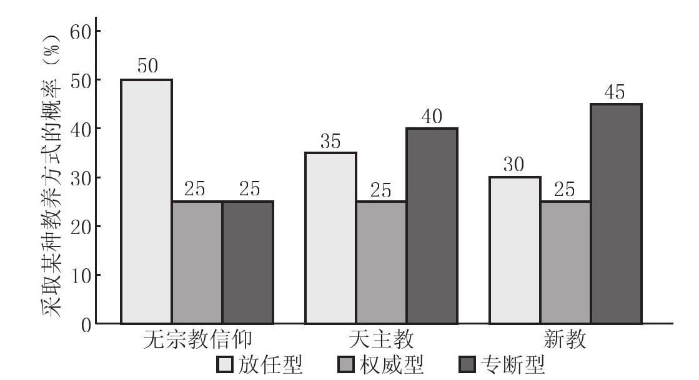

图5.3　在母亲无宗教信仰（利伯塔德，对照组）、是天主教徒（玛丽亚·普利菲克松）和是新教徒（玛格丽塔）的情况下，一个美国孩子接受三种教养方式的某概率

世界各地的宗教信仰与育儿

世界价值观调查数据使我们能够将对宗教信仰影响的分析扩展到更多国家。有两个不同的原因很有趣。首先，我们可以研究除了我们在第3章中讨论过的不平等水平等国家特定因素外，宗教信仰对于解释父母教养方式的差异的重要性。其次，不同教派的特征可能因国家而异。在美国，福音派人士比其他人更保守。相比之下，欧洲天主教徒往往比新教徒更加保守。

我们先分析宗教信仰的影响，而不区分其教派。与之前的分析一样，如果受访者认为宗教“非常”或“相当”重要，我们将他们视为有宗教信仰的人，反之则归类为无宗教信仰。在整个世界价值观调查样本中，包括发达国家和发展中国家，受访者总数为274 504人。其中，72%被归类为有宗教信仰的人，28%被归类为无宗教信仰的人。宗教信仰显然与采用每种教养方式的不同倾向有关。在采用放任型教养方式的父母中，59%的人具有宗教信仰；在采用权威型教养方式的父母中，70%具有宗教信仰；在那些采用专断型教养方式的父母中，信仰宗教的人占总数的81%。与他们的总人口比例72%相比，信仰宗教的人在权威型和专断型父母中的比例过高，在放任型父母中比例过低。因此，有宗教信仰的人比没有宗教信仰的人更专断、更不放任，而权威型教养方式则没有显著偏离样本平均值。

接下来考虑我们在第3章中研究过的OECD成员国样本。把样本限制在这些国家使我们能够根据宗教教派对信众进行分类。在完整的样本中，由于世界上存在大量的宗教组织而使这变得复杂。OECD的样本包括53 328份答卷，其中51%的答题者被归类为有宗教信仰的人。在采用放任型教养方式的父母中，37%的父母拥有宗教信仰；在那些采用权威型教养方式的人中，57%的父母拥有宗教信仰；在那些采用专断型教养方式的人中，信仰宗教的父母占总数的62%。与他们在样本总体中51%的比例相比，宗教信徒在专断型家庭中的比例再次过高，在放任型父母中的比例过低。这与完整样本的主要区别在于，经过工业化的OECD国家样本中信仰宗教的人的比例较低，这同样反映了经济发展过程中的世俗化。

仅考虑OECD国家的受访者对宗教信仰的平均影响可能会出现问题，原因我们已在本书中讨论过。例如，比较有无宗教信仰的瑞典人（具有特定的社会经济特征）和有无宗教信仰的土耳其人之间采用不同教养方式的倾向，相比于比较有宗教信仰的土耳其人和无宗教信仰的瑞典人的区别，可能会得到更多信息。即使仅仅关注国内的比较，我们仍然发现宗教信仰影响了教养方式的选择。考虑同一个国家中除宗教信仰外其他条件都相同的两位家长。假设不信仰宗教的家长选择放任型、权威型和专断型教养方式的概率分别为50%、25%和25%（如图5.3中的利伯塔德）。那么，对于信仰宗教的家长来说，选择这三种教养方式的概率分别为42%、24%和34%。[48]再一次，我们得到的主要结果是，信仰宗教的父母比不信仰宗教的父母更专断、更不放任。

我们可以使用来自世界价值观调查的数据来分离不同宗教教派的影响。相对于仅针对美国的分析，世界价值观调查数据允许我们区分五种教派：佛教徒、天主教徒、穆斯林、新教徒，以及剩余的被归类为“其他宗教”（请注意，在美国样本中，由于穆斯林和佛教徒太少我们未能将他们区分出来）。为了描述这些发现，假设有来自不同宗教信仰类别的五位除宗教信仰外特征完全相同的母亲。我们使用法语名字称她们为玛丽安（无宗教信仰）、珍妮（天主教徒）、玛格丽特（新教徒）、法拉（穆斯林）和蔡泓（佛教徒）。让我们假设玛丽安选择各种教养方式的概率为通常的参考概率：50%（放任型）、25%（权威型）和25%（专断型）。

图5.4总结了不同教派的母亲选择每种教养方式的估计概率。像法拉这样的穆斯林母亲明显不如任何其他宗教派别那样放任，并且更为专断。她们也更可能是权威型的。[49]像珍妮和玛格丽特这样的基督徒母亲也有类似的规律。她们比玛丽安这样的无宗教信仰的家长更为专断，更不放任，尽管没有达到穆斯林父母的程度。像蔡泓这样的佛教徒母亲是所有教派中最不专断的，她们与无宗教信仰的母亲的专断程度相同；同时，她们强烈倾向于选择权威型。与美国父母的样本相反，天主教徒与新教徒之间没有显著差异。这也许并不奇怪：国际样本包括许多欧洲国家，与美国的福音派新教徒和欧洲的天主教徒相比，今天的欧洲的新教徒（主要是路德教会教徒或英国国教徒）社会保守程度较低。

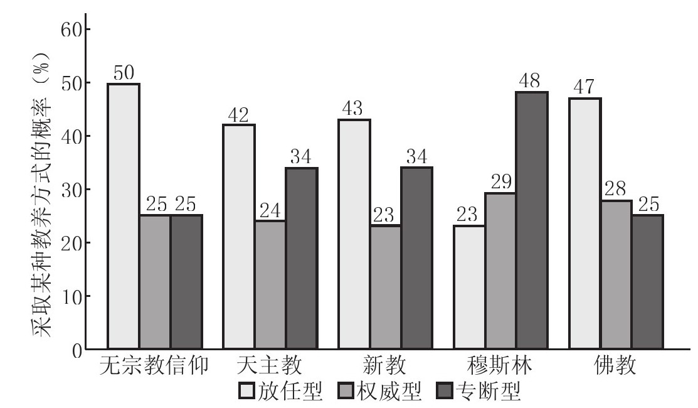

图5.4　在母亲分别为无宗教信仰（玛丽安，对照组）以及是天主教徒（珍妮）、新教徒（玛格丽特）、穆斯林（法拉）和佛教徒（蔡泓）的情况下，一个OECD国家的孩子接受三种教养方式的概率

政治倾向、经济保守主义以及社会保守主义的其他维度

宗教只是保守主义的一个方面。有些信奉宗教的人同时信仰自由，而有些无宗教信仰的人却很保守。世界价值观调查还报告了关于受访者政治倾向的信息。有意思的是这些倾向如何与教养方式产生联系。此外，我们还可以检验宗教信仰是否对具有相同政治倾向的人的教养方式产生影响。[50]

我们根据每个国家的政治光谱将选民分为左翼、右翼和中间选民。[51]再次假设我们选取的参考个体（这里，假设是左翼选民），有50%的概率为放任型，25%的概率为权威型，25%的概率为专断型。我们将其与位于政治光谱中间或右侧的、除政治倾向外其他条件都相同的人比较。中间选民为放任型、权威型和专断型的概率为40%、28%和32%。对于右翼选民来说，这些概率分别为33%、29%和38%。当一个人从左翼向右翼转变时，有从放任型到权威型教养方式的温和转变，以及从放任型到专断型教养方式的明显转变。此外，政治观点似乎并未改变宗教信仰对教养方式的影响。以中间选民为例，宗教信仰和教养方式之间的联系与全样本中得出的联系相同（即宗教信徒更专断、不放任）。如果把样本局限在左翼或右翼选民中，情况也是如此。这表明宗教信仰和政治倾向对教养方式的影响几乎是相互独立的。

通过观察关于对不平等态度问题的回答，我们还可以考虑保守主义中更偏向经济的维度。人们被要求以10分制表明他们对收入不平等的态度，其中1是“收入应该更加平等”，10是“我们需要更大的收入差异作为激励”。如果他们的回答在1—3之间，我们将之归类为支持平等，在4—7之间归类为中立态度，在8—10之间归类为支持不平等。我们发现在支持平等和中立态度的父母的教养方式之间没有显著差异。然而，支持不平等的人比样本平均水平更为放任，尽管这一差别很小，这也表明经济保守主义在决定教养方式方面不如宗教信仰和社会保守主义重要。

总　结

在本章中，我们检验了专断型教养方式的历史延续性和最近的衰落。我们发现经济因素和文化态度，特别是宗教信仰与保守主义，都有助于解释专断型教养方式的受欢迎程度随时间的变化以及在不同社会经济群体间的普及程度的变化。

首先，经济基本面因素会影响专断型教养方式的吸引力。在技术发展较慢、职业流动性差的社会，大多数孩子遵循了子承父业的职业选择模式。这使得父母可以教授子女需要掌握的知识并直接控制子女。此外，子女从脱离父母的掌控中收获甚少而且往往损失很大。在这样的社会中，服从相比独立性和想象力更被高度重视。低技术变化率以及低职业流动性是整个前工业化时期所有社会的特征。相比之下，在高职业流动性和社会流动性的现代经济体中，孩子从独立中获益更多。因此，专断型教养方式在现代化进程中变得不那么有用。相应地，我们观察到专断型教养方式的受欢迎程度随着经济发展水平的上升而下降。

其次，宗教信仰也很重要。在我们的观念中，宗教会产生影响是因为它塑造了父母对于子女将要生活的世界的信念。相信价值观、抱负、职业以及科技将会迅速改变的父母会高度重视孩子的独立性。这样的父母可能也很重视勤奋，但并不坚决主张服从的价值观以及成人权威的原则。相比之下，保守的宗教原则与这样的世界观相关，即世界的秩序是不可改变的，父母的责任是教导孩子绝对真理。与我们的论点相一致，我们展示了信仰宗教的父母更为专断，更不放任，并更有可能采用体罚。[52]

总的来说，结果表明伴随着技术潮流的社会世俗化可能导致了专断型教养方式的衰落。有意思的是，这一结论未来在多大程度上仍然成立。尽管宗教总的来说是保守的，宗教本身并非一成不变，而是随着社会的变化而变化。比如，教皇方济各（Pope Francis）就在其任期中革新性地引入可能影响世界观的改革。随着时间的推移，保守主义可能会自动从宗教信仰中剥离，至少在某些教派中是这样的。根据皮尤研究中心的一项研究，在2017年，美国3/4的成年天主教徒支持同性婚姻（2004年为36%），尽管这仍然受到天主教会官方教义的反对。[53]在白人福音派教徒中，对同性婚姻的支持率仍然较低（35%），但自2004年以来也有显著增长（11%）。最终，这些转变可能会影响宗教信徒对教养方式的选择。与这种观点相一致的，我们已经表明，宗教信仰对当今教养方式的影响在保守程度或高或低的教派中有所不同。

我们也考虑了政治和经济保守主义的影响。政治保守主义的影响与宗教类似：右翼父母更有可能是专断型的。有趣的是，当我们考虑在经济层面的右翼父母的度量，即对再分配的态度时，这一影响要小得多。这意味着政治上的右翼倾向和经济上的右翼倾向是完全不同的概念。特别是，经济上的右翼倾向同样可以源于自由主义而非保守的世界观。

我们没有强调的但可能产生影响的另一个角度是社会规范，这也是决定了采用不同教养方式的动机的环境的一部分。对于我们的祖父母来说，打孩子屁股不仅是自然而然的事情，它也是被社会接受的。如果一个邻居看见他们挥舞着手杖而不出来阻止，可以预期邻居会赞成甚至支持他们训诫调皮捣蛋的孩子。今天，人们会得到截然不同的反应。玛丽亚和法布里齐奥记得有次在斯德哥尔摩散步时，他们曾试图制止小女儿耍脾气。虽然他们远未使用任何类似体罚的方法，但语气有些严厉带着呵斥。正在那时，一个路人走过来并力劝他们停止这种行为：“否则你们的孩子长大后会讨厌你们。”显然，社会规范已经改变，这可以从父母的行为中得到反馈。

社会规范可以帮助我们解释近几十年来教养方式的转变速度。当父母们放弃专断的教养习俗时，体罚会唤起社会耻辱感。变化的社会规范也带来了态度的迅速转变，因此，甚至原本会成为专断型的父母也会随大流，变得更为放任或权威。社会规范可能也部分地解释了为什么在某些国家（比如西班牙）和某些地区（比如美国南部）专断型教养方式仍然具有顽强的生命力。当父母与许多认可使用体罚的人交往时，这减轻了让人回避使用专断型方法的压力。相比之下，在某些社区（比如许多美国大学校园中），打孩子受到如此强烈的反对，以至于没有父母愿意冒着被发现的风险使用体罚。

## 第6章　男孩与女孩：性别角色的变化

随着时间推移，女性逐渐意识到另一种生活也是可行的，而且可能更有吸引力。对工作的向往一代代传递下去，最终形成全新的社会规范。

抚养男孩与女孩之间的差别是家长之间最喜欢讨论的话题之一。确实，现在西方国家的父母通常会质疑性别成见，他们尽力用一种性别中立的方式教养孩子。比如，他们不再给女孩买洋娃娃，给男孩买小汽车，他们会选择与传统性别角色无关的玩具。但是在现实中，男孩和女孩在成长早期确实会不一样，这给他们的父母带来不同的挑战。[1]

法布里奇奥有一个女儿，而马赛厄斯有三个儿子。在生活中，两个人经历了抚养女孩与男孩的两重天。马里萨和马赛厄斯经常烦恼于三个男孩之间频繁爆发的争吵和打斗。这些问题不仅仅是兄弟间的较劲：在学校或托儿所，男孩也比女孩更可能出现肢体冲突。[2]事实证明，马里萨和马赛厄斯的儿子也不例外。当他们的大儿子奥斯卡在洛杉矶就读于一所面向两岁儿童的托儿所时，他是班上仅有的两个男孩之一，也是唯一喜欢“推”其他孩子、朝他们扔沙子和搞其他各种恶作剧的男孩。托儿所的老师对此感到非常担心，而马里萨和马赛厄斯多次被叫到学校，进行不愉快的会面，讨论怎样改变他的这种行为。之后奥斯卡去了芝加哥的一所德语学校，本性不改。第一次家长会时，其他家长提出有一个男孩经常跟别人打架惹麻烦，导致有些孩子回家时脸上还有抓伤。马里萨和马赛厄斯担心这也许是他们儿子干的，这下又要被单独批评了。然而，令他们高兴的是，学校主任批评了另一个男孩。他们还自嘲，这一次奥斯卡最差也只是学校第二粗暴的孩子。类似的故事也发生在他们另外两个儿子卢卡斯和尼科身上。

相比之下，诺拉从不推别人，反而偶尔成为受伤的那一个。法布里奇奥和玛丽亚现在回忆起来仍然害怕：在斯德哥尔摩，诺拉的一个小伙伴拿着一把自制的剑追着她。几年后，在幼儿园，诺拉被推倒撞上了椅子，头也撞到了墙，她当时就哭了。肇事者也是一个粗鲁的男孩。他们从瑞典搬到瑞士后，事情并没有好转：诺拉和一群女生成为了当地一群不良青少年的目标。那些男生的家庭显然把反移民情绪传递给了他们。这些事情并没有对诺拉产生长远的影响，反而与其他女生的吵架更让她受伤。这样的争吵虽然不涉及暴力，但是经常让她心里难受。

这些轶事反映了更一般的趋势。相对而言，在学校教育背景下，男孩比女孩更会“惹麻烦”，不仅是在暴力或打架方面，男孩留级和辍学的比例也更高，以及更可能出现注意力缺陷障碍等状况。现在的教育要求专注度和注意力，而往往很少要求体育活动，人们担忧这样的教育环境确实更适合女孩。[3]

男孩和女孩的差别重新成为焦点，部分是由于现在大多数教育机构的教学理念是男孩和女孩不应该被区别对待。这与几十年前相比是一个本质上的转变。当时，男孩和女孩所学的东西都不一样，单独的男校和女校也更常见。

随着教育系统的转变，男孩和女孩的教养方式也发生了变化，这也是我们最初的研究兴趣所在。对于如今工业化国家的大多数父母来说，如果他们区别对待男孩和女孩，往往是对孩子不同行为和需求的回应。父母对子女的期望是相似的：无论男孩还是女孩，大多数父母希望他们的孩子能接受良好的教育，不需要依靠另一半将来也能过上好日子。然而，仅仅在几十年前，情况却很不一样。当时性别角色之间有更大的差异，父母为男孩和女孩规划完全不同的人生。在很多发展中国家，性别差异的情况至今仍非常普遍，不论是针对孩子还是成年人。

成人后的性别角色差异反映了父母育儿决策的差异。在本章中，我们勾画出世界各地在男女孩教养方式上的差异，以及这些差异如何与男性和女性在不同发展阶段的经济角色相关。根据我们整体的主题，我们将说明经济动机的改变对教养方式有重要影响，这些动机能够解释为什么近几十年教养方式的性别差异发生转变。因为在过去性别差异更大，我们从历史视角开始，展示从前工业化时期到现在，经济变化如何塑造性别角色和男孩女孩的教养方式。

性别角色的经济根源

在早期，女性和男性扮演着完全不同的角色。性别角色部分反映当时大多数社会是父权制社会，男性拥有更多的权力和话语权。今天，在一些发展中国家，我们还是能看到性别之间严重失衡的权力分布。在《妇女在经济发展中的角色》（Woman's Role in Economic Development）一书中，丹麦经济学家埃丝特·博斯拉普（Ester Boserup）描述了在一些社会中，大多数田地劳作由女性完成，而男性则游手好闲。[4]女性在其他很多方面也处于弱势，其范围包括从两性关系中遭受暴力的危险到法律和政治权力的缺失。

除了权力和歧视，性别差异还体现在很多别的方面：性别角色的分工存在经济根源。例如，哺乳把母亲限制在幼儿身边。在一个社会中，如果女性有很多孩子，那么理所当然的，男性会专门从事要求大量移动的任务（比如狩猎），而其他能与照顾幼儿一起完成的工作就落到女性头上。类似地，男性会专门从事更高体力要求的任务。

历史上，特定的技术影响性别角色最著名的例子就是犁。在拖拉机被发明之前，用犁耕田需要大量体力，这使男性拥有天然的优势。在一个社会中，犁是否被使用取决于土壤特征和气候条件。博斯拉普在她的书中描述了在那些不使用犁的社会，女性承担绝大多数农业劳动，而在使用犁的社会中，男性从事田地劳作。犁在欧洲北部和北美洲被广泛使用。因此，在这些地区，女性照顾家庭和孩子而男性从事更多野外工作的“传统”劳动分工拥有悠久的历史。[5]

性别的劳动分工反映在父母对男孩和女孩的育儿差异上。在前工业化时期，只有小部分精英群体能接受教育，大多数孩子很小就开始工作。孩子干的活可以反映社会中不同性别的劳动分工。在概述19世纪欧洲的亲子关系时，历史学家洛夫托尔·古托姆松（Loftur Guttormsson）描述了在冰岛，放羊的任务被分配给只有七岁的男孩，同时，“照顾年幼的兄弟姐妹则是女孩的典型工作”。[6]

技术变革与性别角色革命

不同性别的劳动分工存在经济根源，这一事实意味着随着时间推移，经济环境的变化会反映在性别角色上。过去一百年的技术变革确实给性别关系带来了革命性的变化，大大缩小了历史上的男女分工差异。技术进步的一个重要方面是在很多地方机器取代了对人力的需求，因而降低了对体力的要求。相反，劳动力市场越来越看重认知和社交能力，从而削弱了男性的相对优势。

然而，从更长远的历史来看，技术进步有时候扩大了性别不平等。如今巨大的性别差异通常被认为与前工业化时期的历史常态相关，但是事实上，相比于20世纪中期的美国，在很多方面，前工业化时期的性别差异反而更小。

在前工业化时期，大多数家庭从事农业。女性和男性通常进行不同的劳动：女性经常负责喂养小型动物和种植供家庭消费的作物，而男性负责喂养大型动物和生产供市场售卖的作物。但是两者都在劳动，每个人的工作也都以家庭为中心。当父母都在身边时，孩子可以有很多时间跟父母亲在一起。女性通常负责抚养幼儿，一旦孩子长到五六岁，他们就开始与父母一起工作，母亲和父亲共同照顾他们。

在工业革命以后，性别角色的差异才到达了顶峰。技术和制度因素都扩大了男女社会角色的差异。经济史学家乔伊斯·伯内特（Joyce Burnette）认为，工业革命以前，像操作纺车这样的任务是典型的女性工作，因为女性的灵活性更高。[7]工厂和机械化的出现改变了这一现象。在工业化早期阶段，技术进步确实减弱了灵活性相对于体力在某些工作上的重要程度，例如操作纺纱机的工作被男性取代了。此外，男性主导的团体越来越反对来自女性的就业竞争。伯内特记录了19世纪早期发生在格拉斯哥的工人争端，女性纺纱工和她们的雇主被男性纺纱工暴力袭击。整个19世纪，在就业市场的很多领域中，女性面临着越来越严重的歧视性壁垒。[8]

新兴工业技术也催生了工厂和大型办公室等全新的工作组织形式，大多数人第一次意识到家和工作地的分离。男性离开家去工厂，随着铁路和郊区的出现，家与工作地在地理上进一步分隔开。部分女性（通常是年轻女性）也在工厂工作，但是由于她们仍然不得不照顾幼儿，有小孩的已婚女性愈发被困在家庭范围内。

家和工作地分离的新情况影响了人们对女性和男性在社会中所应当扮演角色的预期。在那些丈夫出去工作可承担一家人开支的情况下，已婚女性不再参与正式的劳动力市场。新的性别角色马上改变了男孩和女孩的教养方式。古托姆松写道：“当男性面对越来越多商业和专业领域的机会时，女性只能把她们的活动限制在母亲身份和家庭事务上。女性需要奉献自己以服务于丈夫和孩子的需要，通过对他人的支持来表现女性气质，无论是作为妻子、母亲、女儿还是姐妹……同时，女孩的教育也致力于让她们成为好妻子和好母亲。”[9]

成人性别角色的差异很快反映在对女孩和男孩的教育上。当正规教育的读写和算术能力成为就业市场看重的技能时，由于只有男生被认为会进入正式的就业市场，男女教育之间的巨大差异就产生了。古托姆松认为这“间接表现在学校和家庭在对男孩和女孩提供的教育上有着显著的性别歧视，他们对女孩写作和算术能力的要求低于男孩”。对于女孩来说，教育“局限于她们未来的家庭主妇角色范围内。女子无才便是德，无需读很多书”。

20世纪女性就业市场参与度提高

在美国，就业和家庭之间的性别分工在第一次世界大战和第二次世界大战之间的几十年中是最明显的。在那些年，仍然有女性在工作，但基本都是单身女性，很少有例外，要么是未婚的年轻女性，要么是丧偶或离婚的年长女性。当时的惯例是一旦一个女性结婚，她就要停止工作。对很多职业来说，这甚至不是一个选择，而是一条规则，被称为婚姻门槛（marriage bar）。例如，在美国大多数州，女老师被要求是单身，一结婚就会失业。适合已婚女性的角色被认为是照顾家庭和孩子。婚姻门槛在20世纪早期广泛存在，直到20世纪50年代才消失。[10]

第二次世界大战期间，女性在职场上的作用开始显著增强。因为当时男性在欧洲或亚洲参军打仗，数百万女性（很多都是已婚）进入职场，以保障战时的生产。二战后，女性工作逐渐被接受，女性劳动力参与率也开始提高。

图6.1展示了从1890年到现在，美国按性别区分的劳动力参与率。[11]在这一期间的大多数阶段，超过80%的成年男性参与工作（剩余的男性多数在接受教育或提前退休）。女性的劳动力参与率从1890年的20%十分缓慢地增长到1940年的28%。二战后（因为直到1960年数据都以十年为频率，所以战争期间没有具体展示），女性的劳动力参与率每十年都平稳上升，在90年代达到70%，不再远低于男性的劳动力参与率。

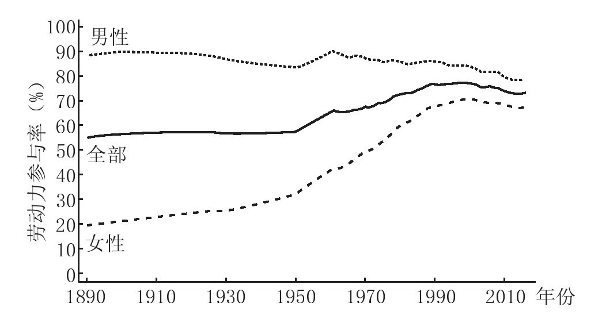

图6.1　美国不同性别劳动力参与率（16—64岁人口的工作比例）

与19世纪的转变一样，20世纪女性劳动力参与率的增长很大程度上是由技术变革推动的。正如之前已经提到的，技术变革的一个重要方面是就业市场上对特定技能的需求发生变化，体力变得越来越不重要。经济学家克劳迪娅·戈尔丁（Claudia Goldin）的研究表明在20世纪二三十年代，体力差距仍是女性就业机会更少和更差的重要原因。[12]自那以后，大多数新工作都出现在服务部门和全新的岗位上，对体力要求不高，但对认知和社交能力有很高要求。经济学家米歇尔·伦德尔（Michelle Rendall）提出这种结构性变化对女性的相对优势有利，能够解释女性就业供给的提高的原因。[13]

经济学家杰里米·格林伍德（Jeremy Greenwood）、阿纳斯·萨斯哈德里（Ananth Seshadri）和梅米特·约鲁格鲁（Mehmet Yorukoglu）指出技术进步对家庭劳动和家庭生活组织也会产生间接影响。[14]在1900年，对一个母亲来说，全职工作是很困难的，除非她能负担得起雇佣仆人的费用。准备食物、洗衣服、打扫房间和照顾孩子需要大量的时间，以至于家务外的日常工作对于很多母亲来说是不可能完成的。家庭中的技术进步大大降低了家务劳动的时间需求，因此让更多女性能在正式的就业市场上追求自己的事业。节省人力的家电，比如冰箱、洗碗机、洗衣机和吸尘器的普及，在这样的转变中起到关键作用。以前的家庭生产活动现在有了市场化的多样选择，比如外卖和托儿中心，这些发展也是转变的相关因素。这些创新联合起来，给予女性更多分配时间的选择。

女性就业机会的变化也反映在工资的性别差距上。有很多原因可以解释为什么女性和男性工资不同，包括公然的歧视，还有像教育、经验、体力等因素的不同。图6.2展示了从1890年至今，美国不同性别的工资差距的演变过程。[15]在1890年，女性的平均工资还不到男性的一半。在接下来的一个世纪中，工资差距逐渐减小，但在20世纪五六十年代，女性相对工资的上升趋势暂时性回落了。工资差距的暂时扩大要归结于当时高等教育的巨大差距（见图6.5）和一批年长而相对没有经验的已婚女性进入劳动力市场。如今，女性收入平均比男性低20%。

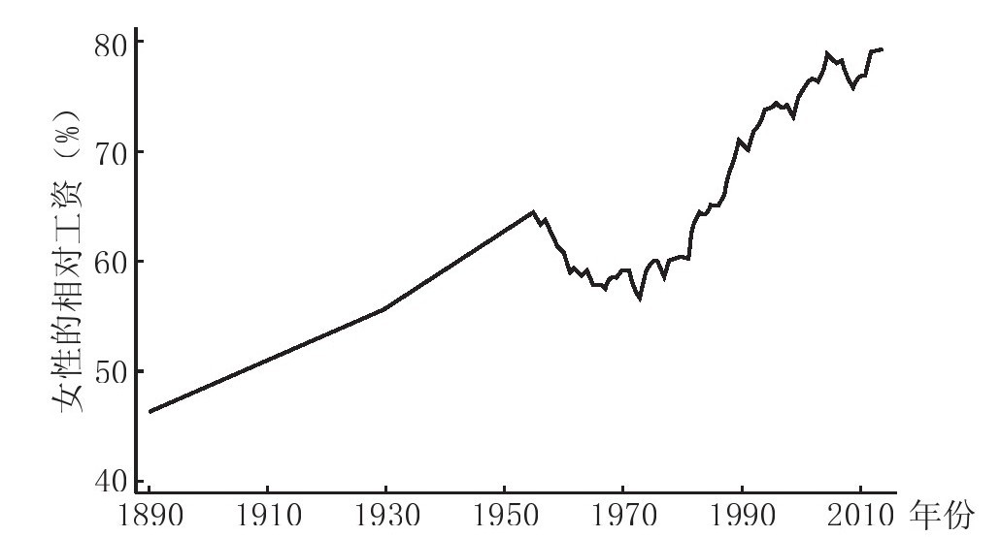

图6.2　美国性别工资差距

（全职全年、15岁及以上女性工人相对于男性的中等收入）

除技术因素以外：学习和文化转变

技术变革不是女性在就业市场上角色变化的唯一推动因素。对职业女性的公然歧视和偏见也扮演了重要角色。玛丽·居里（Maria Sklodowska Curie）的故事是一个典型的性别歧视的例子，即使是伟大的女科学家也要受制于这样的歧视。居里夫人是第一个获得诺贝尔奖的女性，也是第一个在两个不同领域获奖的学者，她在1902年获得了诺贝尔物理学奖，在1911年又获得了诺贝尔化学奖。在她得到第一个诺贝尔奖后，只有她的丈夫（同为共同获奖者）皮埃尔·居里（Pierre Curie）得到了巴黎大学的教授职位，而她只得到了一个普通职位。皮埃尔在一场意外中不幸去世后，她才成为巴黎首位获得教授职位的女性。后来，就在她得到第二个诺贝尔奖的几个月前，法兰西科学院（French Academy of Sciences）拒绝了她的入会申请，给出的解释是女性不能成为法兰西学院（Institute of France）的一员。[16]

最近，很多研究者分析了文化变迁如何使歧视随时间而减弱，从而解释了女性劳动参与率的提高。经济学家拉克尔·费尔南德斯（Raquel Fernández）、亚历珊德拉·福格里（Alessandra Fogli）和克劳迪娅·奥利维蒂（Claudia Olivetti）特别关注了丈夫对妻子参加工作的偏见。[17]他们提供的证据表明，在20世纪早期，婚姻市场歧视职业前景更好的女性。在1890年出生的群体中，受过高等教育的女性中一直未婚的概率是31%，而低学历的女性只有8%。显然，很多男性寻找的是一个忠诚的家庭主妇，教育和职业野心意味着更多的麻烦而不是机会。到今天，情况完全颠倒了：就像我们之前所讨论的，受过高等教育的女性明显比低学历的女性更可能结婚。费尔南德斯、福格里和奥利维蒂认为男性态度的转变非常重要。进一步，这些态度源自男性的原生家庭。例如，如果一位男性的母亲在他童年时是工作的，那么，他成年后更可能与一个职业女性结婚。这个例子展现了我们整本书所强调的重点——父母对子女的影响可以延伸到对性别角色的态度。

不仅是男性改变了对职业女性的态度：女性自己的观点也发生了变化。在20世纪时，鉴于当时主流的性别角色，女性可能会担心参加工作的决定会影响她们的家庭，特别是她们的孩子。在另一项研究中，费尔南德斯提出随着时间推移，女性逐渐意识到另一种生活也是可行的，而且可能更有吸引力。[18]对工作的向往一代代传递下去，最终形成全新的社会规范。学习机制解释了性别态度的改变与女性劳动力供给增加之间是如何相互促进的。费尔南德斯的研究提供了一个有力的例子，证明家庭内部价值观和看法的转变既是社会变革的原因，也是其结果。

时间利用和教育的改变

尽管在总体上性别角色逐渐趋同，但有些性别差异还是存在的。正如我们上面所看到的，女性劳动力参与率还是略低于男性，男女平均工资之间仍有差距。相比于就业市场，我们在家庭方面观察到更大的差异。图6.3和图6.4展示了男性和女性在市场性工作（以营利为目的的正式岗位或自主创业）和非市场性工作（打扫房间、做菜等，但不包括照顾孩子）之间的时间分配。[19]

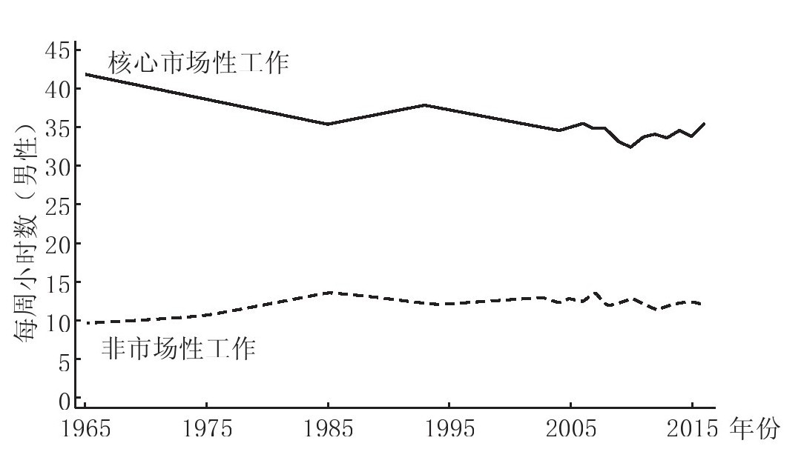

图6.3　美国男性的时间分配

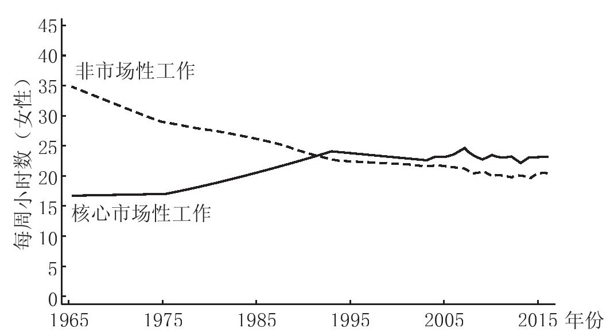

图6.4　美国女性的时间分配

男性继续把多数时间花在市场性工作上，这部分工作所占的时间只有小幅度减少，而在家劳动时间的增长幅度更小。因为女性进入了劳动力市场，所以她们增加了市场性工作，减少了非市场性工作。然而直到今天，女性平均做的家务还是比男性多。

我们的育儿经济学理论预测，因为父母希望让自己的孩子为成年后将要面对的经济环境做好准备，父母对女孩和男孩的教养方式的选择能反映社会上普遍的性别角色观点。由于近几十年女性劳动力参与率大幅提高，我们可以预想在同一时期，对女孩的教养决策会逐渐从培养她们成为家庭主妇转变到让她们具备成为成功职业女性的能力。教育方式就是教养决策转变的一个例子。从就业市场参与度可以看出，20世纪40年代以前，女孩的父母几乎不会相信他们的女儿需要可以在劳动力市场取得高回报的教育，但是60年代以后，那样的教育对男孩和女孩来说同等重要。因此，父母有越来越强的动力给他们的女儿提供良好的教育。虽然之前男孩比女孩接受了更多的教育，但是数据显示在女性的劳动力参与率和相对工资提高的同时，她们的相对教育水平开始追赶（并最终反超）男性的教育水平。

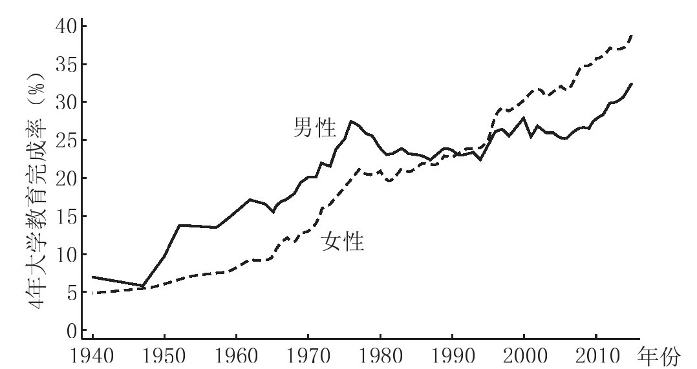

图6.5　美国不同性别25—29岁群体中完成4年大学教育的比例

图6.5展示了美国青年女性和男性完成高等教育的比例（比如，至少四年本科）。[20]1940年以前，大学教育非常罕见，局限在小部分精英群体，无论男女比例都低于10%。第二次世界大战之后，男性教育水平开始快速增长，而女性却没有[这一差距一定程度上被《退伍军人权利法案》（GI Bill）放大了，该法案为二战退伍军人支付上大学的学费和生活费]。在五六十年代，男女教育水平存在很大的差距——男性完成大学教育的数量几乎是女性的两倍。60年代中期以后，女性教育开始快速增长，同时段越来越多女性开始工作。到90年代早期，女性教育水平追上男性，而如今更多的女性完成了大学教育。[21]

历史上，女性和男性被教授不同的技能。20世纪70年代后期，当法布里奇奥在意大利上中学时，女孩和男孩会坐在一起，这是当时意大利教育系统一个相对较新的改革。但是，仍然存在例外。当到了学习“应用技能”时，男孩和女孩被分开了。法布里奇奥回忆起自己搭建蒸汽机原型的失败尝试，而与此同时他的女同学们在学习缝纫、烹饪和招待客人。在分裂的意大利高中体系中，如果一个职业学校的名字中有“女性气质”（feminine）这个词，那么，那些职业学校的任务大多是通过教授得体的餐桌礼仪和家庭管理来培养现代尽责的家庭主妇，或者培养女孩成为速记员和打字员。而男孩却可以上工业技术学校，在那里女孩的比例少得可怜。

性别不平等并不只存于久远的历史中。在苏黎世联邦理工学院（Federal Institute of Technology）诺拉的班级里，男女比例达到3:1，反映出科学和技术领域一直存在性别差距。当玛丽亚（法布里奇奥的妻子）辞去了她在苏黎世大学经济系的教授职务后，系内就没有女性教授了。我们现在所在的学校——西北大学和耶鲁大学——情况稍好一点，但是消除学术上的性别不平等还有很长一段路要走。

女孩和男孩的父母会有不一样的教养方式吗？来自美国的证据

我们的理论认为利他主义的父母会针对他们对孩子未来生活的期望做出回应，致力于使孩子具备对未来有帮助的价值观、技能和态度。正如我们所看到的，在工业化（或者更准确地说，后工业化）国家中，女性和男性的经济角色近几十年显著趋同了，这意味着父母教养男孩和女孩的差异也有可能消失了。[22]

之前所讨论的教养方式的数据证明了这一点。我们关注美国收入动态追踪调查的儿童发展附录（PSID-CDS）（在第5章我们已经使用过），这个数据集包含一系列关于性别态度的问题和教养方式的信息。我们可以参照对世界价值观调查使用的一套方法，构造放任型、权威性和专断型教养方式的指标。[23]我们可以从数据中区分女孩和男孩的教养方式。教养方式的相关问题以1997年的调查为参考。总体来说，跟我们的假设一致，两种性别的教养方式分布是相似的。女孩的父母更可能是权威型，而更不可能是放任型和专断型，但是这些差距很小（在1—2个百分点之间），所以两者的教养方式几乎是相同的。这是我们能料想到的：如果父母对男孩和女孩有相似的计划和期许，以及对有用的价值观和技能看法类似，那么他们会用相似的方式对待男孩和女孩。

虽然性别角色整体上是趋同的，但是如今人们对待性别的态度仍有很大不同，有些人赞同近乎完美的性别平等，而其他人继续支持更传统的性别角色区分。我们的理论可以推出态度的不同会反映在教养方式上：如果父母觉得他们的女儿应该专注家庭生活和母亲身份，男孩应该主要赚钱养家，那么他们会有强烈的动机把这些观点贯彻到育儿决策上。

PSID-CDS数据集包含了很多关于性别态度的问题，所以我们可以检验这个预测是否得到数据支持。考虑以下陈述：“有些工作应该是男性做的，而有些是女性做的，他们不该干错各自的工作。”同意这个陈述的父母偏爱传统的性别角色。所以我们可以推测这样的父母会将女儿和儿子按不同的性别角色培养，因此教养方式也会不同。关于教养方式，在第5章中，我们把专断型与对孩子独立性的低回报认知联系起来。父母如果认为女性和男性应该遵从被社会狭隘规定的角色定位，而不是依照自己的喜好，自然不会重视独立性，因而更可能是一个专断型家长。

数据支持这种预测。在美国，很少人赞同性别角色的严格区分，超过80%的回答者不同意或强烈不同意上述说法。与大多数人相比，同意这个说法的那些人更可能是专断型，更不可能是放任型。即使当我们控制了其他因素，比如家庭收入、教育水平、年龄和种族，认为男女工作应该区分开的那些人是专断型的概率几乎是放任型的两倍。[24]

此外，偏好传统性别角色的回答者不仅普遍更多是专断型，而且如果他们有女儿的话，就更可能是专断型。具体来说，如果他们的孩子是男孩，相比于其他父母，同意区分男女工作说法的父母是专断型的比例高出5%（控制其他因素后），如果是女孩则高出8%。相比于专断型的基准比例39%，这些是较大的差距。

父母的性别态度与经济变量高度相关。特别地，偏好传统性别角色的回答者比偏好性别平等的回答者家庭收入更低，受到的教育更少。家庭收入低可能是支持传统性别角色的一个直接后果：在赞同区分男女工作的回答者的家庭中，女性更不可能离开家工作，因而家庭可得的经济来源就更少。

传统性别角色与家庭收入和教育之间联系的另一个解释是只有当父母能找到地方托管孩子时，他们才都能全职工作。如果儿童托管只有付费的托儿所或雇佣保姆的形式，那么有更多经济资源的人才负担得起。

有趣的是，我们发现性别本身并不是决定性别态度的重要变量：偏好传统性别角色的人是女性的可能性与是男性的可能性一样。这意味着传统的性别角色不一定是父权社会的残留物，因为如果那样的话，父权制社会以女性利益为代价，使男性获益，男性更应该表示支持。相反，与经济激励理论相一致，传统性别角色部分反映了家庭与工作之间的权衡，这对女性和男性来说是一样的。

PSID-CDS调查还问了一个关于男孩和女孩教养的直接问题，即回答者是否同意以下说法：“父母应该像鼓励儿子一样鼓励女儿有同等的独立性。”在调查中，只有很小比例的回答者（6%）不同意这个说法。那些认为女孩不需要像男孩那么独立的小部分回答者整体上对性别角色的态度也更传统。例如，他们对妻子帮助丈夫的事业比拥有自己的事业更重要的观点的认同程度是其他人的2倍，这部分回答者中超过一半都赞同“男性赚钱而女性照顾家庭，对每个人来说都更好”。

关于女孩独立性的观点与教养决策之间的关系取决于回答者有儿子还是女儿，这个结果也不足为奇。对于有儿子的父母来说，同意这个说法并不改变他是专断型的可能性。对于有女儿的父母来说，认同女孩独立性低的回答者属于专断型的可能性高25%，或者说属于专断型的概率接近平均值的两倍。这些相关性与我们的假设一致：家长对孩子未来的希望和期许是教养方式的一个关键决定因素。

不同国家男孩与女孩的教养方式

目前为止，我们已经看到在美国，大多数家庭用相似的方式教养男孩和女孩，而有些父母则认同传统性别角色和性别分工，他们对待女孩和男孩的方式不同。我们现在考虑这种关系是否在不同社会中广泛适用。根据激励理论，在一个社会中，如果传统性别角色普遍存在，男性和女性在日常生活中完成完全不同的工作，那么男孩和女孩的教养方式的差异就更明显。我们通过观察性别角色差异更大的国家来检验这个假设。

为了检验传统性别态度与教养方式差异之间的关系，我们可以利用前面使用过的世界价值观调查数据集，这个数据集也包含了对性别态度的问题。我们使用了整个样本，包括工业化国家和发展中国家。考虑以下陈述：“男性应该比女性拥有更多工作上的权力”，我们把这个问题看作性别偏见态度的一个表征。在全样本中，40%左右的回答者同意这个说法。在这一持有性别偏见的群体中，48%是专断型父母，39%是权威型，13%是放任型。不持有性别偏见的群体的相应比例是40%、37%、23%。因此，相比于平均水平，性别偏见的回答者中有更多的专断型父母和更少的放任型父母。宗教信仰也与性别偏见高度相关：信教的父母中45%有性别偏见，而不信教的只有27%。

表6.1显示了宗教信仰和性别偏见可以预测教养方式。首先考虑信教的父母。只有13%持有性别偏见的父母是放任型，而性别中立的有18%。相反地，高达51%持有性别偏见的父母是专断型，而性别中立的只有46%。考虑不信教的父母的话，这个模式更加明显。高达32%性别中立的父母是放任型，而持有性别偏见的只有18%。相反地，只有28%性别中立的父母是专断型，而在有性别偏见的父母中有34%。就不信教的父母而言，我们还发现持有性别偏见的父母更可能是权威型。

表6.1　教养方式、宗教信仰与性别态度（世界价值观调查）

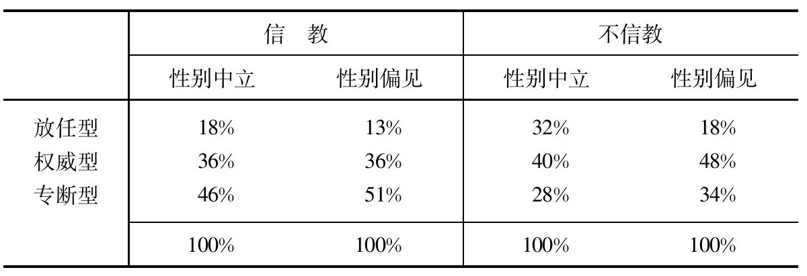

如果我们用世界价值观调查中以下任意一条陈述作为性别偏见的判断标准：“女性比自己的丈夫收入更高是有问题的”“职业母亲对学龄前儿童不好”“大学教育对男生比女生重要”和“男性业务主管比女性做得好”，我们能发现与上述规律相同的现象。在所有情况下，信教且有性别偏见的回答者最有可能是专断型，而不信教且性别中立的回答者最有可能是放任型。这一规律与我们在PSID-CDS美国数据中发现的结果一致。

发展水平不同，性别态度也不同。在高人均GDP的国家，同意男性应该有更多就业权利的人口比例低得多。在一个国家内部，教育是预测性别态度最有力的因素。大学学历及以上的回答者不太可能同意上述说法，而低于高中学历的回答者非常有可能同意。性别态度与政治倾向也有关：相比于左翼回答者，右翼回答者更可能同意男性应该比女性拥有更多就业上的权利，在控制了社会阶层、教育水平、回答者年龄和性别等其他因素后，结果仍然成立。

在高收入国家，最新的女性平权的成果经常用女性劳动力参与率的增长来衡量。例如，在美国和英国，妇女解放运动把让女性实现工作机会平等视为最重要的目标之一。把高收入、中等收入和低收入国家都考虑在内的话，女性平权与女性劳动力供给之间的关系就没有那么清晰。在一些国家，女性承担大量工作恰恰是因为她们拥有的权力太少。

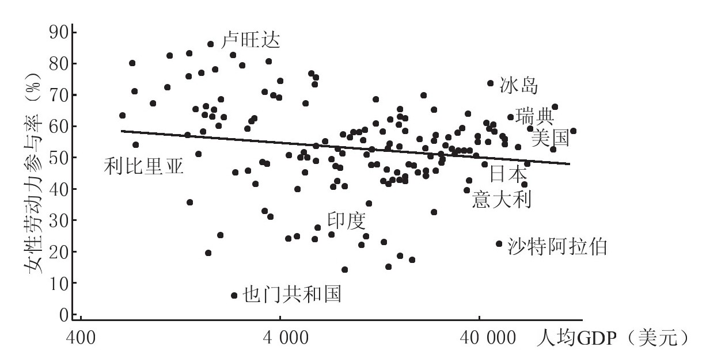

图6.6　2016年不同国家女性劳动力参与率与人均GDP

图6.6展示了不同国家女性劳动力参与率随人均GDP变化的情况。[25]西方工业化国家处于右上角：这些国家人均收入高（在2016年超过30 000美元），女性劳动力参与率接近40%或更高。只有在少数富裕国家中，绝大多数女性不工作，沙特阿拉伯是其中之一，这个国家的财富主要靠开采石油。作为主要以资源为基础的经济体，相比于其他高收入国家，对沙特阿拉伯来说，教育和人力资本的经济重要性不高，这可以说使得统治者推行传统性别角色的成本更低。尽管如此，我们在沙特阿拉伯也看到了一些变化，女性劳动力参与率随着时间的变化而提高，一项禁止女性驾驶车辆的法规最近被宣布废除了。

在人均GDP低于4 000美元的国家中，我们发现女性劳动力供给存在巨大差异，有些国家几乎没有女性参与工作，而有些国家的参与率甚至高过西方国家。在这种情况下，女性在劳动力市场上的高参与度实际上是性别权利不平等的标志。这个观察与我们前面所讨论的犁的使用有关。博斯拉普认为如果一个国家历史上犁的使用率很低，那么父权文化会发展起来，大多数日常劳动需要女性完成。[26]很多女性劳动力参与率高的国家确实在其他女性赋权指标上得分很低，比如政治经济权利或对女性的暴力行为的指标等。

就教养习俗而言，这些发现告诉我们男孩和女孩的教养方式不仅取决于国家的发展水平，同样也取决于当地特定的技术、制度和文化习俗，以及这些因素反映的性别角色。一个高度相关的制度是婚姻制度。如今一夫多妻制（一名男性可以娶多名女性）在很多国家（主要在非洲和中东地区）仍然是常见的。允许男性有多个伴侣而女性不可以是一种性别歧视，一夫多妻制常见的国家通常性别平等指标的得分很低。

一夫多妻制的一个副作用是提高了养育女儿的经济价值。在一夫多妻制的国家，因为富人可以有很多妻子，所以对新娘的需求量很高。对妻子的需求会反映在聘礼上：新郎为迎娶新娘支付一笔钱给新娘的父亲。[27]因此，从父母的角度出发，生女儿具有经济价值。这对女儿来说可能有利，毕竟这样一来，父母有额外的经济激励好好照顾她们。然而，这也有不利的一面：因为父母把女儿看作一项投资，他们就有动力生很多女儿，导致生育率提高，同时在诸如商业创业等其他形式上的投资就会相对减少。经济学家米歇尔·特里特（Michèle Tertilt）证明在一夫多妻制普及的国家，这种效应会导致高人口增长率和低储蓄率，从而使很多这类国家发展水平不高。[28]例如，在乍得、冈比亚、几内亚和塞拉利昂，超过20%的已婚男性至少有两个妻子。这些国家都是世界上最穷的国家，2016年冈比亚的人均收入水平为473美元，而乍得为664美元。[29]

根据经济激励理论，女孩相对男孩的经济“吸引力”会反映在父母对他们的投资上。通过比较女孩有经济价值的国家（比如一夫多妻制比率高的国家）与女孩是经济负担而非投资（单纯从资金角度）的国家，我们可以检验这一预测。尤其是在女儿结婚时，父母要给新郎家提供一大笔嫁妆，而不是收聘礼的情况下。当嫁妆与父系社会（儿子留在家族中，接管父母的庄园或生意，而女儿加入丈夫的家庭）相结合，生女儿就几乎没有经济上的好处了。

女孩相对男孩的不同经济价值会反映在家长所做的决策上。最夸张的是，近几十年这在特别偏好男孩的国家造成了性别选择堕胎的广泛使用。在像印度和中国这样的国家，出生的男孩比女孩更多，近年来男性出生率比女性出生率高10%以上。诺贝尔奖得主、经济学家阿马蒂亚·森（Amartya Sen）把这种现象命名为“消失的女性”（missing women），即相对于男女大致相等的自然比例，女性数量短缺。[30]最近的研究估计全世界有超过1亿的消失的女性——这个事实让我们明白了激励可以对父母的决策产生巨大影响。[31]值得注意的是，在高一夫多妻比率的非洲国家，聘礼比嫁妆更常见，出生性别比更加平衡甚至偏向于女孩出生率更高。

男孩和女孩的不平等待遇并没有在出生后停止。在印度，消失的女性现象不仅仅因为女孩出生率低，还因为女孩的死亡率比男孩高。这乍一看令人意外，因为如果待遇平等的话，在多数社会中，女孩比男孩更不容易生病，存活率更高。有证据可以表明出生后的不平等对待造成了这种差异。营养不良是其中一个因素。许多印度孩子发育迟缓，这是营养不良的一个明显信号。但对新生男孩来说，发育迟缓却不常见。因为在父权社会，这些男孩将赡养年迈的父母，他们对父母来说具有最高的经济价值。哺乳是另一个因素，它对孩子的成长非常有益，尤其在饮用水质量不好的时候。经济学家西玛·贾亚坎德兰（Seema Jayachandran）和伊利亚纳·库奇姆科（Ilyana Kuziemko）发现，在印度女孩的哺乳期比男孩短，这造成了儿童健康发展的性别差异。[32]他们猜想这个差异是因为家长对儿子的偏好。哺乳会阻碍生育，只有一个女儿的女性比已经有儿子的女性更渴望再有一个小孩（也就是一个儿子）。

这些例子表明父母养育男孩和女孩的考虑与在性别角色和男女经济价值方面的地方风俗紧密相关。一夫多妻制、聘礼、嫁妆和父权制等都会影响父母对教养方式的选择。育儿习俗与这些当地风俗之间的密切关系也展示了经济激励在决定父母行为方面的影响力。

在性革命前后教孩子性知识

对男孩与女孩的教养方式的差异的另一个角度与性态度有关。很多父母想要教导孩子正确的性行为，而另一些父母则想要灌输给他们避免婚前性行为的想法。绝大多数情况下，女孩被要求保持贞洁的压力比男孩大。在一些地区，在性行为方面男女所承担的期望的巨大差异一直延续到今天。

同样，父母在这个领域的很多行为可以被理解为对激励做出的（或多或少是有意识的）反应。除了个人的道德观，父母还意识到婚前性行为会对年轻人造成非常实际的影响。第一，婚前性行为有患性传播疾病的风险，这对健康和生育产生长期恶果。第二，婚前性行为会有怀孕的风险。第三，即使之前的风险被规避了，还存在社会影响风险：孩子的这种行为会招致社会评判。孩子可能会受到羞辱和排斥，同时结婚的可能性会降低甚至消失。

在某种程度上，这些风险同样地适用于男孩和女孩，但是大多数情况下，女孩更容易受伤害。几十年前，在欧洲和美国，未婚生子对年轻女性来说还有着严重后果，很多年轻母亲被社会甚至是自己的家庭孤立。对父亲来说，情况却不一样，他们父亲的身份可能都不被知晓。

作为单身母亲的严重后果不仅是因为社会影响，还因为经济影响。在工业化之前，大多数人很穷，营养不良普遍存在。当时还有患传染性疾病的风险，而疾病易感性直接取决于营养：营养充足的孩子和成人更容易恢复健康。成为单身母亲经常陷入一生贫穷的境地。没有丈夫帮助她们，单身母亲和她们的孩子经济困难，因而有很高的风险患病甚至死亡。如今在很多发展中国家，类似的情况仍然存在。基于这些严重后果，父母严格要求自己的孩子保持贞洁也就不奇怪了，尤其是对女儿。

经济学家吉泽斯·费尔南德斯维拉维尔德（Jesus Fernández-Villaverde）、杰里米·格林伍德和内齐·古纳（Nezih Guner）在最近一项研究中分析了上述话题。[33]他们认为经济学可以解释为什么不仅是父母，而且教堂、州政府等机构，也实施污名化性的规范和法律。一方面，父母关心女儿幸福，担心未婚生子的女孩会遭受经济方面和心理方面的伤害。另一方面，教堂和政府担心救助未婚妈妈的相关成本。对这些机构来说，严格的性道德也是控制慈善行为成本的一种方式。研究（与本书的激励理论一致）表明灌输性道德的成本和好处受经济环境变化的影响，随着时间推移，这种变化使早期性行为的后果相对减轻。例如，收入水平的提高和福利体系的建立意味着成为单身妈妈的后果比前几代人要轻微不少。最重要的是，收入和存亡之间的关系不再那么紧密，这个问题也不再是一个关于生与死的问题。

一个关键因素是避孕技术的提高：避孕套大大降低了性传播疾病的风险，避孕药让年轻人可以进行性行为而使怀孕概率达到最低。在这样的条件下，父母就几乎没有理由担心子女的性行为了。这也确实是我们所观察到的。虽然有些父母仍然更喜欢让子女禁欲，但是事实上西方国家的大多数青少年有婚前性行为，而且较吸毒或学习成绩差等问题而言，婚前性行为问题并不那么严重。综合社会调查的数据显示，尽管在1963年美国有超过80%的人不赞同婚前性行为，但这一比例在1972年下降到了34%，在2012年下降到了21%。欧洲人更加自由。在瑞典，2013年出生的婴儿中，54.4%是未婚妈妈所生，婚前性行为也几乎被所有人认同。

正如这些调查显示，在工业化国家，婚前性行为的频率和社会接受度都发生了显著变化，尤其是在20世纪六七十年代的性革命期间。[34]在同一时期，避孕技术以及允许年轻未婚女性可以未经父母同意购买避孕药的立法，让这种变化尤其显著。这解释了性行为本身的变化和父母对子女性行为的态度转变。[35]

教养男孩和女孩的政治影响

目前为止，我们已经说明了经济和社会层面的变化会影响父母教养女孩和男孩的方式。在本章中，我们主要说明家长的激励不仅在家庭内部的决定中起作用，也会影响他们的政治观点和行动，最终会普遍反馈到社会变化上。

只要政府机构对儿童和育儿有影响，家长的政治观点就很重要。这不仅适用于民主社会：即使是非民选政府也知道满足至少一部分人的需求是符合他们利益的。例如，我们可以把19世纪和20世纪公共教育的兴起部分归结于父母对教育需求的增加，他们希望子女能习得成功必备的技能。

在这一章节，我们可以看到男孩和女孩的父母经常面临不同的激励。这是否意味着男孩与女孩的父母想要从政府得到的利益不同呢？强有力的证据证明事实的确如此。经济学家埃邦亚·华盛顿（Ebonya Washington）证实，在美国国会，有女儿的立法者更有可能投票给倾向自由主义的社会事务，尤其是直接关系到女性的事务，比如生育权等。[36]有趣的是，有女儿的立法者更可能是民主党而不是共和党，这意味着从女儿的视角看世界的话，政客更可能在各种事务上秉持自由而非保守的观点。

在推动近代女性权利变革的政治力量中，对女儿的关心发挥了关键作用。可以参考美国和英国的例子。前工业化时期，这两个国家在法律和政治上都是高度父权制的。女性没有政治权利，比如投票权或选举权。她们也很少有其他权利，尤其在结婚后。事实上，在英美法系下，已婚女性没有独立于丈夫的合法存在。她们不能拥有或继承财产，未经丈夫同意不能工作，不能提出离婚，离婚时得不到孩子的抚养权，而且婚内强暴不算违法。

在19—20世纪，已婚女性没有在法律上确权以及缺少法律保护的状况逐渐发生了改变。值得注意的是，大多数已婚女性法律权利的进步（比如婚姻财产法、离婚法和孩子抚养权等方面的改进）发生以后，女性才获得投票权。这生产了一个有趣的问题：如果只有男性可以投票和选举，为什么他们会发现给女性更多权利对他们有利呢？

当然，一部分原因是19世纪女权运动的崛起，女性通过游说能更有效地建立自己的事业。然而，马赛厄斯在与米歇尔·特里特合作的研究中提出，引起政客对女儿未来担心的经济因素也起到关键作用。[37]虽然男性政客可能反对限制与自己性别相关的特权，但是他们乐于接受自己的女儿得到保护，远离虐待或不负责的丈夫。19世纪时，这种担心变得尤其明显，当时男性酗酒问题越来越严重，经常给他们的家庭带来重创。

从男性角度来看，作为选民和政客，他们面临着一个自身特权与赋予女儿更多权利、保护女儿之间的权衡。马赛厄斯和米歇尔认为19世纪人力资本重要性的提高扭转了这个平衡，导致了女性权利的扩张。一旦接受良好教育成为成功的前提，男性就有理由不仅要担心女儿的幸福，还要担心孙女的教育。基于当时的性别角色分工，母亲承担了照顾子女和确保他们得到合适的教育的主要责任。为了胜任这个角色，女性需要权利和保护，而一旦子女的教育成为重要考虑因素时，男性愿意保证她们获得权利和保护。

因此，女性权利的扩张可以理解为重点由从男性特权到孩子需求的转变，而经济体中人力资本和教育的重要性的提升推动了这种转变。我们可以看到当时关于女性权利的公开辩论中，对孩子的需求的担心越来越多。这种变化惊人地迅速。在1868年，一篇《泰晤士报》的社论还提出要继续父权制，认为“所提议的变化会完全破坏现存的夫妻关系。目前的关系是一方权威，而另一方从属……如果一个女性拥有自己的财产，可以单独花自己的收入，那么事实上她就从丈夫的控制中解放了……有什么能防止她去她喜欢去的地方，做她高兴做的事呢？”[38]仅仅一年以后，《泰晤士报》就改变了论调，跳出来支持女性权利。孩子的需求是论点的中心内容：“理论上，（丈夫）确实有责任供养她和孩子。但是这份责任在实践时是有条件的……对孩子来说，没到刑事虐待的程度不会让父亲受到法律的惩罚……因此，必须得承认，虽然《普通法》让丈夫成为妻子所有个人财产的主人，但是没有相对应地对他施加供养妻子或孩子舒适生活的义务。”[39]

总而言之，正如女孩和男孩的父母的教养决策与经济激励一致，选民和政客的行为也是，他们从自己孩子的角度看世界，对孩子未来的需求做出反应。

总　结

以工业化为开端的性别角色的变化过程还远没有完成。虽然在工业化国家，男性和女性在正式劳动力市场的参与率现在接近相等，但是一些经济体内部的某些部门仍存在巨大的差异，比如相当大的性别工资差距。我们不知道这个变化过程会走向何方；女性和男性是不一样的，而就教养方式而言，怀孕和哺乳的基本生理需求将继续在父母的决策中发挥作用。

我们知道的是女孩和男孩抚养方式的差异与他们父母所面对的激励紧密相关。如今，可以在发展中国家中找到性别不平等和歧视女孩最显著的例子。如果这些国家能够转型成功，使人力资本成为生产的关键因素，克服家庭和工作场所的分离，那么，在未来的几十年，我们应该可以观察到更公平地对待女孩和男孩的实质进步。

## 第7章　生育率与童工：从大家庭到小家庭

教育的兴起和童工的减少解释了为什么在父母眼中孩子开始变得“昂贵”起来。他们不得不支付学费；更重要的是，孩子不再通过劳动为家庭收入做贡献了。这些因素使父母的激励转向拥有小家庭。

在父母考虑采取怎样的教养方式前，他们不得不面临更基本的问题，即首先是否要生孩子，如果要的话，生几个。今天工业化社会的父母给出的答案与之前父母的答案大相径庭，也与世界上其他地区父母的答案不同。

从大家庭到小家庭：有意识的选择而非意外

现代的理想家庭是小家庭。在美国，大多数成人认为一个家庭理想的孩子数量是2个，少于15%的人偏好有4个及以上孩子，而这在几十年前“婴儿潮”时期还是常态。

图7.1展示了过去七十年间，美国人对理想家庭观点的转变。[1]直到20世纪60年代中期，大家庭还是流行的：最受欢迎的家庭规模是有4个孩子，其次是3个，不到30%的回答者认为2个孩子是最好的。从60年代中期到80年代，喜欢小家庭的比例越来越高，形成了现在两个孩子家庭模式的风俗。

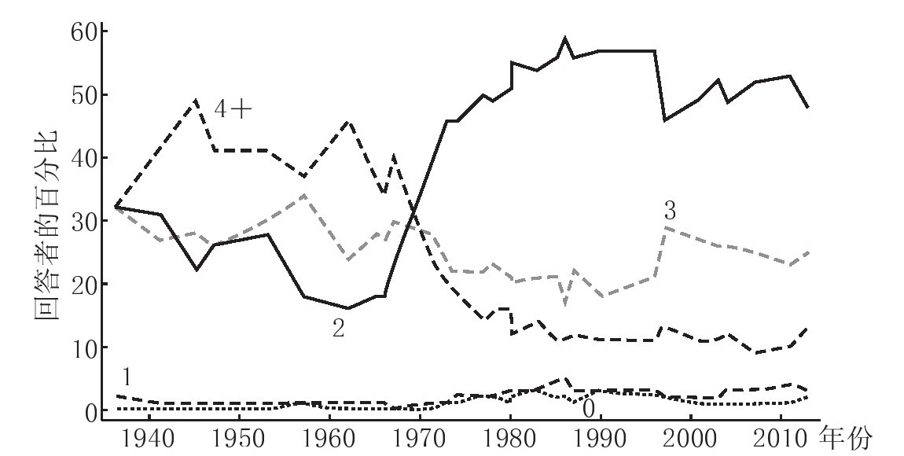

图7.1　美国期望家庭规模（“你认为一个家庭中理想的孩子数量是多少？”）

如果我们回溯更久的历史，那时家庭规模更大。在19世纪，大多数家庭有5个或更多的孩子，3个或4个被认为是最少的孩子的数量。

什么原因导致了小家庭趋势？当然，避孕措施发挥了部分作用。从20世纪60年代开始，避孕药的发明使夫妻更容易控制出生的孩子数量。然而，生育决策的研究者一般把避孕技术看作次要因素。人们早就知道影响生育孩子数量的各种方法；几个重要的例子包括控制结婚时间（女孩晚婚可以减少一生中潜在的孩子数量）、哺乳的习俗（虽然哺乳不是万无一失的避孕方法，但可以通过抑制月经到来而起到避孕效果。）和基本的避孕措施比如体外射精。生育行为的很多主要变化早在现代避孕方式比如避孕套或避孕药的广泛使用之前就发生了。[2]

发展经济学家兰特·普里切特（Lant Pritchett）的一项研究证实了我们的观点——生育率主要由个人选择决定。普里切特发现在不同国家总生育率都与期望生育率紧密相关。实际生育率与期望生育率的相关系数很高，表明不同国家生育率不同的主要原因是人们想要的孩子数量不同。[3]

排除了孩子数量主要是偶然因素导致的之后，经济学视角告诉我们，如果人们选择生更少的孩子，那么拥有大家庭或小家庭的激励一定发生了变化。把这个假设应用到对孩子数量的选择上，这意味着要么是拥有更多孩子的好处减少了，要么是拥有很多孩子的成本上升了。在成本方面，我们之前的章节提到了教养方式趋于密集，这可能是个重要原因：如果父母想要在子女身上大量投资，花很多时间陪在每一个孩子身边，那么，多生孩子的金钱和时间成本都上升了。

在本章，我们应用激励理论来理解在不同国家和时期父母的生育选择。我们认为抚养孩子成本的变化在解释数据上起到关键作用。教养方式的密集程度是成本的一部分，但这既不是唯一也不是最重要的部分。其他三个成本因素起了关键作用：儿童劳工的经济报酬、人力资本投资的成本、女性（也就是母亲）时间的价值。我们将展示这些成本的变化如何解释了大部分关于父母在孩子数量决策上的证据。

历史上和不同国家的生育选择

首先考虑生育选择的基本事实。在历史上的大多数时期以及今天的大多数地区，人们生的孩子要多得多，而不是像今天富裕国家普遍的生一两个。一国人民所做的生育选择通常可以用“总生育率”来表征。总生育率是年龄别生育率（该年龄母亲所生的孩子数量除以该年龄的女性数量）之和。如果年龄别生育率随时间保持不变的话，总生育率给出了一个完整度过生育阶段的女性一辈子所生的孩子总数。所以，总生育率可以看作每个女性平均生育孩子数量的近似。在没有移民的情况下，保持不变的人口总量所需要的总生育率是2.1左右（有时候被称为人口替代率）。如今在大多数工业化国家，总生育率低于人口替代率，而在很多发展中国家总生育率高于人口替代率。

图7.2展示了从1800年至今，美国和英国（准确地说，英格兰和威尔士）生育率的变化情况。[4]在19世纪早期，家庭规模很大，在英格兰和威尔士，每个女性大约有5个孩子，在美国则几乎达到7个。19世纪期间，美国生育率开始逐渐下降，而英格兰和威尔士大约在1880年后迅速下降。到了20世纪早期，生育率降到了初始值的一半以下；典型的家庭有2个或3个孩子，与今天的情况相差无几。

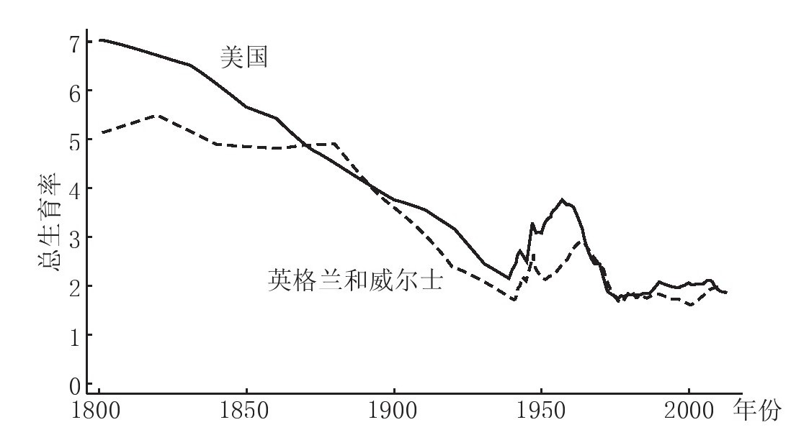

图7.2　美国、英格兰和威尔士的总生育率

在20世纪，生育率一开始继续下降。到30年代中期，大萧条之后，总生育率在两个国家都达到了每个女性有2个孩子。低生育率的趋势在第二次世界大战后被打断了，工业化国家在“婴儿潮”时期的生育率都上涨了。“婴儿潮”在美国尤其显著，在50年代后期，回到了每个女性生育接近4个孩子。但是生育率很快重现了下降趋势。70年代再次达到了30年代的低生育率，自那以后就几乎没有变化了。

除了“婴儿潮”时期，过去两百年的最大特征之一是生育率下降伴随着经济增长：收入越高，出生的孩子越少。收入与生育之间的负相关性在今天的不同国家间也成立。图7.3展示了2015年不同国家人均GDP（衡量经济发展水平）与总生育率的关系。[5]图7.3表明，平均而言，人均GDP越高，孩子数量就越少。在大多数最富裕的国家，总生育率在每个女性生育1—2个孩子之间。在另一端，所有人均GDP低于1 500美元的国家的总生育率都超过4。在今天最穷的国家，女性一生有5—7个孩子，与美国和英国两百年前的情况类似。

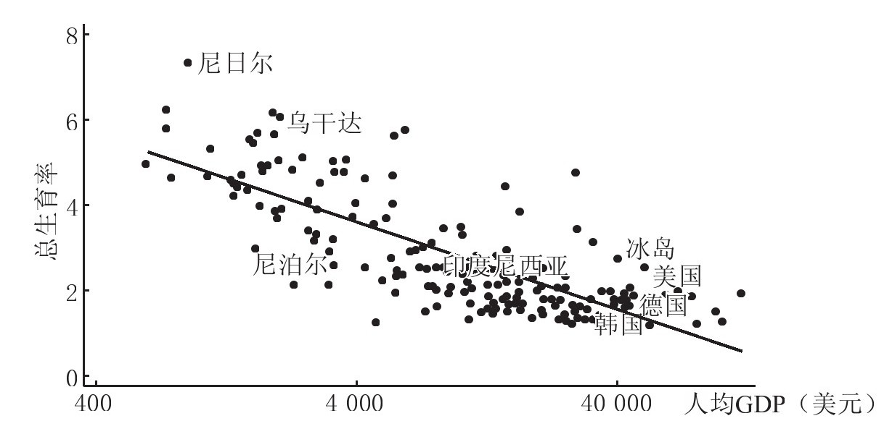

图7.3　2015年不同国家的总生育率与人均GDP

数据中最显著的特征是人们越富裕，生的孩子越少。然而，虽然在如今这个工业化和经济增长的时代，这个特征在国家内部和国家之间都成立，但是如果我们考虑早期历史，故事就完全不同了。事实上，美国、英国和其他国家在经济增长阶段生育率下降，是对人类历史大多数时期生活水平和生育之间稳定关系的一个巨大反转。在19世纪以前，生活水平与生育率之间的关系是正向的：当形势好的时候，人们相应地生更多的孩子。同时，经济条件好还导致死亡率降低，这主要是因为更容易获得食物了。两个因素都意味着好的经济形势会导致人口快速增长。

正是收入水平与人口增长之间的这种正相关关系，让经济学家和人口学家托马斯·马尔萨斯（于1834年逝世，正好是生育率下降之前）对人类命运做出了悲观预测。在他的著作《人口学原理》（An Essay on the Principle of Population）中，马尔萨斯提出食物供给的增加会加速人口增长，直到有太多人需要食物，导致食物不再有盈余。到那时，饥荒和贫穷开始出现。危机会减小人口规模直到食物供应能满足需求，然后开始新的循环。马尔萨斯认为除了短期的盈余，这个循环使人类陷入持续贫困，看不到生活水平长期提高的希望。[6]

今天，我们知道世界上大多数地区最终逃离了马尔萨斯陷阱。不管怎么说，马尔萨斯的理论提供了对前工业化时期收入与人口关系的准确描述。即使在早期，不同地区也存在生产力水平和技术进步的巨大差异。在我们的时代，生活在技术进步国家的人们享有更高的生活水平。与之相反，在马尔萨斯机制下，生产力的提高（比如，轮作方式的引进使亩产农作物增加）首先会造成更高的人口增长率。在马尔萨斯的时代，农业是主要的生产活动，由于具有生产力的土地上人口越来越多，而劳动的回报率递减，人口增长率就超过了食物生产的增长率。到那时，生活水平（用人均食物来衡量）会回到之前的水平，生产力提高的唯一永久性后果是更高的人口密度。

与马尔萨斯理论的预测一致，前工业化时代的生产力差异主要反映在人口密度上，而不是人均收入。大多数国家的生活水平是类似的，都接近温饱线，但是生产力高的地区有更多人。例如，多个世纪以来，中国是技术最先进的国家，包括在农业领域，中国劳动密集型的水稻种植方式的生产率比欧洲农业高得多。但是平均而言，中国农民没有比欧洲农民生活得更好。中国的人口增长率更高，人口密度很大，使得中国成为世界上人口最稠密的国家，如今中国仍是人口最密集的国家。类似地，在工业化前的几个世纪，西欧经历了相对高的生产力增长。虽然这一增长确实带来了生活水平的一些进步，但是主要影响是提高了人口密度和西欧人口占世界总人口的比例。

在工业化时代的前十年，正是马尔萨斯形成自己的理论的时期，经济增长和人口增长之间正相关的预测仍然成立。在英格兰，工厂开始在城市扩张时，人口快速增加，就如查尔斯·狄更斯小说中常描述的拥挤状况和普遍贫穷。几十年后，收入与人口增长之间的关系颠倒了，世界历史上的马尔萨斯时代到达了终点。

我们观察到的19世纪美国和英国生育行为的反转也被称为“人口转型”。除了生育率下降，人口转型也以死亡率下降为特征：伴随着家庭中的孩子越来越少的同时，预期寿命提高了，婴儿和儿童的死亡率下降了。人口转型是经济发展的一个普遍特征：每一个成功逃离前工业时期发展停滞的国家在工业化时期都经历了生育率和死亡率的大幅下降。后发国家通常人口转型速度更快。美国和英国经历了几代人，生育率降到了之前的一半，而被称为“亚洲四小龙”的中国香港、新加坡、韩国和中国台湾只花了不到20年。

孩子的“质量”和生育经济学

很长一段时间内，经济学家把生育选择看作他们领域之外的研究，把生育率背后的解释交给诸如社会学和人口学等学科。然而，今天我们把生育看作人们的决策之一，可以用同一套适用于其他领域的经济学工具来分析。

从经济学视角来看，人们生多少孩子的决策可以用他们面对的激励来解释。激励取决于人们生孩子的目的和养孩子的成本。我们先从目的开始分析。为什么人们要生孩子？一个简单的答案是进化设定了人们想要生孩子：毕竟没有孩子的人不能传递自己的基因，所以自然选择偏好喜欢生孩子的个体。然而，对孩子的普遍渴望不能解释我们所描述的关于生育选择的基本事实。如果是那样的话，在能够承担养育孩子的成本的约束下，父母会尽可能多地生孩子。接近温饱线的贫困家庭就只能负担得起生较少孩子的费用。相比之下，一个百万富豪应该毫不费力就能抚养大量的孩子。因此，如果人们关心的只是孩子的数量的话，我们就会看到正如富人买了更多的食物和汽车，他们也会有更多的孩子。但是就像我们所看到的，至少在过去的200年间，我们观察到的现象正好相反：人们越富有，选择生的孩子越少。

诺贝尔奖得主加里·贝克尔是第一个着手处理收入—生育负相关关系谜题的人，在把经济学思想应用到理解父母做出的决策上，他比其他任何人做的工作都多。[7]贝克尔的基本观点是父母普遍享受拥有孩子的同时，也享受贝克尔所说的孩子的“质量”。孩子质量可以用不同方式来解读，但一般而言，这意味着父母希望自己的孩子成功和富有，即他们无私地关心孩子的幸福。当然，我们关于教养方式的分析基于同样的假设。

父母关心孩子质量意味着他们面临两个相关却不同的关于孩子的决定：生多少孩子以及在每个孩子身上投资多少。因而生育决策不仅取决于收入（或者更一般而言，父母拥有的资源）、抚养孩子的成本，还取决于投资孩子“数量”（也就是大量的孩子）与质量的关系。从这个角度出发，收入增长时期的生育率下降可能是由于抚养孩子成本的上升，或者是由于人们对孩子数量的追求向质量的追求转变。

我们认为伴随经济增长的生育率下降反映了投资孩子数量到孩子质量的转变，这个转变是由经济激励推动的。教育是孩子质量的最重要的形式。当我们谈论到投资于孩子质量时，我们会说把孩子送去学校而不是让他们工作，可能还有支付优质私立学校的学费而不是把他们送去一所普通的公立学校。学校教育不是最终目的；当父母投资孩子的教育时，他们期望这项投资将来能以孩子更好的经济前途为形式带来回报。

在研究经济发展与生育决策关系的经济学家看来，对人口转型影响最大的经济趋势是人力资本投资回报率的增长，也就是教育的回报率提高了。尤其是经济学家奥德·加勒（Oded Galor）和戴维·韦尔（David Weil）做出的学术贡献，他们认为教育的高回报激励父母在孩子质量上投资更多，并且为了努力承担起这种投资比前几代人生的孩子更少。[8]

在前工业化经济中，大多数家长没有经济动机给孩子提供正式的教育去学习识字、计算和其他诸如此类的技能。大多数人不识字，但那也没关系，因为多数工作不需要识字。只有一些高级职业要求识字，比如神职人员和早期大学的学者。那样的职业对多数人不开放，所以父母几乎没有理由要求孩子接受教育。因此我们可以看到缺乏教育的经济回报解释了对孩子质量的投资不足。

低教育回报的负面影响是童工。不上学的孩子很早就可以工作并帮助养家。因此，低教育回报率也解释了前工业化时期童工的普及。事实上，相比于教育决策，童工的存在对生孩子的成本有更大的影响：工作的孩子大多数可以养活自己，因而从父母的角度看是“便宜”的。这就解释了为什么在孩子可以工作时，生很多孩子是合理的。

童　工

当谈到童工时，有人可能会质疑我们是否把关心子女幸福的利他主义父母的概念延伸得有点太远了。毕竟在如今的工业化国家，童工是遭到普遍反对的社会弊病之一。大学校园常常有反对“血汗工厂”的抗议，鞋子和服装生产商如果被认为利用童工，也会遭到抵制。把童工看作关心孩子的无私父母深思熟虑后的选择是合理的吗？

当然有些情况下，童工不是由于父母的选择导致的，比如诱拐儿童的情况，或者更常见的，孤儿也会导致童工现象。但是不管是现在还是过去，多数童工归根结底是父母决策的结果。对现在的很多父母来说，在孩子还很小的时候就送去工作是完全无法想象的。但是即使在富裕国家，普遍使用童工的时期也不是那么遥远。事实上，很多地方仍能发现童工尽管不是主要职业但作为兼职活动的情况。尤其是农业劳动，很多孩子小小年纪就被要求为这一“家庭事业”出力。

这就是马赛厄斯的遭遇。马赛厄斯的父亲是一名公务员，同时家里还有一个小农场，毫无疑问，必要时孩子们不得不帮忙，他们的工作范围从喂养动物到夏天为农田除草。马赛厄斯不是一个热情的童工，他尽可能逃避劳作，但是他从来没有（大概其他任何人也是）认为父母让他工作有什么错。

其实，即使当童工成为非法时，家庭农场中的工作通常也会成为例外，例如让法律只适用于制造业或工厂时。在德国，青少年在18岁以后才能得到驾照，但是农场中的孩子在15岁时就获得了驾驶大型卡车的许可，他们甚至不需要通过驾驶测试。

在过去，童工不是例外，而是常态。在19世纪教育普及前，除了生活最优渥的孩子以外，做童工对于所有人来说都是必须的。童工不仅仅很常见；还完全不会受到谴责。如果有的话，也是相反的情况：工作被认为对孩子有好处，它的反面——也就是懒散——被认为有害，因为不工作使儿童不能为将来的成人生活做好准备，还有可能促使他们走上犯罪的道路。在教授识字和计算的现代学校出现以前，存在被称为“劳动学校”（work school）的地方，没事做的孩子被派去从事生产，不然就到劳动学校去。不像现在的“血汗工厂”，这些劳动学校的目的不是用孩子牟利，而是防止没事做的孩子惹上麻烦。

即使在童工通常被看作是不道德的、是剥削和虐待的今天，很多人仍可能认为有一些工作经验对孩子有好处。这对年龄大一点的孩子来说当然是对的，他们可以利用暑期工作第一次接触“真实生活”。在农场，孩子帮着做家庭工作仍然是常见的（而且合法的）。

当然，在前工业化时期和如今的发展中国家，童工的工作条件与在现代农场偶尔帮忙工作几个小时是不一样的。但是送孩子去工作的决定要放到家庭境况的角度来看，在童工常见的地区，这样的家庭往往是贫困的。当抚养整个家庭是日常挑战，而学校教育不是一个现实选项时，让年长的孩子为家庭收入做出贡献是一个自然的选择。

童工的机会在决定生育率中起到了作用，在工业化早期可以发现这一有趣也发人深省的例子。[9]在工业化之前，童工在绝大多数情况下意味着孩子和父母一起工作。在工厂工作成为常态后，雇佣整个家庭（父母和孩子一起）作为工人也是常见的。[10]但是也出现了一些童工的新形式，专门利用孩子的身体比成人小的特点。采矿业是一个重要的例子。工业革命是建立在煤上的，因此煤矿开采成为工业化时期一个主要的增长产业。

煤矿很危险，但是由于工人经常要进入很小的空间工作，所以儿童在煤矿有特殊的生产功能。在矿区，儿童的工资很高，让孩子工作对父母来说是有利可图的。19世纪早期，矿区的生育率异乎寻常地高也就不奇怪了。这不仅适用于英国，对于整个欧洲来说也是这样：矿区有最高的生育率，其次是农村地区，而城市的生育率最低，同时开始更早地出现下降趋势。[11]这些观察结果支持我们的假设——童工的潜在回报使家长产生了激励，对他们的生育决策产生了显著影响。

教育、童工和生育率下降

现在考虑在工业革命发源地的英国这一特定例子中，童工、教育和生育决策之间的关系。因为专业工匠可以被非技术工人操作的机器取代，所以早期的工业化减少了对技术工人的需求。此外，工业化一开始也增加了对童工的需求，不仅在矿区，工厂也是这样。早期最主要的工业部门是纺织品生产，就像矿区一样，也有对童工的需求：例如，孩子的小手在编织时有优势。

然而，工业化逐渐对人力资本有了更高的需求。大型工业企业的出现使管理部门崛起，对会识字和计算的文职人员的需求增大。财富的增加也使政府规模扩大，并催生了福利型国家，增加了对公共部门文职人员的需求。

从父母的角度来看，教育回报的增长突然使得送孩子去上学成为一个更有吸引力的选择。这解释了为什么在19世纪中期，远在公立学校和义务教育出现以前，入学率开始迅速上升。跟今天的情况一样，教育开始意味着孩子未来的经济条件更好，因而利他主义的父母不再让孩子工作，而把他们送去学校。

图7.4显示即使在1850年，上学的孩子比例也很小。[12]然而在接下来的几十年中，入学率快速上升，1880年接近有一半的儿童入学，1910年的儿童入学比例超过了70%。因此，正是生育率快速下降的时期，越来越多的家长决定送孩子去上学。[13]

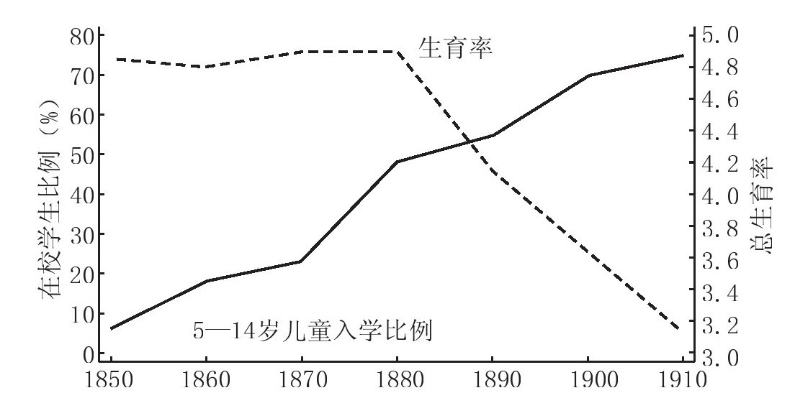

图7.4　英国总生育率与教育水平

入学率上升的另一面是童工的减少。在全民教育出现以前，大多数孩子会以某种形式参加工作，通常是在家庭农场、作坊或家中帮父母的忙。也有很多孩子从事正式的工作，包括在工厂劳动。图7.5展示了在1850年，超过1/4的10—14岁的儿童参加正式工作。接下来的几十年中，教育越来越受欢迎，童工开始被挤出市场，到20世纪，英国的正式童工变得越来越少见。[14]

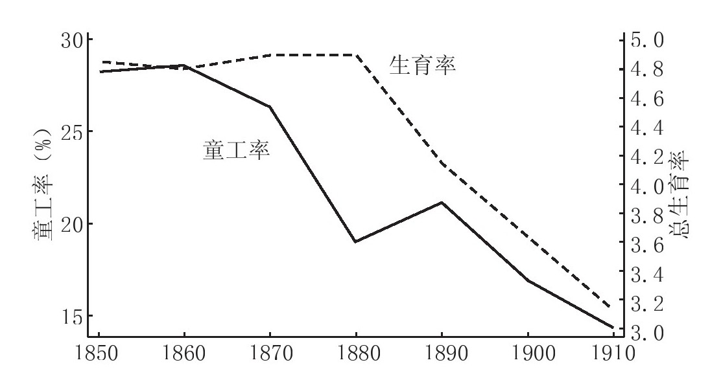

图7.5　英国总生育率与童工率（10—14岁儿童的工作比例）

教育的兴起和童工的减少解释了为什么在父母眼中孩子开始变得“昂贵”起来。他们不得不支付学费；更重要的是，孩子不再通过劳动为家庭收入做贡献了。这些因素使父母的激励转向拥有小家庭。所以经济上对人力资本更高需求的变化，创造了现代教育导向的中产阶层家庭，解释了工业化时期最重要的一些社会趋势。

人口转型时期英国的一个重要特征是童工、教育与生育之间联系密切，这一点在如今的其他国家也可以被观察到。图7.6和图7.7展示了当代各个国家入学率和童工率与生育率之间的关系。在图7.6中，我们看到在儿童教育年限低于4年的国家，生育率都超过平均每个女性生育4个孩子。[15]相反地，教育年限为10年及以上的国家没有一个生育率达到这种水平。类似地，图7.7展示了在童工普遍（用7—14岁工作的儿童比例来衡量）的国家中，生育率也很高。[16]

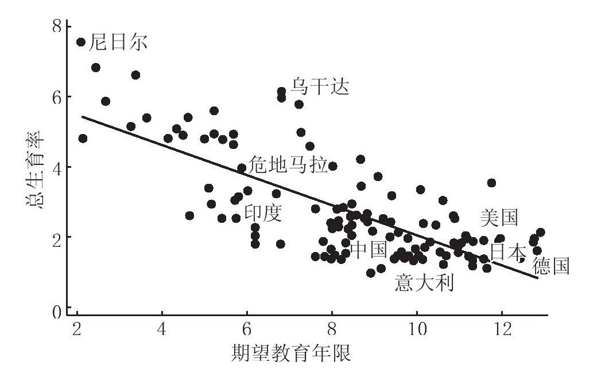

图7.6　2010年不同国家教育水平与总生育率

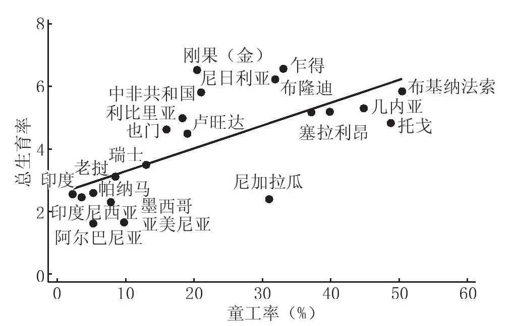

图7.7　2010年不同国家总生育率与童工率（10—14岁工作的儿童比例）

在工业化的世界中，除了农业领域外，童工如今已是久远的回忆。现代社会关于童工的担忧聚焦在发展中国家“血汗工厂”中工作的儿童。即便如此，工作与教育之间的权衡如今仍然存在，在将来很有可能还会继续影响生育决策。例如，在德国大多数州的教育系统中，学术轨和职业轨是分离的。对于实科中学和职业预校的学生来说，正式的学校教育一般在九或十年级结束，通常是在他们十五六岁的时候。接下来，很多学生开始正式的学徒工作，赚取工资。他们如果继续住在家里（大多数是这样的），就经常要拿出部分收入来分担整个家庭的支出。在几十年前，即使他们学术上有天赋，工人阶级的孩子也要当学徒赚钱。马赛厄斯的母亲在德国北部的一个农村长大，她被允许继续实科中学的学习（也就是第十年的学习），这在当时也是很不寻常的特权。

现在，教育进一步扩大了，更多父母希望孩子留在学校继续学业，至少尽可能完成高中学业。但是，高等教育会出现类似的权衡。在美国，因为大学费用的增长速度与平均收入的增长率不成比例，所以贫困家庭孩子的教育选择越来越受到父母支付能力的约束。反过来说，想要给孩子提供最好教育的家庭敏锐地察觉到高等教育潜在的高额成本，很有可能打消他们再生一个孩子的念头。

死亡率的作用

决定生育率的另一个因素就是人口转型的第二个方面，即死亡率。在19世纪后期之前，全世界婴儿和儿童的死亡率都很高。例如，在19世纪早期的英国，每三个孩子中大约有一个不能活到一周岁。贫困父母的孩子死亡率尤其高，父母们努力喂养孩子，给他们提供庇护，但是他们经常居住在不卫生的环境中；缺少干净的水尤其致命。然而富裕家庭也不能避免失去孩子的厄运：各种潜在致命疾病的疫苗还没有出现，而且在抗生素发明以前，常见的感染也可能演化成幼儿致死的原因。在前工业化时代的传记中，死亡的幽灵对孩子来说是始终存在的危险。例如，巴赫与两个妻子共育有20个孩子，但只有一半活到成年。他的子辈和孙辈并没有变幸运，到了19世纪末，这位伟大的作曲家就没有幸存的后代了。

图7.8显示直到19世纪末，婴儿死亡率一直很高。[17]例如，在1900年的英国，超过15%的孩子活不过第一个生日。然而随着卫生条件的改善，营养变好，疫苗和抗生素被发明，存活率逐渐提高了。

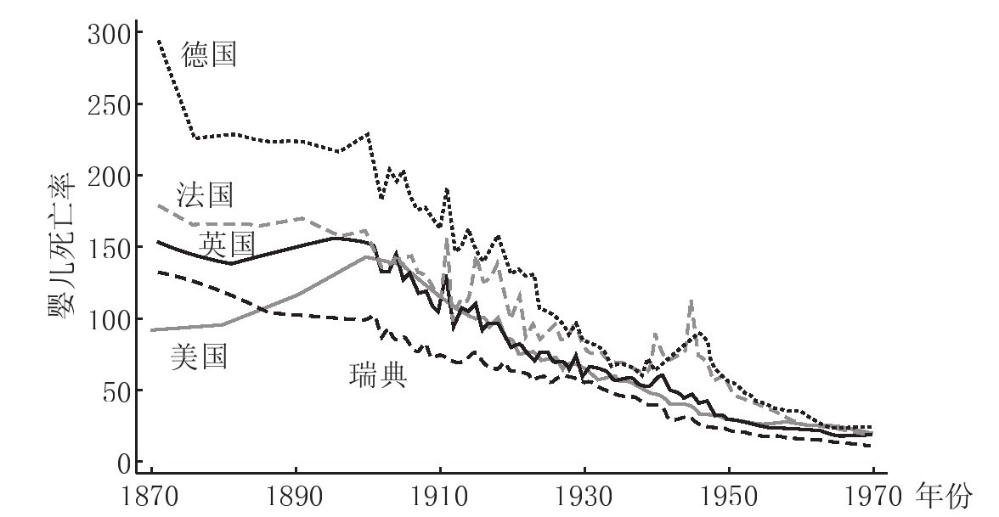

图7.8　美国和欧洲国家婴儿死亡率（每10　000个孩子中不满周岁死亡的人数）

了解存在孩子早夭的风险，对当时的父母生育决策有很大的影响。我们不清楚这种预期的激励会让父母想要更多还是更少的孩子。一方面，有人认为高死亡率和由此带来的悲痛增加了生孩子的成本，降低父母再生孩子的渴望。另一方面，如果父母觉得至少应该活几个孩子，那么面对高死亡率，他们会选择多生孩子来提高至少部分孩子活下来的可能性。从这个角度来看，孩子的高死亡率会增强对大家庭的渴望。然而，因为在前工业化时代，大多数孩子的死亡都集中在年龄很小的时候（即一周岁前的婴儿夭折），这个事实使得任何影响都可能是有限的。一旦孩子活过第一年，他（她）长到成年的可能性就变大了。这意味着只要一个孩子在出生第一年间死亡，夫妻可以再生一个来确保有孩子活下去，这一行为被称为“替代生育”（replacement fertility），是对婴儿早夭做出的反应。大量实证研究发现了支持替代生育的证据，但是总的来说这种效应是小于1:1的，因为平均而言，新生的孩子数量不能完全弥补失去孩子的数量。[18]

总而言之，证据表明在人口转型阶段，死亡率下降可能是生育率下降的一个原因。[19]与此同时，死亡率只能解释生育率变化的很小一部分。基于替代生育的证据，死亡率下降会触发生育率下降，但比例小于1:1，而这意味着实际存活的孩子数量会上升。然而，在人口转型阶段，生育率下降得比死亡率更多，以至于平均每个家庭中活到成年的孩子数量显著下降了。这表明肯定有其他因素要对生育率下降的大部分原因负责。[20]

死亡率作用相对更小的另一个证据是生育率下降的时间：在20世纪主要的工业化国家，在生育率开始快速下降的几十年后，婴儿死亡率才出现大幅度降低，而且相较于儿童死亡率的变化，生育率变化与入学率和童工比例的变化联系更紧密（见图7.4和图7.5）。

教养方式转变的政治后果

术语“工业革命”暗示了18世纪末从英国开始继而席卷全世界的经济和社会变革主要是关于生产方式的转变。但在本章中，我们看到工业革命不仅仅是用工厂取代农场和小作坊；它也引起了家庭生活的彻底转变，从生活在贫困中、孩子早早工作的大家庭，到现代典型的一对父母只有几个孩子的家庭，而且孩子年幼时在学校度过，为未来的富足人生铺垫好道路。推动转变最重要的力量不是工厂体系的建立，而是人力资本越来越重要。之前大多数人的收入主要基于体力劳动的回报，而大约在1850年之后，以教育和知识为形式的人力资本成为了主要的收入来源。相应地，接下来几代的父母们决定生越来越少的孩子，花越来越多的时间和资源来给孩子提供尽可能好的教育。

而政治是变革的另一个维度：同一个发展阶段既带来了现代家庭，也带来了现代国家。现代的大型工业国家（通常是民主的，征收大量税款，积极参与教育和制定劳动力市场规则，提供广泛的社会保险）在工业化之前都是不存在的，它们几乎都是直到20世纪早期才完全成形。我们讨论这些变化，是因为改变父母多生还是少生孩子的力量也改变了他们作为选民时的激励，更一般而言，改变了他们作为政治行为者的激励。由于现代国家的一些关键方面与现代家庭紧密相连，所以这些变化是非常有意义的。

在之前的章节中，我们已经讨论过教育重要性的提高是如何影响19世纪女性权力的扩张的。女权改革背后的一个中心动机是保护已婚女性不再受不负责任的丈夫的任意摆布，进而保证她们可以保护和抚养自己的孩子，并确保他们接受合适的教育。另一个例子是老年保险的公共供给（比如社会保障、公共养老金和老年医疗），家庭规模减小和流动性增强意味着年长者不再能依赖孩子赡养他们，所以老年保险的公共供给成为越来越重要的国家事务。

在公共教育领域可以发现家庭变化与政治变化之间的一个更直接的联系。19世纪末期之前，美国和英国政府在教育领域并没有扮演重要的角色。当时可获得的正式教育基本由教堂提供的主日学校组成，除了基本的识字能力（当然还有《圣经》）外，主日学校不教其他更多的内容。当对人力资本的需求增加而且教育逐渐成为生产的重要因素时，父母想要自己的孩子接受教育，自然会在选举时支持教育的公共供给。雇主组成了支持公共教育联盟的另一股力量：现代企业的所有者想要满足自己对技术工人的需求，因此也会支持扩大国家在公共教育中的作用，并从中获利。[21]

由于上述影响因素，英国花费了几十年时间，在19世纪末完成了从教育领域的自由放任政策到国家出资的义务教育的转变。在同一时期，美国开始了教育改革。由于教育是每个州政府（而不是联邦政府）的责任，美国公共义务教育的普及比英国慢，但即使是落后的州也在第一次世界大战前引进了全面的教育改革。值得注意的是，工业化程度最高的州处于教育扩张的前沿。

另一个有意义的例子是关于童工的法规，在之前的研究中，我们从经济角度分析过这个问题。[22]第一部关于童工的法律于19世纪30年代在英国通过。这主要出于对童工的人道主义关怀，专门为制止工业部门（比如采矿业）的儿童虐待而制定。更广义的童工法（规定制造业的最低工作年龄）几十年后才出现，与公共教育的兴起处于同一阶段。

推动废除童工的主要政治力量是劳工运动，也就是工会及其相关政党带领的运动。工会致力于保障工人的权益，包括限制压低工人工资的竞争来源。这解释了即使在今天工会经常对自由贸易持怀疑态度，并有时支持移民限制的原因。约束童工的动机可以用同样的方式来理解：如果儿童被禁止工作，那么工会工人的竞争就少了，这会增加劳动需求并提升工资水平。

废除童工与其他劳动法有一个关键的区别，它解释了为什么只有当大众教育兴起时，废除童工才出现在工会的议程上。例如，限制移民背后的权衡很清楚：工会工人与外国人之间存在竞争，而工会不代表外国人的利益。与之相反，在童工的例子中，潜在的竞争者（童工）经常与工会工人来自同一家庭。工会工人依赖童工赚取相当大部分的家庭收入，他们不可能支持限制童工。

这解释了为什么在工业化早期阶段，童工很常见时，限制童工并未排在工会议程的前几项。变化是在19世纪末期发生的，人力资本需求增大，促使很多工人阶级的父母把孩子送去学校。结果是，父母们形成了共识，不再依赖孩子的劳动，但仍能从限制其他父母把孩子送去工厂中获益。因此，只有在公共教育的时代，劳工运动才把限制童工作为一个重点目标。

劳工运动的影响也可以从另一个事实中观察到：在儿童与成年工人形成竞争的地方，即制造业，童工被特别限制了。而在家庭农业中童工仍然是合法的，给孩子分配些轻活能让整个生产流程运行得更有效。因此，虽然对儿童的人道主义关怀也起到了一定作用（尤其是早期），但是工会限制竞争的动机才是童工限制运动普遍流行的原因。

如今在发展中国家，童工依然很普遍，而类似的政治和经济力量正在发挥作用。很多人出于人道主义，企图通过抵制产品、制定国际劳工标准和公开游行反对“血汗工厂”来抵制童工。如果这样的措施让童工从正式雇佣转向非正式雇佣，降低成人与童工的直接竞争，那么，这些行为可能会适得其反。如果成年工人不再有理由担心来自童工的竞争，发展中国家内部支持全面禁止童工的政治支持力量就会大幅减弱。这些运动就会与初衷相悖，可能会延迟童工的最终废除。[23]

解释“婴儿潮”

工业国家低生育率的趋势持续了超过一个世纪，只出现了一次重大例外：第二次世界大战后的“婴儿潮”时期。在20世纪五六十年代，生育率急剧上升，不仅仅是美国，遭受战争破坏的欧洲国家和日本也是。正如图7.9显示，“婴儿潮”在非本土作战（对于大多数地区而言）的联盟国尤其明显：除了美国，还包括加拿大、澳大利亚和新西兰。[24]

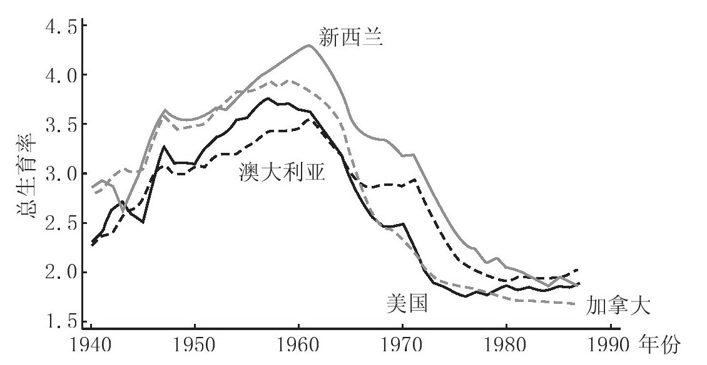

图7.9　第二次世界大战期间及战后美国与联盟国的总生育率

目前为止，我们对于父母生育孩子数量选择的解释聚焦在数量与质量的权衡上，也就是说，因为童工被抵制，高质量教育受到重视，使教养孩子成本变高，所以父母减少生孩子。“婴儿潮”对这种解释提出了挑战；生育率快速上升，但是教育水平继续提高，而且童工没有再次出现。即使如此，“婴儿潮”也能用经济学来解释清楚。

解释“婴儿潮”时要考虑的第一个因素是生育行为变化背后的主要推动力量发生了转变。几十年前，增加对孩子质量的投资推动了生育率下降，但是在战后初期，这不再是一个重要因素。那时，工业国家的童工几乎消失了。教育已经是强制的，且在发达经济体中由公共系统提供，所以教育也不再是抚养孩子成本变化的一个重要部分。随着教育水平不断提高，只有接受高等教育（本科和研究生）才对抚养成本有影响。但当时高等教育比现在的费用低，大多数学生去资金雄厚的公立学校，所以教育成本对父母的决策只有间接影响。

相反地，在“婴儿潮”时期，影响孩子抚养成本的其他因素发生了显著变化。在公共教育和廉价食物的时代中，抚养孩子最大的成本是把他们养大所花费的时间。抚养孩子的相关时间成本有两个不同的因素。第一，照顾孩子需要花费实际的时间，第二，那些时间具有经济价值。目前对“婴儿潮”的解释聚焦于这两个因素。

首先，考虑抚养孩子所需要的实际时间。这种时间成本的某些方面变化很小，或者根本没有变化；例如，怀孕仍然要持续九个月左右。但是也有与更一般的家庭事务相关的时间成本，其中有些家务受到了快速的技术进步的影响，也相应地节省了时间。

我们在之前已经讨论过，节省人力的家用电器的普及发挥了重要作用。有多个孩子的父母都知道，孩子好像能制造无穷无尽的脏衣服，处理这些事情在今天仍然要花费大量时间。然而相比更早之前，由于洗衣机和烘干机的发明，洗衣服的负担已经大大减轻了。另一项花费大量时间的家务是做饭。像冰箱、洗碗机、电炉和微波炉等技术的发展，使做饭所需要的时间也减少了。在50年代末期，“婴儿潮”达到顶峰时，大多数美国家庭都拥有上述电器，而40年代以前，这样的电器是非常罕见的。[25]还有一些其他起到补充作用的创新发明，比如附近超市中越来越多的半成品，让父母不再需要每顿饭都从头开始准备。经济学家杰里米·格林伍德、阿纳斯·萨斯哈德里（Ananth Seshadri）和纪尧姆·范登布鲁克（Guillaume Vandenbroucke）认为家庭生活的技术变革在50年代生育率的提高中发挥了重要作用。[26]

时间的机会成本是一个同等重要的因素。在“婴儿潮”时期，抚养孩子仍然主要是女性的工作。母亲用来抚养孩子的时间的机会成本就是她次优选择的时间价值。例如，如果生孩子意味着不得不放弃一份高薪工作，那么母亲时间的机会成本就很高，她生孩子的动机就更低。时间成本的作用表明女性时间的多种用途——尤其是在正式劳动力市场上的工作机会——会影响她的生育决策。

第二次世界大战前的几十年中，已婚女性离家工作是不常见的。正如第6章所讨论的，很多职业都存在“婚姻门槛”，一旦女性结婚就阻止了她们工作。在很多国家中，这是真实存在的，比如教师必须是单身的（如果她们是女性的话；男性没有那样的婚姻门槛）。如今在很多工业国家，大多数已婚女性甚至在生孩子以后仍然工作，因此生更多孩子（并花更多时间在他们身上）与花更多时间在工作上的权衡对生育决策来说是关键问题。

之前我们讨论过存在女性劳动力参与率提高的长期趋势，意味着时间的机会成本在上升，由此推断生育率应该长期下降。不过，在马赛厄斯与以色列经济学家莫仕·哈赞（Moshe Hazan）和伊萨伊·茂兹（Yishay Maoz）关于“婴儿潮”的研究中，他发现时间的机会成本可以解释为什么五六十年代生育率会先上升后下降。[27]他们发现，适育年龄的已婚女性劳动力参与率提高的趋势恰好在生育率上升的时候停止了，因此得出上述结论。

图7.10比较了美国20—32岁（当时主要的适育年龄）女性与33—60岁女性的劳动力参与率。[28]从40年代末期到1960年左右，年轻女性的劳动力供给显著地比“婴儿潮”前后低。同一时期，年长已婚女性的劳动力供给显著上升，她们在战前几乎是不工作的。

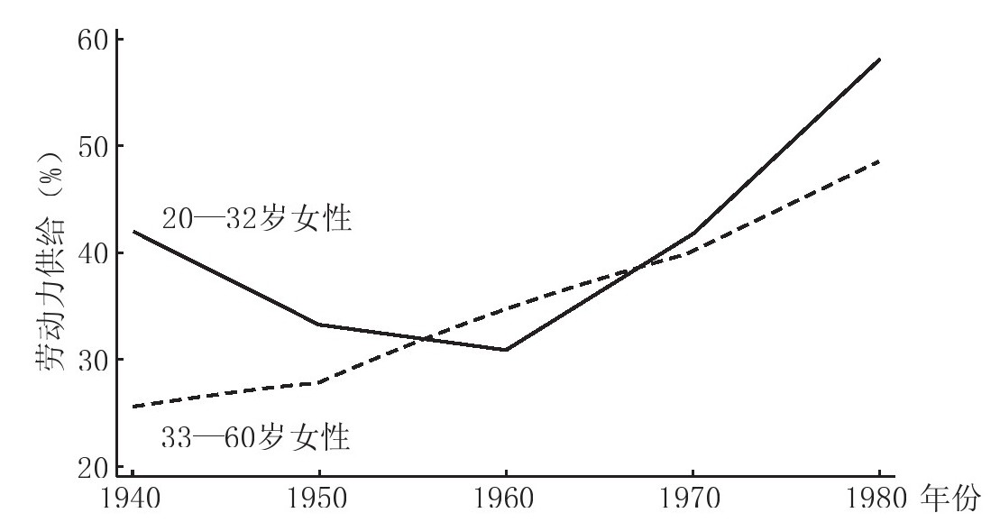

图7.10　美国年轻和年长女性的劳动力供给

马赛厄斯和他的合作者认为可以从第二次世界大战中找到这种变化的原因，这是改变女性劳动力供给决策的重大事件。战争主要通过劳动力市场影响女性：当男性在欧洲和亚洲打仗时，数以百万计的美国女性响应号召，加入劳动力大军，开始在办公室和工厂工作。对于其中相当一部分女性来说，这对她们劳动力供给的影响是持续的：她们喜欢这种经历，在战后继续保持工作。[29]

那么，战时女性就业的增加是如何与50年代生育率变化联系起来的呢？认识到这一点很重要：“婴儿潮”时期的母亲在战时还是儿童或青少年，她们当时太年幼而无法工作。不像年长女性在战时涌进工厂，她们当时还在学校。即使如此，战时女性劳动力供给增加也影响了她们，在40年代末期和50年代，她们成年后，这一变化改变了她们的就业前景。

劳动力市场在战前的模式是大多数女性年轻时工作几年，正好是她们从高中毕业到结婚之前。然后，她们辞职生孩子。对于战后刚成年的那一代女性来说，她们面对的是几百万女性从战时一直在工作的情况。然而，女性能做的工作是有限的。当战时生产减少，男性回到岗位上时，战时工作的女性被取代了。就业市场仍然存在显著的性别隔离，很多女性被限制在某些领域的职位上，比如零售和文职工作。马赛厄斯和他的合作者提出，那些战时加入劳动力大军并在战后决定继续工作的女性占据了大量女性能做的岗位。年长女性的高度竞争加剧了劳动力市场竞争，压低了工资，总而言之，恶化了年轻女性的就业条件。换一个角度来看，女性在就业市场上的时间价值降低了，而这意味着其他选择——比如早点结婚建立家庭——变得相对更有吸引力。

我们可以从数据中看到这个效应：“婴儿潮”时期，女性结婚的平均年龄突然下降，而“婴儿潮”一结束，结婚年龄就迅速上升。基于大多数女性结婚后就开始生孩子，早结婚导致生第一个孩子的平均年龄暂时性地大幅降低（见图7.11）。[30]女性更年轻时就开始生孩子的趋势是“婴儿潮”的主要原因，而30岁以上女性的生育率几乎没有变化。

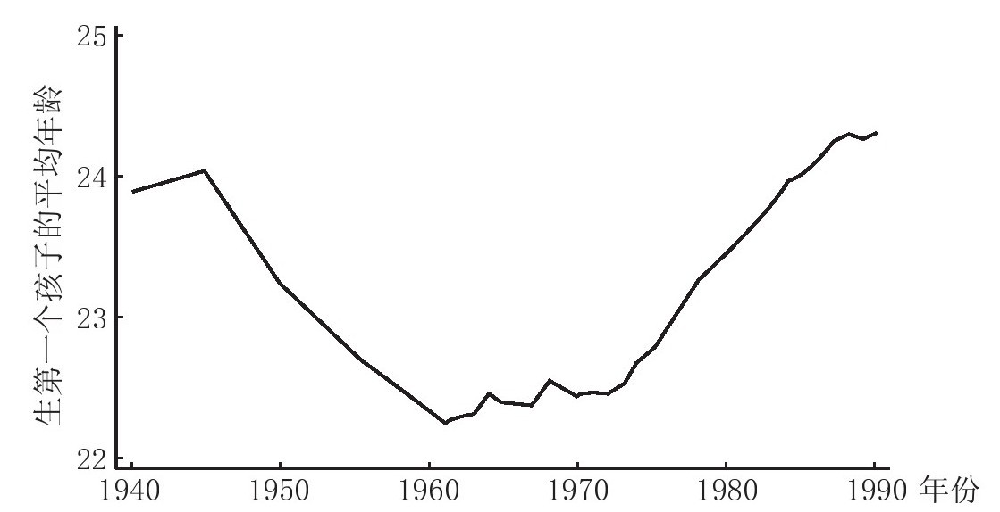

图7.11　美国女性生第一个孩子时的平均年龄

总而言之，对战后“婴儿潮”最有力的解释是由于技术进步导致的抚养孩子的成本下降，以及第二次世界大战对女性就业市场的影响。比较不同国家的“婴儿潮”，可以得到实证证据支持战争发挥重要作用的观点。家庭的技术进步最终以类似的方式影响所有的富裕国家，但是只有参战的国家才会由于战争时间的变化而出现额外的生育率上升。图7.9展示了对于战时动员的联盟国，“婴儿潮”普遍很明显，而且时间上几乎同步。图7.12提供了美国“婴儿潮”与二战中立国生育率的比较。[31]中立国的“婴儿潮”规模明显比美国小，这是因为在中立国，战时动员不是影响因素。

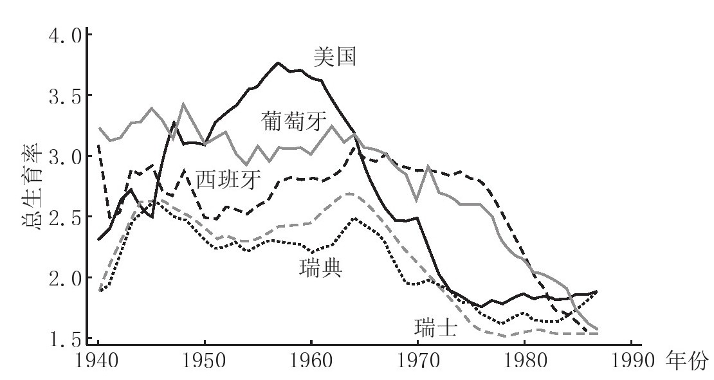

图7.12　第二次世界大战期间美国与中立国的总生育率

低生育率的挑战

长期以来，如何控制人口增长过快才是政策关注的重点；中国最近取消了独生子女政策，当时出台这一政策是想要减小家庭规模，希望能对人力资本的积累和收入的增长起到积极作用。但最近趋势转变了。

在大多数工业国家，如今生育率已经低于人口替代水平（即能保持稳定人口规模的水平）。图7.13展示了从1980年至今一些工业化国家的总生育率。[32]每个女性生育2个孩子意味着长期稳定的人口规模，因为每个家长对应1个子女。图7.13表明现在有些工业化国家（像法国、美国和北欧国家）正处于或略低于替代生育率的位置。然而，也有一些国家的生育率更低，只有1.5或更低。例如日本、德国、意大利和西班牙。这样的低生育率如果持续下去的话，会导致人口随时间显著减少。低生育率也会放大人口老龄化效应，也就是相对于退休的老人，年轻工人的数量下降。这会对负担老年人赡养和医疗的社会保险系统施加巨大的压力。例如，德国的人口规模预计会从现在的8 000万人减少到2060年的6 700万人。今天德国东部某些地区已经在经历快速的人口流失；按照现在的生育率，这样的场景会越来越快地成为常态。

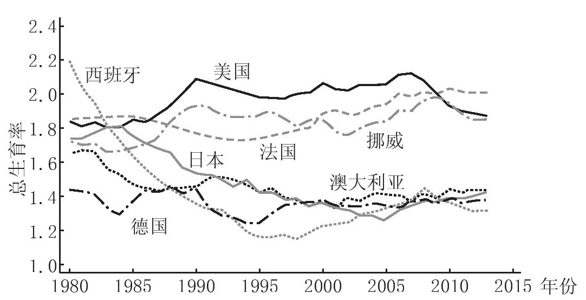

图7.13　工业化国家的总生育率

为什么大部分工业化经济体会出现生育率超低的现象？我们之前提到，在发达经济体中，抚养孩子的时间成本是推动生育决策的关键因素。人口转型后期的生育率下降可以归结于在第二次世界大战之后富裕国家普遍的女性劳动参与率上升的现象。然而，提高的女性劳动力参与率不能解释为什么有些国家比其他国家生育率下降得更多。事实上，关于目前的生育率一个特别有趣的现象是，生育率最高的国家也有着最多的在职女性。图7.14显示了在工业化国家，总生育率与女性劳动力参与率之间的关系现在是正向的：在更多女性工作的国家，女性也生更多的孩子。[33]所有生育率高于1.8的国家，其女性劳动力参与率都高于50%，而低生育率国家聚集在低参与率的区域。

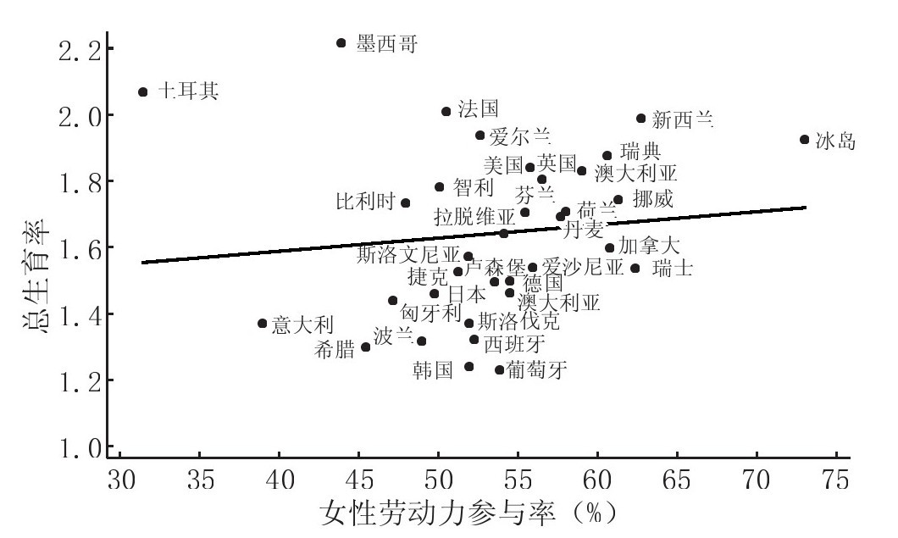

图7.14　2015年OECD国家女性劳动力参与率与总生育率

经济学家詹姆斯·费雷尔（James Feyrer）、布鲁斯·萨切尔多特（Bruce Sacerdote）和阿里尔·斯特恩（Ariel Stern）认为，与“婴儿潮”时期相反，今天的女性不把工作和家庭看作互相排斥的选择：大多数女性两者兼顾，所以上述模式可以被理解。[34]不同国家的区别在于两者结合的难易程度。在生育率和女性就业率都高的国家，女性可以轻易地生孩子而不受失业干扰。例如，法国和北欧国家提供便捷、价格适中的幼儿看护。低生育率国家通常缺少这样的幼托设施，尤其是对非常年幼的孩子的幼托，他们对母亲的需求是最高的。在低生育率国家，另一个更常见的因素是社会规范，比如认为年轻母亲和孩子待在家中才是“适得其所”。

对马赛厄斯来说，通过比较他孩提时在德国的经历与他妻子成年时在美国的经历，政府政策和社会规范对女性两者兼顾能力的影响尤其明显。在20世纪70年代的德国，把家庭和职业有机结合是一个难题。公立的日托只针对4岁以上的儿童；小于4岁的孩子几乎都由母亲来照顾。因为学校一般只开上午几个小时，学生中午就回家，所以即使孩子已经上学，对在职母亲也是一个挑战。此外，即使在上学时间，学校也不总是可靠的：如果因为老师生病而上课被取消，孩子就只能回家。制度的设计使女性几乎不可能兼顾照看孩子和从事一份高要求的工作。很多工作的女性万不得已才选择做在职母亲，大多因为孩子的父亲过世、失业或被监禁。所以当时有年幼孩子的在职妈妈会背上一些污名并不奇怪。

几十年后，马赛厄斯在美国作为父母的经历就完全不同了。他的妻子马里萨是一名选角导演，经常同时忙于多个电视节目或电影。当他们的几个儿子一一出生时，马里萨在分娩时同样可以工作，比如直接在医院的床上打电话安排工作。在之后的几周里，她停止工作来恢复身体，然后就开始重新投入事业了。马里萨与一个时间安排灵活的学者结婚，使她这样做更容易，但能便捷地得到日托中心、保姆和临时看护的帮助也很重要。在美国，马里萨和马赛厄斯的很多朋友生孩子也类似，由于保姆或日托的帮助，工作暂停的时间相对较短，马上能回归全职工作。需要澄清的是，这种生孩子的方法本身有挑战和压力。但是在这样的环境中，女性不需要在一个大家庭与一份有挑战的职业之间做艰难的选择。同样消失的还有污名：不同的家庭用不同的方式处理工作和育儿，不像20世纪70年代的德国，在今天的美国，不会有通常的说法认为一种方法固然比另一种好。

在马赛厄斯最近与法比安·金德曼（Fabian Kindermann）的研究中，他检验了在工业国家对提高生育率最有利的政策。[35]与已经得到的结果一致，他们发现如果政府政策和当地社会规范能演化发展，使父母能兼容养育子女与追求事业的话，超低生育率可以被扭转。而简单的生育补贴政策是相对无效的。值得注意的是，有些超低生育率的国家已经对生育进行高额补贴。例如在德国，政府通过减税和直接的货币转移来支持育有孩子的夫妻，补贴额度比美国慷慨得多，但是德国的生育率仍然显著低于美国。专门支持在职母亲的政策（比如普及幼儿的日托）比直接补贴更有效。但这一政策面临一部分挑战，即家庭内部的劳动分工：在很多例子中，低生育率的国家也是男性在家劳动量最少的那些国家。如果男性能够被说服分担更多育儿责任[例如，引进“爸爸月”（daddy months），也就是专门为父亲设计的育儿假，在瑞典和其他一些国家已经实行]，那么女性决定生更多孩子时会更轻松。

低生育率不是一个选择：中国的例子

当工业化国家努力提高生育率时，很多发展中国家的计划生育政策却有着相反的目标，致力于减缓人口增长。最激进和至少看起来比较成功的例子是中国的独生子女政策。

20世纪60年代以前，因为相信人口快速增长会使中国更加强大，中国政府一直鼓励多生孩子。所以在20世纪的后半段时间中，中国的人口几乎翻倍了。在20世纪70年代，政府的政策发生了改变，通过实行计划生育政策来限制生育，鼓励人们晚婚、晚育。独生子女政策在1979年开始实行。在城市地区，家庭只能有一个孩子，而农村地区允许有两个。少数民族不受这个约束。这个政策一直实行到2016年。

这个政策的经济和社会影响非常复杂。在30年间，中国人口中的大多数处于工作的年龄，需要抚养的孩子和退休老人的数量相对较少，中国经济迎来繁荣。然而这个时期将走到尽头。今天，中国面临着快速的人口老龄化（总生育率现在为1.6），退休老人数量越来越多，养老金支付和医疗保险成为挑战。[36]

独生子女政策对家庭也有重要影响。一开始，这个政策与中国传统的重男轻女思想发生冲突。儒家认为“不孝有三，无后为大”。但是事实是在新规则下，很多家庭无法有儿子。对儿子的偏好导致了选择性流产。在中国，平均每100个新生女孩对应118个新生男孩。女孩的缺少造成婚姻市场巨大的不平衡。[37]

此外，孩子数量的减少从根本上破坏了家庭内部赡养老人的传统。[38]在中国，儿子需要承担照顾年长父母的责任，而女儿要照顾丈夫的父母。在独生子女政策下，很多家庭发现自己的老年依靠发生了变化。当城市里的人逐渐适应新现实时，农村家庭仍不适应。如今北京和上海的多数父母都没有男孩或女孩的偏好，也没有生二孩的渴望。在放开生育政策后，这些地区报告的低生育期望与家庭规模没有被政策限制但总生育率处于世界最低水平（1.2左右）的中国台湾、中国香港和新加坡的情况一致。这些观测结果证明了经济力量的关键作用：在所有这些地区，以及北京和上海，住房和育儿的高成本比文化传统更有影响力。

独生子女政策的另一个后果是“小皇帝”的效应。由于独生子女政策，每个孩子都能得到父母和4个祖父母的全部关注。这一定程度上是意料之中的结果，生育经济学理论可以预测到这种行为。根据之前讨论的加里·贝克尔的数量—质量理论，限制生育的政策会导致家庭把时间、金钱和精力集中在唯一的孩子身上。在一项最近的调查中，超过一半的父母提到他们把独生子女取得好成绩看作家中最高兴的事。与此同时，如果孩子考砸了，他们会惩罚他们。研究还发现，独生子女的父母比非独生子女的父母花更多时间在孩子的学习上。[39]

在之前的讨论中，我们认为中国家长的密集型教养方式是由于高度不平等和教育回报高的重要性。现在我们看到特定的制度——独生子女政策——也与教养方式的选择相关。“小皇帝”效应又提供了中国密集型教养方式的原因。

经济学家塔哈·乔克曼（Taha Choukhmane）、尼古拉斯·考达希尔（Nicolas Coeurdacier）和金刻羽（Keyu Jin）最近的一项研究想要量化独生子女政策对父母在孩子身上投资的影响。为此他们比较了独生子女父母与偶然生双胞胎的父母之间的行为。他们发现独生子女比双胞胎显著吸引了父母更多的精力和资源。结果就是双胞胎积累了更少的人力资本。例如，双胞胎比独生子女接受高等教育的可能性低40%，而且上高中的概率也显著更低。这些效应表明，虽然独生子女政策造成了社会和心理成本，但它也为中国经济的快速增长做出了贡献。[40]这样的结果也验证我们提出的基本观点，即激励影响教养方式：即使假设双胞胎父母对孩子的爱与独生子女父母的一样，多孩家庭更紧的约束也导致人力资本投资方面的差异巨大。

总　结

是否生孩子和（如果生的话）生多少孩子是人一辈子面对的最重要和重大的决定之一。换句话说，这是一个风险很高且利害攸关的决定，所以在讨论生育决策时，用经济学方法分析人的行为（即激励推动决策的观点）尤其有说服力。

在本章中，我们看到经济学方法可以解释为什么一旦人力资本的回报增加，父母会在孩子的教育上投资更多并且更少依赖童工，生育率随之快速下降。经济学方法也可以解释当代女性的就业决策与生育决策之间的紧密联系。

育儿决策对个人和国家都有重大的影响。在一些贫穷的发展中国家，减少人口增长仍是一个重点政策目标，而一些更发达的经济体正面临相反的问题，包括人口老龄化和超低生育率。生育决策的经济学方法可以帮助制定政策，以应对两种未来的挑战。

## 第8章　教养与阶级的价值观：贵族vs.中产阶级

由于努力工作不会在未来带来高额的经济回报，贵族父母几乎没有动力给孩子灌输职业道德。做相反的事反而会有回报，即教导孩子享受优雅的休闲活动，比如让男孩打猎或让女孩学习音乐。这样的休闲技能之后会在提升社会阶级和择偶上发挥作用。

本书前几章所讨论的大多数父母都渴望子女在学校表现优异，最终拥有满意而成功的职业。对这些父母来说，教养方式的选择就是如何更好地实现这些目标，以及如何在这些目标与幸福闲适的家庭生活之间互相权衡。重视教育和事业成功是中产阶级价值观的一个表现，今天的经济增长以人力资本驱动，因而中产阶级的价值观是主流文化。

从更广的角度来看，父母不仅会在教养方式上有区别，在孩子应该学习的内容上也会有不同看法。在过去几百年中，社会阶级的界限比现在明显得多，生活背景不同的父母对子女有完全不同的期望。中产阶级的部分价值观，像教育、勤奋和节俭，被其他社会阶级的成员厌弃，包括从底层到顶层。正如阶级名称所暗示的，工人阶级重视孩子的勤奋努力，但与大多数现代父母不同，教育对他们来说几乎没有用处。而另一个极端例子，欧洲贵族（通过简·奥斯汀的小说、电视剧《唐顿庄园》等为我们所熟知），并不认同孩子应该被教导勤奋的观点。他们鼓励孩子享受闲暇和“更高雅的事物”，而且对劳动不屑。

我们认为基础价值观的阶级差异是影响教养方式选择的重要原因，与理解现代不同国家或社会经济群体的教养方式差异类似，我们可以用相同的方法来理解价值观的差异。[1]我们仍然假设不论在哪个社会阶级，父母都关心子女，而且尽可能使子女具备过上他们所期望的生活的能力。我们认为不同社会阶级的经济激励差异可以解释父母灌输价值观的强度，也能解释父母为什么会选择灌输这一类的价值观。

我们把这一分析应用于比较工业革命时期不同社会阶级的父母所重视的基本价值。我们把英国（工业化的发源地）作为主要的例子，但很多观点在当时的其他欧洲社会同样适用。

阶级社会中的育儿

历史学家把工业革命前的英国社会划分成三个阶级。[2]位于顶层的是经常可以在文学作品、电影和电视剧中看到的英国贵族。除了尊贵的地位和贵族特权，这个上层阶级的一个关键经济特征是，他们的主要收入来源是土地（也就是来自贵族领地的租金和其他收入）。其实这一时期的上层阶级基本与土地所有者重合，经常被称为“有地的士绅”（landed gentry）。

位于社会底层的是工人阶级，占据当时人口的大多数。工人阶级的经济特征不仅是依靠劳动而不是土地来获得收入，还包括劳动很大程度上是非技术性的：工人阶级通常教育水平很低或完全没上过学，几乎都不识字，也几乎没有接受过职业训练。工人阶级分布在不同部门，从农业散工到正经历工业化的小镇的工厂工人。他们的共同点是依靠非技术劳动获得工资。

在贵族与工人阶级中间的是第三个群体，主要由工匠、手工业者和商人组成，我们称其为前工业化中产阶级。这个群体也分布在大多数部门，但是主要居住在城镇而不是农村。像工人阶级一样，这个群体依靠劳动获得收入。然而与工人阶级不同的是，教育和技术对中产阶级非常重要。这在某种程度上就是“现代”技能，比如识字和算术。这些技能很重要，例如商人需要处理合同、融资和通信。但即使是最没文化的工匠也需要接受大量教育，尽管是更实用性的职业培训。对于有技能的城市阶级来说，成功之路通常包括漫长的学徒生涯（在英格兰一般需要7年），他们以此来习得所择职业要求的隐形知识，这之后他们还通常需要当一段时期的熟练工。很多职业受行会约束，年轻的工匠满足行会要求后才能最终成为该领域的师傅。这样他们才有望过上相对舒适和有名望的生活，但通常只有在三四十岁时才能成为师傅。

除了经济阶级划分，同时还明显存在正式和非正式的社会流动壁垒，使家庭很难或不可能向上层社会阶级流动，即使花费几代人的努力也行不通。顶层的正式壁垒是最强的。有头衔的贵族几乎只来自继承、婚姻和领主授予。相较而言，工人阶级与中产阶级之间的流动壁垒更容易打破，但仍很明显，以至于形成了不同的社会阶级概念。有时候这些壁垒是正式的，例如行会形成垄断，控制其他人进入该领域。即使在更开放的职业，成为学徒通常要求父母预先给师傅支付学费，这有效阻止了没有充足资源的工人阶级家庭的孩子的进入。[3]

回到教养问题上，就像现代父母一样，前工业化社会的父母面临一个重要选择：应该鼓励子女发展怎样的价值观和态度。人类行为的经济学分析方法认为，不同社会背景和历史时期的人在动机上基本相似。因此，我们假设所有父母都想使子女具备他们成年后适用的价值观。区分不同行业父母的方式在于他们认为子女的成功取决于哪种态度和技能。在前工业化社会，社会阶级的经济生活差异意味着不同的阶级对于让孩子成功的价值观的认知不同。所以，经济阶级的显著差异导致了父母激励的显著差异。

工人阶级

对工人阶级的父母来说，日常的经济和社会条件表明他们有动机强调工作的重要性，而不鼓励享受闲暇。正如“工人阶级”一词本身所暗示的那样，工作是这个阶级成员存在的前提条件。当然今天大多数人仍然依赖工作谋生，因此很多父母仍然在鼓励孩子保持勤勉的态度。但是父母灌输这种态度的动机强弱取决于由此带来的收益的大小，毫无疑问，这一收益对于前工业化时代的工人阶级父母而言比现在的大多数父母高得多。

可以想象一下，如果父母没能灌输努力工作的态度，孩子长大成为一个懒惰而不愿工作的人，会发生什么情况？在今天，这样的孩子可能不会有成功的事业，很可能最终成为收入最少的那部分人。尽管如此，现在很多工作对时间和努力的要求较低，甚至即使孩子完全不工作，在现在的福利国家，他们通常也能生存下去。

而在前工业化的中产阶级中，想不工作的人几乎没有生存空间。因为当时的收入水平普遍较低，对穷人来说刚接近温饱线，几乎没有懈怠的可能性。就像今天的一些发展中国家，家庭依赖每个人（包括成人和孩子）的贡献才能度日，不可能容忍游手好闲的家庭成员依靠别人的努力。更糟糕的是，一旦只能靠自己，一个不积极工作的人（或者用今天的白话讲“懒鬼”）没有足够的收入，就很难获得充足的食物，而且营养不良会增加死于某种无法医治的传染性疾病（当时有很多这样的疾病）的概率。

此外，如果没有收入，婚姻和合法生子就不可能。直接地说，工人阶级的父母如果不能确保子女具有努力工作的价值观，就要十分担心孩子的、最终是整个家庭的长期生存。

历史证据有力地支持了这个观点——良好的职业道德是工人阶级一个关键的文化价值。这个阶级的成员工作勤奋，不赞成以及极力反对享受娱乐活动。此外，因为收益很高，经济动机也可以解释为什么父母会如此不遗余力地对子女强调“正确合规”的生活态度。正如我们在第5章中所讨论的，父母普遍会动用体罚来确保子女“循规蹈矩”。

虽然前工业化时期工人阶级的父母和如今的很多父母都强调勤奋，但是两者在教育价值的看法上有明显区别。如今不论背景，大多数父母都希望孩子在学校表现良好。而过去的工人阶级父母不要求孩子有学业上的成就。而且即使是在公共财政使家庭更容易负担起正规教育后，除了极少数父母外，很多工人阶级父母继续积极反对孩子接受更多教育。这种行为同样能用当时的经济环境所提供的激励来进行解释。

不像现在，当时大多数工人不要求接受过正规教育（在当时指识字和基本的计算能力），工人阶级从事的那类工作当然也对教育没有要求。在城市，商人、工匠和手工业者对正式技能有需求。但是在大多数人口居住的农村，阅读仅对神职人员来说是重要技能。正如之前所提到的，在19世纪以前，大多数学校是教堂组织的主日学校，教授识字主要是为了能阅读《圣经》。因此，教育要么与宗教相联系，要么与上层阶级的闲暇消遣或社交礼仪相关，对大多数人来说，教育没有实用价值。识字也不会带来成为神职人员的可能性，占据那些职位的孩子通常来自社会地位更高的家庭。因此，接受正式教育不能确保孩子的成功未来。

相反，父母有理由担心太多的教育可能会对孩子有害。对宗教产生兴趣会导致对长期的思考与冥想的渴望，这可能会阻碍孩子在体力劳动上付出努力。识字的孩子也可能对读小说和其他文学作品感兴趣，而这些都不是生产性活动。前工业化时期的工人阶级父母有充分的理由把孩子读太多书看作一个问题，就像现代父母不赞同孩子整天看电视或玩游戏一样。由于当时的经济激励，工人阶级父母的价值体系与现在的社会风俗有本质区别也就不足为怪了。

推崇勤奋工作不是工人阶级父母唯一强调的价值观。他们也重视道德价值，比如严禁婚前性行为，这在现在看来似乎过于严厉了。在现代人看来，早先的父母对性和道德的态度老派并且落后。但是像我们在之前章节所分析的，如果我们考虑父母的激励，那么，即使是这些看上去非经济性的价值观也能被理解了。当谈到性道德，父母想到的是孩子婚前性行为的后果。事实上，即使到今天，有些父母仍希望尚处青春期的孩子能保持禁欲。但在这两种情况下，孩子偏离常规的后果有着巨大的差异。

现在，青少年能接触各种形式的避孕措施，大大降低了怀孕和患上性病的风险。因此进行婚前性行为不太可能有严重后果。而在早先时候，风险却特别大。不遵从这种社会风俗的人不仅更可能怀孕或患病，而且还会面临更严重的后果。很多细菌引起的性传播疾病在今天有着抗生素的时代能简单地被治愈，而在过去，这些疾病会导致严重的残疾甚至死亡。

即使是在今天，很多父母也认为未婚或者在青少年时期怀孕会带来麻烦，可能会给未来的教育或事业带来挑战。当然，即使出现“意外”，堕胎在大多数国家是合法的，而且未婚生子在今天不会危及生存。而在早期，除了被社会排斥的风险，未婚母亲和孩子所面对的前景是令人绝望的。在收入水平勉强高于温饱线、婴儿死亡率达到30%—40%的那个时代，在没有丈夫的帮助下抚育孩子确实是一个生死攸关的问题。考虑到这些因素，关心孩子的父母有绝对的激励动用所有可能的方法要求子女遵从严格的道德规范也就不足为怪了。

育儿与贵族价值观

现在考虑社会阶级另一端的家长，即贵族阶级的成员。贵族所经历的经济环境与工人阶级正好相反。从经济角度来看，贵族主要是地主。贵族头衔与土地所有权紧密相连，贵族家庭的收入由这些土地所产生的农业收入和租金收入组成。所以体力劳动与上层阶级的经济状态毫不沾边，大多数贵族家庭把土地的管理交给雇员。

由于努力工作不会在未来带来高额的经济回报，贵族父母几乎没有动力给孩子灌输职业道德。做相反的事反而会有回报，即教导孩子享受优雅的休闲活动，比如让男孩打猎或让女孩学习音乐。这样的休闲技能之后会在提升社会阶级和择偶上发挥作用。要不然，上层阶级也不是平白无故地被称为有闲阶级（leisure class）的。不必靠工作谋生是这个社会群体的鲜明特征，也是强调他们与其余阶级相区分的条件。在《有闲阶级论》一书中，凡勃伦（Thorstein Veblen）指出在强调阶级划分时“炫耀性消费”与“炫耀性休闲”的用处。他写道：“不用工作是财富的直接证据，因而是社会地位的传统象征；这种对财富崇拜的经久不衰造就了对休闲活动愈发执着的追求。”[4]

所以休闲本身不是最终目的。与休闲活动相联系的特定技能也可以作为向上层社会流动的方式。对女儿来说，成功主要由好的婚姻来衡量。重点社交领域的技能（比如音乐和舞蹈）可以帮助实现这个目标。即使对男生来说，进一步向上流动的机会更多取决于社交技能而不是工作。在英国，长子继承贵族头衔，这意味着小儿子们不得不找到其他的谋生方法。然而几乎所有的小儿子们都不会去工作，而是最终获得令人向往的地位，这些地位只有具备良好的社会关系的人才有机会得到。

表8.1展示了1752—1899年剑桥毕业生的职业选择。[5]在18—19世纪，剑桥不是现代意义上的大学，而是为上层阶级服务的精修学校。学校很少教授实用性技能，而是提供大学服务以支持贵族内部的凝聚力与帮助社会地位的提升。在剑桥毕业生的职业选择中，贵族男孩的去处给我们留下深刻印象（到19世纪末，剑桥收的都是男学生，而直到1948年，才招收女性学生）。[6]长子成为地主，在1752—1849年的毕业生中占比14%。大多数小儿子进入英国教会，教会由上层阶级控制，并且为他们提供了安全稳定的收入。小部分进入上流行业，比如法律或医药。值得注意的是，1849年以前，没有一个毕业生从事商业（本质上是任何以营利为目的的事业）或银行业。因为他们的社会关系给他们提供了更不费力且更有利可图的机会，所以上层阶级的年轻男性没有理由选择用这样不体面的方式赚钱。

表8.1　剑桥毕业生的职业选择

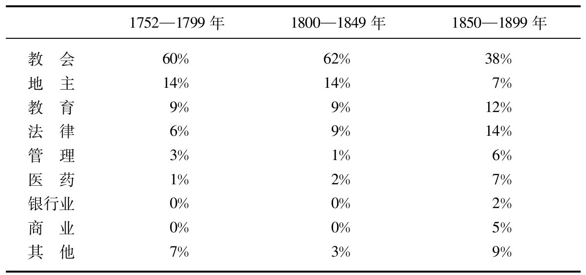

另一个有趣的现象是贵族实际上几乎不亲自教养孩子。婴儿被交给奶妈照顾，年幼的孩子由家庭教师负责，而男孩一旦到十或十一岁，就被送去寄宿学校。[7]标准流程是父母每天与孩子相处一个小时，而见面前孩子由保姆精心打扮和准备。由于贵族有钱，这样花也不值得惊讶。雇人来照看孩子对上层阶级的父母来说是完全负担得起的。因为不是所有的孩子都讨人喜欢，把烦躁外包给别人，而只享受偶尔与孩子相处的乐趣是十分明智的选择。

事实上，即便在今天，我们仍能观察到富人经常依赖保姆的服务，而且寄宿学校的服务对象仍然主要是富人。然而，在现今以人力资本驱动的社会，有一个因素会影响他们雇人照顾孩子，即这些父母会担心相较他们亲自教养，雇来的帮手没有足够的能力使孩子掌握成功所需的技能。工业化前，上层阶级没有这样的忧虑，是因为他们的财富建立在土地上，其他人也可以很轻松地教授与土地相关的必要技能。

总而言之，我们看到顶层和底层社会阶级的父母都具有同样的动机，即让孩子尽可能具备未来成功的能力。当时的社会和经济环境恰好在孩子应该学的内容上给出了相反的策略——工人阶级是勤奋和克己，而贵族则是优雅从容的品位。

中产阶级价值观在工业化前的根源

在工业化前的社会，第三个重要的群体是由工匠、手工业者和商人组成的中产阶级。与工人阶级一样，这一阶级依赖劳动，所以他们推崇勤勉工作的价值。此外，这一阶级的一个关键特征是教育的重要性和专业技能的获取。当然，教育采取的形式与我们今天所熟悉的不同。这个群体实际上不存在正规教育，虽然有些人学习阅读和写作，但是他们的职业不依赖那些技能。相反，他们工作所涉及领域的实用技能才是中产阶级成功的关键。习得这些技能的主要途径是通过与有经验的年长者一起工作，这些人经常被称为“师傅”。在很多行业中，这种学习是通过正式的学徒制进行的，这也是工匠和手工业者的传统。对于其他职业来说，比如各种类型的商人，技能的学习过程相对没有那么正规，但在工作中向熟练的从业者学习仍是成功的重要因素。

虽然他们与我们现在受教育阶级的人力资本的本质不同，但成功所需要的价值观是类似的。首先最重要的，获得顶尖人力资本的道路是漫长的，需要长远的眼光和足够的耐心。在现代，教育最密集的职业要求将近30年的人力资本积累和训练。例如，美国的医生通常要花12年时间在学校学习，4年普通本科教育，4年医学院教育，然后是住院医师培训（residency）和专科医师培训（fellowships），那要再花5—8年甚至更久的时间。如果一个人追求即时满足，想要尽可能快地赚钱，那么他不可能选择这样一条道路并且取得成功，这也是为什么父母如果想要孩子在诸如医学这样的领域成功的话，会很早就开始强调耐心和长远考虑的重要性。[8][9]

现在考虑在前工业化社会一个未来的手工业师傅所经历的训练。他会与他的家庭、父母和兄弟姐妹一起度过幼年时期。如果他的父亲也是一名手工业者的话，他很有可能帮助父亲做很多事，而且通过实践学习一些技能。正式教育的第一阶段由学徒制构成。在英国，学徒制通常持续七年，很多男孩在13岁左右开始做学徒。学徒的生活并不容易。学徒没有工资；相反地，在很多情况下，还要支付学费给师傅。学徒经常睡在厨房的长椅上，而且要工作很长时间。很多学徒未能完成他们的学徒期；在这种情况下完成培训需要相当多的执着投入。

一旦学徒期满，年轻的手工业者就可以开始为其他师傅工作，但离自己成为师傅还很远。成为一个师傅要求更多的训练和经验，在很多领域，这包括一段时间的熟练工（journeymanship）经历，也就是到不同的小镇为不同的师傅工作并学习各种技能。成为师傅不仅有技术的要求，也需要有相当多的储蓄。一个年轻的师傅需要拥有资源来购买职业所需的所有工具和设备，而在工会有影响力的地方，还会有其他要求，比如需要宴请工会的老师傅。因此，如果一个手工业者想要成功，他不得不省下微薄的收入，一切都是为了最终可以加入师傅的行列。

从学徒开始的人中只有很小一部分才能成功走到师傅的位置。如果他们确实成功了，那么，他们会在三十多岁时（与今天医生或科学家参加工作的年龄相近）作为师傅被承认。到那时，他们的生活水平就当时的标准来说是不错的。年轻的师傅很可能结婚并建立起一个家庭，开始积累财富，甚至可能加入市政府或者当地行会的管理层。

显然地，在成为未来的师傅所必备的特征中，耐心是非常重要的一点。当时的父母所面对的经济激励也由此表明中产阶级也是耐心阶级：只有教导孩子拥有足够长远眼光的父母才可能令孩子取得成功。从这个角度来看，工业化前的中产阶级与现代的中上阶级相类似，对他们来说，教育至上，并且想要在需要研究生教育的行业，比如法律、商业、医药或者学术界中有所成就，长远眼光是必备的。

工人阶级和上层阶级没有对耐心的要求。对工人阶级来说，因为收入主要基于体力劳动，技能的积累发挥相对较小的作用。对体力劳动的依赖意味着工资与力量和耐力相关，因此工资在年轻时达到顶峰。图8.1展示了19世纪早期英国不同年龄的农业工人的平均工资。[10]在青少年时期，工资一年年快速上涨，是因为体力增加和基础经验积累。然而，工人在20岁出头时就已经拿到接近顶点的工资，之后工资几乎不变，直到60岁后体力开始衰退。

图8.1表明体力劳动者在20岁之后几乎没有指望获得更高收入了。专业技能和前瞻性投资都对他们的经济生活没有用处。所以拥有长远的眼光对这个阶级来说不是特别重要。

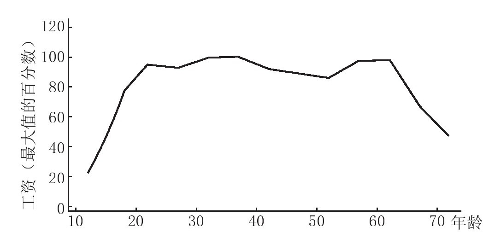

图8.1　19世纪早期英国农业工人一生的收入概况

在上层阶级中，虽然至少拥有一点耐心和远见是可取的，但这不是成功人生中必不可少的。因为收入来自土地，而且大多数贵族不工作，所以生产性技能的积累对这个阶级来说没有什么重要作用。相反，贵族价值体系强调守成和传承的价值。对一个上层阶级的男性来说，人生成功的标志是把继承的地产没有损失地传给自己的长子，可能的话再增加一些。事实上，通过限制销售财产以及确保整个地产继承给唯一的继承人，“继承”的法律概念如此设计是为了鼓励维持财产。虽然维持的观点意味着至少有一点耐心，但两者存在巨大差异——贵族希望孩子延续家族历来的稳固地位，但中产阶级的价值观精髓是希望子女过得比自己更好。

总而言之，经济激励可以预测出工人阶级会重视职业道德，而上层阶级会培养孩子更好地享受休闲。两者都没有强烈的激励给孩子灌输耐心和未来导向的价值观。然而，对于工匠和商人等技术型中产阶级来说却是如此，他们有动力培养孩子重视职业道德，同时教导他们具有耐心和理解延迟满足的好处。

这种基本的分类与当代对不同社会阶级的描述非常类似，不仅在文学作品中，在学术作品中也是如此，比如韦伯的《新教伦理与资本主义精神》。[11]在他的书中，韦伯把宗教看作不同阶级价值观差异的推动力量。虽然把宗教视为原因之一在后来的研究中只得到了有限的支持，但我们把宗教看作不同社会阶级价值观和态度受约束的机制之一。无论是什么机制，韦伯所描述的中产阶级价值观与我们经济激励分析所预测的高度一致。

教养价值观对阶级社会的影响

不同阶级的教养价值观由经济激励推动，也对工业化发生后不同社会阶级的命运有重要影响。工业化意味着实物资本的积累而非土地，成为了财富积累的关键因素。然而，积累资本要求人们延迟满足，所以只有足够耐心的人或家庭才有可能做到。联系我们关于社会阶级的分析，这意味着耐心的中产阶级会从新机会中得到更多好处，超过当时的上层阶级。

当然，事实确实如此。大多数实业家都有中产阶级渊源。经济史学家弗朗索瓦·克鲁泽（Francois Crouzet）调查了工业革命第一个百年（1750—1850年）主要工业企业创始人的社会出身。克鲁泽发现上层阶级和下层（工人）阶级都没有在创始人中占据重要比例。相反地，整整85%的创始人来自中产阶级，包括中产阶级的下层，比如“店主、自营手工业者和工匠、各种农民”。[12]贵族和士绅组成的上层阶级只占了2.3%的比例。当然，上层阶级在创业者中占了小部分，但即使相对于人口占比，中产阶级的比例也过高，而上层阶级过低。[13]

瓦特是工业创始人典型出身的一个好例子，他是蒸汽机的发明者和生产者，而蒸汽机推动了工业革命。他的父亲是一名“手工业者和商人——造船人、木工、建房人、船用杂货商，以及最终成为商人”。[14]瓦特离开学校后，开始在父亲的作坊工作，当他在伦敦为成为一名仪器制造师接受培训时，他生活得相当贫困。在制造蒸汽机之前，他在格拉斯哥担任仪器制造师。[15]

谈到开始创业时的财富可能会成为未来成功的障碍时，19世纪美国钢铁业的领导者安德鲁·卡内基可能是这个观点最有名的拥护者。卡内基在苏格兰长大，生活贫困，他是一个织布工的儿子。为了逃离苏格兰低迷的经济状况，他的家庭移民到美国。他十三岁时开始在一家棉加工厂工作，最终一步步成为了当时最富有的人之一。[16]卡内基把他的成功部分归功于从小就不得不工作：“我的父母本身很贫穷，作为他们最年长的儿子，我幸运地不得不在很小的时候就开始做一些有用的工作来谋生，因此当我还是小男孩时，我的责任就是帮助父母，像他们一样，尽早成为赚钱养家的人。”[17]之后，卡内基直言支持父母不应该把财富留给子女，而应该效仿他，把财富捐给慈善事业。他的观点就包括继承的财富对孩子没有任何好处。在《财富的福音》（The Gospel of Wealth）一书中，卡内基写道：“父母留给儿子巨大的财富通常埋葬了他的天赋和能量，诱惑他过一种更无用和没有价值的生活，否则他可以过得更有意义，这似乎能被不可辩驳地证明。”[18]卡内基的观点与上层阶级在工业革命中作用很小的现象相一致。

贵族精英蔑视劳动的教养方式有深远的经济和社会影响。上层阶级游离在工业部门之外，不仅在创立企业这种直接方式上参与有限，甚至在间接的参与方式，比如融资投资上也很有限。由于上层阶级高度推崇休闲，认为工作赚钱有碍尊严，领主和伯爵不想在早期工业企业中“弄脏自己的手”也就不奇怪了。但是他们仍然可以以出资者的身份参与，基于当时财富大量集中在上层阶级手中，他们本可以完美胜任这个角色。然而，上层阶级选择了当旁观者。所以早期的实业家主要是自筹资金，以至于到了股权投资开始被使用的后期，来自城市的中产阶级商人也比上层阶级的参与热情更高。

上层阶级对工业投资缺少兴趣与家庭教养有关，贵族不仅教导孩子享受休闲，而且缺少对耐心和节俭的重视。一旦金融工具发展起来，贵族可以利用地产价值借款，上层阶级耐心的缺乏会演变为逐渐加重的资金负担。他们可以方便地借钱来承担支出，比如其他家庭成员的津贴和地产的建设，而不用改变自己的奢侈生活方式。结果就是19世纪期间，旧贵族没有从工业投资中变得更富有，而是负债越来越多，这正是我们可以预期到的一个阶级缺乏耐心的后果。

只要地产产生足够的收入，债务负担就还可以支撑，但越来越高的债务水平让上层阶级面临经济冲击。对大多数家庭来说，债务的积累与农产品价格（地产收入的基础）下降相联系，最终导致经济状况变差，需要变卖大量地产。

耐心和勤奋在贵族教养价值观的排序中并不靠前，而合适的婚姻选择却是最重要的价值观之一。在英国电视剧《唐顿庄园》中，伯爵格兰瑟姆（Grantham）为了防止克劳利（Crawley）家族衰落，娶了美国的富有女继承人科拉（Cora），她的财富救了这个庄园。虽然这是虚构的，但这种做法在当时是一个相当常见的逃避债务的现实选择。从19世纪70年代到20世纪20年代，上百个被称为“美元公主”的美国人，嫁到了英国贵族家庭。[19]真实的一个例子是丘吉尔的母亲珍妮特（Jeanette），她是纽约一位金融家的女儿。[20]然而，美国资金提供的喘息通常只是暂时的。贵族再也没能重新获得以前的社会地位。我们认为根植于经济激励的阶级偏好在贵族没落中起到关键作用。

当贵族家庭逐渐丧失财富时，工业奠基者的时代拉开序幕，他们往往白手起家，在19世纪期间变得越来越富有。到20世纪初，曾经出身卑微的工业者构成英国富裕精英阶级的最主要部分。

通过财产记录，也就是富人过世时留下的资产，我们可以得到一个对英国富裕阶级相对准确的印象。在19世纪的前50年，真正富有的人仍然几乎都来自上层阶级。经济史学家威廉·鲁宾斯坦（William Rubinstein）研究了过世时拥有超过一百万英镑财富的人，这在当时是一笔相当可观的财富（相当于今天的十亿美元左右）。[21]在1809—1858年间，由富有地主组成的上层阶级仍然占据富裕阶层的95%。在19世纪期间，最富有的实业家的财富首次接近并且超过了大多数贵族。在1900—1939年期间，地主只占有7%的规模最大的地产。而大多数巨额财富来自大型工业企业的拥有者，另一小部分来自富裕的商人和投资人。

我们在向一个新的阶级社会前进吗？

随着工业化和现代经济增长推动社会转型，社会阶级概念的意义和重要性发生了显著改变。在前工业化社会中，社会阶级是个体的主要特征，比职业或国籍更重要。社会阶级的重要性一部分来源于当时的壁垒降低了社会阶级之间的流动性这一事实。阶级社会中教养方式的经济学分析突出了第二个因素，也就是在社会流动壁垒很高的社会中，我们也应该观察到社会不同阶级有截然不同的态度和价值观。换句话说，阶级不仅仅是一个随便的标签或社会地位的标志，还与人们价值体系的显著差异相关。

即使在今天，社会阶级之间的差异也能被辨认出来，但本质上比前工业化社会轻微得多。中产阶级包括耐心、崇尚教育和社会阶层提升的价值观被大多数人所采纳，包括社会的上层阶级，而单纯的有闲阶级很大程度上消失了。

我们不太确定的是社会阶级差异消失的趋势是否会在未来持续。关于教养方式的经济学分析提出社会流动性是阶级差异的关键因素。如果社会流动性高，那么来自不同背景的父母会对孩子有类似的期许和愿望，从而有类似的教养决策。相反，如果来自社会底层的父母看不到孩子升到上层的希望，那么他们不会认为让孩子具备那些在他们不大可能成功的领域的技能有什么意义。

我们在第4章已经讨论过不同社会阶级家庭生活分化的趋势，比如低收入家庭不婚和单亲育儿比例的上升，以及时间投入更多、更密集的教养趋势，特别是在高收入和高教育水平的家庭中。如果这些趋势造成与前工业化时期一样不同社会阶级间的孤立，那么我们可能进入社会阶级差异鲜明的一个新阶段。这些差异不仅与教养投入的密集程度有关，也与不同社会阶级采用的整个价值体系相关。

这种社会阶级的价值观和态度的新分歧是一个让人担心的趋势，对以机会公平、社会流动和广泛的政治参与为基石的民主社会提出了全新的挑战。然而，面对这样的挑战，民主国家并不是束手无策。正如我们在本章中所讨论的，社会阶级差异反映了经济环境并对其作出反馈，但同时经济力量不是社会组成的唯一决定因素：政治力量也发挥了重要作用。

在前工业化时期，政治决策通常由贵族精英控制，政策（包括税收、担任公职、教育权利和政治代议）的制定很大程度上出于保护现有社会秩序的目标。与我们现在的时代一样，涉及教育系统、税收和转移支付、社会保险和职业选择的政策也会影响社会流动性和不同社会阶层家长面临的激励。当经济力量加剧了不公平和低流动性时，民主社会可以通过促进机会公平的政策选择来做出反抗。

---

# 第三篇　政策如何影响教养方式

## 第9章　学校系统的组织

在像纽约和洛杉矶这样的地区，很多父母几乎从孩子出生开始就为他们的表现而焦虑，因为上一个顶尖的幼儿园（这是一个竞争激烈的过程，父母和孩子都要被面试）意味着之后上一个顶尖小学的概率更高。这进而打开了顶尖中学的大门，并最终打开名牌大学的大门。

本书一直在强调，父母的教养决策不仅受经济作用的影响，比如社会的不公平程度和技术水平，还受他们所生活的社会中制度和公共政策的影响。对育儿来说，学校系统至关重要。在这一章中，我们描述学校系统在不同国家的组织方式的差异，并分析其如何影响到父母的教养决策。

学校会从方方面面影响孩子。首先，通过所传授的知识和所传递的价值观，教育者对孩子有直接的影响。公共教育的组织就是由于国家想灌输给孩子一套共同的价值观和信念推动的。公立学校不仅是传授知识的工具，它的建立也带有各种目标，包括增强社会凝聚力、加强国家稳定，以及很重要的是，普及公民对兵役的接受度。其次，孩子在学校与同龄人交往，这些互动也帮助孩子形成他们的偏好和价值观。同群效应有时候是对学校和家庭教育的强化和补充，有时候则会抵消。最后，学校系统的组织形式影响父母的行为。父母会针对学校系统提供的激励而调整教养方式，也会调整生育决策。

学校和家庭之间的协调程度也各有不同。法布里奇奥回忆当他们居住在瑞典时，他尽力教导学龄前的诺拉阅读和写作。在意大利，老师赞同这种做法，把它看作教养良好和负责的标志。在瑞典，法布里奇奥却得到了不同的反应。出乎他的意料，诺拉托儿所（优秀的）教育者不赞成他的做法。他们认为应该寓教于乐，过早的正式教育是拔苗助长。这种文化碰撞使小诺拉在家里和学校里感到左右为难和无所适从。[1]

学校系统的组织方式也影响到课外活动的激励。当我们还是孩子的时候，除了踢足球外，很少有课外的正规活动。如今，从小学开始，孩子们有完整的课外活动安排是司空见惯的。但是，父母给孩子安排这些活动的动机在不同国家却是有区别的。在欧洲大陆，大多数父母把课外活动看作孩子的娱乐方式，同时也有助于孩子的个人发展。相反，在美国和英国，很多父母把课外活动看作孩子简历中不可或缺的部分，这在之后会帮助孩子进入顶尖大学。

教育系统组织方式所带来的激励可以解释这些不同的看法。在北欧，学校之间几乎没有质量差异，很少有按能力分班的情况，学生接受高质量的高等教育的机会很多。大多数孩子上当地的公立学校，只要能从中学毕业的话，进入公立大学并没有难度。所以当家长送孩子去参加各种活动时，他们只是想要孩子开心，或者至多不过是要提高孩子的独立性和成熟度。课外活动是“好学校”敲门砖的想法对他们来说是匪夷所思的。

在德国，与北欧一样，大多数家庭依赖公立学校，但是在有些州，学生在四年级或六年级之后会分校，或是去更易考大学的学校（学术型高中），或是以后进行职业训练的学校（实科中学或职业预校）。从“有野心”的父母角度来看，让孩子进入学术型高中是一个重要的目标，但课外活动在录取流程中不发挥作用。但凭借任何学术型高中或其他大学认可的学校的毕业证书，学生都可以免费进入大多数公立大学，而且这些大学的质量相对统一。

在美国，父母面临截然不同的处境。高等教育存在巨大差异，只有极少数的名牌大学提供有限的入学机会。所以这些学校的录取竞争变得越来激烈。对于2021届学生来说，常春藤盟校（比如哈佛和耶鲁，还有顶尖的STEM方向的学校，像麻省理工和斯坦福）的录取率低于7%。因为只有最好的学生才被建议去申请这些名校，所以录取的比率低估了竞争强度。进入这些大学不仅要求学生有近乎完美的中学成绩和大学入学考试（比如SAT）成绩，也要求有一系列课外活动的经历，以让候选人脱颖而出。

这些事实就已经表明，美国父母有强烈的动机逼迫孩子在青少年时期努力学习。[2]事实上，竞争压力确实反映到早期教育上。高中的质量也有巨大差异，最好的高中使孩子进入顶尖大学的概率高得多。进入顶尖学校的目标引发“竞争性教养”，甚至从幼儿阶段就开始。在像纽约和洛杉矶这样的地区，很多父母几乎从孩子出生开始就为他们的表现而焦虑，因为上一个顶尖的幼儿园（这是一个竞争激烈的过程，父母和孩子都要被面试）意味着之后上一个顶尖小学的概率更高。这进而打开了顶尖高中的大门，并最终打开名牌大学的大门。

在其他国家，由于大学入学考试利益攸关，父母们会格外重视并全力以赴。在中国、法国、韩国和土耳其，高中结束前的大型考试是学生进入名牌大学的关键决定因素。进入一所名牌大学是进而在商业、政府或学术领域谋得一份成功职业的门票。由于这些好处，很多父母督促孩子每天努力学习，经常还会请校外的家教。利益攸关的考试有助于解释，为什么一些不平等程度较低的国家（比如法国或韩国）却表现出密集型教养的特征。

最后，在有些国家，比如意大利，最好的学校是公立的，高中不存在正式的进入门槛。但是，高中是有差异且专业化的。有些学校（文法学校，Licei）重视学术知识，而有些学校有更职业化的特点（技术学校，Istituti Tecnici）。虽然文法学校和技术学校的学生都可以上大学，但文法学校提供更好的学术基础。此外，虽然不同高中的录取是不受限制的（而且免学费），但留级和不及格是常见的，以至于很多学生最后学得很吃力，被迫辍学离开最初录取他们的学校（经常转去要求更低的学校）。因此，尽管没有正式的门槛，学业成功某种程度上取决于学生的努力和自律。总而言之，意大利的学校系统为家庭和学生提供了一些努力学习和获得成功的激励，但不存在为了好学校或高分的激烈竞争。[3]

历史上的教育实践

教育实践和教学方式随时间发生巨大变化。在过去，专断型方式不仅在家庭盛行，在学校也很普遍。体罚很常见，家长通常也认同体罚。有趣的是，在反对体罚方面，学校是先于家庭的。按理说，人们会觉得心疼打孩子应该只限于家长，而非无亲无故的教育者，因为他们可能会滥用体罚。

在不同的国家，学校体罚的历史也有所不同。波兰早在1783年就宣告学校体罚不合法，但是由于在1795年整个国家从欧洲地图上消失了，这个禁令最终的存在时间很短。在20世纪的前五十年，大多数欧洲大陆国家都宣告学校体罚不合法，而在德国，全国范围的禁令在1983年才通过。

在英语国家，学校体罚则更有弹性。“代理父母地位说”（in loco parentis）认为，教育机构拥有与父母一样的权力来管教孩子。1987年英国议会才宣告学校体罚不合法，比爱尔兰晚了五年。英国的禁令一开始只适用于公立学校，所以有些私立学校仍然会用藤条鞭打学生，直到1998年，英国通过了全国禁令。在美国，最高法院于1977年宣告学校体罚不侵犯宪法赋予的权力。到目前为止，体罚在19个州还是合法的。2003年青少年医学学会（Society for Adolescent Medicine）发表的研究估计每年美国学校发生200万—300万起体罚，其中1万—2万起体罚中，学生随后请求医疗援助。[4]

学校体罚在澳大利亚、埃及、印度（只在有些州）、马来西亚、墨西哥、尼日利亚和新加坡也是合法的。[5]在中国，体罚从1986年起被官方禁止；但事实上，在很多学校，体罚仍是被豁免的，尤其在农村地区。[6]即使体罚没有被正式惩罚，无论在家还是学校，中国孩子也仍然被“打骂教育”的传统所约束。日本和韩国的情况与中国类似：体罚虽是不合法的，但却是被社会所容忍的。[7]在2012年，东义大学调查了481个韩国学生，95%的回答者承认他们在学校经历过体罚，包括被掌掴、打脸，甚至被拳头打过。[8]而如今在很多欧洲国家，来自老师的任何形式的身体接触都是一件严肃的事情，可能会导致司法起诉和解雇。

学校体罚的存在与否会影响父母的行为。如果质疑老师的权威可能会导致孩子被打或被羞辱，爱护孩子的父母就不会鼓励孩子这样做。相反，如果体罚在学校不被认同的话，那么父母也不太可能在家打孩子。法布里奇奥回忆起他的一个同学的例子，同学的母亲坚持认为老师完全有资格掌掴表现不好的儿子。学校不仅无视了这个请求，而且强迫母亲在家也不能采用如此激烈的方式，虽然当时在意大利打自己的孩子是合法的。另一例子是，法布里奇奥的父亲曾惊恐地描述某个老师曾体罚在学校说当地方言的一个孩子，那是很多农村家庭说的唯一语言。在当时，在学校被打的孩子肯定不会向父母寻求安慰：抱怨被老师批评可能会在家中引发又一次惩罚。

体罚的历史只是学校专断型教养方式逐渐消亡的一个例子。教学方法随时间发生明显变化，尤其在20世纪的后五十年。直到20世纪50年代，除极少数特例外，工业国家的学校主要是“垂直化”专断型教学模式。小学课堂中学生是不能说话的。学生要认真听讲，而教学成功与否用小学生能否死记硬背老师说过的话来衡量。后来在20世纪60年代，教学方法开始改革，强调合作、自由讨论和孩子的感受，这逐渐成为教学任务的核心。在1972年，英国的一项研究调查小学老师如何在学生毕业时衡量教学策略的成功。[9]出现频率最高的三个答案是孩子幸福、开心和心智健全；他们享受学校活动，对自己的成就感到满足；每个人被鼓励按照自己的方式发展。

自由的（或放任的）教育方法的流行有两个关键因素。一是弗洛伊德抑制（repressiveness）思想的影响越来越大，即“强加给孩子的严格自律或过度拘束的想法非但无助于健康的情感发展，还有可能适得其反。”[10]另一个因素是当时的经济状况，我们认为这一点更重要。失业率和不平等水平达到历史低点，家长对社会充满安全感，相信当孩子离开学校时，他们能很容易找到好的工作。

学校的教育方法与家庭的教养实践是互补的。如果孩子在反专断的学校环境中长大，那么他们更可能抵抗家中的专断型方式。而当教学成功取决于孩子独立推论和思辨能力时，家长会受到鼓舞在家中培养孩子独立思考。这两者间的因果关系是双向的。放任型父母会拒绝学校采用专断型方式，施加压力迫使制度改变。

教育方法的最新趋势紧跟教养方式的演变。在20世纪六七十年代的英国，放任趋势和撒切尔主义（Thatcherism）出现后，同一个词“放任”（permissive）拥有了负面的内涵，经常与孩子表现不佳相联系。宽容的学校教育越来越被指责没能使新一代准备好应对劳动力市场上新的挑战。教育政策的修正主义浪潮引发改革重点的再次转变，这次转向学科专业化和严格的学术成果。[11]教学评估变得流行起来，也越来越看重考试和跨校的学习成绩竞争。

以上是大多数发达经济体共同的趋势，但国家之间在教育制度方面还是存在很多重要区别。为了刻画特定的制度如何影响家长的行为，我们聚焦一些国家，它们在教育系统的设计上呈现截然不同的情况。我们认为理解制度的作用尤其重要，是因为这些制度至少在原则上是根据社会需求变化的。在本书中，我们把密集型教养方式的普及与趋于更高不平等水平的全球经济力量的驱动联系在一起。接下来的例子将说明，特定的制度选择是如何强化或弱化了这些趋势的。

中国：竞争与高风险考试

如果有一个国家的学校系统围绕评估和利益攸关的考试而变化，这个国家就是中国。竞争性考试的传统可以回溯到隋朝（581—618年）建立的国家考试制度（科举制）。在明朝（1368—1644年），科举成为筛选国家官员的标准流程。[12]考试极具挑战性，但回报也很高，毕竟在官僚阶层立足能保证一个人的飞黄腾达：传统儒家文化认为文官是最显要的职业。在1905年清朝末期，科举制度被废除。然而，1952年新中国政府重新设立了竞争性入学考试。这个体系在1966年再次被废除，当时“文化大革命”旨在打破学校表现与职业之间的联系，消除来自不同背景的学生之间的差距。[13]全国范围的大学入学考试（高考）最终在1977年得以恢复。由于高考多年中断，十三岁到三十七岁的人都可以参加考试。[14]

如今，整个中国的教育系统围绕考试而展开。孩子在教室的时间被模拟考占据，这些模拟考的目的是使他们为真正的考试做好准备。孩子很小的时候就要为了分数而竞争。在幼儿园，老师让孩子学英语和乘法表。富裕的家庭为了让孩子赢在起跑线上，把他们送去名牌幼儿园。香港的教育系统虽然与内地有所不同，但是组织形式中有相似的竞争原则。法布里奇奥的一个朋友居住在香港，他讲述了整个家庭为两岁的女儿准备名牌幼儿园入学面试的紧张经历。女儿最终被录取了，他们也如释重负。

在九年义务教育结束后，中国学生如果想要继续接受正式的教育，就必须参加中考。根据考试结果，学生被分配到普通高中或职业高中。为了获得高中毕业证书，学生必须满足一定的学分要求，并且通过高中会考或者称为学业水平测试。

虽然会考对大多数学生来说只是一种形式，但这只是决定成败之举大事的序曲：全国大学入学考试，或高考，这才是进入大学的先决条件。[15]在2017年，940万学生参加了高考。在大多数省份，高考安排在六月初的两天内，在那两天中整个中国都屏息以待。在考试的第一天，大多数报纸都会在首页报道这个盛事。考试场地附近的建设工地停止施工，交通也被管制，以避免打扰学生。在地铁站，高考学生可以插队。救护车在考试场地外准备就绪。各种严格的措施被用来防止作弊：如果被当场抓住，学生可能面临七年的监禁。[16]考试的监控非常密集：无人监视机和金属探测器被用于检测非法设备，学生需要按手印来验明正身。

高考利益攸关。高考不仅决定学生能否继续学习，也决定他们能上哪些大学。事实上，高考排名最靠前的学生可以自由选择大学。在中国，大学的质量有很大差异，从顶尖大学毕业的好处是难以估量的。高分打开名牌大学的大门，例如北京的北京大学和清华大学，上海的复旦大学和上海交通大学，杭州的浙江大学。高考分数对于进入香港最好的大学也是至关重要的。这些学术机构在国际上排名很高，有着全球化的教学和科研氛围，经常会有国际访问学者（法布里奇奥是清华大学的定期访问学者）。顶尖大学的学生会成为未来的精英，包括高级政府官员、大公司和银行的高管。排名较低的大学根本无法与之相提并论。大约四分之一的高考生将面临考试失败，不能进入任何一所大学。这场考试的成功是生活之福；失败则是永久之咒。因此，毫无疑问，关爱孩子的家长执着于让孩子努力学习来获得成功。在高考中取得高分值得牺牲其他方面的优良素质，比如想象力和独立性。

学生在学校学习的课程也能说明问题。高考只考少数核心课程，而且课程范围有进一步缩小的趋势。所有学生都要考语文、数学和一门外语（通常是英语）。此外，学生还面临分科问题，他们得决定修学哪些科目，是文科还是理科。[17]美术、音乐和体育不在高考范围内，因而在高中课程中越来越不重要。家长几乎没有动力培养孩子的艺术技能和创造力。成为“死亡诗社（Dead Poets Society）”的一员对孩子来说是成本高昂的消遣。

中国的教育系统给父母、老师和学生施加了巨大的心理压力。它的有效性颇具争议。一方面，很多中国父母质疑太多压力是否有效。另一方面，强烈的激励确实使中国学生表现非凡。中国内地学生的数学考试成绩尤其令人印象深刻。参加PISA的中国（来自北京、上海、江苏和广东四省市）学生中，超过四分之一在2015年PISA数学科目上表现优异。根据PISA专家分析，这些学生能够处理高难度任务——要求具有对复杂情境进行数学建模和运用抽象符号的能力。在这一点上，西方国家无一能望其项背。其他表现优异的参与者来自中国香港、中国澳门、新加坡和中国台湾，所有这些国家和地区都以华人为主，学校系统也与中国内地有相似性。[18]

现行系统的拥护者认为高考促进学生勤奋学习和熟练掌握知识，为学生提供了公平的竞争机会。原则上，来自任何社会经济背景的学生都能通过高考获得进入名牌大学的机会，无论他们上哪所高中，无论他们是农村还是城市居民，无论他们的父母是富有还是贫穷，他们都拥有这样的机会。然而，高考提供机会公平的竞争环境也是被夸大的说法。以城市和农村地区为例。平均一半的中国学生能上普通和职业高中，而在像上海这样的富饶城市，这个比例高达97%。城市学校提供的课程质量明显比农村学校高。全国平均班级人数为50人，而农村学校的平均班级规模是城市的两倍。家庭也起到重要作用。城市中产阶层家庭经常花大量的钱把孩子送去补习班。教育水平高的家长能更密切地关注孩子的学习进步，并且更擅长辅导孩子的学习。因此，在不同社会经济群体中，高考成绩存在明显的差距。例如，考上清华大学的学生中只有10%来自农村。且差距正在逐渐扩大：在20世纪90年代，这个比例还是30%。[19]

在中国，若为了给孩子提供更好的教育就从农村搬到城市有一定的限制，这进一步放大了机会差距。中国特殊的居住制度（户口）限制了移民，户籍制度的历史可以追溯到1958年，当时政府实行严格的居住许可以控制城市与农村间的人口流动。如今，尽管人们可以从农村搬到城市居住，但大多数农村移民不能登记成为城市居民。作为非城镇居民的劳动者无法享受提供给城镇居民的社会服务，其中包括医疗保险和当地的公立学校等。名牌私立学校学费高昂，贫穷的农村移民难以负担，所以他们只能把孩子送去专门服务非城镇居民的子弟学校。这些学校比普通公立学校的教学质量更低，使得农村移民的孩子更难应付高考。

各地区大学录取分数的差异也放大了不公平程度。除了以高考成绩为依据外，大学会优先录取本地居民。因为最好的大学集中在上海和北京等一线城市，所以定居在这些城市的考生就更有优势。例如，2016年，河南考生家长的一封公开信中提到，2013年清华大学在河南地区招生名额仅85名，却有758 000名河南考生参加竞争。而同年在北京，考生人数为河南省考生人数的十分之一（73 000名），但他们却拥有近3倍于河南的录取名额（226名）。[20]

尽管存在这样的不公平现象，期望通过高考向社会上层流动仍然是中国家长的重要激励。高考成功取决于学习的努力程度。大门向具有天赋而家境贫寒的孩子敞开着，即使是富裕且高学历家长的孩子也不能确保进入顶尖大学。[21]

但是这样的系统存在很大的副作用。批评者认为教育系统扼杀了学生的创造力。他们认为高考的准备过程包含过度的机械学习，死记硬背已有知识牺牲了学生独立批判思维的发展。此外，他们认为沉闷的学习方法是孩子不愉快的童年和长期创伤的罪魁祸首。很多成年中国人提到自己会反复做关于高考的噩梦。在2015年的PISA中，中国学生的生活满意度自评得分在全世界垫底。压力和不满有时会引发悲剧。根据2014年的中国教育年度报告（Annual Report on China's Education），自杀的青少年中很大比例是被高压考试推到崩溃的边缘。[22]有报道记载，一部分考试失利的学生选择极端方式结束生命。[23]2013年，一项分析青少年自杀的研究得出如下结论：93%的自杀案例与准备考试的压力和焦虑相关。此外，63%的自杀发生在每年学生参加重大考试的时期。

又比如，2012年网络上有照片显示，有学生在教室边挂盐水边复习备考。[24]这个场景当然不是普遍现象，但是它获得的广泛媒体关注表明人们对这个话题非常有共鸣。

关于高考制度的争论引发了教育体系改革的压力。改革者要求减缓过度竞争，推行以学生为导向的制度。改革的另一个动力来自对独立性和创造性的考量，现行的体系没有足够重视这些价值，但是如果中国的经济模式从模仿和生产已有的技术转型为更多地依赖创新创造，那么这些价值对学生来说会变得越来越重要。[25]

有些改革已经在地方层面实行。从2001年起，上海不再采用全国统一大学入学考试，而是采用地区自主的高等教育入学考试。相较全国统一的标准考试，上海的考试包含关于各学科的考题，而不再强调学生死记硬背的能力，上海的教育系统由此向测试学生的天生智力转型。上海市还规定了家庭作业的上限，规定学生每天至少有一小时的体育活动时间。[26]然而，这些规定往往不是强制的。根据OECD的调查，上海的十五岁学生平均每周花13.8个小时做作业，除此之外很多学生还要上补习学校。[27]这些学校提供课后补习，从学校放学后一直持续到晚上。作为对比，北欧的学生每周只花3个小时做作业。即使如此，有些家长还抱怨作业负担过重，提倡让学生完全摆脱作业。英国和美国的高中生每周分别花5个和6个小时做作业。

中国的教育系统是高风险考试催生强有力激励的一个极端例子。中国孩子未来的成功取决于通过单次考试。学生必须高度努力、机械学习和集中注意力于几门核心科目，来为这一次考试做好准备。第3章中，我们已提到90%的中国家长认为勤奋是教养孩子的关键品质，而只有23%的家长强调想象力的重要性。之前我们提到社会不平等加剧可以解释中国家长的这种态度。在这里，我们看到教育系统加强了教养方式选择的回报差异，中国家长有更强的激励去采用密集型教养方式。

日本：高风险遇上独立性

日本再一次与中国形成有趣的对比。与中国不同的是，日本社会收入不平等程度较低。但相同的是，日本教育系统也具有考试风险高和学生压力大的特征。相应地，虽相比中国家长程度略有不同，但日本家长一样会敦促孩子在学校取得成功。

在日本，孩子很小就开始互相竞争。《日本时报》（Japan Times）一篇名为《从摇篮开始为大学做好准备》的文章描述了一贯制学校（escalator schools）的现象。[28]这些名牌学校具有鲜明特征，它们提供从幼儿园到大学的教育，而且学生不需要通过考试就能一级级往上读。这些学校的很多学生都能进入如东京大学、京都大学等顶尖大学。

一贯制学校的录取流程非常重视家庭背景。《日本时报》的文章描述一个五岁儿童准备考试的过程，这场考试将决定她是否能进入理想学校。“她已经完成了看图辨识水果，马上会听到一个关于熊猫的故事，之后她需要据此画一幅图画并为这个故事编一个结尾。她在这些活动中的表现会决定她去哪儿上大学，没有人比她的父母更紧张，而他们这时正在隔壁房间面试。”孩子在三岁时就开始为这场高风险考试做准备。录取的竞争非常激烈。在东京，大约8%的五岁孩子能上一贯制学校，但却有大量的申请者。筛选过程包括对家长和孩子的面试。孩子的排名取决于他们快速理解明确指令的能力，以及他们的敏锐度和反应速度。另外，家长的职业发展情况、待人处事方式和行为举止也在被考察之列。

此外，日本教育系统还面临很多其他障碍。高中入学考试决定高中的录取情况，而不同高中在教学质量和教学目标上都有差异。在高中毕业后，学生想办法进入大学学习。日本的公立大学录取分两个步骤。首先，学生必须通过全国大学入学中心考试，这个考试涵盖所有基础学科，包括文科和理科。然后，他们必须参加各个大学的考试。[29]顶尖大学的录取存在激烈的竞争，所以第二步是最大的挑战。有些学生花几年的时间不断尝试，以求被心仪的专业录取。这些学生有时被称为浪人，本义是称呼历史上没有领主或主人的武士。

由于大学入学考试的重要性，与中国学生一样，很多日本学生上补习学校来备考。这加重了本已不轻松的课业负担：日本学生一年有240天呆在学校，比美国学生多60天。补习学校和漫长的学校生活解释了为什么日本学生说自己每周只有3.8个小时用来完成常规的家庭作业。虽然太阳在日本升起得早，一天还是只有二十四个小时！

并非所有人都能上补习学校。补习学校所费不赀。富裕家庭的孩子如果没能考入好大学，可以选择读一整年的补习学校来准备第二次考试。而不富裕的家庭难以负担相关费用。

就像在中国，利益攸关的考试激励家长强调孩子要自律和勤奋。家长，尤其是母亲，在敦促孩子成功和灌输正确价值观中发挥重要作用。[30]但教养价值观在中国和日本有显著差异。世界价值观调查数据表明只有34%的日本家长重视勤奋，远低于中国的90%。我们认为两者区别的主要原因是日本社会比中国社会更均等。虽然高风险考试导致家长敦促孩子努力学习，但是家长也看到学校表现的回报相对较低，较低的回报会起到反向作用。这个观察与我们的主要论点一致——经济因素非常重要。

另一个有趣的现象是日本人高度重视独立性（这在中国也成立）。部分原因可能是独立性在东亚文化中有不同于西方国家的含义。日本家长不是通过让孩子做喜欢的事来培养他们的独立性，而是通过要求他们像成人一样完成日常事务。例如，孩子被要求打扫学校，自己去上学，照管好自己的独轮车（骑独轮车是日本小学生之间流行的一项娱乐活动）。午餐是一个重要的教育机会。孩子从餐厅取回食物，自己吃饭，而且在教室与老师同学们一起吃。吃完午餐后，他们被要求整理干净桌椅和教室。有时候有些食物还是学生自己种植和采摘的。重视独立性意味着孩子必须快速学会承担责任和依靠自己。谈到教养方式的话，这些例子表明，在日本，相对于放任型教养方式，独立性与权威型教养方式的联系更加紧密。

芬兰：低压力与学术成就

如果中国教育系统的核心是竞争和利益攸关，那么北欧国家（丹麦、芬兰、挪威和瑞典）的学校强调合作和宽松的教育方法。竞争性评估不发挥主要作用。北欧国家中，芬兰是广受认同的成功例子，也是其他国家改革的榜样。这主要是因为在没有高风险考试激励的情况下，芬兰学生依然能在各种版本的PISA学生表现研究中持续取得高分。

芬兰教育系统的特征是低竞争性和低压力。孩子相对较晚（在七岁时）才上小学。在达到入学年龄前，所有孩子都去上托儿所和幼儿园。入学率接近100%；无论是公立还是私立，这些服务（几乎）都是免费的。这些机构并不进行正式教学，它们的宗旨是寓教于乐。托儿所和幼儿园不教孩子学习阅读、写作或算术。名牌幼儿园通过面试来挑选孩子，这在芬兰家长听来匪夷所思。

大多数芬兰孩子上公立学校。目前，私立学校数量很少，它们不能收取学费，但会有国家补贴。学校不能挑选学生，大多数家长把孩子送去所在社区的学校。除了免费教学外，学生还享受免费的教学资料、免费的午餐、健康检查、牙医服务和上下学接送。教室的氛围也比较随意：学生不穿制服，直呼老师的名字。

学校没有官方的排名。虽然地区和学校在调整课程安排上享有一定的自主权，但所有学校有共同的全国性教学目标，老师也来自同一个受过大学培训的群体。因此，从教学内容和教学质量的角度，芬兰农村孩子接受的教育与住在大学城或城市的孩子非常类似。虽然学校的名声各异，但是区别很大程度上来源于学校校长的管理能力，而且学校间的这些区别从来就不大。大学层面也是如此。

在学习的大部分阶段，芬兰学生不会面对高风险的考试。老师确实会进行阶段性评估，但是评估体系是用于改进教学，给老师提供学生进步情况的反馈，而不是为了给学生排名或敦促他们更加努力学习。芬兰国家教育委员会在指导意见中推荐评估，认为它是有用的，可以帮助学生了解自己的真实发展情况。与这些指导方针一致的是，当小学老师评估学生时，评估结果并不是个人水平测试的形式展现的，学生得到的反馈结果只有“很好”到“需要努力”；数字评分根本不被采用。孩子和家长经常都不会知道结果，只有老师把它们用作反馈和目标规划。

芬兰学生的辍学率很低。[31]这既反映学校成功做到不把学生落下，也反映学校普遍认为应该帮助更差的学生，而不是激励更有天赋的学生努力学习。留级在德国和欧洲南部仍然很常见，但这在芬兰是非常罕见的，而且普遍被认为是过时的。

芬兰课程设置中有两场重要的考试。学生十六岁结束基础教育时参加第一场考试。这场考试得到高分的学生能够选择更有名气的高中，然而正如之前所提到的，中学之间的质量差异是有限的。在高中结束时，学生参加第二场考试，这通常被称为大学预科考试，考试成绩会被作为大学录取的参考。通过考试的学生可以在大学继续学习。这场考试的结果能衡量学生总体成熟程度，包括他们继续高等教育学习的准备情况。学生不仅要回答标准的学术问题，也要展示他们处理现实问题的能力，比如发表对失业或节食的看法，还要讨论政治、体育道德、性、毒品和流行音乐等话题。这与中国教育系统重视核心学科的做法完全不同。

芬兰教育者对他们的教育系统感到非常自豪。帕斯·萨尔伯格（Pasi Sahlberg）以前是一位学校老师，现在是政府顾问，他写的一本关于芬兰教育系统的书还获过奖，他认为没有标准化考试是芬兰教育系统的一个关键优势。[32]他认为让孩子准备全国性考试会分散老师的注意力，使他们不能关注于提高孩子的学习能力和理解力。他认为公布标准化考试的结果和追求学校排名导致了“有毒的竞争”，这会阻碍学生合作能力的发展。[33]然而某种程度上与萨尔伯格的观点相矛盾的是，芬兰学校在国际上受欢迎，要归功于芬兰学生在标准化PISA测试中的成功。

什么能解释芬兰的成功呢？萨尔伯格认为是因为没有竞争性考试。然而，芬兰教育系统另一个鲜明特征是非常重视教师的资格。芬兰国家教育局坚持对所有层次老师的高学历要求，所有老师都要有硕士学位。此外，即使是教育专业的大学毕业生想要当小学老师，也需要在其他学院上课，精通至少两个其他领域。虽然当老师要求严格而且工资基本与国际平均水平一致，但是教师仍然是最受芬兰大学生欢迎的职业选择之一。很多学生会申请教师专业，大学得以在每一届中选出最有资质的学生来培养。

芬兰如何做到拥有高质量老师而不必支付高额工资？我们可以用经济学家舍文·罗森（Sherwin Rosen）提出的“补偿性工资差异”（compensating wage differentials）观点来解释。[34]他的理论认为，劳动力市场的竞争使得有相同要求的职业给出的回报等同。学术工作就是一个例子。经济学教授通常赚得比在业界工作的经济学博士少。但我们仍愿意当大学教授，原因不是我们不在乎钱，而是我们认为做研究和没有老板使学术工作更加有趣。所以作为补偿，业界企业必须向经济学博士提供更高的工资。补偿性工资差异也可以解释地区溢价。例如，在海外采油的挪威工程师的薪酬显著高于在奥斯陆工作的工程师的薪酬。在海外采油的工程师无法在工作日结束后与家人或朋友在首都享受晚餐，他们要在遥远的海上平台度过日日夜夜，因此得到了更高的工资作为补偿。

尽管工资不吸引人，但高教育水平和高能力的芬兰人愿意选择成为教师，原因之一是教师在芬兰有很高的社会地位。高学历要求保证了只有最好的学生才能成为老师，使他们受人尊敬。只有10%到15%的老师放弃他们的职业，这可以反映教师的受欢迎程度。[35]芬兰教师的心理满意度很高，这是纳税人的福气，他们所缴纳的税款能有高价值回报。在教师职业不那么受欢迎的国家，政府需要支付高额工资来吸引同等质量和教育水平的人。芬兰能够创造有吸引力的工作条件，使老师对自己的职业感到满足，这可以很大程度上解释芬兰在教育上所取得的成功。

瑞典：几乎与芬兰一样，但又不尽相同

竞争性学校系统和高风险考试的反对者尤其喜欢芬兰的例子。他们认为芬兰成功的真正原因是低压方法，重视合作和孩子内在激励。但瑞典的情况则对这种解释构成挑战。瑞典的例子更支持另一种说法——学习需要对孩子施压和合适的激励。

瑞典的教育系统大体上与芬兰类似。它强调低竞争性、低压力和团队合作。瑞典的课程安排也与芬兰类似。所有孩子都上托儿所和幼儿园，而且大多数人上公立学校，这些学校强调寓教于乐。孩子从七岁开始上小学，这也与芬兰一样。私立学校同样也不能收费。

瑞典教育系统的调整方向是限制不公平。瑞典学生的辍学率很低。虽然最近几年，综合性义务学校经常将学生按能力分组，但是学校内部并不存在正式的分班系统。瑞典国家教育局强调分组只能是暂时性的，需要带有特定教学目标。孩子在六年级前不会收到成绩单。在那之后，学生开始收到各学科的学期成绩，并且在九年级期末收到最终成绩。这个最终成绩是学生申请高中的基础。

与芬兰一样，瑞典没有大型的高风险考试。九年级之后，学生会参加一场核心学科（英语、瑞典语和数学）的全国标准测试，以确保全国范围内学生的学习水平是接近的。几乎所有学生都接着上三年制的高中。而大学的录取则取决于高中成绩。

家庭作业负担很轻。根据2015年的PISA调查，瑞典学生每周只花3.8个小时做作业。即使如此，家长还经常抱怨作业过多。在2014年，哈尔斯塔哈马（Hallstahammar）市议会的左翼党成员提出议案，要求全面禁止家庭作业。[36]虽然这个提案最后未能通过，但它反映出很多家长的观点。

总体而言，芬兰和瑞典的学校系统有很多相似点。两者都强调机会公平，构造一个有利的环境，让孩子在不受竞争压力的约束下学习。然而，如果我们相信国际测试成绩的有效性，那么这两个国家的教育成果是有显著差别的。2000年到2012年间，在32个数据可得的国家中，瑞典学生成绩退化最严重。这样糟糕的结果使瑞典暂时处于OECD国家垫底的位置，直到2015年情况才发生明显反弹。数据反映了人们的看法。如果说我们的芬兰朋友普遍对他们的教育系统感到自豪，瑞典人对其教育系统则是更为挑剔与不满的。

一个可能的原因是，芬兰与瑞典的教育系统的实质区别要比人们想的更大。[37]区别之一在于瑞典的教师不像芬兰一样享有高社会地位。瑞典老师工作满意度较低。根据瑞典教师协会的一项调查，近90%的小学老师提到他们的工作负担太重，而且管理任务占据太多有价值的教学时间。[38]三分之一的瑞典老师提到他们“很有可能”或“肯定”不会一直在学校工作到退休。低社会地位与满意度也导致了教师聘任的困难。[39]

另一个区别是在20世纪90年代，瑞典开展了一场教育改革，但是结果不如人意。在这场改革中，家长分到代金券（voucher），可以用来支付公立或私立学校的学费。私立学校改革后仍然受到政府管控。像公立学校一样，它们不能选择自己的学生，也不能收取除代金券外的费用。在报名人数超员的情况下，学校可以选择学生，但应该遵循瑞典学校监察局批准的非歧视标准（然而实践中，常有例外）。

尽管存在这些限制，但这是一次重要的改变。在政府推行改革前，瑞典几乎没有私立学校。如今，瑞典有八百所“独立”学校，很多由营利公司运行。12%的义务制学生和24%的高中生上独立学校。这种想法尤其受中上阶级的家长欢迎，他们急切地想要把自己的孩子与上公立学校的“普通”孩子区分开来。有些家长把这视为对公立学校所谓的社会民主价值观的解放。

作为经济学家，我们可以理解改革思路——来自私立学校的竞争能够激励公立学校表现得更好。但是在瑞典，这并未发生。大量研究清晰地表明了代金券政策对学生的表现有消极影响。[40]

问题出在哪里呢？我们猜测主流教养文化与改革精神之间产生了冲突。瑞典家庭有根深蒂固的放任型原则，而这种原则源于经济的不平等程度很低，因此取得个人成功的经济激励很弱。基于这样的环境，市场机制推动独立学校迎合对玩乐的需求，而非激励其追求卓越的学术成就。一个相应的现象是公立学校和私立学校的竞争转化为所有学生成绩的虚高。

有些独立学校采用激进的完全放任方法。例如，希斯塔（Kista，位于斯德哥尔摩的郊区）的一所独立学校给学生提供个性化学习方法的机会，学校允许他们每周自己制定时间表，按其个人意愿决定修课数量。学生也可以制定和修改自己的学习目标。[41]在这里我们要声明的是，我们的本意并不是要评判这所特别的学校，也不是要对结果的好坏做定论。我们只是把它作为一个例子，用以说明我们的观点，即私立学校与公立学校之间的竞争似乎导致学校不再重视学习强度，而这显然不是改革初衷。

芬兰与瑞典的对比，说明了把一个国家成功的教育系统应用到另一个国家去要比想象的更复杂。即使两个国家有很多共同特征，而且采用大体上类似的教育系统，当地环境的微小区别也会导致结果的巨大差异。相比于让瑞典家长和孩子接受更多结果导向的价值观，把芬兰模式应用到中国或美国，难度可能还要大得多。

另一个教训是教养价值观与教育系统是互补的。相比于勤奋和顺从，北欧家长更重视想象力和独立性；这些国家的教育系统反映了同样的价值观。家长支持重视低竞争、低压力和同学合作导向的教育机构。然而，因果关系是双向的：学校系统的组织形式，以及较低的经济不平等程度，共同强化了家长的放任型教养取向。这并不是说瑞典和芬兰孩子长大后百无一用。北欧的工作时间比美国和中国短，但是芬兰人和瑞典人在创新能力上遥遥领先。这可能是宽松的教育系统所带来的意外之喜。

法国：垂直教学实践

高风险考试不是唯一与教养方式相关的教育系统因素。在最近的一项研究中，经济学家杨·阿尔刚（Yann Algan）、皮埃尔·卡赫克（Pierre Cahuc）和安德鲁·施莱弗（Andrei Shleifer）发现，在不同国家，教育孩子所用的方法显著不同。[42]有些国家主要采用“垂直”型教学实践，也就是等级系统，其中老师与学生的关系是教室互动的核心元素。老师讲课，而学生记笔记或看课本。对学生的评估标准是他们重现老师所讲内容的能力。在其他国家，学校更推崇“水平”型教学实践，学生之间的互动是师生关系的重要补充，师生等级关系更为弱化。在水平化的环境中，学生在群体中学习，一起做课题，老师鼓励学生提问甚至挑战自己。

通过考虑各种指标，这项研究表明水平教学实践在北欧国家、荷兰和瑞士最常见，在英国和美国也颇为主流。垂直教学实践则盛行于法国、日本、比利时、土耳其、俄罗斯和东欧。介于两者之间的则是意大利、德国、西班牙、澳大利亚和（某种程度上出乎我们意料的）芬兰。

阿尔刚、卡赫克和施莱弗证明教学实践影响人们成年后的信任程度和合作意愿。年轻时接受垂直教学实践的人更不信任别人、更不愿意合作，而学生时期经常参与小组合作和公开讨论的人，长大后则更具合作精神。

不同的教学实践也与我们教养方式的指标有关。图9.1横轴为阿尔刚和他的合作者提出的垂直教学指标，纵轴为采用三种教养方式的家长占比。[43]可以看到，在垂直教学实践更多的国家，家长倾向于采用权威型教养方式，采用放任型方式的比例更低。令人惊讶的是，教学实践与专断型教养方式占比不存在显著关系。这个结果很大程度上是由德国和日本这两个国家导致的，在这两国内，教学方法相当（德国）或非常（日本）垂直，但是家长并不认为服从是重要的品质。在其他国家中，垂直教学与专断型教养方式之间的相关性很高而且在统计意义上显著。

法国是一个特别有趣的例子。在第3章中，我们提到尽管法国不平等程度较低，但有很大比例的家长崇尚勤奋，而重视想象力和独立性的家长占比却很低。法国家长也比欧洲大陆的任何其他国家的家长更加强调服从，而且正如图9.1所显示，相比样本中任何其他国家的学校，法国学校更多地采用垂直教学实践。这表明教育系统影响了法国家长的育儿价值观。

法国教学方法被归类为高度垂直型，这与国家的传统观念一致。加拿大记者让贝诺·纳步（Jean-Benoit Nadeau）和朱莉·巴洛（Julie Barlow）写了一本关于法国文化的书，书中把法国学校描述为无情和专断的机构：“法国教育的一个突出特点是教师的权威。法国人不把童年看作无邪的年纪，而是把它视为无知的年纪。孩子的行为必须被规范，错误必须被纠正。”[44]虽然这样的描述可能夸大了事实，但是这与人们对法国学校的普遍印象一致：出于积极干预的理念——老师帮助孩子加强学习能力——法国学校强调老师向学生强制灌输正式的知识。

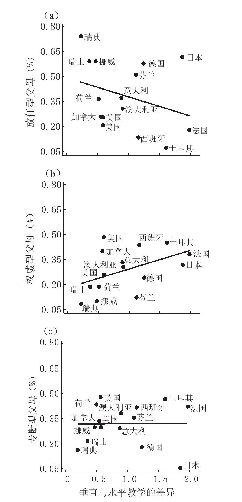

图9.1　OECD国家垂直教学（垂直与水平教学实践的差距）与采用三种不同教养方式的父母比例

法国有严格的评估系统，有些人认为这甚至到了严酷的地步。与北欧的学校不同，在法国学校，学习有困难的孩子经常留级。超过四分之一的法国学生至少留过一级，这是OECD汇报的国际平均水平的两倍以上。如果学校不帮助差生，而是选择放弃他们，那么这个系统就会激励家长采用另外的措施来避免失败。因此，法国家长重视服从和勤奋的品质。

法国教育系统的其他特征也助长严格的教养方式。首先，20%的法国孩子上私立学校，远高于英国和美国的比例。大多数私立学校是天主教学校，宗教课是课程安排的一部分。天主教私立学校的学费不贵，各种社会经济背景的孩子都可以上这些学校。严格的自律是宗教学校的典型特征，这意味着相对于独立性和想象力，在学校的成功更多取决于自律和勤奋。

差异化的高中和大学是法国家长关注服从和勤奋的一个更重要的原因。按照欧洲大陆的标准，法国高中之间存在差别。虽然理论上所有公立高中按照国家教育系统的框架提供同样的课程，但事实上，众所周知，有些学校比其他学校好得多。一些公立高中名气很大，比如巴黎的路易斯勒格兰德高中（Lycée Louis-le-Grand）和亨利四世高中（Lycée Henri-Ⅳ），或者图卢兹的费尔马高中（Lycée Fermat），最好的学校都是公立学校。最近几年，越来越多的私立高中排名逐渐靠前。其中一个例子就是巴黎的斯坦尼斯拉斯学院（Collège Stanislas），一所大型的天主教私立高中。

在大学层面，顶尖大学与其他普通大学的差异是很明显的。大学录取的依据是高风险考试的成绩。高中毕业生的常规期末考试（被称为Bacca-lauréat或Bac）对学生的大学录取非常重要。更重要的是，法国有高等教育的双轨系统。法国既有普通大学，也有“大学校”（Grande École）。“大学校”是一系列与其他大学独立的精英机构，为法国政府、行政机关和私人部门的国家精英提供高质量的教育。只有不到5%的学生能上“大学校”。为了进入这些学校，学生首先要在高中毕业后申请预备课程（classe préparatoire）。在这些课程中，学生需要不停地学习（学生每周有四十个小时的课程，经常会有测试，还有大量作业）。两或三年之后，学生需要参加一场竞争激烈的考试，才能获得进入某一所“大学校”的机会。

“大学校”的录取不仅取决于学生的天生智力，还非常看重学生的努力和毅力。有些人认为进入“大学校”是最大的困难，在成功录取之后，学生就能够放松了。在法国，进入一所有名的“大学校”是成功的一个关键标志。虽然只有少数比例的法国家长计划让孩子进入这个精英系统（父母是“大学校”毕业生，其孩子进入“大学校”的比例特别高），但是竞争激烈的筛选过程使这些志向远大的家长越来越重视忍耐力和适应力的价值。因此，这解释了为什么勤奋是受法国家长欢迎的育儿价值观，对其重视的程度几乎与美国的情况类似，而美国社会的不平等程度要高得多。

总　结

在这一章中，我们提出教育系统是不同国家教养方式决策的一个有力决定因素。在有些情况下，教育制度强化了经济基础对教养的作用。例如，中国和美国都是收入不公平、教育回报高、社会保障薄弱的经济体。我们认为这些特征促使家长采用密集型教养方式，其中美国偏向权威型，而中国倾向于专断型。在这两个国家，教育系统增强了家长采用密集型教养方式的激励。在美国，具体的作用渠道表现为顶尖学校录取名额的激烈竞争，这些名额的分配不仅取决于考试成绩，也取决于学生的课外活动经历。在中国，教育系统对教养的最大影响渠道是高风险考试，尤其是高考。在芬兰和瑞典等其他国家，我们观察到的是高度社会平等与低压型学校相结合，学校强调团队合作和水平型教学模式。因此，经济环境和教育系统共同激励家长采用放任型教养方式。

最有趣的情况是当两个因素（经济基础和教育系统）对激励的作用方向相反时。我们讨论了两个这样的例子：法国和日本。在法国，高风险考试和垂直型教学方法等制度激励家长敦促孩子学习。这解释了为何虽然法国经济不平等程度不高，但法国家长仍然更倾向于采用权威型和专断型教养方式。日本的情况也是低不平等程度和高教育系统风险，日本家长鼓励孩子独立，但是总体上比中国家长要求更宽松，而且对勤奋和服从的重视程度更低。然而，日本媒体经常讨论“说教妈妈”和“魔鬼父母”现象，这表明日本的育儿文化具有一定的密集型教养方式的特征，这在低不平等程度的国家并不常见。以上这些例子说明了对家庭教养模式而言，经济不平等程度和教育系统都很重要，且两者之间是相互影响的。

## 第10章　育儿的未来

如果一个教育系统高度分层，而且在孩子很小的年纪就能预先确定他们的经济未来，那么这个教育系统会引发家庭之间的“育儿战争”……相反地，如果一个教育系统强调公平机会和淡化成年前的竞争，那么家长和孩子会有更多放松的余地。

在本书中，我们运用了经济学的分析工具，以探讨究竟是什么塑造了现代的教养方式。为什么育儿对上一代人来说还似乎是一件轻松的事，而现在却成了疯狂的家长带着孩子辗转于各类活动，竭力敦促他们成功呢？为什么教养方式在不同国家和社会经济群体中会有差异呢？为什么过去被普遍采用的体罚惩戒，在近来几十年已难觅踪影了呢？理解家长的经济激励，能够帮助我们很好地回答这些问题。

我们认为，无论所在何时、身处何地，大多数家长的目标其实是一致的，那就是让孩子能有幸福美满的人生。当然，的确有一些忽视甚至虐待孩子的家长，但所幸这只是少数。大多数父母疼爱孩子，并愿意将最好的一切给予孩子。这样善意的家长是我们的分析对象，他们会在既定的经济条件下，竭尽全力帮助子女取得成功。

哪些经济条件最重要

收入不平等和教育回报是关键因素。如果只有当孩子在日常教育和课外活动中都表现优秀，他们才能确保在未来取得成功时，那么家长会努力敦促孩子达到这些必要的条件。但若是收入不平等并不严重，或者即便是表现“一般”的孩子也拥有足够多的机会来享有舒适的中产阶级生活，费尽心力育儿就显得不是那么重要，家长也能稍作放松。通过考察世界各地的育儿实践，并思考学校和教育系统的组织形式如何对家长的决策产生影响，我们致力于为不同教养方式产生的原因和造成的影响提供解释，并进一步探究造成教养方式历史变迁的深层原因。

在过去的两百年间，由于工业化、技术进步、城市化，人类生产活动的重心由农业转为工业，再转向服务业，人们的生活也发生了翻天覆地的变化。这些外部经济环境的变化，使得家庭内部决策也发生了同样剧烈的变动。对人力资本的需求增加、公立学校的建立，使家长有激励让子女接受教育，而不是早早将他们送去工作。由此造成的育儿成本的提升，能够为现代化发展进程中生育率的不断下降提供解释。

在第二次世界大战之后，尤其是20世纪六七十年代，西方国家的经济不平等程度快速下降。这些变化加速了专断型教养方式及其副产品（如体罚）的消亡，为更自由开放的养育模式和旨在培养孩子独立性与想象力的教学实践奠定了基础。但从20世纪80年代开始，情势再度扭转，经济不平等日趋严重，教育回报提升，孩子在学校努力学习并取得成功对其人生的影响更为重大。因而家长更尽力地敦促孩子，导致了现代“直升机育儿”的现象。我们观察到，继持续20年的低教育回报与放任型育儿之后，在20世纪80年代，当教育的经济回报开始增长时，家长在教养方式上也的确变得更为急迫。

我们还观察到不同工业化国家之间教养方式存在着巨大差异。在最近的几十年，在不平等程度快速增长的国家，例如美国，“虎妈”“直升机家长”这类的教养方式获得了相当程度的支持。但是在经济不平等程度较低的国家，比如北欧国家和（程度较轻的）德国、瑞士、荷兰，这种教养方式的吸引力仍是有限的。

理论上，高经济回报可能使家长更倾向于专断型与权威型教养方式，而其中向权威型的转变更为明显，专断型教养模式的占比则持续下降。对此，我们认为主要的解释是在现代社会中，孩子才是重大决策（关乎成败）的最终决定人。知识对于经济发展的重要性日渐提升，而其中大多数人力资本的积累是通过正式教育完成的，并且教育的过程将延续到孩子成年之后，因此家长不能永远只是简单地控制他们的孩子，告诉他们该做什么，专断型教养方式注定是要失败的。家长的唯一选择是激励孩子，给他们灌输正确的态度，而这些是权威型教养方式的本质特征。

为什么我们不写一份教养指南

我们不会给出好家长应该做什么这类的建议。我们也并不认为一种教养方式就一定优于另一种。从经济学家的视角来看，所有教养模式都各有利弊。例如，专断型教养方式在低社会流动性的社会中可能效果不错，因为在这样的社会中，成功要求严格服从于传统社会角色，而叛逆态度可能会给孩子的人生带来麻烦。发展心理学的最新研究指出，严格的教养方式对孩子会产生负面的情感与行为的影响。我们对这些发现并无异议。但我们相信，这样的负面影响一定程度上是现代社会特有的。在现代社会中，专断型父母是例外，而非寻常。我们的父母并不会因其父母的严格要求而去指责他们。因为在他们那个年代，这太常见了，偶尔挨一巴掌并不会被视为羞辱或虐待。在传统社会中，大多数父母爱他们的孩子，大多数孩子也爱他们的父母，和当今的父母、子女并无差别。

侵入性的权威型教养方式能增强个人成功的驱动力，但这同时也阻碍了孩子独立思考能力和想象力的发展。此外，虽然权威型家长能成功提高孩子的学校成绩，但这对于社会而言并不总是有利的。在北欧国家，大多数家长采取放任型教养方式，孩子竞争心更弱，更不愿意进行持续不懈的努力，但是他们有极好的团队合作能力。

而直升机父母，在我们看来，是权威型父母的溺爱版本，他们的爱护措施可能能够塑造孩子的偏好和态度，并且使孩子不惹麻烦。然而，随之而来的代价是孩子向成人的自然过渡阶段被推迟，如故事中所说的三十多岁还与父母住在一起的“妈宝男”一般。

同样，我们也不认为放任型教养方式是万能灵药。放任型教养方式可能有利于培养孩子的想象力和独立性。然而在某些环境中，被放任自流的孩子可能会被诱导去尝试酒精、毒品等危险活动。家长管教的缺位也可能助长了有些孩子只顾眼前快乐、不顾长远后果的冲动。有些孩子在学习上不够努力，无法受到良好教育。高竞争性环境中，偷懒的不良后果更为严重。例如优秀的成绩对获得好大学的录取非常重要，偷懒的孩子在这场竞争中将被淘汰，失去了受高等教育的机会。

虽然我们主要关注经济激励，但是教养方式的选择也受到诸多文化因素的影响。这些因素并不是独立于经济力量的，而是与其相互作用，有时加强、有时抵消经济激励的效果。我们已讨论过宗教的作用。虔诚的家长更可能重视对传统的遵从和拥护。因此，宗教信众往往可能采取更专断的教养方法。虔诚的家长笃信特定的世界观、价值观等，将其传给自己的孩子，并不支持他们自由形成自己的世界观。有趣的是，随着社会变得更加富有活力和流动性，有些信仰对宗教观念采用了更灵活的解读。宗教传统模式的衰落，与广泛的经济变化和社会变革一起，造成专断型教养方式的消亡。

女孩与男孩

另一个初看上去有强烈文化内涵的维度，与家长对女孩和男孩采用不同教养策略有关。长期以来，女权运动把家庭教育视为社会传统性别角色定式的来源之一，这种性别刻板印象加强了性别歧视。基于这个视角，如今人们普遍持有的观点是家长应该平等对待男孩和女孩，并且在育儿时避免性别刻板印象。从这个角度来看，教养受到文化力量的影响，而家长所强调的角色定式继而影响到男孩们与女孩们成年后的择业及经济状况。但我们提出的影响机制与此恰恰相反——是经济状况影响到了育儿中的性别角色。

我们考虑一个高生育率的社会，由于缺少现代化的家用电器，照顾家庭有很高的时间成本，相比于男性和女性在劳动力市场上平等竞争而且存在幼托服务市场的发达经济体，在这样的经济环境中，女性和男性更可能出现专业化的角色分工。在女性和男性的经济社会角色大相径庭的社会中，家长倾向于用不同的方式抚养女孩和男孩。从这个角度来看，我们在很多社会中所观察到的家长采取更平等的态度对待女孩和男孩的趋势，并非受到独立的文化因素的驱使，而是部分反映了整体经济环境的变化。

随着时间的推移，经济变化与文化动态相互影响并且彼此强化。如果文化价值观是持续性的，它们一开始会减缓新角色模式的普及。然而，一旦文化观念发生调整，它们会对经济变化的影响起到加速的效果。例如，如果在抚养孩子时，家长抱有女孩和男孩应该享有同等劳动力市场机会的想法，那么他们也会支持工作场所的反歧视规定，这有利于让他们的想法成为现实，而且强化这种趋势。

与此相反，社会歧视与经济歧视则会加强有性别偏见的教养方式。如果女性在劳动力市场上面临歧视，那么由于认同对女儿人力资本的投资回报较低，家长对女儿的人力资本投资的动机就更弱。这种恶性循环在一些女性劳动力市场参与率低的发展中国家是存在的。回到个人经历，法布里奇奥的一个朋友曾经做过一个来自撒哈拉西部的女孩的临时养母，当时这个女孩正在西班牙接受医治。女孩天资聪颖，学习能力很强，因此法布里奇奥的朋友表示支持她接受教育，并愿意支付她在西班牙完整教育的费用。女孩的家庭很感谢她，但是拒绝了帮助，他们说这对女孩没有用处，但如果是男孩的话，他们可能会同意这个计划。

总而言之，我们在这本书中强调教养决策很大程度上由经济因素推动。教养方式的经济学理论可以解释育儿文化的主要趋势和潮流的变迁，也可以解释不同国家主流教养方式的不同，还可以解释经济因素和文化因素是如何相互作用来影响教养决策的。

经济方法如何预测未来？

我们认为未来的教养实践仍然会被经济变化所影响。虽然未来是不确定的，但过去两百年经济增长和变革的经验，使我们得以对未来教养方式做出有一定把握的猜测。我们已证实，教育回报的增长和对独立性的回报的提高是工业化以来教养方式变化的两个关键推动因素。缩小家庭规模以提高对孩子的教育投资、专断型教养方式的消退、权威型教养方式的兴起等趋势，均可追溯以上两个长期趋势。

在思考发展中国家的未来教养方式时，我们可以认为塑造工业化世界教养方式变化的趋势，也会在发展中国家发挥同样的作用。技术进步可能会取代低技能的劳动力，进而提高对高技能的劳动力的需求。此外，独立性的低回报一定程度上是人为塑造的流动性壁垒和财务约束的结果，而这种障碍在现代全球化经济体中将逐渐减弱。

因此，孩子数目少、对子女教育高度重视这种典型的中产阶级家庭模式，未来可能会普及到如今仍然处于发展早期阶段的国家。在生育率水平很高但正在快速下降的国家，教养方式的改变会尤其明显。人口转型是经济发展的一个普遍特征：每个发展为成功的、以知识和创新驱动的经济体都曾经历过向低生育率的转变。在大多数发展中国家，人口转型已然在快速进行中，我们有充分的理由相信向更低生育率发展的趋势将会持续。

本书提出的育儿经济学理论预测家庭内孩子数量会减少，这会对育儿实践产生显著影响。孩子数量减少使得家庭得以提高人力资本投资，而在工业化国家已经观察到的密集型育儿实践将被进一步普及。想一想中国：1979年实行的独生子女政策强制要求大多数中国家庭只能有一个孩子。这塑造了中国的育儿实践，导致每对夫妻花费前所未有的努力提高这唯一的孩子的人力资本，我们把这种现象称为“小皇帝”效应。即使没有限制生育的政策干预，在中国发生的事，很可能在其他发展中国家重复上演。在很多国家，低生育率也会提高女性劳动力市场参与率，最终改变家长对女孩和男孩的角色定式。随着时间的推移，直升机父母等现象将会在全世界变得常见，而不是只限于最发达的经济体。

中产阶级的空心化

工业化国家未来的教养会继续受到经济不平等的影响。工业化社会的长期趋势是不平等程度的降低。在20世纪六七十年代，社会各阶层的收入分布比之前两百年间的任何时候都更加公平。但在过去的三四十年间，这些趋势发生了反转。一些经济学家，比如托马斯·皮凯蒂预测这样的趋势将会持续，导致像英国维多利亚时代和美国“镀金时代”一样的穷人与富人之间的巨大差距将再度重现。[1]如果皮凯蒂预测得没错的话，我们预期教养方式也会同样出现巨大变化，日益焦虑的中上层阶级将花费更大的精力，以促进孩子社会地位的进一步提升。

教养决策不仅受不平等的影响，也受到社会流动性的影响。[2]在社会阶层固定，学校的努力无法改变阶级出身的社会中（像前工业化的欧洲阶级社会），采取密集型教养方式的激励很弱。经济学家迈尔斯·克拉克（Miles Corak）猜测除非改变公共政策，提高弱势儿童的人力资本，否则美国代际间收入流动性将在未来几年中下降。[3]即使如此，我们也并不认为未来社会将出现前工业化社会那样刻板的阶级划分。这些研究想要指出的是，由于我们在第4章所讨论的一些原因，部分群体有长期被排除在美国梦之外的风险。更富有家庭的孩子更有可能取得成功，而这部分是因为他们家长的敦促。与此对应的是，在这场筹码总是不利于他们的激烈竞赛中，贫穷家庭则感到越来越沮丧。最终，我们可能会看到社会流动性的降低，在社会最低阶层与最高阶层之间尤为明显。但我们认为，在中上阶层家庭之间追求成功的竞争仍会继续。

最近一个被广泛讨论的现象是“中产阶级的空心化”（hollowing of the middle class）。[4]新技术和新机器逐步取代中等技能的工作，例如银行职员、白领工厂工人和公共部门职员等。公司组织形式的变化使得它们正在大幅削减底层管理岗，并给予高层管理者更多自主权和控制权（以及更高的报酬）。[5]在所有OECD国家，相对于高技能和低技能职业，中等技能的职业正在缩水。这种两极化引起了人们的担忧，因为很多经济学家和政治学家将中产阶级共识视为将民主社会粘合起来的“胶水”。中产阶级的衰落会削弱社会凝聚力，这一方面会引起社会底层群体的更多不满，另一方面又导致精英阶层不愿意投资公共品，为大多数人提供服务。而就教养方式而言，这种技术趋势会加强对教育机会的竞争，因为教育能保证孩子在社会中提升的可能性。

这意味着“多数趋同”吗，也就是未来几年会出现越来越多密集型教养方式？未必。未来发达国家的家长会面临新的问题。机械自动化不会仅限于中等技能的工作，它将会快速侵入并淘汰一些今天看来都最有声望的职业。在《纽约时报》的专栏中，亚历克斯·威廉姆斯（Alex Williams）讨论了家长将如何不得不防止机器人破坏孩子的未来。[6]在高技能的医疗专业，例如放射科和外科，机器已然取代了很多工作，而我们预期在这些行业，对劳动服务的需求还将会继续下降。律师、飞行员和金融部门的工作也是如此。

然而，不必担心这种变化会导致大规模失业和普遍贫穷。未来社会会出现技能需求的重叠，以及不同职业工资的巨大变化。医生会需要掌握越来越多关于机器的复杂知识。对程序员、应用数学家、工程师和物理学家的需求会持续增长。高级律师将继续事业兴隆，但仅仅只有少数能够做到，而当机器接管日常工作时，法律公司收费时间的总量将会下降。顶尖大学，尤其是文理学院，则不得不调整教育服务的供给。

如果这个场景实现了，那么当他们意识到多年的不懈努力无法得到回报，即使拥有名牌学校的学位，孩子的职业前景也不那么明朗时，一些权威型家长可能会感到沮丧。选择正确的专业将逐渐变得比进入正确的学校更加重要。

育儿差距与居住隔离

正如罗伯特·帕特南所强调的，随着美国密集型教养方式的兴起的，是来自不同社会经济背景的孩子的成长环境差距的扩大。[7]我们认为育儿差距会转变成育儿陷阱。贫困家庭没有办法让孩子获得良好的教育机会。这在公立学校由地区政府出资的区域更为严重，因为不富裕地区的学校还面临着资金不足的问题。这会引发更大的居住隔离，中产阶级家庭逐渐搬离贫困社区。对贫穷家庭的孩子来说，隔离加剧意味着成功进入上层社会的希望更渺茫。而令穷人已有的劣势处境更糟糕的是，穷人的家庭纽带似乎正在减弱。这种现象的一个表现是逃避婚姻；即，越来越多人不想建立稳定的家庭。

在其他地区，如南欧，家庭制度更加有弹性。但令人泄气的事情依然存在。自2008—2009年经济危机以来，“尼特族”（NEET，年轻人不工作、不学习、不培训，“youth not in employment, education, or training”）现象快速兴起，也被称为“Ni-Ni”（西班牙简写短语）。2016年，25%的15岁至29岁的意大利男性既不在就业也不在受教育阶段。[8]尼特族比例在希腊、保加利亚、罗马尼亚和西班牙也超过了20%。尼特族主要来自低收入、低教育水平的家庭，这些家庭仍然与成年孩子分享有限的家庭资源，而这些孩子已经放弃依靠自己取得成功的希望。

在意大利，就像很多其他国家一样，已婚成年人的比例在下降。意大利的特殊之处在于结婚率下降的主要原因不是离婚，而是成年孩子（尤其是年轻男性）继续与父母住在一起。其中一些成为了“妈宝男”，既不工作也不学习。（意大利也是欧洲国家中大学毕业生比例最低的国家之一。）萧条的劳动力市场环境、不确定的工作、低质量的教育和意大利大片区域的高昂住房成本，使得家庭的庇护尤其具有吸引力。然而，尼特大潮也反映了一个事实——很多家庭在我们这个时代的挑战面前感到无能为力，只得转而为孩子提供长期经济援助和温暖的三餐。这些家庭也爱自己的孩子，只是看不到对抗逆境的任何意义。

恶性循环在代际之间发挥作用。沮丧的贫穷家庭父母更少参与孩子的教育。进一步地，这些贫困的孩子将无法为他们的孩子提供机会。相反地，富有的家长为孩子的提升付出越来越多的时间和资源。中产阶级的空心化会加强这种对比。

时间的分配与凯恩斯的预言

当我们考虑父母教养孩子时可以利用的资源时，金钱只是故事的一方面。教养孩子的另一个关键投入是时间。对很多家庭来说，抚养孩子的时间成本（用在孩子身上花时间所放弃的收入来衡量）是一个比金钱支出更紧的约束。当我们考虑未来的教养方式时，考虑时间分配如何变化也非常重要，其中最为重要的是未来家长需要花多少时间工作。

在经济发展的过程中，工作时间的总体趋势是下降的。工业化早期，人们只能梦想拥有八小时工作日、自由的周末、休假时间和退休时光，而我们今天都把这些当作理所应当。如果这种趋势持续下去，我们认为工作时间将继续减少，人们会有更多空闲时间干其他事情，例如教养孩子。

早在1930年，约翰·梅纳德·凯恩斯（John Maynard Keynes）就明确提出了这一预测。[9]他认为在一个世纪内，经济增长和技术变化使得人们得以解决经济问题：工作时间会大大削减，可能减少到每周十五个小时。他也认为新时代会带来“道德准则的巨大变化”，比如新社会将“欣赏那些教导（我们）如何有效而开心度过时间的人，以及能够享受及欣赏事物的人。”[10]

他的预言有多少被证实是准确的？如今人们确实花费更少的时间工作。然而，不同国家和个人之间存在着生活水平和工作习惯的巨大差异。[11]而工作习惯还没有发生主要改变。机器已经改变了我们的家庭生活，例如用家用电器来完成家务劳动。通过提高女性的劳动力参与率，技术变革的早期阶段提高而非降低了工作时间。而在我们现今这个时代，机器人和其他机器正在取代工作场所的劳动。如果机器能更有效地完成日常工作，我们将能获得更加便宜的产品来满足物质需要。这个自动化过程也将不断提高劳动力市场的技能要求。

在自动化崛起的时代，我们认为人们会在两个维度上调整其对时间的利用：他们会花更多时间进行人力资本投资（包括育儿时间），他们会有更多空闲时间用于娱乐和休闲活动。两者都与凯恩斯的预言一致。然而，到目前为止，在两种时间利用中，娱乐休闲时间的增长趋势相比于育儿时间并不明显。

凯恩斯可能过于乐观了。我们应乐观地看到技术进步使劳动时间缩短，但对社会成员如何分享技术进步的利益的能力并不乐观。社会规则如果不能公平地让人们分享利益，这个社会就可能陷入高度竞争的陷阱，人们花费大量时间和努力想要沿着社会阶梯向上爬。想要胜过别人而进行的这种投入，可能会大到压过技术进步带来的潜在好处的地步。经济学家把这种机制称为“标尺竞争”（yardstickcompetition）。[12]有个笑话描述了这种竞争的典型：一只气势汹汹的熊正向两位露营者冲来。其中一个赶紧系好自己的鞋带。另一个说：“你在干什么？你不可能跑赢一只熊！”第一个人回答：“我不需要跑赢熊——我只需要跑赢你！”因而，一旦陷入了这种竞争社会，越来越密集的教养方式可能类似于无效率的计划。

减缓不公平和育儿差距的政策

总而言之，我们有理由担心在不久的将来，经济趋势会扩大来自不同背景的孩子之间的育儿差距，因而加强社会不平等程度，进一步限制社会流动。然而，这些结果不是无可避免的。正如我们在本书中从始至终所强调的，尽管社会的经济条件是家长教养行为的一个关键决定因素，但是政府政策也能起到重要作用。事实上，我们已经提到过，像美国、德国和瑞典，这些富有国家受到经济发展和技术变化的影响是类似的，但其制度、社会和教育政策上则有所不同，这些国家中的父母的教养方式也因此有所不同。

从这个角度来看，我们可以把高不平等性和低社会流动性看作对政策制定者的一个挑战，他们需要调整制度和政策来应对经济变化带来的挑战。准确地说，作为经济学家，我们不认为完全解决不平等问题就是终点。一定程度的不平等是有益的，因为这能给企业家和创新者提供激励。而且在一个重视个人自由的社会中，个体结果的部分差异应该被接受。但是当谈到育儿上的不平等时，我们有充分理由认为自由主义不是最好的状态，一些政府干预是必要的。

支持政策干预的第一个理由本质上是从哲学角度考虑的。个人自由是现代自由民主社会的基石，而机会公平也非常重要。孩子无法选择出生在哪个家庭或社会阶级。如果来自不同背景的家庭为孩子提供机会的能力差距增大，此时需要政府干预来创造公平的竞赛环境。从这个意义上说，如今许多的项目和政策，包括公立教育、孩子的健康保险等，确实是应当实行的。

干预的第二个理由与经济学家支持在其他领域进行政府干预的原因相似，为解决可能出现的外部性（externality）问题。污染是外部性的一个常见例子。如果一家工厂的污染对周围居民的健康和幸福产生负面影响，放任自由并不是最好的解决方案；制度管控，或者建立排污许可证的交易市场，强迫工厂把生产活动的全部成本纳入考虑，可以达成更好的结果。外部性也会引发公地问题（commons problem），例如当很多渔船在同一片海上捕鱼时，每个人都在消耗鱼类资源，因而对其他人产生了负面影响。

类似地，如果存在人为设置的障碍，使得机会只为少数孩子所用，教养方式也会出现负外部性。这回到了关于标尺竞争的讨论。如果社会上大多数有利可图且有影响力的职位，入行门槛是少数几个名牌大学的毕业证书。而要获得这些大学的录取则必须通过考试选拔。那么家长有激励敦促孩子努力学习以通过考试，如此他们才可以击败竞争者。然而，无论家长多么努力敦促，孩子多么努力学习，提供的名额数量不会上升。即使通过所有考验从个人角度来说非常有意义，但从社会的角度来看，这是对努力的浪费。在这种情境下，政策干预是合理的，例如增加提供高质量教育的机构数量，并让这些机构的录取更容易。

我们讨论过一些国家的例子：这种类型的激烈竞争对中产阶级家庭来说几乎完全是消耗性的，使家长和孩子筋疲力尽地应付学习而不能享受在一起的时光。在美国，对孩子有高期望的家长不仅需要担心孩子的成绩，还要操心其课外活动的表现（比如志愿者活动、创业经历、音乐或运动成绩），这些表现能帮助孩子敲开通往美国名牌大学的大门。

家庭外部性的这些例子最终的根源是制度安排，例如教育系统和录取政策的设计，而政策制定者可以控制这些制度。公共政策也可以影响不平等程度，例如通过税法的累进性、转移支付和养老金系统的再分配等。

正如我们在本书中所提到的，育儿决策是人一生所做最重要的决策之一，是社会不平等演变的主要决定因素。因此，我们认为将来有关税收、再分配和教育领域的政策讨论中，应该着重关注这些政策对育儿的影响。目前很多令人担忧的关于不平等和社会流动的发展趋势，若选对了政策的话，是可以抵消乃至扭转的。

教育是一个关键的政策领域。如果一个教育系统高度分层，而且在孩子很小的年纪就能预先确定他们的经济未来，那么这个教育系统会引发家庭之间的“育儿战争”，其中所有的家庭都想要给孩子最好的成功机会。相反地，如果一个教育系统强调公平机会和淡化成年前的竞争，那么家长和孩子会有更多放松的余地。当比较不同教育系统的富裕国家的教养方式时，我们已经看到教育系统的差异对应于不同的教养方式和不同的社会不平等程度。如果经济作用促进不平等程度增强，那么政策制定者可以通过调整教育系统，来减少强调学生之间争取有限提升机会的竞争。

家庭政策的另一个维度也很重要。金融资源和时间的匮乏（例如工作的单亲家长）都使贫困家庭很难给孩子提供富裕家长所能给予的机会。由诺贝尔奖得主詹姆斯·赫克曼引领的最新经济研究表明对儿童早期（0至4岁）的投资，尤为重要。提供高质量日托、亲子假、早期幼儿干预等政策会产生重要作用，可以减弱家庭收入不平等对孩子未来的影响。赫克曼及其合作者的研究表明，侧重于弱势儿童的早期幼儿干预可以改善其未来表现，提高健康水平，减少犯罪，并有效地提高其收入。[13]

总结

在对抗令人隐忧的高不平等水平发展趋势上有很多政策可供选择，这使我们得以做一个乐观总结。诚然，我们即将迎来巨大的挑战，但是也有足够的理由相信我们可以解决它们。我们的自信部分来源于一个观察——在经济发展的长期阶段，育儿的改变通常是向更好的方向发展。但这不一定在每时每地都成立。无疑，在有些国家，如美国，家长会认为育儿比几十年前更繁重和紧张。但是即使在我们这个时代，也有许多我们可以乐观看到的趋势。孩子们应该庆幸，专断型教养方式和体罚正让位于给予他们更多独立性的教养方式。对父母来说，与孩子更密切的接触有时候是压力的来源，但也是一种奖励。

对我们这些父亲而言，两性之间更加平均的育儿责任分配趋势使我们与孩子有了更亲密的关系，这种关系比我们与我们的父亲和我们的父亲与祖父之间的传统关系要更为密切。成为父亲或母亲是我们人生中最大的喜悦。如果要做选择的话，相比于过去的教养方式，我们也更喜欢现下的这种“密集的”父亲体验。在本书中，我们强调育儿存在经济基础，如果社会能够选择与这些经济发展趋势配套的政策，那么可以乐观地预测，同我们一样，未来的家长也会感到无比幸运。

---

# 注　释

序

[1]Matthias Doepke and Fabrizio Zilibotti，“Parenting with Style：Altruism and Paternalism in Intergenerational preference Transmission，”Econometrica 85，no.5 （2017）：1331—71.

引　言

[1]Robert D.Putnam, Making Democracy Work：Civic Traditions in Modern Italy （Princeton, NJ：Princeton University Press，1993）.

[2]Kendall King and Alison Mackey, The Bilingual Edge （New York：HarperCollins，2007），233.

[3]在德语中，礼貌用语“Sie”被用于问候陌生人和熟人，而非正式用语du被用于亲密的朋友。成年人面对孩子时使用“du”，而孩子与成年人交流时应该用“Sie”来表示他们的尊重。其他欧洲语言（法语、意大利语、西班牙语等）也存在类似的区分。在瑞典语中，与英语一样，人们用第二人称单数代词“du”作为通用的问候方式。有趣的是，这并不是一直以来的惯例，而是半个世纪前一场废除各种礼貌用语的改革的结果。通过废除社会中不同年龄和阶级人群之间的壁垒和区别，这场改革显然是迈向更加平等的方向的一步。

[4]当然，我们不能排除认知能力的限制阻碍他们分清每个问题合适的解决方法。例如，有些父母确实缺少利他主义思维，没有考虑孩子的最佳利益。值得庆幸的是，虐待和故意伤害孩子的父母是特例而不是普遍情况。在本书中，我们不会详细讨论他们。

第1章

[1]我们所用方法的这种衍生用法有时候被称为“经济帝国主义”（economic imperialism）。这个词由拉尔夫·威廉·苏特（Ralph William Souter）创造，他提出“开明的、民主的‘经济帝国主义’入侵邻国的领地，不是为了奴役人或吞并土地，而是为了帮助他们，使他们富裕起来，并且使他们在自我帮助和富裕的过程中提高自身的增长”。具体见拉尔夫·威廉·苏特的《相对经济学绪论：经济领域扩大的机械和有机要素的基础研究》（Prolegomena to Relativity Economics：An Elementary Study in the Mechanics and Organics of an Expanding Economic Universe）（New York：Columbia University Press，1933），94。加里·贝克尔的A Treatise on the Family：Enlarged Edition（Cambridge, MA：Harvard University Press，1993）总结了他关于家庭的大多数研究。家庭经济学主要发现的最新总结可以看文献：Shelly Lundberg and Robert A.Pollak，“The American Family and Family Economics，”Journal of Economic Perspectives 21，no.2（2007）：3—26。家庭经济学现状更广泛的总结可以参见Martin Browning, Pierre-Andre Chiappori and Yoram Weiss, Economics of the Family（Cambridge：Cambridge University Press，2014）。

[2]我们的意思不是孩子工作的话，父母就不爱他们的孩子，纯粹追求个人的目标。而是一方面把孩子看作情感的对象，另一方面看作家庭的经济资源，在很多例子中，这样的想法是非常有用的。见Matthias Doepke and Fabrizio Zilibotti，“The Macroeconomics of Child Labor Regulation，”American Economic Review 95，no.5（2005）：1492—1524。

[3]James Duesenberry，“Comment on‘An Economic Analysis of Fertility’by Gary Becker，”in Demographic and Economic Change in Developed Countries, ed.NBER （Princeton, NJ：Princeton University Press，1960），231—34.

[4]Diana Baumrind，“Effects of Authoritative Parental Control on Child Behavior，”Child Development 37，no.4 （1966）：887—907；Baumrind，“Child Care Practices Anteceding Three Patterns of Preschool，”Genetic Psychology Monographs 75，no.1（1967）：43—88.

[5]Baumrind，“Effects of Authoritative Parental Control on Child Behavior，”890.

[6]Fanny and Alexander, directed by Ingmar Bergman （1982；Sweden：Sandrew Film&Teater，1983），DVD.

[7]Andre Agassi, Open, An Autobiography（London：HarperCollins，2010），57.

[8]Baumrind，“Effects of Authoritative Parental Control on Child Behavior，”889.

[9]通常而言，形容词“放任的”（permissive）有负面的内涵，与过度的行为自由相联系。这个术语借鉴发展心理学文献的传统，在这里被看作是中性的。

[10]E.E.Maccoby and J.A.Martin，“Socialization in the Context of the Family：Parent-Child Interaction，”in Handbook of Child Psychology：Vol 4.Socialization, Personality, and Social Development, ed.P.H.Mussen and E.M.Hetherington （New York：Wiley，1983），1—101.

[11]Bruce Zeines，“The Opposite of Tiger Mom，”in The Free School Apparent, January 29，2011，https://bzeines.wordpress.com/2011/01/29/opposite-of-tiger-mom/.

[12]Baumrind，“Effects of Authoritative Parental Control on Child Behavior，”891.

[13]Stanford M.Dornbusch, Philip L.Ritter, P.Herbert Leiderman, Donald F.Roberts, and Michael J.Fraleigh，“The Relation of Parenting Style to Adolescent School Performance，”Child Development 58，no.5（1987）：1244—57.在这篇研究中，教养方式根据学生对一系列关于家庭行为的问题的回答来区分。例如，一个孩子接受权威型教养的程度用是否同意以下9个表述来衡量：“在家庭交流中，父母告诉孩子要看到事物的两面性；他们承认孩子有时候知道得更多；他们在家中谈论政治；他们强调每个人都应该帮助家庭决策；作为对好成绩的回应，父母表扬孩子，给予他们更多的自由来做决定；作为对坏成绩的回应，他们收回自由，鼓励孩子更努力学习，并提供帮助”。

[14]Susie D.Lamborn, Nina S.Mounts, Laurence Steinberg, and Sanford M.Dornbusch，“Patterns of Competence and Adjustment among Adolescents fron Authoritative, Authoritarian, Indulgent, and Neglectful Families，”Child Development 62，no.5 （1991）：1049—65；Laurence Steinberg, Nina S.Mounts, Susie D.Lamborn, and Sanford M.Dornbusch，“Authoritative Parenting and Adolescent Adjustment across Varied Ecological Niches，”Journal of Research on Adolescence 1，no.1 （1991）：19—36.

[15]Tak Wing Chan and Anita Koo，“Parenting Style and Youth Outcomes in the UK，”European Sociological Review 27，no.3（2010）：385—99.

[16]Kaisa Aunola, Hakan Stattin, and Jari-Erik Nurmi，“Parenting Styles and Adolescents'Achievement Strategies，”Journal of Adolescence 23，no.2 （2000）：205—22.

[17]Laurence Steinberg, Susie D.Lamborn, Sanford M.Dornbusch, and Nancy Darling，“Impact of Parenting Practices on Adolescent Achievement：Authoritative Parenting, School Involvement, and Encouragement to Succeed，”Child Development 63，no.5（1992）：1266—81.

[18]Ruth K.Chao，“Beyond Parental Control and Authoritarian Parenting Style：Understanding Chinese Parenting through the Cultural Notion of Training，”Child Development 65，no.4（1994）：1111—19.

[19]斯坦伯格等人的“Impact of Parenting Practices on Adolescent Achievement”记录了相似的发现。然而，他们的解释是不同的。他们认为亚裔美国学生中，同龄人对学习的帮助中和了专断型教养的负面影响。

[20]我们的方法与经济学家弗拉维奥·库尼亚（Flavio Cunha）提出的主观理性一致，即“对孩子的投资和教养方式的选择可以用带约束的最优化模型来解释”。见Flavio Cunha“Subjective Rationality, Parenting Styles, and Investments in Children，”in Families in an Era of Increasing Inequality：Diverging Denstinies, ed.Paul R.Amato, Alan Booth, Susan M.McHale, and Jennifer Van Hook （New York：Springer，2015），83—94。

[21]见Doepke and Zilibotti，“Parenting with Style：Altruism and Paternalism in Intergenerational Preference Transmission，”Econometrica 85，no.5 （2017）：1331—71。在这篇文章中，我们提供父母偏好的数学公式，正式定义利他主义和父爱主义。

[22]贝克尔的《人类行为的经济分析》（The Economic Approach to Human Behavior）（Chicago：University of Chicago Press，1976）。在经济学中，贴现效用是与未来某些事件相关的福利，这些事件是从现在的角度来看，而不是当它发生的时候。

[23]德普克和齐利博蒂的论文“Parenting with Style”提供了这一说法隐含的数学叙述。我们假设父母和孩子做决策来最大化效用函数，这是经济学理论中的标准工具。如果父母是纯粹的利他主义（完全没有父爱主义），那么孩子做的决策能最大化父母和孩子的效用函数。因此，父母会理性地选择不干预，也就是他们采取放任型教养方式。

[24]以下是限定条件。当策略性行为的机会出现时，即当孩子有意识地想要利用父母的利他主义时，利他主义父母可能想要影响孩子的行为。例如，富裕父母的孩子可能有意识地选择在学校偷懒，他们认为如果生活变得困难，利他主义父母会帮助他们脱离困境（父母或兄弟姐妹付出相应的代价）。我们不会强调这种类型的策略性行为，这在经济学文献中被称为“撒玛利亚人困境”。见NeilBruce and Michael Waldman，“The Rotten-Kid Theorem Meets the Samaritan's Dilemma，”Quarterly Journal of Economics 105，no.1（1990）：155—65。

[25]我们关于父爱主义的观点与不完美共情的最新经济文献相关。见Alberto Bisin and Thierry Verdier，“The Economics of Cultural Transmission and the Dynamics of Preferences”，Journal of Economic Theory 97，no.2（2001）：298—319；Esther Hauk and María Sáez Martí，“On the Cultural Transmission of Corruption，”Journal of Economic Theory 107，no.2（2002）：311—35。如果想要更广泛了解文化转变及其与其他社会科学的联系的经济学文献，见María sáez Martí and Fabrizio Zilibotti，“Preferences as Human Capital：Rational Choice Theories of Endogenous Preferences and Socioeconomic Changes，”Finnish Economic Papers 21，no.2（2008）：81—94；Bisin and Verdier，“The Economics of Cultural Transmission and Socialization，”in Handbook of Social Economics, vol.1A, ed.Jess Benhabib, Alberto Bisin, and Matthew O.Jackson （Amsterdam：North Holland，2010），339—416。

[26]发展心理学文献已经讨论过邻居对教养方式的影响。综述见Jessica Cuellar, Deborah J.Jones, and Emma Sterrett，“Examining Parenting in the Neighborhood Context：A Review，”Journal of Child and Family Studies 24，no.1 （2015）：195—219。

[27]德普克和齐利博蒂的“Parenting with Style”为这种说法提供了数学公式。当父母不是纯粹的利他主义（因而某种程度上是父爱主义的），孩子自己做的决定就不会最大化父母的效用函数。因此，父母会理性地选择干预，要不是通过禁止某些行为（专断型教养），要不是通过塑造孩子的偏好，说服他们表现得与父母喜欢的更接近，比他们按照自己的天性（权威型教养）。父母越倾向父爱主义，就会干预越多，即越不是放任型。

[28]关于父母采取不同的教养方式时会做什么，一个替代（或补充）的观点是父母是利他的（与父爱主义相反），但了解关于某些行为后果的大量信息。因而父母可能会采取干涉行为，保护孩子免受缺乏经验的选择的后果。不同的教养策略取决于父母是想要保护孩子远离他们行为的严重后果，还是希望最大化利用学习的机会。见Alessandro Lizzeri and Marciano Siniscalchi，“Parental Guidance and Supervised Learning，”Quarterly Journal of Economics 123，no.3（2008）：1161—95。

[29]玛丽亚和法布里奇奥的女儿诺拉，体验了两种不同教养方式的冲突。虽然她习惯了这样的教养方式：任何要求或规则都是被激励的，她的观点会被认真考虑，但每次她亲爱的祖母几乎不在意她的反对意见时，她还是会感到深深地沮丧。

[30]Joseph Nye, Soft Power：The Means to Success in World Politics（New York：Public Affairs，2004）.

[31]在玛丽亚兄弟姐妹的家庭中，教养方式和职业选择之间的关系是十分明显的。她的两个姐妹采取放任型教养方式。在她们的四个孩子中，有三个从事艺术方向的职业（虽然有一个在读物理学的博士）。另一个姐妹是更传统的类型，她采取更加密集型的教养方式，包含权威型和专断型的要素。她的两个孩子都从西班牙搬到德国，在大学学习工程学。采取类似教养方式的一个兄弟的唯一的孩子毕业于经济学专业。

[32]见Steven Pinker, The Blank Slate：The Modern Denial of Human Nature（New York：Viking，2002）；Judith Rich Harris, The Nurture Assumption：Why Children Turn Out the Way They Do（New York：The Free Press，1998）。在经济学中，父母可以塑造孩子的偏好，以及教养是重要的观点是由加里·贝克尔提出的。见Gary Becker, Kevin M.Murphy, and Joerg L.Spenkuch.“The Manipulation of Children's Preferences, Old Age Support, and Investment in Children's Human Capital，”Journal of Labor Economics 34，no.S2（2016）：S3—S30.Gary Becker and Casey Mulligan，“The Endogenous Determination of Time Preference，”Quarterly Journal of Economics 112，no.3（1997）：729—58，讨论了人们甚至可以影响自己偏好的可能性。

[33]Luigi Luca Cavalli-Sforza and Marcus W.Feldman, Cultural Transmission and Evolution：A Quantitative Approach （Princeton, NJ：Princeton University Press，1981）；Samuel Bowles and Herbert Gintis，“The Inheritance of Inequality，”Journal ofEconomic Perspectives 16，no.3 （2002）：3—30；Peter J.Richerson and Robert Boyd, Not by Genes Alone （Chicago：University of Chicago Press，2005）.

[34]Anders Bj?rklund, Mikael Lindahl, and Erik Plug，“The Origins of Intergenerational Associations：Lessons from Swedish Adoption Data，”Quarterly Journal of Economics 121，no.3（2006）：999—1028.

[35]认知能力包括计算或逻辑推理的能力，或者处理复杂信息的能力。非认知能力是更宽泛的、社会导向的能力。

[36]James J.Heckman，“Policies to Foster Human Capital，”Research in Economics 54，no.1（2000）：3—56；Pedro Carneiro and James J.Heckman，“Human Capital policy，”in Inequality in America：What Role for Human Capital Policies？ed.James J.Heckman, Alan B.Krueger, and Benjamin M.Friedman（Cambridge, MA：MIT Press，2003），77—240.以下儿童发展心理学的研究也发现了类似的结论：Jack P.Shonkoff and Deborah A.Phillips, eds.，From Neurons to Neighborhoods （Washington, DC：National Academy Press，2000）；Jeanette Taylor, William G.Iacono, and Matt McGue，“Evidence for a Genetic Etiology of Early-Onset Delinquency，”Journal of Abnormal Psychology 109，no.4（2000）：634—43。

[37]James J.Heckman, Jora Stixrud, and Sergio Urzua，“The Effects of Cognitive and Noncognitive Abilities on Labor Market Outcomes and Social Behavior，”Journal of Labor Economics 24，no.3（2006）：411—82.

[38]Thomas Dohmen, Armin Falk, David Huffman, and Uwe Sunde，“The Intergenerational Transmission of Risk and Trust Attitudes，”Review of Economic Studies 79，no.2（2012）：645—77.

[39]Orazio P.Attanasio，“The Determinants of Human Capital Formation during the Early Years of Life：Theory, Measurement, and Polices，”Journal of the European Economic Association 13，no.6 （2015）：949—97.See also Orazio Attanasio, Sarah Cattan, Emla Fitzsimons, Costas Meghir, and Marta Rubio-Codina，“Estimating the Production Function for Human Capital：Results from a Randomized Control Trial inColombia，”（NBER Working Paper 20965，2015）.

[40]Bruce A.Weinberg，“An Incentive Model of the Effect of Parental Income on Children，”Journal of Political Economy 109，no.2（2001）：266—80.

第2章

[1]Haim G.Ginott, Between Parent and Teenager （Mew York：Macmillan，1969）.

[2]Wendy Wisner，“15 Ways You Know You Were the Child of Hippie Parents，”Scary Mommy, http://www.scarymommy.com/15-ways-you-know-you-were-the-child-of-hippie-parents/.

[3]“Tom Brokaw：1960s Radicals Have Become the‘Helicopter Parents，'Shopping at Whole Foods……，”https://www.yelp.com/topic/san-francisco-tom-brokaw-1960s-radicals-have-become-the-helicopter-parents-shopping-at-whole-foods.

[4]Amy Chua, Battle Hymn of the Tiger Mother（London：Bloomsbury Publishing，2011），62.

[5]Chua，“Why Chinese Mothers are Superior，”Wall Street Journal, January 8，2011.

[6]同上。

[7]在她的文章《为什么中国妈妈地位更高》中，蔡美儿澄清她所指的“中国妈妈”是宽泛的，她的刻板描述适用于美国很多没有华裔移民背景的妈妈。她也承认她偏好的教养方式受很多西方父母的欢迎。

[8]Hara Estroff Marano, A Nation of Wimps：The High Cost of Invasive Parenting （New York：Broadway Books，2008）.

[9]Marano，“Helicopter Parenting—It's Worse Than You Think，”Psychology Today, January 21，2014，https://www.psychologytoday.com/blog/nation-Wimps/201401/helicopter-parenting-its-worse-you-think.

[10]Tanith Carey, Taming the Tiger Parent：How to Put Your Child's Well-Being first in a Competitive World （London：Hachette，2014）.

[11]Julie Lythcott-Haims, How to Raise an Adult：Break Free of the Overparenting Trap and Prepare Your Kid for Success （New York：Henry Holt&Company，2015）.

[12]想要看关于过度教养影响的分析，见Chris Segrin, Michelle Givertz, Paulina Swaitkowski, and Neil Montgomery，“Overparenting Is Associated with Child Problems and a Critical Family Environment，”Journal of Child and Family Studies 24，no.2（2015）：470—79。

[13]我们关于父母时间日记的分析基于加利福尼亚大学圣地亚哥分校的经济学家加里·雷米（Garey Ramey）和瓦莱里·雷米（Valerie Ramey）的重要贡献。见Garey Ramey and Valerie A.Ramey，“The Rug Rat Race，”Brookings Papers on Economic Activity （Spring 2010）：129—76。他们的分析聚焦于加拿大和美国的情况。

[14]这个项目的详细描述可以参考：Daniel S.Hamermesh, Harley Frazis, and Jay Stewart，“Data Watch：The American Time Use Survey，”Journal of Economic Perspectives 19，no.1（2005）：221—32。

[15]例如，多国时间利用研究（Multinational Time Use Study, MTUS, http://www.timeuse.org/muts）收集大量国家的这项数据。

[16]Judith Burns，“Parents'Mobile Use Harms Family Life, Say Secondary Pupils，”BBC News, April 23，2017，http://www.bbc.com/news/education-39666863.

[17]我们采用MTUS的第九版，意大利2009年的数据没有包括在内。按照用于1989年数据的代码，我们把这些数据加入数据集。

[18]见US Department of Education，“Statistics about Nonpublic Education in the United States，”https://www2.ed.gov/about/offices/list/oii/nonpublic/statistics.html。

[19]Nancy Gibbs，“The Growing Backlash against Overparenting，”Time, November 30，2009.

[20]例如，考虑两个假想的雇员，一个职业工人和一个蓝领工人，在1970年分别每月赚200 000里拉和100 000里拉的工资。假设每年通货膨胀率是20%，补贴是两个工资平均值的20%。五年之后，在1975年，两个工人的工资分别是423 000里拉和323 000里拉。职业工人的工资在1970年是蓝领工人的2倍，在1975年只高31%。

[21]Thomas Piketty and Emmanuel Saez，“Income Inequality in the United States，1913—1998，”Quarterly Journal of Economics 118，no.1（2003）：1—39；Thomas Piketty, Capital in the Twenty-First Century （Cambridge, MA：Harvard University

Press，2014）.从20世纪80年代开始，大量文献记录高学历与更低学历工人之间、同等学历工人之间扩大的不平等。例如：Peter Gottschalk，“Inequality, Income Growth, and Mobility：The Basic Facts，”Journal of Economic Perspectives 11，no.6 （1997）：21—40。

[22]Margaret Thatcher，“No Such Thing as Society，”interview by Douglas Keay, Woman's Own, September 23，1987，https://www.margaretthatcher.org/document/106689.

[23]世界经济合作和发展组织的收入分布和贫穷数据库（OECD Income Distribution and Poverty database）。

[24]Daron Acemoglu and David Autor，“Skills, Tasks and Technologies：Implications for Employment and Earnings，”in Handbook of Labor Economics 4，ed.Orley Ashenfelter and David E.Card （Amsterdam：North Holland，2011），1043—171.

[25]Joanne Lindley and Stephen Machin，“Rising Wage Inequality and Postgraduate Education，”（Centre for Economic Performance Discussion Paper, no.1075，2011）.

[26]Andrew Rendall and Michelle Rendall，“Math Matters：Education Choicesand Wage Inequality”（mimeo, Monash University，2016）.

[27]Lawrence F.Katz and Kevin M.Murphy，“Changes in Relative Wages，1963—1987：Supply and Demand Factors，”Quarterly Journal of Economics 107，no.1 （1992）：35—78；Daron Acemoglu，“Why Do New Technologies Complement Skills？Directed Technical Change and Wage Inequality，”Quarterly Journal of Economics 113，no.4（1998）：1055—89.

[28]Daron Acemoglu, Philippe Aghion, and Gianluca Violante，“Deunionization, Technical Change and Inequality，”Carnegie-Rochester Conference Series on Public Policy 55，no.1（2001）：229—64.

[29]John Hassler, Kjetil Storesletten, Jose-Vicente Rodriguez Mora, and Fabrizio Zilibotti，“The Survival of the Welfare State，”American Economic Review 93，no.1 （2003）：87—112.

[30]Joseph Berger，“Born to Be Wild.Scratch That.Born to Be Mild，”New York Times, December 4，1994；Eric Pace，“Jerry Rubin，56，Flashy 60's Radical, Dies；‘Yippies’Founder and Chicago 7 Defendant，”New York Times, November 30，1994.

[31]Claudia Goldin and Lawrence F.Katz，“The Race between Education and Technology：The Evolution of U.S.Educational Wage Differential，1890 to 2005，”（NBER Working Paper no.12984，2007）.尤其是表A8.1。

[32]值得注意的是，我们构造密集型教养方式的指标是通过回答涉及父母与孩子互动频率的问题，而不是直接衡量父母对孩子学校活动的支持。我们这样选择有两个原因。首先，我们意在强调不限于父母参与学校活动的教养方式。其次，有些父母参与学校活动只是因为他们的孩子需要帮助。由于这对表现较差的学生来说更普遍，所以有人可能会产生错误的印象，认为父母的帮助是有害处的。例如，我们观察到有父母帮助做作业的孩子的分数略低于那些父母不帮忙的孩子。这并不一定意味着帮助孩子做作业是有害的。如果学生对作业很熟练，那么父母就不需要参与这些活动。但是能力较弱的学生从父母对他们做作业的帮助中获益，这也可能是真实的。

[33]数据来自PISA 2012。样本有3 271个采取“密集型”教养方式的父母和1 662个采取“非密集型”教养方式的父母组成。

[34]多元回归是一种基于超过一个变量（解释变量或回归因子）的影响，预测某个变量（被解释变量）数值的统计方法。例如，我们可以用多元回归法来分析一个孩子的PISA分数多大程度上能由她或他受到的教养方式、性别、父母的教育水平来预测。这也能告诉我们将其他因素控制在常见值时，解释变量的影响。例如，两个孩子性别相同（比如都是女孩），父母的受教育水平也一样（比如都是大学生）的情况下，不同教养方式的影响。

[35]更准确地，这些问题的答案会被记录为二维的形式。如果年轻人对第一个问题的答案是“某种程度上支持”或“不太支持”，答案就被标记为0，否则是1。类似地，对于第二个问题，那些回答“放任”的被标记为0，那些回答“严格/要求高”的被标记为1。因此，教养方式如下定义：“忽视型教养”对应“不支持、不严格”；“放任型教养”定义为“支持、不严格”；“专断型教养”定义为“不支持、严格”；“权威型教养”定义为“支持、严格”。我们只关注居住型父母（即父母与孩子住在同一个家中）。

第3章

[1]Emmanuel Saez，“Striking It Richer：The Evolution of Top Incomes in the United States，”（mimeo, University of California，2015）.

[2]WVS收集不同国家进行、使用共同问卷的全国代表性的调查。这些数据被广泛应用于对文化要素与经济发展的联系感兴趣的政治学家、社会学家、人类学家和经济学家的学术研究。我们首先使用来自WVS第五版（2005—2009）的数据，在所有可得的数据中，这版调查覆盖的国家最多。在本章之后的内容中，我们会延伸分析到其他版本。

[3]我们重点关注OECD成员或1994年前获得成员资格的国家（我们使用WVS数据可得的所有国家的数据）。基尼系数的数据来自OECD。我们报告距离每个国家进行问卷调查最近年份的可得数据。1994年前成为OECD成员而且我们拥有数据的国家是：澳大利亚、加拿大、芬兰、法国、德国、英国、意大利、日本、荷兰、新西兰、挪威、西班牙、瑞典、瑞士、土耳其和美国。如果加入1994年后成为成员的五个国家（智利、韩国、墨西哥、波兰和斯洛文尼亚），我们可以得到类似的发现。为了比较，我们也加入中国和俄罗斯的数据。

[4]WVS和OECD。我们只关注至少提到我们重点关注的价值观之一的个体。这意味着我们丢掉12%数据可得的个体。把这些人包括进来并不会显著改变结果。

[5]皮尔森相关系数是一个衡量数据中两个变量（比如不平等与某种教养方式）相互关联程度的常见指标。两个变量的协方差除以它们标准差的乘积，可以得到相关系数。相关系数的范围从-100%（完全负相关）到+100%（完全正相关），0意味着两个变量之间没有统计意义上的联系。例如，不平等程度与赞扬想象力的父母百分比之间的负相关表明当我们考虑不平等程度更高的国家时，更低比例的父母赞扬想象力。

[6]最近的研究表明孩子对自主性的需求与父母放弃控制权的决定通常是相互联系的。例如，如果孩子想要更多的自由，很多父母会先评估孩子是否有能力做出有利的决定，其次是万一决定错误，会出现那些风险。见Jennifer L.Romich, Shelly Lundberg, and Kwok P.Tsang，“Independence Giving or Autonomy Taking？Childhood Predictors of Decision-Sharing Patterns between Young Adolescent and Parents，”Journal of Research on Adolescence 19，no.4（2009）：587—600。因为这些是重要的考虑因素，我们发现把独立性与放任型教养方式联系起来是适合的，我们再次强调我们没有附加任何负面内涵在“放任”一词上。

[7]UNICEF Office of Research，“Child Well-Being in Rich Countries：A Comparative Overview，”Innocenti Report Card 11 （2013），https://www.unicef-irc.org/publications/pdf/rcll\_eng.pdf.

[8]Mihal Greener，“Are They the World’s Most Relaxed Moms？What We Can All Learn from The Dutch，”Washington Post, November 5，2015.

[9]E.Villamor, S.Hammer, and A.Martinez-Olaizola，“Barriers to Bicycle Helmet Use among Dutch Paediatricians，”Child：Care Health and Development 34，no.6（2008）：743—47.

[10]Sara Zaske，“How to Parent Like a German，”Time, February 24，2015.

[11]Chantal Panozzo，“In Switzerland, Parents Observe.In the US, Hovering Is Required，”New York Times, March 11，2015.

[12]Julian Sch?rer，“Parenting Style and Income Inequality in Switzerland，”bachelor’s thesis, University of Zurich，2016.

[13]Daniel Martin，“I Want Every Teacher to Be a Tiger Mum, Says Cameron.PM Praises‘Hard Work Ethos’and Demands End to‘All Must Win Prizes’Culture，”Daily Mail Online, January 12，2016.

[14]Wendy Lee，“Have Helicopter Parents Landed in the UK？”Guardian, October 9，2014.

[15]在一项最近的研究中，经济学家克里斯蒂娜·博拉（Cristina Borra）和阿尔穆德娜·塞维利亚（Almudena Sevilla）得出结论：顶尖大学录取竞争的增加可以解释英国过去30年间不同教育水平的父母在时间投资上的不同趋势。她们的结果与我们的观点一致（也可以看本书第9章学校录取系统影响的讨论）。见Cristina Borra and Almudena Sevilla，“Parental Time Investments in Children：The Role of Competition for University Places in the UK，”（IZA Discussion Paper 9168，2015）.

[16]Amy Chua, Battle Hymn of the Tiger Mother（London：Bloomsbury Publishing，2011），5.

[17]Li Yao，“‘Tiger Moms’Popular in China，”China Daily, April 15，2011.

[18]Chua, Battle Hymn of the Tiger Mother，53.

[19]Selena Hoy，“Why Are Little Kids in Japan So Independent？”AtlanticCitylab, September 28，2015.

[20]Susan D.Holloway and Ayumi Nagase，“Child Rearing in Japan，”in Parenting Across Cultures：Childrearing, Motherhood and Fatherhood in Non-Western Cultures, ed.Helaine Selin（Dordrecht：Springer Science+Business Media，2014），59—76

[21]Susan Holloway, Sawako Suzuki, and Yoko Yamamoto，“From Ky?iku Mama to Monster Parent：Changing Images of Japanese Mothers and Their Involvement in Children's Schooling，”Child Research Net （2010），http://www.childresearch.net/papers/parenting/2010\_04.html.

[22]Roger Pulvers，“Monster Parents Make Matters Worse for Their Children and Teachers，”Japan Times, August 19，2012.

[23]Kai-D.Bussmann，“The Effect of Banning Corporal punishment in Europe：A Five-Nation Comparison，”（mimeo, Martin-Luther-Universit?t Halle-Wittenberg，2009）.

[24]Gerhard Lenski, The Religious Factor：A Sociological Study of Religion's Impact on Politics, Economics, and Family Life（Garden City, NY：Doubleday，1961）.

[25]WVS（我们关于“教养方式”的界定）和OECD。

[26]我们继续聚焦本章开头所考虑的OECD早期成员的样本。在1981—2013年间，那些国家总共有六轮调查。此外，我们需要对应于每个调查年份的OECD收入不平等数据。我们就有以下国家—调查轮次（括号内是年份）的列表：澳大利亚（1995，2005，2012），加拿大（2000，2006），芬兰（1996，2005），法国（2006），德国（1997，2006，2013），意大利（2005），日本（2000，2005，2010），荷兰（2006，2012），新西兰（1998，2004，2011），挪威（1996，2007），西班牙（2007，2011），瑞典（1996，2006，2011），瑞士（1996，2007），土耳其（2007，2011），英国（2005），美国（1995，1999，2006，2011）。

[27]Matthias Doepke and Fabrizio Zilibotti，“Parenting with Style：Altruism and Paternalism in Intergenerational Preference Transmission，”Econometrica 85，no.5 （2017）：1331—71.

[28]回归式控制个人特征，包括性别、年龄（线性和平方项）、教育（高中辍学，高中毕业，大学或更高）、国家GDP、国家固定效应（在有些回归式中）、调查轮次的固定效应。剔除不是父母的回答者，剔除只有少数国家的调查轮次，包括自述收入的其他控制变量，结果保持稳健。

[29]详细信息见Doepke and Zilibotti，“Parenting with Style”。

[30]在图3.3中，三个柱状图案与三种教养方式相联系。第一个柱状图案描述瑞典目前的不平等情况。第二个和第三个柱状图案描述一旦不平等程度设定在美国的水平，个人选择三种教养方式的可能性，两者分别对应考虑和不考虑固定效应的估计结果。结果对两种方法的选择并不敏感。

[31]这个指标描述收入水平增长为等价于一个国家人均GDP四倍的边际速率。见“Andrew Young School World Tax Indicators，”Georgia State University, https://aysps.gsu.edu/isp/wti.html。

[32]OECD社会支出数据库（OECD Social Expenditure Database）。

[33]土耳其与德国的对比，以及之前瑞典与美国的对比都应该被看作不平等（和社会政策）与教养方式相关性大小的说明。这些效应不能被视为因果关系，但可能部分反映遗漏变量的影响。

[34]Claudio E.Montenegro and Harry Anthony Patrinos，“Comparable Estimates of Returns to Schooling around the World”（World Bank Policy Research

Working Paper 7020，2014）。因为这个数据集只包含关于每个国家教育回报随时间变化的少量信息，所以我们只采用来自WVS第五轮调查（2005年左右）的教养方式信息，展示时间上最接近的可得的教育回报数据。

[35]WVS（我们关于“教养方式”的界定）和世界银行。

[36]Transparency International，“Corruption Perceptions Index 2016，”https://www.transparency.org/news/feature/corruption\_perceptions\_index\_2016.

[37]在图3.8中，教养方式的数据参照WVS的第五轮调查，指标构造以2005年（第五轮的第一年）为基础。

[38]“The Global Innovation Index，”https://www.globalinnova tionindex.org/analysis-indicator.

第4章

[1]例如，见Melvin L.Kohn, Class and Conformity：A Study in Values, with a Reassessment，2nd ed.（Chicago：University of Chicago Press，1977）；Murray A.Straus and Julie H.Stewart，“Corporal Punishment by American Parents：National Data on Prevalence, Chronicity, Severity, and Duration, in Relation to Child and Family Characteristics，”Clinical Child and Family Psychology Review 2，no.2（1999）：55—70。

[2]Joel Kotkin，“Where Inequality Is Worst in the United States，”Forbes, March 20，2014.

[3]George Galster, Jackie Cutsinger, and Jason C.Booza，“Where Did They Go？The Decline of Middle-Income Neighborhoods in Metropolitan America，”Brookings Metropolitan Policy Program（2006）.

[4]Robert D.Putnam, Our Kids：The American Dream in Crisis （New York：Simon&Schuster，2015）.

[5]见Annette Lareau Unequal Childhoods：Class, Race, and Family Life（Berkeley and Los Angeles：University of California Press，2003）。

[6]Jonathan Guryan, Erik Hurst, and Melissa Kearney，“Parental Education and Parental Time with Children，”Journal of Economic Perspectives 22，no.3 （2008）：23—46.

[7]我们在第2章已经说明NLSY97提供的放任型/权威型父母的分类标准与WVS的不同。在NLSY97中，父母是严格又支持孩子的，就被分类为权威型；如果他们支持孩子但不严格，就被分类为放任型。很多高学历的父母可能是密集型父母（正如时间日记所展示的），想要避免严格地灌输给孩子勤奋和成功的价值观。WVS会把这些父母定义为权威型，而NLSY97标记为放任型。高学历的父母尤其如此，他们拥有软实力，可以避免表现得很严厉。这或许能解释为什么在高学历父母的群体中，权威型父母没有比放任型父母表现得更出色。

[8]详细的回归结果经过申请可以得到。我们不能排除同时影响教养方式和向上社会流动的因素某种程度上导致了这样的结果，是因为我们无法获得所有这样因素的数据。例如，我们不能衡量父母的软技能。

[9]回归式中包括父母双方的教养方式，控制父母的教育水平、种族、性别和孩子的年龄，这些结果仍然成立。

[10]NS-SEC社会阶级分类如下：（1）高级管理、行政和专业职位；（2）低级管理、行政和专业职位；（3）中介职业；（4）小规模雇主和自营工人；（5）低级监管和技术职业；（6）半常规职业；（7）常规职业。学术资格分类如下：（1）高级学位；（2）第一学位；（3）高等教育毕业证书；（4）A/AS/S水平；（5）O水平/GCSE成绩A—C；（6）GCSE成绩D—G。

[11]戈德索普（Goldthorpe）的七种分类法基于父母的职业划分七种社会阶级：（1）“高级工薪阶层”，比如高级专业人士、管理人员和行政人员；以及大型工业工厂的经理；（2）“低级工薪阶层”，比如低级专业人士、管理人员和行政人员；高级技术人员；小型工业工厂的经理；非体力劳动工人的监管者；（3）常规非体力劳动职业；（4）自营职业；（5）低级技术人员和体力劳动工人的监管者；（6）技术型体力工作；（7）非技术型体力工作。

[12]我们采用1994—2008年首次纳入样本的孩子的数据，并且结合第一次采访（教养方式和父母社会阶级的信息可得）的数据，得到之后调查时已经成年的孩子的结果。结果基于827对父母和据此匹配的孩子。教养方式的分类依据Tak Wing Chan and Anita Koo，“Parenting Style and Youth Outcomes in the UK，”European Sociological Review 27，no.3（2010）：385—99.

[13]结果基于Goldthorpe-7社会阶级分类。回归式包括教养方式、父母的社会阶级和孩子的年龄。详细的回归结果经过申请可以得到。

[14]Kids Count Data Center，“Children in Single-Parent Families by Race，”National Kids Count （2017），http://datacenter.kidscount.org/data/tables/107-children-in-single-parent-families-by.

[15]Alison Aughinbaugh, Omar Robles, and Hugette Sun，“Marriage and Divorce：Patterns by Gender, Race, and Educational Attainment，”Monthly Labor Review, US Bureau of Labor Statistics, October 2013.

[16]见Betsey Stevenson and Justin Wolfers，“Marriage and Divorce：Changes and Their Driving Forces，”Journal of Economic Perspectives 21，no.2（2007）：27—52。他们的研究基于出生于1950—1955年的那一代人。

[17]例如，见Jonathan Gruber，“Is Making Divorce Easier Bad for Children？The Long Run Implications of Unilateral Divorce，”Journal of Labor Economics 22，no.4 （2004）：799—833。

[18]Thomas Piketty，“The Impact of Divorce on School Performance：Evidence from France，1968—2002，”（CEPR Discussion Paper No.4146，2003）.

[19]Gretchen Livingston and Anna Brown，“Intermarriage in the US 50 Years After Loving v.Virginia，”Pew Research Center，2017.

[20]Lasse Eika, Magne Mogstad, and Basit Zafar，“Educational Assortative Mating and Household Income Inequality”（Federal Reserve Bank of New York Staff Report No.682，2014），table C.1.

[21]同上。随机匹配意味着一种假设的情境：结婚的概率不取决于双方的教育水平。

[22]US Census Bureau，“Income and Earnings Summary Measures by Selected Characteristics：2014 and 2015，”Current Population Survey （2016），http://www.census.gov/data/tables/2016/demo/income-poverty/p60-256.html.

[23]Rakesh Kochhar and Richard Fry，“Wealth Inequality Has Widened Along Racial Ethnic Lines Since End of Great Recession，”Pew Research Center, December 12，2014，http://www.pewresearch.org/fact-tank/2014/12/12/racial-wealth-gaps-great-recession/.

[24]US Census Bureau，“Percent of People 25 Years and Over Who Have Completed High School or College, by Race, Hispanic Origin and Sex：Selected Years 1940 to 2015，”CPS Historical Time Series Tables（2016），http://www.census.gov/data/tables/time-series/demo/educational-attainment/cps-historical-time-series.html.

[25]Sean F.Reardon, Demetra Kalogrides, and Kenneth Shores，“The Geography of Racial/Ethnic Test Score Gaps，”（CEPA Stanford Working Paper no.16-10，2017）.

[26]Evanston Township High School, Annual School Statistical Report 2013—2014，Office of Research, Evaluation, and Assessment（2014），https://www.eths.k12.il.us/Page/757.

[27]US Census Bureau, American Community Survey（2014）.

[28]Kids Count Data Center，“Children in Single-Parent Families by Race，”National Kids Count （2017），http://datacenter.kidscount.org/data/tables/107-children-in-single-parent-families-by.

[29]US Department of Justice，“Prison Inmates at Midyear 2009—Statistical Tables，”Bureau of Justice Statistics（2010），http://wwm.bjs.gov/content/pub/pdf/pim09st.pdf.

[30]Derek Neal and Armin Rick，“The Prison Boom and the Lack of Progress after Smith and Welch，”（NBER Working Paper 20283，2014）.

[31]Mark Hugo Lopez and Ana Gonzalez-Barreia，“Women's College Enrollment Gains Leave Men Behind，”Pew Research Center, March 6，2014，http://www.pewresearch.org/fact-tank/2014/03/06/womens-college-enrollment-gains-leave-men-behind.

[32]Northwestern University, Fall 2015 Enrollment Statistics, Office of the Registrar （2016），http://www.registrar.northwestern.edu/documents/records/enrollment-graduation-statistics/fall\_2015\_enrollment.pdf.

[33]DePaul University, Tuition Rates 2016—2017，Student Financial Accounts （2017），http://offices.depaul.edu/student-financial-accounts/cost-of-attendance/tuition/Pages/2016—2017.aspx.

[34]DePaul University, Enrollment Summary 2015，Division of Enrollment Management and Marketing（2016），offices.depaul.edu/enrollment-management-marketing/enrollment-summary/Documents/EMMEnrollmentSummary2015\_FINAL.pdf.

[35]Chicago State University，2015—2016 Undergraduate Costs and Financial Aid, Office of Student Financial Aid（2017），www.csu.edu/financialaid/costs.htm.

[36]Chicago State University, Enrollment, Retention&Graduation Fact Sheet, Office of Institutional Effectiveness and Research （2012 ），www.csu.edu/enrollment management/enrollservices/pdf/CSUERGFactSheet\_Fall2012.pdf.

[37]一项最近的研究提出婚姻市场对教育的回报仍然在今天的美国发挥重要作用。见Fatih Guvenen and Michelle Rendall，“Women's Emancipation through Education：A Macroeconomic Analysis，”Review of Economic Dynamics 18，no.4 （2015），931—56。

[38]数据来自International Consortium for Political and Social Research, General Social Survey, Roper Center for Public Opinion Research（2013），https://www.icpsr.umich.edu/icpsrweb/ICPSR/studies/34802；以及Sheldon G.Levy and Sandra Ball-Rokeach，“Study of Political Violence Attitudes, Personal Experiences with Violence, Emotional Reactions to Assassination and Violence in the Media，1968”（International Consortium for Political and Social Research Study No.7354，1968）。数据展示给定年份同意使用体罚的成人比例，经过五年期的平均化。1968年问卷的问题是：“如果孩子身体健康而且超过一岁，是否存在某些情况你认为你会同意父母打自己的孩子？”GSS的问卷问题是：“你非常同意/同意/不同意/非常不同意有时候有必要用出于善意的、大力的掌掴来教育孩子？”同意定义为“非常同意”或“同意”的父母的比例加总。

[39]Melvin L.Kohn and Carmi Schooler，“Class, Occupation, and Orientation，”American Sociological Review 34，no.5（1969）：659—78.

[40]Deborah Cobb-Clark, Nicolas Salamanca, and Anna Zhu，“Parenting Styles as an Investment in Human Development”（IZA Discussion Paper 9686，2016）实证

检验了这样的假说：教养方式的选择被父母的认知限制所约束，父母的认知限制会约束他们付出“持续关注、参与、指导、监督孩子所需要的心力”的能力。他们发现在投资育儿时，教育水平低和弱势的父母受到更多认知限制。

[41]见María Sáez Martí and Anna Sjoegren，“Peers and Culture，”Scandinavian Journal of Economics 110，no.1（2008）：73—92。

[42]为了了解榜样的重要性，推荐斯坦福大学社会学家阿尔伯特·班杜拉（Albert Bandura）的重要著作。尤其是Albert Bandura, Social Learning Theory （Englewood Cliffs：Prentice Hall，1997）。想要了解他的理论最新的正式经济学应用，见María Sáez Martí，“Observational Learning and Parental Influence”（mimeo, Yale University，2017）。

[43]根据这些方法，经济学家谢利·朗德伯格（Shelly Lundberg）和罗伯特·波拉克（Robert A.Pollak）提出高教育水平和低教育水平的美国人之间的婚姻差异，很大程度上是因为计划投资孩子的父母把婚姻看作一种承诺手段。见Shelly Lundberg and Robert A.Pollak，“Cohabitation and the Uneven Retreat from Marriage in the United States，1950—2010，”in Human Capital in History：The American Record, ed.L.Boustan, C.Frydman, and R.Margo.National Bureau of Economic Research Conference Report （Chicago：University of Chicago Press，2014），241—72；以及Shelly Lundberg, Robert A.Pollak, and Jenna E.Stearns，“Family Inequality：Diverging Patterns in Marriage, Cohabitation, and Childbearing，”Journal of Economic Perspectives 30，no.2（2016），79—102。

[44]例如，见Flavio Cunha, James Heckman, and Susanne Schennach，“Estimating the Technology of Cognitive and Noncognitive Skill Formation，”Econometrica 78，no.3（2010）：883—931。

[45]见Orazio Attanasio，“The Determinants of Human Capital Formation during the Early Years of Life：Theory, Measurement, and Policies，”Journal of the European Economic Association 13，no.6（2015），949—97。

[46]James Heckman, Rodrigo Pinto, and Peter Savelyev，“Understanding the Mechanisms through which an Influential Early Childhood Program Boosted Adult Outcomes，”American Economic Review 103，no.6（2013）：2052—86.

[47]Eliana Garces, Duncan Thomas, and Janet Currie，“Longer-Term Effects of Head Start，”American Economic Review 92，no.4（2002）：999—1012.See also Janet Currie，“Early Childhood Education Programs，”Journal of Economic Perspectives 15，no.2（2001）：213—38.

[48]儿童发展文献的研究得出相似的结论。例如，Jack Shonkoff and Deborah Philips, eds.，From Neurons to Neighborhoods：The Science of Early Childhood Development （Washington, DC：National Academy Press，2000）。这个研究强调情感、社交、规范和道德能力的重要性，这些与经济学文献中非认知能力的概念类似。

[49]见Carmit Segal，“Misbehavior, Education, and Labor Market Outcomes，”Journal of the European Economic Association 11，no.4（2013）：743—79；James Heckman, Jora Stixrud, and Sergio Urzua，“The Effects of Cognitive and Noncognitive Abilities on Labor Market Outcomes and Social Behavior，”Journal of Labor Economics 24，no.3 （2006）：411—82；Robert Kaestner and Kevin Callison，“Adolescent Cognitive and Noncognitive Correlates of Adult Health，”Journal of Human Capital 5，no.1（2011）：29—69。

[50]?Francesco Agostinelli and Giuseppe Sorrenti，“Money vs.Time：Family Income, Maternal Labor Supply, and Child Development，”（HCEO Working Paper Series No.2018-017，2018，University of Chicago）.

第5章

[1]“10 Reasons Not to Hit Your Child，”Ask Dr.Sears, http://www.&nbsp；askdrsears.com/topics/parenting/discipline-behavior/spanking/10-reasons-not-hit-your-child.

[2]《箴言》22：15。

[3]《箴言》20：30。

[4]Hadith Collection, Abu Dawud Book 002，Hadith Number 0495，http://www.hadithcollection.com/abudawud.Ahadith（意思是叙述）是描述伊斯兰先知穆罕默德的一系列传闻。在伊斯兰传统和法理上，圣训从属于古兰经。

[5]用原始的班图语言来说：“Atika mutosi ndaaluhega nwana.”班图是来自刚果民主共和国东部（卡班巴雷地区）的一个部落，信仰非洲传统宗教。Elias Bushiri Elie, African Proverbs Working Group, Nairobi（Kenya），http://quoterich.com/wp-content/uploads/2017/11/elias\_bangubangu.pdf.

[6]Plutarch, De Liberis Educandis, Section 12.

[7]J.H.Plumb，“The New World of Children in Eighteenth-Century England，”Past and Present 67，no.1（1975）：65.

[8]Philippe Ariès, Centuries of Childhood：A Social History of Family Life, translated from the French by Robert Baldick（New York：Knopf，1962）.

[9]同上，第38页。

[10]同上，第39页和第130页。

[11]Lloyd De Mause, The Evolution of Parent-Child Relationships as a Factor in History（London：Souvenir Press，1976）.

[12]De Mause, The History of Childhood（New York：Psychohistory Press，1974）.

[13]Hugh Cunningham, Children and Childhood in Western Society since 1500（New York：Routledge，2014）.

[14]Thomas Wiedemann, Adults and Children in the Roman Empire（New Haven：Yale University Press，1989）.

[15]John Locke, Some Thoughts Concerning Education （Detroit：Gale Group, Eighteenth Century Collection Online；London：Printed for W.Baynes by Heming-way and Crook, Blackburn，1800）.Citations refer to the Eighteenth Century Collections Online edition.

[16]同上，§40。

[17]同上，§1。

[18]同上，§40。

[19]Jean-Jacques Rousseau, Emile, or On Education, translated by Allan Bloom （New York：Basic Books，1979.1st English ed.，1762）.

[20]“热情的老师，请简单、明智、谨慎；除非为了阻止别人的行为，不要急着行动。我一次又一次强调如果可能造成不好影响的话，拒绝教导孩子。不要在世界上扮演诱惑者的角色，自然本意为人类打造一个天堂，不要试图教给无辜的孩子好与恶的知识；既然你不能防止孩子从他所看到的身外之物学习，约束你的行为，不要把那些例子以最适合他的方式灌输给他。”见Rousseau, Emile，96。

[21]同上，第102页。

[22]Maria Montessori, The Absorbent Mind （Adyar—Madras：The Theosophical Publishing House，1949）.

[23]同上，第122页。

[24]Kai-D.Bussmann, Claudia Erthal, and Andreas Schroth，“The Effect of Banning Corporal Punishment in Europe：A Five-Nation Comparison，”in Global Pathways to Abolishing Physical Punishment, ed.Joan E.Durrant and Anne B.Smith （New York：Routledge，2011），299—322.

[25]自2007年起，西班牙就已经禁止体罚，但这在法国和意大利仍是合法的。先前文章提到的这项研究创作于西班牙法律变化之前。

[26]Save the Children Italia Onlus，“I metodi educative e il ricorso a punizioni fisiche，”Ipsos Public Affairs（2012），http://images.savethechildren.it/f/download/ri/ricercaipsosamaniferme.pdf.

[27]我们样本中唯一的例外是土耳其，相信顺从价值观的父母的比例从1990年后仍然很高且稳定。

[28]Giovanni Verga, The House by the Medlar Tree （Berkeley：University of California Press，1933）.这本书最初1881年在意大利出版时，标题为I Malavoglia。

[29]Verga, Fantasticheria, in Giovanni Verga.Tutte le novelle, a cura di Carla Riccardi，136（Milano：Mondadori，1979），我们从原始的意大利文本翻译。

[30]John Mainwaring, Memoirs of the Life of the Late George Frederic Handel （London：R.and J.Dodsley，1760）.

[31]Oded Galor and Daniel Tsiddon，“Technological Progress, Mobility, and Economic Growth，”American Economic Review 87，no.3 （1997）：363—82；John Hassler and Jose V.Rodriguez Mora，“Intelligence, Social Mobility, and Growth，”American Economic Review 90，no.4（2000）：888—908.

[32]Linda Pollock, Forgotten Children：Parent-Child Relations from 1500 to 1900 （Cambridge：Cambridge University Press，1983）.

[33]Carl F.Kaestle and Maris A.Vinovskis, Education and Social Change in Nineteenth-Century Massachusetts（Cambridge：Cambridge University Press，1980）.

[34]Antoine Prost，“Public and Private Spheres in France，”in The History of Private Life.Riddles of Identity in Modern Times, ed.Antoine Prost and Gerard Vincent （Cambridge, MA：Harvard University Press，1991），1—144.

[35]Chang-Tai Hsieh, Erik Hurst, Charles I.Jones, and Peter J.Klenow，“The Allocation of Talent and U.S.Economic Growth”（NBER Working Paper No.18693，2013）.

[36]见Ramon Marimon and Fabrizio Zilibotti，“Unemployment vs.Mismatch of Talents：Recosidering Unemployment Benetits，”Economic Journal 109，no.455 （1999）：266—91；Gianluca Violante，“Technological Acceleration, Skill Transfer-ability, and the Rise in Residual Inequality，”Quarterly Journal of Economics 117，no.1 （2002）：297—338。

[37]人均GDP的数据采取购买力平价的形式。见Penn World Tables 9.0。可以看到图5.1和图5.2中提到顺从和独立性的回答者百分比分别与图3.1略有不同，是因为在这里，我们报告相对于回答者总数的比例（见图3.1构造的具体细节）。

[38]强调顺从的父母比例与人均GDP之间的相关系数是-55%，而独立性与人均GDP之间的是+40%。两者都是统计显著的。

[39]Christopher G.Ellison, John P.Bartkowski, and Michelle L.Segal，“Do Conservative Protestants Spank More Often？Further Evidence from the National Survey of Families and Households，”Social Science Quarterly 77，no.3（1996）：663—73；Christopher G.Ellison，“Conservative Protestantism and the Corporal Punishment of Children：Clarifying the Issues，”Journal for the Scientific Study of Religion 35，no.1 （1996）：1—16.

[40]宗教对教养方式的影响还有一个不同的渠道是教育（在这里不讨论）。例如，有些宗教强调阅读古代文本，这激励父母培养孩子的识字能力。见Maristella Botticini and Zvi Eckstein, The Chosen Few：How Education Shaped Jewish History（Princeton, NJ：Princeton University Press，2012）；and Sascha Becker and Ludger Woessmann，“Was Weber Wrong？A Human Capital Theory of Protestant Economic History，”Quarterly Journal of Economics 124，no.2（2009），531—96。想要了解宗教与经济态度的关系更广泛的讨论，见Luigi Guiso, Paola Sapienza, and Luigi Zingales，“People's Opium？Religion and Economic Attitudes，”Journal of Monetary Economics 50，no.1（2003），225—82。

[41]Kaestle and Vinovskis, Education and Social Change in Nineteenth-Century Massachusetts.

[42]John P.Bartkowski and Christopher G.Ellison，“Divergent Models of Childrearing in Popular Manuals：Conservative Protestants vs.the Mainstream Experts，”Sociology of Religion 56，no.1（1995）：21—34.

[43]同上，第25页。

[44]Irwin A.Hyman, The Case against Spanking：How to Discipline Your Chlid without Hitting（San Francisco：Jossey-Bass，1997），6.

[45]我们的样本包括14%的无信仰人士，23%的天主教徒，31%的新教徒和32%的其他宗教教徒。样本容量为5674。“其他宗教”是一个剩余的归类，也包括不把自己与任何教派联系在一起，但是认为宗教重要的人。

[46]统计分析基于多元逻辑模型。

[47]根据多元逻辑模型的估计结果，天主教徒是权威型而不是放任型的相对概率是1.4，而新教徒是1.6（相对于无信仰人士）。天主教徒和新教徒是专断型而不是放任型的相对概率分别为2.2和3.0。

[48]根据多元逻辑模型的估计结果，无信仰人士相对于有信仰人士，成为权威型而不是放任型的相对概率是1.2，成为专断型而不是放任型的相对概率是1.6。

[49]结果并不是由土耳其（唯一穆斯林占多数的国家）的样本导致的，事实上，剔除土耳其后，结果变强了。

[50]?与之前一样，我们控制国家的固定效应。换句话说，相对于国家平均水平，人们被定义为右翼或左翼。瑞典保守党（Moderaterna）的很多选民在政治和社会上都比美国民主党的典型选民更加自由。因为我们把美国人与美国人比较，把瑞典人与瑞典人比较，所以这并不会成为一个问题。与往常一样，我们控制了其他因素，比如年龄和性别。

[51]?[52]WVS让每个人以十分制给自己的政治倾向打分，1表示左，10表示右。我们把1—3分的个体归为左倾，4—7分归为中立，8—10分归为右倾。

[53]?[54]有人可能会把宗教信仰发挥作用的结果解读为反驳经济要素影响教养方式的证据。但是，我们认为这个证据与本书广义的主题是完全一致的。正如我们在第1章中所强调的，我们采取的视角是人们纯粹在约束下实现自己的目标。我们也讨论过这些目标可能会超越单纯的经济因素。当我们提出经济因素对大多数人来说发挥重要作用时，我们的主题并没有排除其他因素，比如宗教或国家认同，也是重要的。这种观点与经济学家阿尔贝托·比辛（Alberto Bisin）和蒂埃里·维迪尔（Thierry Verdier）的想法相关：Alberto Bisin and Thierry Verdier，“Beyond the Melting Pot”：Cultural Transmission, Marriage, and the Evolution of Ethnic and Religious Traits，”Quarterly Journal of Economics 115，no.3（2000）：955—88。他们认为有信仰的人，尤其是少数族群，为了把他们的观念传递给孩子而进行投资。这样的做法有利于保持文化和宗教的多样性。他们的结果与本书的整体主题一致，也与宗教影响教养方式的特定结论一致。

[55]?[56]Pew Research Center，“Changing Attitudes on Gay Marriage，”June 26，2017，http://www.pewforum.org/fact-sheet/changing-attitudes-on-gay-marriage/.

第6章

[1]我们把讨论范围限定在女孩和男孩，分离出非二元性别，例如跨性别的孩子。虽然延伸讨论这个话题是有趣的，但我们依赖的数据资源无法支持分析这件事。

[2]例如，见Janis B.Kupersmidt, Donna Bryant, and Michael T.Willoughby，“Prevalence of Aggressive Behaviors among Preschoolers in Head Start and Community Child Care Programs，”Behavioral Disorders 26，no.1.（2000）：42—52。

[3]想要了解这个观点的流行表述，见Richard Whitmire, Why Boys Fail：Saving Our Sons from an Educational System That's Leaving Them Behind （New York：AMACOM，2010）。想要了解差学校尤其对男孩不利的更多正式证据，见David H.Autor, David N.Figlio, Krzysztof Karbownik, Jeffrey Roth, and Melanie Wasserman，“School Quality and the Gender Gap in Educational Achievement，”American Economic Review：Papers&Proceedings 106，no.5（2016）：289—95。

[4]Ester Boserup, Woman's Role in Economic Development （London：George Allen&Unwin，1970）.

[5]在最近的研究中，有些经济学家认为犁的使用历史对性别角色有持久的影响，直到今天仍能看到。见Alberto Alesina, Paola Giuliano, and Nathan Nunn，“On the Origins of Gender Roles：Women and the Plough，”Quarterly Journal of Economics，128，no.2 （2013）：469—530。

[6]Loftur Guttormsson，“Parent-Child Relations，”in Family Life in the Long Nineteenth Century，1789—1913，ed, David I.Kertzer and Marzio Barbagli （London：Yale University Press，2002），251—81.

[7]Joyce Burnette，“Women Workers in the British Industrial Revolution，”EH.Net Encyclopedia, ed.Robert Whaples, March 26，2008，http://eh.net/encyclopedia/women-workers-in-the-british-industrial-revolution/.

[8]Burnette, Gender, Work, and Wages in Industrial Revolution Britain（Cambridge：Cambridge University Press，2008）.

[9]Guttormsson，“Parent-Child Relations，”263.

[10]Claudia Goldin，“Marriage Bars：Discriminination against Married Women Workers from the 1920s to the 1950s，”in Favorites of Fortune：Technology, Growth, and Economic Development since the Industrial Revolution, ed, Henry Rosovsky, David Landes, and Patrice Higonnet （Cambridge, MA：Harvard University Press，1991），511—36.

[11]OECD，“Sex and Age Indicators，”OECD.Stat （2017），https://stats.oecd.org/Index.aspx？DataSetGode=LFS\_SEXAGE\_L\_R#；US Census：Bureau，“Historical Statistics of the United States：Colonial Times to 1970，”US Department of Commerce （2015），www2.census.gov/library/publications/1975/compendia/hist\_stats\_colonial-1970/hist\_stats\_colonial-1970p1-chA.pdf and www2.census.gov/library/publications/1975/compendia/hist\_stats\_colonial-1970/hist\_stats\_colonial-1970p1-chD.pdf：Table A119—134 and D29—41.

[12]见Goldin, Understanding the Gender Gap：An Economic History of American Women （New York：Oxford University Press，1990）.

[13]Michelle Rendall, Brain versus Brawn：“The Realization of Women's Comparative Advantage”（mimeo, Monash University，2017）.伦德尔的观点不依赖于某个性别具有智力优势的假设。例如，如果女性在智力任务中表现得与男性一样好，但在要求体力的工作中比男性差，那么，她们在脑力相关活动中会有相对优势。

[14]Jeremy Greenwood, Ananth Seshadri, and Mehmet Yorukoglu，“Engines of Liberation，”Review of Economic Studies 72，no.1 （2005）：109—33.

[15]US Gensus Bureau，“Race and Hispanic Origin of People by Median Income and Sex：1947 to 2015，”Current Population Survey （2016），https://www2.census.gov/programs-surveys/cps/tables/time-series/historical-income-people/p02.xls；and Goldin, Understanding the Gender Gap, table 3.2 for the years 1890 and 1930.

[16]歧视会阻碍被歧视人群的人力资本投资。此外，如果父母认为孩子一旦成年后，会在劳动力市场上被歧视，那么他们会花更少的力气敦促孩子成功。这种说法适用于任何群体的歧视，比如性别或少数种族。描述这一反馈循环的正式经济理论可以参见María Sáez Martí and Yves Zenou，“Cultural Transmission and Discrimination，”Journal of Urban Economics 72，no.2—3 （2012）：137—46。

[17]Raquel Fernández, Alessandra Fogli, and Claudia Olivetti，“Mothers and Sons：Preference Formation and Female Labor Force Dynamics，”Quarterly Journal of Economics 119，no.4（2004）：1249—99.

[18]Raquel Fernández，“Cultural Change as Learning：The Evolution of Female Labor Force Participation over a Century，”American Economic Review 103，no.1 （2003）：472—500.想要了解相关的假说，见Alessandra Fogli and Laura Veldkamp，“Nature of Nurture？Learning and the Geography of Femake Labor Force Participation，”Econometrica 79，no.4（2011）：1103—38。

[19]数据来自American Time Use Survey，2003—2016。核心市场和非市场化劳动时间、控制组成变化的方法参照Mark Aguiar and Erik Hurst，“Measuring Trends in Leisure：The Allocation of Time over Five Decades，”Quarterly Journal of Economics 122，no.3（2007）：969—1006。特别地，核心市场工作包括所有花在主要工作、兼职、加班上的时间，还包括任何花在家中的时间，但不包括花在通勤或休息上的时间。非市场化工作包括购物、打扫和烹饪等活动，但不包括休闲娱乐和育儿。

[20]Us Census Bureau，“Percent of People 25 Years and over Who Have Completed High school or College, by Race, Hispanic Origin and Sex：Selected Years 1940 to 2015，”Current Population Survey（2015），https://www2.census.gov/programs-surveys/demo/tables/educational-attainment/time-series/cps-historical-time-series/taba-2.xlsx.

[21]现在更多女性完成大学学业，一个可能的原因是婚姻市场对教育的影响。想要了解这个观点的相关研究，见Pierre-André Chiappori, Murat Iyigun, and Yoram Weiss，“Investment in Schooling and the Marriage Market，”American Economic Review 99，no.5（2009），1689—1713。

[22]想要了解有女儿或儿子的父母在除教养方式外的维度（比如婚姻稳定和时间利用）上的区别，见Shelly Lundberg，“Sons, Daughters, and Parental Behaviour，”Oxford Review of Economic Policy 21，no.3（2005），340—56。

[23]与WVS一样，父母被询问一系列关于他们在育儿中所强调价值的问题，并且按重要性排序。如果在包含“服从”“受欢迎”“为自己着想”“勤奋”“在别人需要时提供帮助”的列表中，父母把服从放在孩子最需要学习的两个价值观之一，那么，我们把他们归类为专断型。其余的父母如果把“勤奋”放在最靠前的两个中，他们就被归为权威型，否则被归为放任型。

[24]这种说法基于一个教养方式的多元逻辑回归，其中控制关于男女工作隔离问题的答案（分为非常同意/同意和不同意/非常不同意）、家庭收入、教育水平、孩子的年龄和性别、种族和地区。相较那些回答“不同意”或“非常不同意”的父母，回答“同意”或“非常同意”的父母是专断型的（相较于放任型）相对概率是1.86，标准误为0.47。

[25]数据来自World Bank International Comparison Program database：https://data.worldbank.org/indicator/SL.TLF.CACT.FE.ZS, https://data.worldbank.org/indicator/NY.GDP.PCAP.PP.KD。

[26]Boserup, Woman's Role in Economic Development （London：George Allen&Unwin，1970）.

[27]例如，见Siwan Anderson，“The Economics of Dowry and Brideprice，”Journal of Economic Perspectives 21，no.4（2007）：151—74。

[28]Michèle Tertilt，“Polygyny, Fertility, and Savings，”Journal of Political Economy 113，no.6（2005）：1341—71.

[29]一夫多妻制的数据来自人口与健康调查（Demographic and Health Surveys，非常新的调查）。人均GDP的数据来自世界发展指标（World Development Indicators）。

[30]Amartya Sen，“More Than 100 Million Women Are Missing，”New York Review of Books, December 20，1990.

[31]Stephan Klausen and Claudia Wink，“Missing Women：Revisiting the Debate，”Feminist Economics 9，no.2—3（2003）：263—99.

[32]Seema Jayachandran and Ilyana Kuziemko，“Why Do Mothers Breastfeed Girls Less than Boys？Evidence and Implications for Child Health in India，”Quarterly Journal of Economics 126，no.3（2011）：1458—1538.

[33]Jesus Fernández-Villaverde, Jeremy Greenwood, and Nezih Guner，“From Shame to Game in One Hundred Years：An Economic Model of the Rise in Premarital Sex and its De-Stigmatization，”Journal of the European Economic Association 12，no.1 （2014）：25—61.

[34]Jeremy Greenwood and Nezih Guner，“Social Change：The Sexual Revolution，”International Economic Review 51，no.4 （2010）：893—923.

[35]见Claudia Goldin and Lawrence Katz，“The Power of the Pill：Oral Contraceptives and Women's Career and Marriage Decisions，”Journal of Political Economy 110，no.4 （2002）：730—70。

[36]Ebonya L.Washington，“Female Socialization：How Daughters Affect Their Legislator Fathers，”American Economic Review 98，no.1 （2008）：311—32.

[37]Matthias Doepke and Michèle Tertilt，“Women's Liberation：What's in It for Men？”Quarterly Journal of Economics 124，no，4 （2009 ）：1541—91.Matthias&nbsp；Doepke, Michèle Tertilt, and Alessandra Voena，“The Economics and Politics of Women's Rights，”Annual Review of Economics 4 （2012）：339—72；and Doepke and Tertilt，“Families in Macroeconomics，”in Handbook of Macroeconomics, vol.2B, ed.John B.Taylor and Harald Uhlig （Amsterdam：North Holland，2016），1789—891.

[38]London Times, April 23，1868.

[39]London Times, March 27，1869.

第7章

[1]Gallup News Service，“Desire to Have Children”（2013），www.gallup.com/file/poll/164630/Fertility\_130925.pdf.所展示的是所有表达偏好的回答者的百分比，包括那些表达“没有意见”的。

[2]想要了解关于14世纪欧洲生育率下降的原因的研究，见Nico Voigtl?nder and Hans-Joachim Voth，“How the West‘Invented’Fertility Restriction，”American Economic Review 103，no.6 （2013）：2227—64。

[3]Lant Pritchett，“Desired Fertility and the Impact of Population Policy，”Population and Development Review 20 （1994）：24—40.David Weil, Economic Growth，3rded.（New York：Routledge，2016）.

[4]英格兰和威尔士数据的来源：Ron Lee and Roger Schofield，“British Population in the Eighteenth Century，”in The Economic History of Britain since 1700，vol.1，ed.Roderick Floud and Deirdre McCloskey （Cambridge：Cambridge University Press，1981）提供1800年、1820年和1840年的信息；Jean-Claude Chesnais, The Demographic Transition：Stages, Patterns, and Economic Implications （Oxford：Oxford University Press，1992）表A2.3和表A2.4提供所有其他年份的信息；美国的情况参见：Larry E.Jones and Michèle Tertilt，“An Economic History of the Relationship between Occupation and Fertility in the United States：1826—1960，”in Frontiers of Family Economics, vol.1，ed.Peter Rupert （Bingley, UK：Emerald Group Publishing Limited，2008），表1A。

[5]数据来自World Bank International Comparison Program database：https://data.worldbank.org/indicator/SP.DYN.TFRT.IN, https://data.worldbank.org/indicator/NY.GDP.PCAP.PP.KD。

[6]Thomas R.Malthus, An Essay on the Principle of Population （New York：Dover Publications，2007）.

[7]加里·贝克尔关于生育决策的最初研究是“An Economic Analysis of Fertility，”in Demographic and Economic Change in Developed Countries （Princeton：Princeton University Press，1960），209—40。数量与质量权衡的概念由他与格雷格·刘易斯（H.Gregg Lewis）提出：Gary S.Becker and H.Gregg Lewis，“On the Interaction between the Quantity and Quality of Children ，”Journal of Political Economy 81，no.2 （1973）：S279—S288；and Robert J.Barro and Gary S.Becker，“Fertility Choice in a Model of Economic Growth，”Econometrica 57，no.2 （1989）：481—501。贝克尔对生育经济学的贡献总结可以见Matthias Doepke，“Gary Becker on the Quantity and Quality of Children，”Journal of Demographic Economics 81，no.1 （2015）：59—66。

[8]把工业化与人口转型结合起来，发展出一个共同的理论，并且与本书内容一致的重要论文是Oded Galor and David N.Weil，“Population, Technology, and Growth：From Malthusian Stagnation to the Demographic Transition and Beyond，”American Economic Review 90，no.4 （2000）：806—28.See also Oded Galor and Oded Moav，“Natural Selection and the Origin of Economic Growth，”Quarterly Journal of Economics 117，no.4 （2002）：1133—91。考虑到生育下降的变化，见David de la Croix and Matthias Doepke，“Inequality and Growth：Why Differential Fertility Matters，”American Economic Review 93，no.4 （2003）：1091—113。

[9]想要了解英国工业化时期的童工状况回顾，见Jane Humphries, Childhood and Child Labour in the British Industrial Revolution （Cambridge：Cambridge UniversityPress，2010）。

[10]例如，洛夫托尔·古托姆松写道：“虽然大家都知道童工被滥用，但是工厂工作不像人们所认为的会破坏家庭纽带。在法国北部，1/4—1/3的工厂童工与他们的父亲在同一个地方工作，这很常见。此外，很多孩子有哥哥或姐姐在销售楼层工作……这确保了对很多工厂童工的一种保护措施”（“Parent-Child Relations，”in Family Life in the Long Nineteenth Century，1789—1913，ed.David I.Kertzer and Marzio Barbagli [London：Yale University Press，2002]，271）。

[11]Michael Haines, Fertility and Occupation：Population Patterns in Industrialization （New York：Academic Press，1979）.

[12]生育率数据来自“British Population in the Eighteenth Century”；Chesnais, The Demographic Transition，表A2.3和表A2.4包含所有其他年份；在校孩子的百分比数据来自Hugh Cunningham，“Combating Child Labour：The British Experience，”in Child Labour in Historical Perspective 1800—1985：Case Studies from Europe, Japan and Colombia, ed.Hugh Cunningham and Viazzo Pier Paolo （Florence：UNICEF ICDC，1996），41—55。

[13]义务教育和童工法律的出现进一步加快了童工向教育的转变；见Doepke，“Accounting for Fertility Decline during the Transition to Growth，”Journal of Economic Growth 9 no.3 （2004）：347—83。

[14]数据来源与表7.4相同。

[15]数据来自OECD，“Gender Institutions and Development Database”and World Bank，“Education Statistics”（2016 ），https://data.worldbank.org/data-catalog/ed-stats。

[16]数据来自World Bank International Comparison Program database：https://data.worldbank.org/indicator/SP.DYN.TFRT.IN, https://data.worldbank.org/indicator/SL.TLF.0714.ZS。

[17]数据来自Chesnais, The Demographic Transition and the US Census Bureau。

[18]见Yoram Ben-Porath，“Fertility Response to Child Mortality：Micro Data from Israel，”Journal of Political Economy 84，no.4 （1976）：S163—78；and Michael R.Haine，“The Relationship between Infant and Child Mortality and Fertility：Some Historical and Contemporary Evidence for the United States，”chapter 7 of From Death to Birth：Mortality Decline and Reproductive Change, ed.M.R.Montgomery and B.Cohen，（Washington DC：National Academy Press，1998）。

[19]想要详细了解生育率变化的作用，见Matteo Cervellati and Uwe Sunde，“The Economic and Demographic Transition, Mortality, and Comparative Development，”American Economic Journal：Macroeconomics 7，no.3 （2015）：189—225。

[20]想要了解这个观点的详细叙述，见Doepke，“Child Mortality and Fertility Decline：Does the Barro-Becker Model Fit the Facts？”Journal of Population Economics 18，no.2 （2005）：337—66。

[21]工人阶级与资本家在支持公共教育上的共同利益可以从经济学角度分析：Oded Galor and Omer Moav，“Das Human-Kapital：A Theory of the Demise of the Class Structure，”Review of Economic Studies 73，no.1 （2006）：85—117。

[22]Matthias Doepke and Fabrizio Zilibotti，“The Macroeconomics of Child Labor Regulation，”American Economic Review 95，no.5 （2005）：1492—1524.

[23]Doepke and Zilibotti，“Do International Labor Standards Contribute to the Persistence of the Child Labor Problem？”Journal of Economic Growth 15，no.1，（2010）：1—37.

[24]数据来自Chesnais, The Demographic Transition and national statistical agencies。

[25]Jeremy Greenwood, Ananth Seshadri, and Mehmet Yorukoglu，“Engines of Liberation，”Review of Economic Studies 72，no.1 （2005）：109—33.

[26]Greenwood, Seshadri, and Vandenbroucke，“The Baby Boom and Baby Bust，”American Economic Review 95，no.1 （2005）：183—207技术进步对“婴儿潮”影响的另一个方面是医疗进步，降低女性生育时的死亡风险，提高母亲的健康水平；见Stefania Albanesi and Claudia Olivetti，“Maternal Health and the Baby Boom，”Quantitative Economics 5，no.2 （2014）：225—69。

[27]Matthias Doepke.Moshe Hazan, and Yishay Maoz，“The Baby Boom and World WarⅡ：A Macroeconomic Analysis，”Review of Economic Studies 82，no.3 （2015）：1031—73.

[28]数据来自美国人口普查；Doepke, Hazan, and Maoz，“The Baby Boom and World WarⅡ”提供了关于该数据构造的更多细节。

[29]第二次世界大战对女性劳动力市场参与率影响的早期分析来自Claudia Goldin，“The Role of World WarⅡin the Rise of Women's Employment，”American Economic Review 81，no.4 （1991）：741—56。想要了解该话题的最新研究，见Claudia Goldin and Claudia Olivetti，“Shocking Labor Supply：A Reassessment of the Role of World WarⅡon Women's Labor Supply，”American Economic Review 103，no.3 （2013）：257—62。

[30]数据来自Doepke, Hazan, and Maoz，“The Baby Boom and World WarⅡ”。

[31]数据来自Chesnais, The Demographic Transition and national statistical agencies。

[32]数据来自World Bank, World Development Indicators。

[33]同上。Luisa Fuster and José Da Rocha，“Why Are Female Participation and Fertility Rates Positively Correlated Across OECD Countries？”International Economic Review 47，no.4 （2006）：1187—223.首次提出和分析在工业化国家中，女性劳动力参与率与生育率之间存在正向关系。

[34]James Feyrer, Bruce Sacerdote, and Ariel Stern，“Will the Stork Return to Europe and Japan？Understanding Fertility within Developed Nations，”Journal of Economic Perspectives 22，no.3 （2008）：3—22.

[35]Matthias Doepke and Fabian Kindermann，“Bargaining over Babies：Theory, Evidence, and Policy Implications”（NBER Working Paper No.22072，2016）.

[36]见Kjetil Storesletten and Fabrizio Zilibotti，“China's Great Convergence and Beyond，”Annual Review of Economics 6 （2014）：333—62；Zheng Song, Kjetil Storesletten, and Fabrizio Zilibotti，“Growing Like China”American Economic Review101，no.1 （2011）：196—233；Fabrizio Zilibotti，“Growing and Slowing Down Like China，”Journal of the European Economic Association 15，no.5 （2017）：943—88。

[37]根据经济学家魏尚进和张晓波的文章，这个政策是中国储蓄率大幅上升的原因之一。见Shang-Jin Wei and Xiaobo Zhang，“The Competitive Saving Motive：Evidence from Rising Sex Ratios and Savings Rates in China，”Journal of Political Economy 119，no.3 （2011）：511—64。

[38]见Zheng Song, Kjetil Storesletten, Yikai Wang, and Fabrizio Zilibotti，“Sharing High Growth Across Generations：Pensions and Demographic Transition in China，”American Economic Journal：Macroeconomics 7，no.2 （2015）：1—39。

[39]Barbara H.Settles, Xuewen Sheng, Yuan Zang, and Jia Zhao，“The One-Child Policy and Its Impact on Chinese Families，”in International Handbook of Chinese Families, ed.Chan Kwok-bun（New York：Springer，2013），627—46.

[40]见Taha Choukhmane, Nicolas Coeurdacier, and Keyu Jin，“The One-Child Policy and Household Saving，”（unpublished manuscript, Yale University，2017）。这项研究也表明独生子女政策可以很大程度上解释中国总储蓄率上升的原因。想要了解采用数量与质量权衡法，研究独生子女政策对增长的启示，见Pei-Ju Liao，“The One-Child Policy：A Macroeconomic Analysis，”Journal of De-velopment Economics 101（2013）：49—62。

第8章

[1]在这一章中，我们大量参考了我们关于工业革命阶级差异的早期研究；见Matthias Doepke and Fabrizio Zilibotti，“Occupational Choice and the Spirit of Capitalism，”Quarterly Journal of Economics 123，no.2 （2008）：747—93.See also Doepke and Zilibotti，“Culture, Entrepreneurship, and Growth，”in Handbook of&nbsp；Economic Growth vol.2A, ed.Philippe Aghion and Steve Durlauf （Amsterdam：North Holland，2013），1—48；Doepke and Zilibotti，“Social Class and the Spirit of Capitalism，”Journal of the European Economic Association 3，no.2—3 （2005）：516—24。

[2]见David Cannadine, The Rise and Fall of Class in Britain （New York：Columbia University Press，1999）。我们剔除像牧师、军官这样的小群体，他们通常结合上层阶级与中产阶级的特征，但是在教养上不发挥主要作用。

[3]想要了解前工业化时代学徒制的概况，见David de la Croix, Matthias Doepke, and Joel Mokyr，“Clans, Guilds, and Markets：Apprenticeship Institutions and Growth in the Pre-Industrial Economy，”Quarterly Journal of Economics 133，no.1 （2017）：1—70。

[4]Thorstein Veblen, The Theory of the Leisure Class （New York：Dover，1994，first published in 1899），26.

[5]Hester Jenkins and D.Caradog Jones，“Social Class of Cambridge University Graduates of the 18th and 19th Centuries，”British Journal of Sociology 1，no.2 （1950）：93—116.

[6]Suzanna Chambers，“At Last, a Degree of Honour for 900 Cambridge Women，”Independent, May 30，1998.

[7]Valerie A.Fildes, Breasts, Bottles, and Babies：A History of Infant Feeding （Edinburgh：Edinburgh University Press，1986）.

[8]人类学家、经济学家和心理学家所做的实验研究记录了耐心对经济成功的重要性。在斯坦福大学，由一组心理学家所做的经典面板研究发现儿童时期更加耐心的个体在以后更可能获得正式的教育，选择市场导向的职业，得到更高的收入。见Walter Mischel, Yuichi Shoda, Monica L.Rodriguez，“Delay of Gratification in Children，”in Choice Over Time, ed.George Loewenstein and Elster Jon （New York：Russell Sage Foundation，1992）。最近，实验经济学家的一项研究发现10—18岁的年轻人的时间偏好指标（通过实验测得）可以预测储蓄行为、抽烟酗酒、体重指数（BMI）和学校表现。见Matthias Sutter, Martin G.Kocher, Daniela Glaetze-Ruetzler, and Stefan T.Trautmann，“Impatience and Uncertainty：Experimental Decisions Predict Adolescents'Field Behavior，”American Economic Review 103，no.1 （2013）：510—31。一组人类学家研究在Tsimanes（一个亚马逊部落社会，最近才从半自给自足转变为市场经济）的耐心对经济结果的影响。他们发现当社会引入市场后，在前市场化环境中更加耐心的个体平均地获得更多的教育，更频繁参与企业活动。见Victoria Reyes-Garcia, Ricardo Godoy, Tomas Huanca, William R.Leonard, Thomas McDade, Susan Tanner, and Vencent Vadez，“The Origin of Monetary Income Inequality：Patience, Human Capital, and the Division of Labor，”Evolution and Human Behavior 28 （2007）：37—47。

[9]在非实验研究中，耐心的重要性作为一种价值观被强调。见David Figlio, Paola Giuliano, Umut ?zek, and Paola Sapienza，“Long-Term Orientation and Educational Performance”（NBER Working Paper 22541，2016）。

[10]Joyce Burnette，“How Skilled Were English Agricultural Labourers？Wage Profiles from the 1830s and 1840s，”Economic History Review （New Series）59，no.4 （2006）：688—716.

[11]Max Weber, The Protestant Ethic and the Spirit of Capitalism, translation of the original 1905 edition by Talcott Parsons, with a foreword by R.H.Tawney （New York：Charles Scribner's Sons，1958.Republished by Dover，2003）.

[12]Fran?ois Crouzet, The First Industrialists （Cambridge：Cambridge University Press，1985），127.

[13]在19世纪初，贵族和绅士占英格兰和威尔士人口的1.4%，而中产阶级占据30%左右。

[14]Crouzet, First Indrustralists，112.

[15]Jennifer Tann，“Watt, James （1736—1819），”Oxford Dictionary of National Biography, online ed.（Oxford University Press，2004）.doi：10.1093/ref：odnb/28880.

[16]Geoffrey Tweedale，“Carnegie, Andrew （1835—1919），”Oxford Dictionaryof National Biography, online ed.（Oxford University Press，2004）.doi：10.1093/ref：odnb/32296.

[17]Andrew Carnegie, The Cospel of Wealth and Other Timely Essays, ed.Edward C.Kirkland（Cambridge, MA：Belknap Press of Harvard University Press，1962），3.

[18]同上，第56页。

[19]Ruth Brandon, The Dollar Princesses：Sagas of Upward Nobility，1870—1914 （New York：Knopf，1980）.

[20]Paul Addison，“Churchill, Sir Winston Leonard Spencer （1874—1965），”Oxford Dictionary of National Biography, online ed.（Oxford University Press，2004）.doi：10.1093/ref：odnb/32413.

[21]William Rubinstein, Men of Property：The Very Wealthy in Britain Since the Industrial Revolution （London：Croom Helm，1981）.

第9章

[1]这种情况好像对移民小孩来说是常见的经历，他们移民到拥有不同学习文化和制度的国家。库萨尔（Kushal）是耶鲁大学的一名印度裔美籍学生，他读过本书的草稿版后，给了我们很多有用的评论，讲述了与诺拉相似的个人经历。他的父母从他很小时就教他高级的数学技能，他的印度裔美籍同龄人情况也一样，而他的非移民社会的同龄人没有受到过那样的要求。他讲述自己收到相互冲突的反馈，这与诺拉所回忆的一样：“在家时学习数学，但出了社区不跟人谈论这件事，否则你会觉得自己像是被排斥的人。”

[2]经济学家瓦莱里·罗默（Valerie Romer）和加里·罗默（Garey Romer）认为相较加拿大父母，顶尖大学的录取竞争是受过良好教育的美国父母花在教养上的时间大幅增长的一个重要原因；见Garey Ramey and Valerie A.Ramey，“The Rug Rat Race，”Brookings Papers on Economic Activity （Spring 2010）：129—76。

[3]为了评估激励对意大利学生和他们父母的作用，这一点也值得注意：在欧洲国家中，意大利拥有最低的教育回报之一。只有北欧国家拥有甚至更低的教育回报。见Mircea Badescu, Béatrice D'Hombres, and Ernesto Villalba：“Returns to Education in European Countries：Evidence from the European Community Statistics on Income and Living Conditions （EU-SILC ），”JRC European Commission，2011的表4。

[4]Donald Greynadus, Helen Pratt, Richard Spates, Anne Blake-Dreher, Marissa Greynadus-Gearhart, and Dilip Patel，“Corporal Punishment in Schools，”Journal of Adolescent Health 32，no.5 （2003）：385—93.

[5]Emily Guddy and Richard V.Reeves，“Hitting Kids：American Parenting and Physical Punishment，”Brookings Social Mobility Papers, November 6，2014.

[6]例如，见Peony Lui，“School Incidents Highlight China's Corporal Punishment Debate，”South China Morning Post, January 25，2013。

[7]“Corporal Punishment Rife in Schools in 2012：Survey，”The Japan Times, June 3，2013.

[8]Nathan Schwartzman，“After Corporal Punishment Debate, Korean Students Still Being Hit，”Asian Correspondent, July 18，2012，https://asiancorrespondent.com/2012/07/afrer-corporal-punishment-debate-korean-students-still-being-hit/#1gYUIv4HI WUG1TCJ.992.

[9]Patricia Ashton, Pat Kneen, Frances Davies, and B.J.Holley, The Aims of Primary Education：A Study of Teachers'Opinions （London：MacMillan，1975 ）；discussed by John Darling, Child-Centred Education and Its Critics （New York：SAGE Publications，1994）.

[10]Darling, Child-Centred Education and Its Critics，50.

[11]同上。

[12]见Ho Ping-ti, The Ladder of Success in Imperial China：Aspects of Social Mobility，1368—1911.（New York and London：Columbia University Press，1962）；TingChen, James Kai-Sing Kung, and Chicheng Ma，“Long Live Keju！The Persistent Effects of China's Imperial Examination System”（mimeo, Hong Kong University of Science and Technology，2017）。

[13]Guofang Wan，“The Educational Reforms in the Cultural Revolution in China：A Postmodern Critique，”Education，122，no.1 （2001）：21—32.

[14]David Lague，“1977 Exam Opened Escape Route into China's Elite，”The New York Times, January 6，2008.

[15]想要了解高考对教养和中国文化其他方面的重要性的最新评价，见Yanna Gong, Gaokao：A Personal Journey Behind China's Examination Culture （San Francisco：China Books，2014）。

[16]Charlie Campbell，“Chinese Students Fsce Up to 7 Years in Prison for Cheating on College-Entrance Exams，”Time, June 8，2016.

[17]在不同的省市，考试的细节不同。人们所称的“3+X方案”如今被大多数省市采用。其中，“3”表示语文、数学和外语，“X”是学科的组合。对于文科来说，“X”是政治、历史和地理的组合；对于理科来说，它是物理、化学和生物的组合。见“China：Gaokao UCAS Qualification Information Profiles”（https://qips.ucas.com/qip/china-gaokao）。

[18]PISA：Results in Focus（OECD，2015）.

[19]Helen Gao，“China's Education Gap，”The New York Times, September 4，2014.

[20]Teddy Ng and Li Jing，“Chinese Protests over University Quotas Spread to Third Province，”South China Morning Post, May 23，2016.

[21]例如，见Zhuang Pinghui，“Gaokao：How One Exam Can Set the Course of a Student's Life in China，”South China Morning Post, June 8，2017。

[22]Yang Dongping, Annual Report on China's Education （Beijing：Social Sciences Academic Press [China]，2014）.

[23]Zhao Xinying，“School Tests Blamed for Suicides，”China Daily, May 14，2014.

[24]Fauna，“Chinese Students Get IV Drips While Studying for Gaokao Exam，”china-Smack, May 7，2012.

[25]Fabrizio Zilibotti，“Growing and Slowing Down Like China，”Journal of the European Economic Association 15，no.5（2017）：943—88.

[26]John Sudworth，“China's Students Take on Tough Gaokao University Entrance Exam，”BBC News, June 8，2012.

[27]OECD，“Education at a Glance 2014：OECD Indicators，”OECD Publishing （2014）.

[28]Teru Clavel，“Prepping for University Straight from the Crib，”The Japan Times, February 16，2014，http://www.japantimes.co.jp/community/2014/02/16/issues/prepping-for-university-straight-from-the-crib/#.WQcPpNqGM2w.

[29]“University Entrance Examinations，”Nippon.com, April 11，2015，http://www.nippon.com/en/features/jg00032/.

[30]Anne Allison, Precarious Japan （Durham, NC：Duke University Press，2013）.

[31]在2016年，所有年级上学的学生中，5%停止了他们的学业。见Official Statistics of Finland （OSF），“Discontinuation of Education Decreased，”Statistics Finland （2016）。

[32]Pasi Sahlberg, Finnish Lessons：What Can the World Learn from Educational Change in Finland？（New York：Teachers College Press，2011）.

[33]Julie Nightingale，“Focus on Finnish Assessment，”Chartered Institute of Educational Assessors, www.ciea.org.uk/focus-finnish-assessment/.

[34]见Sherwin Rosen，“The Theory of Equalizing Differences，”in Handbook of Labor Economics 1，ed.Orley Ashenfelter and Richard Layard （Amsterdam：North Holland，1986），641—92。

[35]Harriet Alexander and Richard Orange，“OECD Education Report：Finland's No Inspections, No League Tables and Few Exams Approach，”The Telegraph, December 3，2013.

[36]“Barnen i Hallstahammar kan f? slippa l?xor，”SVT Nyheter, June 16，2014，https://www.svt.se/nyheter/inrikes/har-kan-det-bli-laxfritt.

[37]想要了解关于不同国家学生成绩差异的解释因素的研究，见Eric A.Hanushek and Ludger Woessmann，“The Economics of International Differences in Educational Achievement，”in Handbook of the Economics of Education, vol.3，ed.Eric A.Hanushek, Stephen Machin, and Ludger Woessmann （Amsterdam：North Holland，2010），chapt er 2。

[38]见https://www.thelocal.se/20160525/why-swedens-teachers-have-no-time-for-their-students。

[39]Anna Dorozynska，“Teacher Job Satisfaction in Primary Schools：The Relation to Work Environment”（student essay, Department of Education and Special Education, G?teborgs Universitet，2017），https://gupea.ub.gu.se/bitstream/2077/51390/1/gupea\_2077\_51390\_1.pdf.

[40]见http://www.konkurrensverket.se/globalassets/publikationer/uppdrag-sforskning/forsk\_rap\_2010\_6\_betygens\_varde.pdf；and http://www.ifau.se/globalassets/pdf/se/2016/wp2016-09-impact-of-upper-secondary-voucher-school-attendance-on-student-achievement.pdf。

[41]Odd Eiken，“The Kunskapsskolan （‘The Knowledge School ’）：A Personalised Approach to Education，”CELE Exchange, Centre for Effective Learning Environments 1 （2011），http://www.oecd.org/education/innovation-education/centreforeffectivelearningenvironment scele/47211890.pdf

[42]Yann Algan, Pierre Cahuc, and Andrei Shleifer：“Teaching Practices and Social Capital，”American Economic Journal：Applied Economics 5，no.3 （2013）：189—210.

[43]同上。

[44]Jean-Beno?t Nadeau and Julie Barlow, Sixty Million Frenchmen Can't be Wrong（Naperville, IL：Sourcebooks, Inc.，2003），183.

第10章

[1]Thomas Piketty, Capital in the Twenty-First Century （Cambridge, MA：Harvard University Press，2014）.

[2]见Roland Bénabou and Efe A.Ok，“Social Mobility and the Demand for Redistribution：The Poum Hypothesis，”Quarterly Journal of Economics 116，no.2 （2001）：447—87。这些作者讨论了社会流动的政治影响。

[3]Miles Corak，“Income Inequality, Equality of Opportunity, and Intergenerational Mobility，”Journal of Economic Perspectives 27，no.3 （2013）：79—102.

[4]见Daron Acemoglu and David Autor，“Skills, Tasks and Technologies：Implications for Employment and Earnings，”Handbook of Labor Economics 4 （2011）：1043—171；Daron Acemoglu and Pascual Restrepo，“The Race between Machine and Man：Implications of Technology for Growth, Factor Shares and Employment，”（NBER Working Paper No.22252，2016）；Guy Michaels, Ashwini Natraj, and John Van Reenen，“Has ICT Polarized Skill Demand？Evidence from Eleven Countries over Twenty-Five Years，”Review of Economics and Statistics 96，no.1 （2014）：60—77。

[5]见Daron Acemoglu, Philippe Aghion, Claire Lelarge, John van Reenen, and Fabrizio Zilibotti：“Technology, Information and the Decentralization of the Firm，”Quarterly Journal of Economics 122，no.4 （2007）：1759—99。

[6]Alex Williams，“Robot-Proofing Your Child's Future，”The New York Times （Thursday Styles），December 14，2017.

[7]Robert D.Putnam, Our Kids：The American Dream in Crisis （New York：Simon&Schuster，2015）.

[8]OECD：“Education at a Glance：Transition from School to Work.”Seehttps://data.oecd.org/youthinac/youth-not-in-employment-education-or-training-neet.htm.

[9]John Maynard Keynes，“Economic Possibilities for our Grandchildren，”in Essays in Persuasion （New York：Harcourt Brace，1932），358—73.

[10]同上，第372页。

[11]想要了解这些趋势的进一步分析，见Fabrizio Zilibotti，“Economic Possibilities for Our Grandchildren 75 Years After：A Global Perspective，”in Revisiting Keynes：Economic Possibilities for our Grandchildren, ed.Lorenzo Pecchi and Gustavo Piga （Cambridge, MA：MIT Press，2008）。

[12]Edward Lazear and Sherwin Rosen，“Rank-Order Tournaments as Optimum Labor Contracts，”Journal of Political Economy 89，no.5 （1981）：841—64；Andrei Shleifer，“A Theory of Yardstick Competition，”Rand Journal of Economics 16，no.3 （1985）：319—27.

[13]见James Heckman，“Four Big Benefits of Investing in Early Childhood Development，”https://heckmanequation.org/assets/2017/01/F\_Heckman\_FourBenefitsInvestingECDevelopment\_022615.pdf。

---

Love, Money, and Parenting：How Economics Explains the Way We Raise Our Kids

By Matthias Doepke and Fabrizio Zilibotti

Copyright © 2019 by Princeton University Press

All rights reserved.No part of this book may be reproduced of transmitted in any form or by

any means, electronic of mechanical, including photocopying, recording or by any

information storage and retrieval system, without permission in writing from The Publisher.

本书根据Princeton University Press 2019年英文版译出

2019年中文版专有出版权属格致出版社

本书授权只限在中国大陆地区发行

版权所有　翻版必究

上海市版权局著作权合同登记号：图字09-2019-435号

---

[1]主要表现为父母在孩子身上投入的时间、金钱、情感等更多，一个表征是当下热门的“推娃”现象。——译者注
